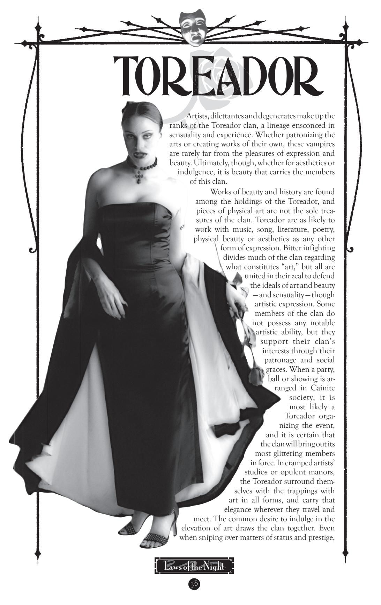
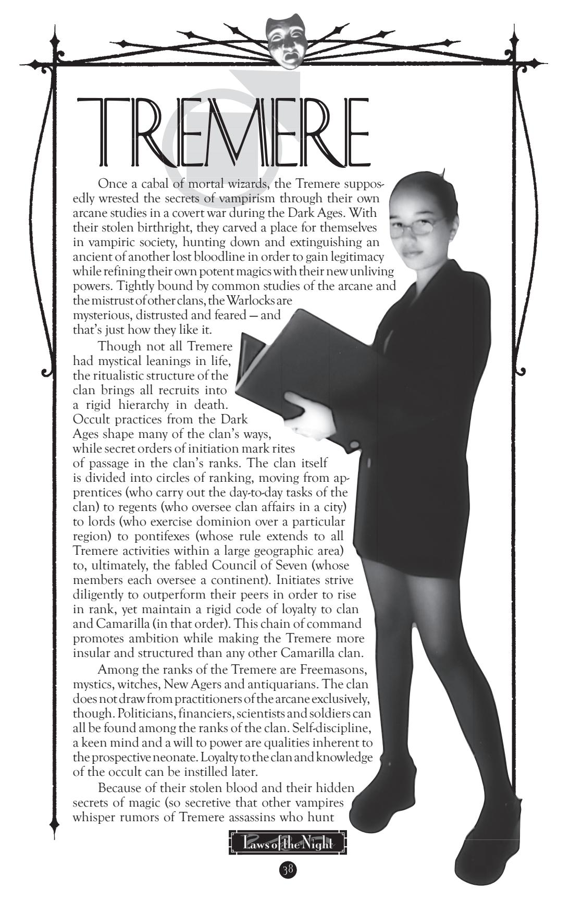

**Roleplaying Hints:** Revolution is your cause, passion your strength. You throw your heart and soul into anything that could help tear down the old, dead ways and make room for the new. Although you may just like chaos or tearing things down, chances are, you have some ideal that you want to see come to fruit, and this drive pushes you to engage in revolt. You use the skills available to you, whether you are a subtle creature manipulating courts and Kindred socially or a gangbanger punk who beats the opposition down mercilessly. When you join with your clan to change the status quo, other concerns drop aside. Once the revolution's over, though, you fight for your idea with the same ferocity, which may put you at odds with others who have different goals. It's about changing the world for something that you think is better — whether just for yourself, or for everyone.

**Disciplines:** *Celerity, Potence, Presence*

**Advantage:** As free-thinkers and rebels, all Brujah have some sort of contacts from their field of revolution, be it gang warfare or socio-political theory. Thus, all Brujah characters gain one free Trait in *Political*, *University* or *Street* Influence, and an associated Ability Trait of *Politics*, *Academics* or *Streetwise*.

As an aside, Brujah tend to stick together tightly when trouble erupts, and indeed, a "call to arms" draws Brujah together for common cause even in spite of personal differences. Failure to respond to such a call causes the offender to lose standing within the clan, and to be unable to gain help from other Brujah. However, if there are only three Brujah in a given city, this solidarity is obviously not such an obvious advantage.

**Disadvantage:** The Brujah clan bears the scars of many insults and oppressions from the past. Thus, its members are easily prone to violence and frenzy. Indeed, among modern Brujah, even debate and discourse can become heated enough to incite rage. All Brujah suffer a one-Trait penalty on Virtue Tests of *Self-Control/ Instinct*.

**Bloodlines:** Brujah of any allegiance are functionally similar; there are no particularly special bloodlines of Brujah in any sect. Far and away, the largest amount of anarchs tend to be Brujah. Rare rumors of a secretive group calling themselves the "True Brujah" rise on occasion, but whether they are actually a separate bloodline or simply a group of deluded dissidents is unknown by the Cainite population at large.

really say what might motivate a Lunatic to bring another into the fold. Some new childer are not insane when they are Embraced, but their sires seek to rectify this "shortcoming" as quickly as possible. A few are physically brutal, and some can be quite socially charming when not visibly afflicted, but these outlyers serve only to point up the commonality of the clan: Madness — and enlightenment — can infect anyone.

Most Malkavians seem to have little care for sect politics, although those who do so are terrifying in their dogged pursuit of their aim. The true loyalties of the Malkavians likely lie with whatever greater goal drives their shared insight, though. Even the most chaotic Lunatics occasionally find themselves working in tandem at the most unusual of tasks.

**Roleplaying Hints:** You see and understand things that nobody else comprehends. Maybe they're right when they say you're mad, but maybe it's just that they can't handle the *truth*! You're not feeble, helpless or stupidly comical. You have a vision, and though it sometimes makes unlife difficult, you can look at things from directions that nobody else contemplates. You can sometimes get others to see brief moments of your vision by tricking their minds into thinking in strange ways, so you create plans designed to interrupt the "normalcy" of other peoples' existences, so that they are forced to examine their motives and places more carefully. You may have a lot of trouble with unlife, or you may be only subtly touched and pretty much functional in normal society — but you are *always* aware of the invisible pulse of currents underlying everything.

**Disciplines:** *Auspex, Dementation, Obfuscate*

**Advantage:** The Lunatics seem "blessed" with a special insight into the workings of the hidden world. Whether they discern small bits of knowledge from watching leaves fall or they work divination with human entrails, all of Malkavs's brood seem to follow hidden patterns that few others are even aware of. Because of this bizarre insight, all Malkavians gain a free level of *Awareness*.

Some Malkavians possess a strange link to others of their kind. Indeed, the Lunatics seem to be able to recognize one another on sight, and they even pass along bits of knowledge from time to time. This "madness network" may be the result of a true sharing of minds, or simply ranting — none outside the clan really know, and few wish to explore the matter too deeply.

**Disadvantage:** The members of the Malkavian clan are universally insane. All Malkavian characters suffer from a derangement of some sort. These sorts of personality disorders are not humorous — they are cracks in the workings of the mind, turning the Malkavian into something beyond the comprehension of even vampires. A Malkavian is unlikely to regress to a childlike or clownish state, collecting teddy bears and silly clothing. A Malkavian who wears blood-stained pajamas and babbles in a room full of teddy bears covered in entrails, seeking wisdom from the charnel pit — *that's* the sort of insanity that infects the Lunatics.

A Malkavian's initial derangement can be temporarily suppressed with Willpower Traits like any other derangement, but it can never be removed or cured permanently.

**Bloodlines:** Most Malkavians claim nominal membership in the Camarilla, though *antitribu* are found in the Sabbat — the Freaks are usually the most deranged and homicidal of their kind. Some Malkavians of the Camarilla still possess the Discipline of *Dominate* (instead of *Dementation*), but most of the Lunatics were "converted" to the ways of *Dementation* in a wash of madness that swept through the clan in recent years.

turn a Nosferatu against his clan, though — in their communal misery, the Nosferatu have forged strong ranks of loyalty. When the only ones to keep company with a monster are other monsters, they develop powerful bonds indeed.

As outcasts, the Nosferatu often Embrace among those like themselves derelicts, vagrants, the antisocial, the wayward and unstable individuals — in a commonality of social pariahs. Other victims include the beautiful and vain, or sociopaths and criminals, to whom the Nosferatu wish to teach a permanent and disfiguring lesson. Whatever the case, the Embrace often has a surprising effect. Aside from inflicting the deformities characteristic of the clan over the next few weeks, the abrupt and extreme changes often force the fledgling into an utterly new existence, one in which his clan is his only anchor. It's unsurprising, then, that recruits find themselves with friends and allies among those they would otherwise scorn.

The Nosferatu remain on the fringes of vampire society. The clan lacks any sort of overarching organization as a whole, but among themselves, the Nosferatu are unfailingly polite and well-versed in the pecking order. Outsiders may see nothing but a ragged band of deformed and pitiable creatures, but among their unearthed secrets and hidden tunnels, the Nosferatu hide far more influence and knowledge than the other clans would care to know.…

**Roleplaying Hints:** Though you may appear hideous to others, you are no less a person for it. You may shun the trappings of your humanity like the visage you sloughed off during your Embrace, or you may seek to regain the feelings of mortality; either way, you are cursed with this form. Outsiders treat you with contempt, fear or hostility. Among others of your kind, though, you can be civil; after all, you are brothers in arms. Outsiders expect you to act like a crude, bestial monster, so you play up that stereotype for what it's worth, and you use your sophistication to learn the secrets that can be sold or put to good use. You have to take care of yourself since nobody else will now.

**Disciplines:** *Animalism, Obfuscate, Potence*

**Advantage:** All Nosferatu learn the ways of skulking and hiding, simply to avoid unwanted attention. With their signature command of a city's hidden byways, they discover lost hideaways and secrets. As a result, all Nosferatu have at least one Trait of *Stealth* at no cost and they also gain one Ability Trait of *Survival* at no cost.

**Disadvantage:** The hideous countenance of the Nosferatu precludes ever holding normal social relationships without the use of concealment or misdirection. No Nosferatu may possess the Social Traits *Alluring, Gorgeous* or *Seductive*  without calling on special powers (such as the *Obfuscate* Discipline) to gain those Traits. Furthermore, all Nosferatu suffer from the Negative Social Traits *Repugnant* x 3 whenever their true forms are apparent. These Traits may never be removed with Experience Traits or Free Traits. A Nosferatu in his "normal" visage cannot initiate any Social Challenges except for the purposes of intimidation, although he may defend against Social Challenges normally.

**Bloodlines:** There are no distinctive bloodlines of Nosferatu; indeed, the Nosferatu *antitribu* of the Sabbat actually retain cordial (if distant) relations with their Camarilla counterparts. Some inside the clan maintain that there exists a line of monsters, Embraced by an ancient, which hunts the rest of the Nosferatu clan. These beasts, called the Nictuku, are considered mythical by most Nosferatu, but whenever a warren goes silent or a clanmate vanishes mysteriously, the fears return.

these vampires respect the prowess of true creative genius. As the guardians of culture, the Toreador pass judgment on what victories constitute genius or what gaffes make a fool. Currying Toreador favor can do much to assist any career in Elysium.

Obviously, the Toreador are quick to Embrace those mortals with great artistic talents, the better to preserve those talents for all eternity. In some cases, members of the clan also Embrace from passion, and they are the most likely to Embrace for companionship. Though the Toreador are not uniformly beautiful, a disproportionate number are goodlooking — works of physical art to some thinking.

Time, however, is often unkind to the Toreador. Many become jaded with the passing years, seeing works fall to ruins or mortal beauty crumble with age. Consequently, they seek greater thrills and experiences to whet their palates, often falling into hedonism and decadence. Most Kindred agree that few things are more disturbing than a Toreador needing a new hobby. Even worse is the Toreador who has become bored. Like decadent, pleasure-loving nobility, they snipe and disparage those who do not meet their exacting standards. For every hostess with the mostest or inspired artist, there is a catty preener whose only interest is destroying others.

**Roleplaying Hints:** You are a creature of eternal magnificence. You may have an artistic talent (or talents), or you may yourself *be* a work of art. Either way, it is your duty and your pleasure to raise awareness and culture through the spread of art, both its creation and its patronage. You want people to strive for higher ideals and to experience new heights of feeling due to art, so you encourage others to indulge in works of passion. After all, a great artist must be immersed in art.

**Disciplines:** *Auspex, Celerity, Presence*

**Advantage:** With their predilection for artistic skills, the Toreador all have some sort of unique talents. Even those Toreador who have no real artistic ability learn to become patrons of the arts, to engage in social sniping and to buy what they can't create. Every Toreador vampire begins with *Academics*, *Crafts*, *Performance* or *Subterfuge* Abilities (one Trait each of any two, or two Traits of one).

A Toreador can also call on artistic talents to hunt and feed. Though she may have a stable *Herd* like any other Cainite, a Toreador can also find willing mortal victims by use of artistic ability or patronage ("Would you like to come upstairs and see my etchings?"). A Toreador can gain one Blood Trait for each level possessed in the aforementioned Abilities; each Blood Trait gained in this fashion requires 15 minutes out of play. Gaining Blood Traits in this fashion *does* use up the Abilities in question, so the Toreador may be limited in her feeding if she has already used some of her Abilities.

**Disadvantage:** The Toreador are easily entranced by beauty. Every work of art is a key to insight, whether in the form of sculpture, poetry, a lovely face, even a clear sky spangled with stars. As such, beauty draws the attention of Toreador, often to the exclusion of all else. When presented with a work of great art (generally, one executed with the equivalent of three levels of *Crafts* or *Performance* Traits, though some special cases may require more or less), a Toreador becomes absorbed in the task of examining and understanding the work, lost in a fugue state. The Toreador can only break from this state willingly by expending a Mental Trait, although injury or other distractions (such as attack or being elbowed by a neighbor) can break this enthrallment.

**Bloodlines:** The Toreador clan has no offshoot bloodlines; the *antitribu* of the Sabbat share the predilections and capabilities of their Camarilla brethren, although they find their pleasure and artistic expression in horror as much as beauty. These *antitribu*, instead of becoming paralyzed with fascination, instead have a disturbing tendency to act out their sociopathic tendencies on whomever is at hand through socially cutting remarks, intellectual dominance or physical torture. A Toreador *antitribu* given a chance to act out such tendencies must expend a Mental Trait if the player wishes to resist the urge, though such an expenditure need only be made once in any given scene.

and slay vampires learning *Thaumaturgy* outside the auspices of the clan), the Tremere occupy an uncertain place within the Camarilla. Their prowess grants them grudging respect, but it is no secret that any Tremere advances the clan's agenda first and foremost. As a result, most Tremere are superlative manipulators. Vampires of this clan barter their impressive magical skills for favors, calling in debts later to consolidate the clan's claims to specific political goals and mystical treasures. Their magical powers allow them to counter the actions of the Camarilla's many enemies, yet they grant an unpredictable edge over their allies at the same time. The Tremere exert an insidious influence over vampire society from their chantries (part stronghold, part academy), directing crusades and research to their own occult ends.

**Roleplaying Hints:** You have taken an oath to uphold the goals of clan and Camarilla. You hail from a distinguished house of wizards, and in return for your dutiful service, you can expect instruction in the mystic arts. You obey the laws of Kindred society unswervingly, but you always work to advance the interests of your clan first. Since unknown abilities cannot be opposed, you conceal the true measure of your own power and your clan's knowledge, acting when appropriate and before others can fathom your plans. You possess a strong will, capable of undertaking difficult tasks in order to succeed. Other vampires may not understand or trust you, and that's just fine — you have other plans.

**Disciplines:** *Auspex, Dominate, Thaumaturgy*

**Advantage:** As a result of their training in the mystical arts, all Tremere gain one *Occult* Ability and one *Occult* Influence automatically. This bonus represents their basic knowledge of magical practices and their clan's contacts within arcane circles.

Because of the tightly knit structure of the clan, Tremere can expect assistance and instruction from higher-ranking members of the clan. However, members must still perform their duties. Tremere cannot simply expect all of their problems to be solved by their superiors — the clan does not tolerate laggards. Tremere vampires can expect that any *Mentor* they may have will always offer assistance (if the Storyteller rules that doing so is within the *Mentor*'s capabilities), but conversely, they will always be required to fulfill a specific duty afterward.

**Disadvantage:** On receiving the Embrace, all new Tremere are forced to drink from a chalice containing the blood of seven elders of the clan. From this mixture of blood, the neonate comes one step toward a blood bond to the elders and, through them, to the clan as a whole. Tremere who fail in their duties or who disobey orders may be forced to drink again of such a mixture, stepping closer to total obedience to the clan.

Tremere who fail to report to their superiors, or who do not successfully carry out their duties, can also expect their superiors to deal with them harshly. Members of the clan who do not pull their own weight quickly find that they are expendable.

**Bloodlines:** At one time, a small faction of *antitribu* claimed membership within the Sabbat. However, a recent turn of the Jyhad has seen to the extermination of all of those expatriates, with no survivors whatsoever. Also, during the Dark Ages, a small group of Lithuanian pagans formed several cults. These Telyavelic Tremere possessed the Discipline of *Presence* instead of *Dominate*, but they suffered mightily from displays of Christian faith. These pagans were finally exterminated before the 17th century. With the rigid structure of the Tremere clan, there is no room for the deviance of any other bloodlines.

