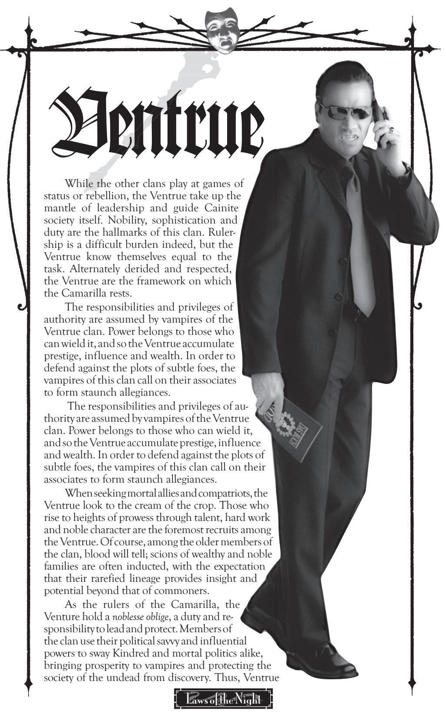
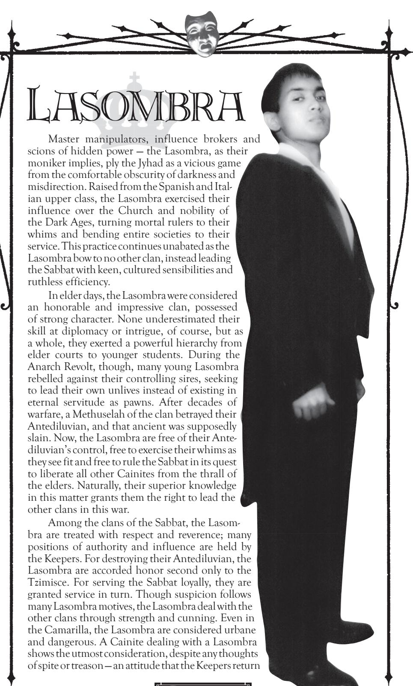

naturally gravitate toward positions of power and authority, or attempt to do so. Even those Ventrue who join the Sabbat take their duties as protectors of Cainite society very seriously, serving as dark crusaders of a holy cause. Of course, since the Ventrue cannot let other clans know the hidden secrets and burdens that they carry in the war to defend all vampires, they must assume the burdens of leadership alone. However, they are certain to drop hints about the burdensome task.

**Roleplaying Hints:** You are among the elite nobility of Kindred society. Above mortal or even petty Cainite concerns, you bear the right and responsibility of leadership. You have a firm respect for tradition, for the ways that have worked for hundreds of years; even the most rebellious youth understands the power of tradition. No other vampires have the necessary talents or capabilities to take on the burden of guiding Cainite society. Thus, it is up to you to take up that mantle. You lead not necessarily out of desire or habit (though such factors may figure in), but because your clan has gifted you with the duty to assume responsibility. All that is done must advance the sect, for the sect will protect the weaker ones. Your conviction is your armor, your honor a shield, your birthright your weapon. Honed to perfection, you uphold all that is noble, ordered, ancient and wise in the children of Caine.

**Disciplines:** *Dominate, Fortitude, Presence*

**Advantage:** Because of their keen financial acumen and savvy, all Ventrue characters begin play with an extra Trait of the *Resources* Background that can never be lost permanently. All Ventrue additionally gain one Trait of *Finance*, *High Society* or *Political* Influence (player's choice) due to their connections to society and social manipulation. Even those Ventrue without such ties themselves may call on their clanmates for the appropriate aid, effectively granting them the same capabilities.

Ventrue tend to keep detailed records of lineage and heritage. As a result, the Ventrue clan, though not as hierarchical as the Tremere, can prove difficult to infiltrate; nearly every Ventrue is recorded somewhere in the clan's family trees. Though it may take several months to track down a particular lineage, a Ventrue can usually contact others of his clan and discover the sire, grandsire and so on of a particular Ventrue claimant, thus establishing "credentials" of a sort.

**Disadvantage:** All Ventrue have rarefied tastes, to the point of excluding all other prey except their chosen taste. Ventrue may only feed from mortal blood meeting with their particular dietary restriction. A given Ventrue might be able to feed only from young women or from businessmen or perhaps only from those experiencing terror. A Ventrue reflexively regurgitates any blood taken from any other source, gaining no nourishment. This restriction does not apply to vampiric vitae, though, and it may be suppressed long enough for a Ventrue to Embrace a new childe.

Because of their restrictions on feeding, Ventrue typically come into play each game session with one Blood Trait less than other vampires (though this shortage can be ameliorated with the *Herd* Background, as usual).

**Bloodlines:** The Ventrue *antitribu* are crusaders who lead in the holy war of the sect, feeling that the others of their blood have failed in their mission to protect Cainites from the machinations of the Antediluvians. Despite differences of philosophy, though, Ventrue of the Camarilla and the Sabbat are functionally similar; *antitribu* are the true dark knights of their kind. There are no distinctive bloodlines of Ventrue, though some family lines do form "dynasties" within the clan.

in kind. After all, one can never tell who dances on the puppeteers' strings.

As befits their heritage, the Lasombra choose their potential childer from strong-willed mortals, selecting those with courage, cleverness and a talent for manipulation. Artistic skill, specialized knowledge and physical prowess are all secondary considerations compared to the *will to power* necessary to be a true Lasombra. The Lasombra recruit must have the confidence and authority to master himself and others. Naturally, these conflicting inner drives lead to friction between sire and childe as the fledglings refuse to bow to the potent wills of their sires, but the Lasombra wouldn't have it any other way — through conflict comes strength, and to the victor go the spoils.

**Roleplaying Hints:** You shape the world to your desire. By leading those around you and influencing the keys of power, you can achieve your own goals, whatever they are. When social acumen is required, you can be silver-tongued or threatening; your insight into motives allows you to discern what others want and how to use them. If force is necessary, though, you don't hesitate to use it (though the necessity of force generally means that something went wrong along the way). Sophistication, confidence and knowledge are the means to power, but power in and of itself is not your end. Power is simply the means to achieve your true desires, the ends that you set for yourself.

**Disciplines:** *Dominate, Obtenebration, Potence*

**Advantage:** A long heritage of influence and manipulation makes the Lasombra puppeteers *par excellence*. During the Dark Ages, the Lasombra exercised subtle authority within the Church and over secular rulers; in the modern age, these old habits die hard, even among the more rebellious elements of the clan. All Lasombra gain one Trait of *Church*, *Political* or *Underworld* Influence.

As founders of the Sabbat, the Lasombra are respected for their destruction of their Antediluvian, and they hold positions of leadership and power. All Lasombra automatically gain one free Status Trait.

**Disadvantage:** Mirrors and reflective surfaces do not show any trace of the Lasombra. Some say that this oddity occurs because the Lasombra have no souls; others claim that it is part and parcel of their *Obtenebration* Discipline. Whatever the cause, Lasombra (and their clothes and carried possessions) do not show up in any sort of reflective surface, such as mirrors, pools of water, reflective windows, polished metals, photographs and black-and-white film (which uses a reflecting silver emulsifier).

Also, because of the Lasombra clan's ties to darkness, all Lasombra suffer an additional level of damage from exposure to sunlight.

**Bloodlines:** A small number of Lasombra — about a hundred — claim allegiance with the Camarilla, calling themselves Lasombra *antitribu*. Most of these Lasombra are old and potent, from days before the formation of either sect. The few modern ones still have the backing of their powerful sires. These Lasombra are all accorded respect within the Camarilla, so they keep their usual clan advantages but within their sect. The Sabbat Lasombra denounce the existence of their wayward brethren, and they hunt the traitors mercilessly whenever the opportunity presents itself.

Potent sorceries, crumbling castles, forbidding mountains, villages of huddled and fearful peasants these images play through the history of the Tzimisce. The scholarly Fiends trace their roots to the demesnes of Eastern Europe, where they ruled as feudal lords over a superstitious populace (and, in some places, they still do, it is whispered). Even in the modern day, anachronistic behavior and uncommon occult insight are hallmarks of the Tzimisce. Once the pre-eminent sorcerers of Cainite society, they now serve the Sabbat as terrifying, alien creatures that epitomize the traditional characteristics of vampires. The great Vlad Dracul himself is said to be one of the Tzimisce, though in the Sabbat, he is counted a traitor to

the clan. The Tzimisce have existed since time immemorial, ruling for generations in the fiefs and provinces of Eastern Europe. There, they extended their taloned hands over the mortal villages and authorities, brooking no resistance. Their broods of blood-bound childer exacted fearsome tribute, while the *koldun* sorcerers performed hideous rites, calling on the black-stained power of the twisted lands. With the coming of the Anarch Revolt, legions of childer broke away from their domineering masters, putting castles and elders to the torch. The mystical ritual of the Vaulderie, corrupted from *koldun* rites, broke the blood bonds and sent childer screaming as bands of terror ravaging the landscape.

At last, the anarchs destroyed the Tzimisce Antediluvian, and together with the Lasombra, the remaining Fiends formed the core of the Sabbat. The few surviving *voivodes* and *koldun* shut themselves away in their castles, avoiding the strife and closeting themselves in an earlier age. Now, the Fiends' influence in the Sabbat is second only to the Lasombra clan's, and many believe that the Tzimisce manipulate the Lasombra as well.

> Few can understand the motives of the Tzimisce. Many are insane or simply alien to human or vampiric m i n d s .

Uninterested in secular power yet wrathful and deadly when balked, incredibly intelligent but unwilling to grasp the modern age, by turns courtly and torturous, the Tzimisce are a study in contrasts yet the Fiends themselves admit to no dichotomy. Other vampires treat the Tzimisce with a guarded sort of respect. The Fiends take the greatest insult when their domains are trespassed, yet they hoard insights that the other clans have long since lost. Once angered, a Tzimisce never fails to exact retribution. To their allies, they seem erratic, yet their knowledge is useful and their minions are potent in battle. Suffice to say that few would want Tzimisce "friends," and none would want Tzimisce enemies.

In keeping with their bizarre predilections, the Tzimisce Embrace from an eclectic selection of mortals. The insane are sometimes chosen, but most often the Fiends choose those whose minds were broken by some terrible insight. More often, the Tzimisce Embrace those strong wills who were twisted but unbowed by unusual knowledge, whether scientists, magicians or philosophers. In some cases, the Tzimisce will Embrace their revenant relatives or mortal minions as a gift or reward for devoted service. Though the Embrace does not alter the fledgling Tzimisce physically, it exacts its price on the mind; few Tzimisce have the capacity to empathize with their former mortal days, while more than a few pick up disturbing new habits, sharper tempers and more territorial natures.

**Roleplaying Hints:** Existence is a process of learning and evolution. You have evolved beyond simple humanity, and through further work and study, you can evolve past the vampire condition, too. However, all of your work is still built fundamentally on the blocks that you have already laid. The ways of the past, those which have stood for centuries, have withstood the test of time and shown themselves correct. Therefore you mix anachronistic tradition with bizarre speculation and thought. If other Cainites do not understand you, that is their own problem; they have not reached your level of insight. You act with the elegance and politeness of a higher creature, but by the same token, you do not brook failure — you are a superior being, after all.

**Disciplines:** *Animalism, Auspex, Vicissitude*

**Advantage:** Because of their feudal heritage and ancient ways, the Fiends keep secrets long since thought lost by the other clans. All Tzimisce start with one free Ability Trait of *Occult*, and they can also purchase *Lore* Abilities with greater ease than most vampires — at Storyteller discretion, the Fiends may learn the first two levels of any *Lore* Ability without the need for extensive work or specialized resources, since the clan's libraries and holdings usually include such knowledge.

Tzimisce may have revenants as *Retainers*. A revenant *Retainer* can be treated like a ghoul, except that the revenant does not require regular upkeep with vitae. More detailed descriptions of revenants and their unusual families and powers can be found in other books, such as **Ghouls: Fatal Addiction** and **Liber des Goules.**

**Disadvantage:** The warped Carpathian Fiends exhibit some inexplicable tie to the lands of their birth. Whether this tie is a result of the ancient demonic pacts levied there in the Dark Ages, or a result of their bodies' craving for stability in response to their mutable Discipline of *Vicissitude*, the results are the same. A Tzimisce must sleep within at least two handfuls of soil from his grave or his native homeland. Each day that a Tzimisce fails to get such rest, he suffers a one-Trait penalty on all challenges. These penalty Traits are removed on a one-for-one basis as the Tzimisce regains rest in a safe haven with the appropriate earth. For this reason, many Tzimisce keep multiple havens, and they are loath to travel. A Tzimisce whose haven is compromised is in dire straits indeed.

**Bloodlines:** Many Tzimisce come from the revenant families, ancient lines of mortals transformed into ghoulish creatures through centuries of ingestion of vampiric vitae. The Bratovich Tzimisce hail from a family known for its brutality and animalistic tendencies; they learn *Potence* instead of *Auspex*, but they suffer a one-Trait penalty on their *Self-Control/ Instinct* tests against frenzy. Also, the Tzimisce claimed a heritage as sorcerers unparalleled among vampires until the eminence of the Tremere clan. These ancient sorcerers called themselves *koldun*, and some young Tzimisce take this title while studying the more modern magics of *Thaumaturgy* instead of *Vicissitude*. The modern *koldun* endure a one-Trait penalty when defending against opposing magic, though, since they must attune themselves to magical energies in order to learn *Thaumaturgy*.

Almost no Tzimisce are found in the Camarilla — the Fiends' distaste for the humanistic trappings of that organization is tremendous. Any Tzimisce who works with the Camarilla does so merely to further a particular personal agenda. More often, a Tzimisce without Sabbat leanings simply remains a cloistered independent.

From hidden fortresses in the Middle East, the Assamites emerge as the silent stalkers of other Cainites. Secretive, insular and fanatically loyal to the precepts of their clan, the Assamites claim to be descendants of Haqim (Assam), who is said to fight against Khayyin (Caine) and his curse. As a result, the Assamites seek to convert or slay other Cainites, attempting

to purge the foul curse of Khayyin and bring honor to Haqim's cause of justice. Needless to say, such pursuits — including hunting other Cainites for blood, and engaging in diablerie in attempts to strengthen their clan and their closeness to Haqim — are not popular with the other clans.

Due to their attacks on elders of the other clans in the Dark Ages and their assistance of the rebels during the Anarch Revolt, the Assamites were fought by the Camarilla and forced into capitulation. With their home fortress of Alamut compromised and peace enforced on them, they were subjected to a great curse by the Tremere. Through this curse, the Assamites were rendered unable to drink Kindred vitae, making it impossible for them to commit diablerie. Recently, though, the curse was broken (speculations have been rampant and none confirmed), and every Assamite across the globe awakened to discover a renewed thirst for the potent vitae of other Kindred. Though this development is not known publicly (because some Assamites, all *antitribu*, refused to submit to the curse and thus retained this ability), the Assamites are hoarding their secret, striking where they can to eliminate threats and draw on their returned strength.

The Assamite clan has undergone much upheaval recently, and not only due to the overturning of the Tremere curse. While previously young Assamites would take out contracts for the assassination of other Kindred and collect blood tithes as fees, now the Assamites hunt and kill without any sort of contracts, codes or strictures. In addition, the clan has moved away from its former Islamic ties, instead looking to more ancient gods. With these changes have come the awakenings of lost powers and the resurgence of the clan's physical and political clout. Where once the Assamites were seen as honorable and contract-bound (and thus useful tools), they are now silent terrors that plague elders of every clan and sect.

In older times, Assamites Embraced primarily males, those of Middle Eastern descent and strong faith. In modern days, women also fill the ranks and even a few Westerners have been brought in. Skill now plays more of a role in selection than heritage; prospective clan members are Embraced from those with a penchant for the hunt or kill — assassins, mercenaries, terrorists and gang warriors of any descent. Recruits are expected to undertake rigorous training, and they are indoctrinated in many of the clan's precepts and history. These *fida'i* (apprentices) are watched closely, but they are allowed to progress based on their own worth and skill. Many *fida'i* run in small packs called *falaqi*, hunting other Cainites for blood and practice.

**Roleplaying Hints:** You are a predator who preys on others of your kind. The cursed Get of Khayyin must be swayed from their path of bickering madness or be destroyed before they destroy all else. Your cause is just, and though you may not enjoy your tasks, you do your duty. You may be humorous, angry or withdrawn, but you go about your work professionally. Only by drawing on the strength of Haqim can the corrupted Kindred be fought, so you must steal their power and make sure that the clan is ready when Gehenna arrives. Khayyin was debased and had neither honor nor soul. His children share the same flaws, so they must be saved or destroyed, so that the powers of the blood are used only by the dutiful. The elders of the clan direct how to fight so that Gehenna may be survived. By following their commands and working within the strictures of the clan, you may hope to achieve some small piece of that battle.

**Disciplines:** *Celerity, Obfuscate, Quietus*

**Advantage:** Assamites are trained killers, and they are all subjected to a lengthy process of apprenticeship before the Embrace. Even those hurriedly Embraced for some reason have at least a modicum of training or skill. As a result, all Assamite characters gain one *Melee* Ability and one *Brawl* Ability at no cost during character generation.

At the Storyteller's option, Assamites may be able to access weapons and equipment through their clan. Players of Assamites should not use this benefit as a replacement for the proper *Mentor* and Influence Backgrounds — the clan doesn't reward those who rest on their laurels at the clan's expense — but a competent assassin who needs a little specialized help may be able to garner some additional tools from the clan's stores.

**Disadvantage:** With the lifting of the Tremere curse comes a renewed thirst for blood. All Assamites suffer from a hunger for vampiric vitae, one that cannot be easily controlled. Once an Assamite has tasted the blood of a particular vampire, she may become addicted to it — the player must make a *Self-Control/ Instinct* Virtue Test with a difficulty of four Traits, or the Assamite acquires a taste for the Kindred's blood. When encountering the same Kindred later, the character's player must succeed on a *Self-Control/ Instinct* Test or fly into a frenzy, attempting to devour the other Cainite. Even if the Assamite retains control, the lust for blood is immediate and evident, and it should be roleplayed accordingly.

**Bloodlines:** Assamites generally hold allegiance only to their own clan. A few exist in the Camarilla, as loners who broke from the clan; the Sabbat also claims *antitribu*, who differ from the rest of the clan only in that they never allowed themselves to be subjected to the (now-defunct) Tremere curse. In the Assamite homelands and fortresses exists a line of viziers who research blood magic and the nature of vampirism. Assamite vizier researchers gain *Thaumaturgy* as a Discipline instead of *Celerity*, but they must expend an additional Blood Trait on all uses of *Thaumaturgy* (in addition to their weakness for Kindred vitae), as their control of blood magic is not as refined as the Tremere's. This flaw comes in the viziers' magical practices; should another Cainite somehow learn *Thaumaturgy* from a vizier, all effects of the Discipline would be similarly difficult to cast, with the increased blood cost. Viziers also gain one *Occult*  Ability Trait in place of either the free *Melee* or *Brawl* Trait (player's choice as to which).

## assamites oF earlier days

After the Treaty of Tyre but before the breaking of the Tremere curse, the Assamites suffered from a different set of problems. The Assamites were unable to consume Kindred blood — indeed, each Trait of Cainite vitae (other than the Assamite's own blood) ingested or otherwise introduced into the Assamite's system inflicted one health level of damage. Furthermore, since the only means of lowering generation was through certain alchemical blood potions (diablerie having been rendered impossible by the curse), Assamites would hire themselves out on contracts to assassinate other Cainites, accepting blood as payment (and sending a tenth of all such blood earned to their elders as a tithe). Should the target manage to escape the Assamite, he would never be targeted again — until now, when the clan's members cast aside their former strictures of honor and obligation in favor of their former bloodthirst.

The desert sands of Africa hold many secrets long buried, some best left undisturbed. Claiming literal descent from the dark Egyptian god Set, the Setites hoard the secrets of their lost civilizations. According to the Setites, Set himself will rise — soon — and he will reward his faithful while plunging the world into eternal night. Organized more like a cult than a clan, the Followers eagerly search for the mystic means to rouse Set, while they simultaneously spin webs of deceit and fixation to sway others to their service. Needless to say, the Setites are regarded with wariness at best and horror at worst.

> Vague and contradictory rumors surround the Serpents' origin. Most Cainites hold that the Serpents are simply another branch of Caine's tree, from the far-wandering days of the Antediluvians and their mythical sires. For their part, the Followers of Set often insist that Set himself was no mere Cainite, but a true god of darkness. Such wild stories are discounted by most vampires, though the Serpents seem to hold bits of lore and wisdom from lost days that would legitimize their claims.…

With respect to the other clans, the Setites are carefully neutral. During the formation of the Camarilla, it is said, the Setites were invited to join, but few deigned to do so — much to the secret relief of that sect's elders. As far as the Serpents are concerned, the Jyhad is just a petty struggle between the upstart children of Set's inferiors. The Setites thus broker their influence carefully, trading in commodities and vices that make them valuable, if covert, suppliers for many Kindred. Where a particular vampire has a weakness or desire, the Setites quickly move in to fill the vacuum, indebting the buyer to them and sometimes exacting favors through blackmail and addiction. Such tactics naturally don't endear the Setites to the other clans, so most Serpents make a great show of dissembling and an outward display of friendship. Of all the clans, the Setites reserve their greatest hate for their own kind: The Serpents of the Light, a small cult of Haitian Setites who broke away from the clan to join the Sabbat, are viewed as heretics and wiped out ruthlessly.

Setites tend to Embrace from among people who share an understanding of dark appetites and forbidden desire. Scholarship is highly prized in the clan, for only with the ancient lore of the earliest days can Set be found and awakened. Secrets of all manner are their stock in trade, and the vices that humiliate others are their best weapon. Those who partake of desire are naturally inclined to understand it, and so they form the basis of the clan's recruits. With time and education, Setites learn to weave webs of subtle deceit, drawing in ever more unwitting servants while plucking out the dirty secrets and lies that others try so carefully to bury.

**Roleplaying Hints:** You are a disciple of a dark god, and you must do your best to uphold that faith. None outside your clan will serve Set willingly, so it is your duty to ensnare them with their own weaknesses. By plying the illicit trades to support the hungers of others, you can gather their support and force them to pay for their needs — in deeds, in secrets or simply in "a few favors later." With such secrets and assistance, you can gather the knowledge necessary to raise Set, to enshroud the world in the darkness of your clan's grip and to cause all others, vampire or mortal, to bow before you.

**Disciplines:** *Obfuscate*, *Presence*, *Serpentis*

**Advantage:** The Followers of Set choose recruits with connections in the underworld, crime and politics. By preying on the weaknesses of influential and important individuals, the Setites turn them into allies, willing or otherwise. Every Setite thus has one bonus *Streetwise* Ability Trait and a level of *Political*, *Street* or *Underworld* Influence. The rare Followers who eschew such connections can still gather a modicum of aid from their clanmates, equivalent to the same Traits. The Setite philosophy, though Darwinian, stresses the need for the clan to cooperate in raising Set, so resources are shared (albeit begrudgingly).

**Disadvantage:** Just as Set was banished from Egypt into the darkness, so too do his followers hide in the shadows and the night. Setites are particularly sensitive to light, especially sunlight. Exposure to sunlight always inflicts an extra health level of damage on Setites. Even bright spotlights, flares or floodlights are uncomfortable, causing the Setite to suffer a one-Trait penalty on all challenges.

**Bloodlines:** Among the Followers, different philosophies divide the clan into sects that practice disparate methods of serving Set. Most Setites espouse the Path of Typhon, seeking occult knowledge to raise Set from his age-long sleep. A few work as martial students in Set's army; these "Serpent Warriors" study *Potence* instead of *Obfuscate*. Some Ecstatics indulge themselves in the pleasures of debauchery, and a small, heretical splinter sect affiliated more with *voudoun* than Egyptology, called the Serpents of the Light, claims allegiance with the Sabbat.

