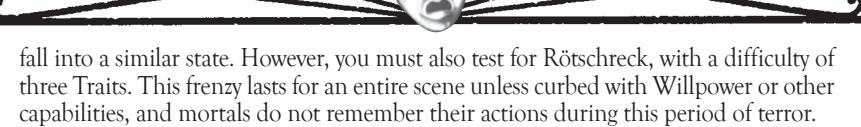
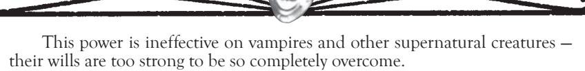

and intangible, unable to affect anything physically. However, your spirit-form can still sense its surroundings normally, even using your other powers of *Auspex*. Your immaterial form is tied to your material corpse through a silver cord, a sort of psychic tether that keeps you from becoming lost in the realms of spirit.

Sending your senses out in this fashion requires the expenditure of a Willpower Trait. You may remain out of your body as long as you like, though the rise of the sun over your physical form may force you into slumber. Furthermore, by expending an additional Willpower Trait, you can manifest for a single turn as an intangible apparition, allowing you to be seen and to speak audibly. While materialized, you can use any of your Mental or Social Disciplines simply by expending a Mental Trait before making the appropriate additional expenditures or challenges. While visible, you appear as an idealized form of yourself, complete with projected trappings, though your real-world physical possessions do not come with you in spirit form. Even while visible, you remain intangible and thus immune to injury from conventional sources like claws, fire, sunlight and mundane weapons (although your comatose body can still be harmed). While in astral form, you may not possess other bodies, even if you have that talent in *Dominate*.

You may deal normally with other astral forms that you encounter, conversing and using Mental or Social Disciplines. You may even attempt to injure other astral travelers by attacking their silver cord. Such astral combat uses Mental Challenges, with damage causing the opponent to lose Willpower Traits. Once an astral combatant runs out of Willpower Traits, his silver cord snaps, stranding him in the spirit realms. From there, the spirit may accidentally wander deeper into other worlds (such as the Dark Umbra in **Oblivion** or the Realms described in **Laws of the Wild**), or he may stumble about until he finds a way to return to his body. Some spirits thus trapped never return, captured or devoured by monstrous entities that dwell in the astral plane.

While astral, your consciousness exists in a mental projection of the material world. You cannot directly interact with or see wraiths, Umbral spirits or Garou (see **Oblivion** and **Laws of the Wild**), unless you find a means to travel to or sense the other spirit worlds. Similarly, your astral form is invisible and intangible to them unless you manifest in the physical world.

# Celerity

As one of the physical augmenting Disciplines of vampires, *Celerity* represents preternatural speed and reflexes. When angered, stressed or consumed with need, a Cainite can use the power inherent in the blood to fuel her actions, moving with startling quickness.

If attacked by surprise (see p.200), the victim may not use *Celerity* in the initial challenge — she must respond with her normal reflexes, and can only draw on her vampiric speed once she has reacted to the surprise.

The *Celerity* Discipline is most common among the Assamite, Brujah and Toreador clans. The former two tend to use the powers of *Celerity* in battle, while the latter engages in feats of dance, rapid completion of artwork or to flee from danger.

Since *Celerity* simply grants additional actions or modifiers to speed, it does not draw retests from any Ability. Actions performed with *Celerity* can still be retested appropriately (if shooting a gun twice, for instance, *Firearms* is used normally for a retest on each shot). Additional actions with *Celerity* can only be used for physical feats; one cannot use rapidfire *Dominate* or *Thaumaturgy* with *Celerity*, for instance. As a general rule, Mental and Social Disciplines may not be activated during *Celerity*, except during *Alacrity*.

Use of *Celerity* at the speed of *Swiftness* or above is generally considered a breach of the Masquerade. Note that a vampire need not use her full level of *Celerity*; a vampire with Advanced *Celerity* could simply rely on the Basic levels if desired.

#### Alacrity

Your reflexes are finely honed. Even as you watch others act, you can spring into action, completing your movements before they can respond.

By expending a Blood Trait, you gain the ability to preempt any physical actions taken in the same turn, as long as you are aware of them (a face-to-face mugging, yes — a sniper attack, no). Thus, if someone declares an attempt to pull out a hidden weapon and shoot at you, you can preempt that action to pull out your own gun and fire back (instead of being relegated to dodging). Similarly, if someone attacks an ally, you can preempt the action to get in the way and fight against the aggressor instead. If you attempt to preempt someone using *Celerity* or a similar speed-enhancing power, the character with the highest degree of *Celerity* acts first.

#### Swiftness

With shocking speed, you move faster than humanly possible. Even as others are recovering from events, you are making your next move.

Expend a single Blood Trait to gain one additional action in your turn, in addition to your preemptive *Alacrity* (the costs are not cumulative). This additional action is taken at the end of the turn, after everyone has resolved single basic actions. If multiple people have additional actions like this, they are all resolved at the same time, after basic actions. You can thus swing a sword twice, run twice as far as normal in a turn, fire a gun and then duck behind cover, or otherwise perform multiple feats.

INTERMEDIATE CELEBITY

#### Rapidity

Even other Cainites are dazzled by your superhuman speed. You routinely catch dropped objects, and the speed of your passing whips clothes and loose debris about.

Invoking all of your *Celerity*, at the cost of a single Blood Trait, enables you to use the Bomb in challenges of speed and agility. When performing an action where speed is of the essence, such as dodging an attack, throwing a knife or grabbing something out of someone's hand, you can declare that you have *Rapidity*. Once thus declared, you may choose to use the Bomb, a fist with the thumb pointing upward; the Bomb defeats Rock and Paper, but loses to Scissors (the fuse is cut) and ties with other Bombs. This symbol is usable in any challenges of speed throughout the turn. However, you are not required to use the Bomb — it is simply another option.

You may use *Rapidity* in any challenge where you rely on your own speed, even if your opponent attempts to use strength or stamina. Thus, if you try to use your *Rapidity* to dodge out of the way of someone grabbing at you, you can still use the Bomb. If the opponent possessed *Might*, you could still use the Bomb for speed, but the opponent would be able to use his *Might* retest for grappling.

#### Legerity

Moving faster than the human eye can track, you blur across the landscape with the speed of a cheetah. Compared to you, bystanders are statues.

You may activate your *Legerity* and all other *Celerity* levels for the turn at the cost of one Blood Trait. Your *Legerity* grants you one additional normal action at the end of the turn, in addition to your action from *Swiftness* (thus, you have at least three actions, a preempt and the Bomb in challenges of speed). Actions gained from *Legerity* come after basic and *Swiftness* actions, at the end of the turn.

ADVANCED CELERITY

#### **Fleetness**

When you call on your blood, you burst into a whirlwind of motion. Your passing extinguishes small flames, whips up flurries of debris and sows confusion among slower-moving entities.

# Chimerstry

The Ravnos tricksters of India live in a world of illusions and dreams. According to their philosophies, the material world itself is only a passing fantasy. Consequently, they wield power over perceptions, shaping their own illusions and crafting dreamstuff to their liking.

With the *Chimerstry* Discipline, the Ravnos call on the energy of dreams and imagination, giving it form and phantasmic substance. This Discipline's powers can conjure almost any shade that springs to mind, though plausible effects or duplications of things that the conjurer has experienced are much more likely to fool viewers and victims. With enough mastery, the vampire can even give such illusions shadow-substance, causing injury to others. These illusions vanish only if dispelled by the creator, if the illusionist ceases concentrating on her creations or if they are banished by a disbelieving opponent who exerts enough presence of mind to prove the illusion's nonexistence (say, by shoving a hand through an illusory wall).

Chimerical illusions can only create, not remove — thus, they may add elements to a scene, but cannot cause something to become invisible. *Chimerstry*  could cover up something's features but not remove selected parts. Furthermore, each illusion is a single object; one use of *Chimerstry* cannot create an entire host of illusory sensations or items. Chimerical creations must be free-standing items or sensory effects — a chimerical piece of clothing could conceal someone's real appearance, but a chimerical stake could not suddenly materialize inside of someone's chest (though it could later seem to be thrust there).

Retests with *Chimerstry* use the *Subterfuge* Ability, as they attempt to trick, deceive and mislead.

BasiC Chimerstry

#### **Ignis Fatuus**

You generate a brief, static illusion that affects a single sense. You could cause the appearance of a rose in your hand, or make someone hear a low wind or feel the grating touch of sandpaper. This illusion has no real substance (and it cannot confine or injure your victims), but it can confound or mislead. The illusion cannot move in any fashion, although you can hold and move an illusion that you create. Thus, an illusion of a person cannot walk or fidget, but you can pick up and brandish an illusory knife.

You must expend a Willpower Trait and best your subjects in a Social Challenge to create this illusion. The illusion persists until you leave the area or until someone manages to disbelieve the effect (by passing a hand through the illusory rose, testing the air and feeling no wind, etc.). You may also dispel the illusion at your desire; doing so is immediate and requires no action.

#### **Fata Morgana**

Your illusions appeal to all of the senses. Though you still cannot harm or affect others physically with your phantasms, you can generate static constructs

that seem real to any senses that you choose to affect. Thus, you can make a wall that appears solid, has a texture to the touch and smells of old dust and paint, but which has no real substance and can be passed through. Alternately, you could create a phantasm that lacks certain characteristics — you could cause a person to believe that you were holding a rose and brushing it against her cheek, provoking the feeling of the flower against the skin and the scent of the rose, when in fact you do not have a rose. These illusions are still incapable of independent movement.

You must expend a Willpower Trait and a Blood Trait to create an illusion of this nature, and you must best your subjects in a Social Challenge. These illusions remain viable under the same conditions as phantasms created with *Ignis Fatuus*.

intermediate Chimerstry

#### **Apparition**

No longer confined to mere static images, you can create an illusion that appeals to many senses and has its own capabilities. You must first create an illusion using one of the lesser powers of this Discipline. Then, you can give it a semblance of life. People can be made to move, water to drip and lights to shine in complex patterns. You can even create blatantly strange moving effects, like a knife that flies about threateningly or a human who comes apart and back together again.

You need only spend a single Blood Trait to give animation to an illusion. Once so imbued, you cause the phantasm to move in one specific pattern that you desire. If you spend a complete turn in concentration, you can change this pattern at no extra cost. You must be present for your illusion to sustain itself.

### **Permanency**

You no longer need to be present to sustain your illusory creations. Any illusion that you make with *Chimerstry* can be imbued with *Permanency*, allowing it to persist even if you leave the area.

Once you have created an illusion, the expenditure of a single Blood Trait grants *Permanency*. The phantasm remains until you dissolve it or until someone sees through the illusion in some fashion. Thus, you can cast an illusion over an area and then leave, allowing the illusion to persist.

advanCed Chimerstry

#### **Horrid Reality**

Your terrifying powers of deception extend directly into the mind of your victim. By focusing your efforts on one individual, you can create terrifyingly realistic phantasms. These illusions can affect the senses and move about in any fashion that you desire, but they affect only one victim. Because of the absolute realism of these phantasms, they can actually convince the victim that he has been injured or affected physically. An illusory fire created with this power burns its target, a phantom wall bars passage and a chimerical stake paralyzes a vampire if thrust through the heart.

## Chimerstry and the Fae

If you are using the rules from **The Shining Host**, the Discipline of *Chimerstry*  briefly shapes dreaming energy into chimerical constructs, and pulls them into a pseudo-Wyrd state where onlookers can experience them. Such creations are fully effective against changelings, who are always aware of these dream-fantasies. Thus, a chimerical knife (created with only low levels of *Chimerstry* and thus unable to actually injure people) can and does inflict chimerical damage on changelings. Furthermore, since these illusions are fueled by the power of the caster's blood, they cannot be dismissed with simple Banality; active resistance must disbelieve them.

# dementation

The twisted psyches of Clan Malkavian house a passion and insight unmatched among the other lines of Cainites. Through their bizarre powers of *Dementation*, the Malkavians spread their madness, catalyzing insanity among mortal and vampire alike. Though this power was found only among the deranged Freaks of the Sabbat, a recent wave of instability has spread its nightmarish bubbles through Malkavians across the globe.

The Malkavians do not consider the secrets of *Dementation* "proprietary"; indeed, many seem almost eager to spread them. Curiously, other Cainite students of this Discipline need not be insane to use its powers. The Discipline does not seem to spread insanity, but rather, unlocks the doors of the psyche, exciting the madness that festers in every mind.

Some Lunatics do not use *Dementation* consciously. These few instead catalyze the passions of their victims; such advisors and seers spread their insight to unsuspecting vampires, who in turn find themselves spiraling slowly out of control. Other Malkavians recognize, categorize and use the powers of *Dementation* like the other regimented Disciplines. Strangely, the most stable and sane-appearing Lunatics are typically the ones who exert their *Dementation* with the least awareness.

*Dementation* powers use the *Empathy* Ability for retests.

BasiC dementation

#### **Passion**

You can bring emotion to a fever pitch, accentuating any and all drives or fears that may occupy the mind of your subject. Alternately, you can diminish passions to whispers, quelling the most fierce emotional fires.

You must engage your victim in a Social Challenge in order to use *Passion*. If you succeed, you enhance or dull the subject's emotions, at your choice. If you heighten the target's sensitivity, then the subject suffers from the Negative Mental Trait *Impatient*. If you dim the subject's emotions, then the victim suffers the Negative Mental Trait *Submissive*. In either case, the target should roleplay the new condition. The incited *Passion* lasts for the remainder of the scene or for a full hour, whichever comes first. Successive uses of this Discipline on the same individual are not cumulative. The source of this affliction is not immediately obvious, though some elder vampires are aware of the mind tricks of the Malkavians, and they may deduce the source correctly if someone suddenly becomes manic or listless.

#### **The Haunting**

Freakish, fleeting nightmares follow your target. The surreal world seems to come alive in barely heard noises and brief glimpses of motion. Victims find themselves distracted by inexplicable sensations, often stemming from their own hidden fears and guilt. Though you have no control over these images, you can choose what sense is affected. With continuous prolonged exposure, your subject may fall to madness as these apparitions afflict his consciousness.

intermediate dementation

### **Eyes of Chaos**

Scrutinizing patterns, you can find wisdom in the cracks of reality. Your insight extends to seemingly random patterns and bizarre manifestations of chance. Watching the interplay of events around you, you can sometimes discern complex patterns in them; observing people in action, you uncover their motives and secrets.

You can delve into someone's innermost motives by watching his simple actions. You must watch the target for a full turn, concentrating on his actions and motions. Then, you must engage in a Mental Challenge with the target. If you succeed, you learn the subject's Nature.

By watching the fall of random events around you, you may gain insight into your current situation. If you spend a full turn in contemplation of circumstances and expend a Mental Trait, you can predict (to some degree) the possible course of events. For the remainder of the scene, or for the next hour (whichever comes first), you cannot be surprised.

Losing a challenge in *Eyes of Chaos* causes you to become entranced with the patterns around you. Consider this entrancement identical to the Toreador Clan Disadvantage.

#### **Voice of Madness**

Simply by speaking aloud to your victims, you can reduce them to howling fear or anger. You address your targets in a reasonable tone, encouraging them to succumb to their inner demons. Those terrors then come to the fore, driving your victims to blind, uncontrolled panic.

You must expend a Blood Trait to use this power. Then, by speaking to your victims for a full turn, you can attempt to drive them into frenzy. You may affect multiple people at once, as long as they can all hear you. You then make a Social Challenge against your targets; any who lose to you are brought to the verge of frenzy. Mortals immediately flee in terror, as if affected by Rötschreck. Vampires, Lupines and other creatures capable of frenzy make *Self-Control/ Instinct* Tests immediately, with a difficulty of four Traits, or else

## inFeCtion!

In the late 1990s, a wave of renewed madness spread among Clan Malkavian, shattering feeble or comical Lunatics and leaving the clan solely as twisted seers and madmen. One rapidly evident effect of this madness was the reintroduction of *Dementation* to the repertoire of many otherwise independent or Camarilla-affiliated Malkavians. Players of existing Malkavian characters may choose to retain *Dominate* as a Discipline or switch their *Dominate* powers for *Dementation* (those rare Malkavians with both Disciplines may choose to swap *Dominate* as a clan Discipline, and all of its levels, for *Dementation*, though the reverse is not possible). For instance, a Camarilla Malkavian with both Basic levels of *Dominate* but only one Basic level of *Dementation* (bought as an out-of-clan Discipline) could keep his Disciplines as they are, or decide to switch them, taking *Dementation* as a clan Discipline and having both Basic levels while losing one level of his *Dominate* Discipline.

advanCed dementation

### **Total Insanity**

Madness lies around the nearest corner of every mind. Pulling insanity from the recesses of your target's deepest memories and beliefs, you cause the hapless victim to succumb to a wash of overpowering lunacy.

You must gain your target's total attention for a full turn; many Malkavians do so with sudden tricks, non-sequiturs and bizarre actions. You must then expend a Blood Trait and engage your target in a Social Challenge. If you win, your victim begins to suffer from five derangements, chosen by a Storyteller or Narrator, for the remainder of the evening. This Discipline is not cumulative you cannot pile up more derangements with successive uses.

For ease of use of *Total Insanity*, it may be handy to make up several cards with derangements listed on them, and allow your subject to choose five randomly.

# dominate

Many Cainites are willful creatures, casting about their ambitions and bending mortals to their desires. For some, though, the strength of will channels into the power to bend minds and control actions. With a piercing gaze and a forceful word, *Dominate* can cause even the strongest mortal mind to crumble and push even other vampires to accede to one's desires.

Most *Dominate* powers require the victim to meet the Cainite's gaze and to hear his commands. Simple sunglasses do not protect against this power; as long as the subject can see the dominator's eyes, he can be affected. Furthermore, commands may be issued silently with *Telepathy*, as long as the victim meets the dominator's gaze.

*Dominate* is most common among the Giovanni, Lasombra, Tremere and Ventrue clans, who all exercise their authority unflinchingly.

Retests with *Dominate* use the *Intimidation* Ability, as the vampire exercises his powerful will against your subject. A subject may attempt a retest by expending a single Willpower Trait, and may only make one retest per challenge. A vampire of lower generation is always immune to a weaker vampire's *Dominate*  powers (although canny elders may feign otherwise).

BasiC dominate

### **Command**

Exerting your will against a single individual, you can give a simple command and demand obedience. A single word, even one embedded in a sentence and stressed slightly, becomes an imperative command to your victim. You need only meet your victim's gaze. As long as your victim sees your eyes and hears your voice, your command carries the authority of your blood.

You must meet the gaze of your subject and speak a single word, emphasized for control. This command must be simple and easily understood: "Stop," "Run," "Sleep," "Scream," "Follow," and "Silence!" are all acceptable examples. The command cannot be blatantly harmful or self-destructive. You then engage in a Mental Challenge with your opponent. If you win, your victim must follow the order directly and immediately. The command cannot last more than 10 minutes.

#### **Mesmerism**

Like a hypnotist, you can impart commands to your subjects, even keying them on specific trigger events. If you can meet your subject's gaze and speak

aloud your commands, you can force the subject to obey your will. Unsuspecting victims can even be given commands that they must carry out later.

By making a Mental Challenge against your subject, you can impart more complex or subconscious commands. You may give your subject any sort of command as long as it is not self-destructive. This command can either be triggered immediately ("Go and fetch me a mortal vessel") or implanted with a particular trigger event ("When the prince ends court, sneeze loudly"). Only one such command may be implanted in a victim at a time, and unless other powers are used, the victim may well remember the process. Placing an order in your victim requires only as much time as it takes to speak the entirety of your order. Both the trigger and the suggestion must be clear and easily understandable.

intermediate dominate

#### **Forgetful Mind**

Your considerable powers of mental manipulation allow you to exert your influence in the very memories of your victims. By meeting your target's gaze, you can draw out answers to questions and even alter the subject's memory. You can erase entire blocks of the victim's past, or replace recollections subtly with your own dictated constructions.

To uncover, alter or erase memories, you must make a Mental Challenge against your victim. With success, you can change up to 15 minutes of your victim's memories; additional blocks of time may be altered with additional challenges. You can simply erase areas of the past, leaving the victim with a "hole" in his recollections, or you can specify new memories to overwrite your victim's experiences. By questioning your victim, you can also prompt him to elucidate his memories, repeating back his own experiences. As long as you gaze into the victim's eyes, and the subject is unthreatened, you keep the target pacified and unable to move or resist your hypnotic powers. Implanting additional commands with other *Dominate* powers still requires additional challenges, though. When altering someone's memories, you should record the number of Mental Traits that you possess at the time of the alteration — later uses of *Forgetful Mind* may be able to overcome your powers.

Although you can remove, add or change memories, you cannot destroy a subject's actual capabilities. That is, you may remove all memory of a subject learning a particular Ability or Discipline, but the victim will still retain the capability in question — he may simply be unable to recall how and when he learned it. *Forgetful Mind* is most useful in changing someone's memories of an event (causing someone to forget your feeding, for instance) or to cover traces of other powers (removing someone's recollection of the use of *Mesmerism*, leaving an implanted command buried in the subconscious mind). The more detailed your description, the more realistic the memory seems to your victim.

Use of *Forgetful Mind* can also determine if a particular set of memories is fake, by causing the subject to recall his overwritten experiences. By winning a Static Mental Challenge against the Mental Traits of the previous dominator, you can determine if certain memories are falsely implanted or changed, and you can then restore the original memories or alter the false ones as you see fit. You cannot use this power on your own memories.

#### **Conditioning**

The depths of your mental influence are frightful and pervasive. With time, you can strip away the defenses of the most determined mind, even removing your victim's personality and free will. You must have unrestricted access to your subject for several full nights. Should you manage to tear down the victim's resistance, her will is shattered and her mind becomes completely pliant to your whims.

Each night that you attempt to exercise *Conditioning*, you must make a Mental Challenge against your victim. If you manage to accumulate as many successes as your subject's *Self-Control/ Instinct* Traits (or Willpower Traits for victims without

vampiric Virtues), you tear down the victim's mind and turn her into a virtual slave. The victim loses creativity and self-direction, instead following your orders to the letter automatically. You need not make tests to *Dominate* such a victim; the subject follows your commands even if you cannot make eye contact. Furthermore, the subject gains one free retest against the *Dominate* powers of any other Cainites.

A victim of *Conditioning* has little free will or motivation, and he has trouble reacting to stimuli. As a result, such pawns cannot produce artistic works or engage in teaching; they lack the drive and flexibility to perform these sorts of tasks.

If an enslaved subject manages to avoid all contact with her master for six game sessions, minus one session for each Willpower Trait spent (minimum of one full session), then the *Conditioning* is shaken off and the subject reasserts her individuality. A drone may also be deprogrammed by the successful use of this Discipline again, just as if trying to enslave the subject. The subject resists automatically, but if enough successes are accumulated to perform proper *Conditioning* again, then the target's original persona can be restored.

advanCed dominate

#### **Possession**

No mortal mind can resist the power of your will. With but a touch, you can move your consciousness into a mortal body, taking complete control of the shell and suppressing the victim's mind. For the duration of this *Possession*, your own body lies comatose, while the mortal's mind is unconscious and unaware of what transpires.

Once you have touched a likely mortal subject (possibly requiring a Physical Challenge to get a firm grip), you may expend a Willpower Trait immediately and make a Mental Challenge to exercise *Possession*. If you win the challenge, you take control of the mortal body, while your own body collapses without volition. You must expend a Mental Trait to finish the possession; additional Traits allow you to use some of your Mental and Social Disciplines while in the host body, as shown on the table.

During the course of *Possession*, you experience everything that happens to the mortal body, as you guide its actions. Your Cainite form also suffers any damage sustained by the mortal body; if the mortal body dies before your consciousness can flee, you immediately collapse into torpor. If you wish to flee the mortal body for your own corpse, you must announce your intent at the beginning of the turn, and your spirit does not leave until the end of the turn (although you may still perform actions as normal). As soon as you leave, the mortal resumes control over his body (assuming that he's still alive).

While in the mortal body, you may travel any distance from your unconscious Cainite form. You have all the capabilities of the living body; you can even survive daylight, if you manage to stay awake (see p. 111). The body is as vulnerable as any other mortal's, though. For this reason, most vampires use ghouls for *Possession*, relying on the inherent strength in such creatures.

If your vampiric body is slain while your consciousness resides in another body, you can try to hang onto the form. However, you must make a Simple Test (win or tie) at each sunrise. If you lose, your spirit tumbles into the astral plane, lost forever. A possessed body also cannot be Embraced; your spirit prevents the transfer of the Curse, and the body simply dies.

## possession

1 Trait Simple possession

2 Traits Can use *Auspex*

3 Traits Can also use *Dominate* and *Presence*

4 Traits Can also use *Chimerstry*, *Dementation* and *Animalism*

5 Traits Can also use *Necromancy* and *Thaumaturgy*

Fortitude

All vampires are supernaturally resilient, capable of surviving blows, slashes, bullet wounds and falls with impunity. Some few, however, are even more powerfully resilient, able to shrug off the most severe wounds and even resist the powers of fire and sunlight for a short time. The Discipline of *Fortitude* represents such resilience, and its mastery allows survival of situations that would otherwise cause Final Death in lesser Cainites.

The nomadic Gangrel and Ravnos clans, who must survive the rigors of the wilderness and travel, most commonly possess *Fortitude*. The Ventrue also exhibit this Discipline, often leading their charges into battle while shrugging off terrible attacks.

Retests on *Fortitude* powers use the *Survival* Ability.

BasiC Fortitude

### **Endurance**

While most Kindred still suffer the fatigue and pain of their injuries, you shrug off such hardships. Even the searing injuries of fire and sunlight can barely slow you.

You do not suffer any wound penalties from anything past the Bruised health level, until you are struck into torpor or Final Death. When most vampires lose all ties due to being Wounded, or remain insensible and Incapacitated, you simply suffer the usual penalties of being Bruised.

#### **Mettle**

Wounds that would slow other vampires mean nothing to you. You can shrug off damage from most sources, ignoring pain and damage alike. Your body resists harm with incredible strength.

On achieving this Discipline, you gain one additional health level, which functions just like an extra Healthy line on your health level chart. This health level can be lost and healed like any other.

intermediate Fortitude

#### **Resilience**

Even the banes to most Cainites, fire and sunlight, rarely injure you. You can endure punishment that would reduce other Cainites to ash, albeit for a brief time.

When you suffer aggravated damage, you may immediately make a Simple Test to try to reduce the severity of the damage. If you succeed, you reduce the injury to lethal damage. Before making the test, you may choose to expend a stamina-related Physical Trait, allowing you to reduce injury on a win or a tie. Otherwise, you must win the test outright. Use of *Resilience* is reflexive; it does not count as an action.

You may only attempt to use this Discipline once on any given attack. Thus, if you suffer two or more levels of aggravated damage from a particular attack, you may test to reduce only one level to lethal damage.

#### **Resistance**

Your vampiric endurance far surpasses that of any mortal, or even most other Cainites. You shrug off injury without noticeable effect. Blows that would stagger or kill a mortal may not even scratch you.

When you suffer lethal or bashing damage, you may make a Simple Test immediately to avoid some of the damage. If you succeed, you remove one level of the damage from the amount suffered. Before making the test, you may choose to expend a stamina-related Physical Trait, allowing you to avoid a level of damage on a win or tie. Otherwise, you must win the test outright. Use of *Resistance* is reflexive; it does not count as an action.

