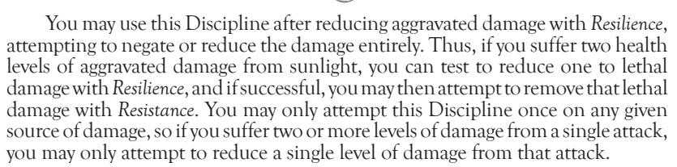
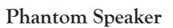
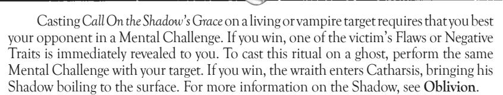

ADVANCED FORTITUDE

#### Aegis

Like a bar of steel, a mountain, an immutable constant, you resist all damage and survive any attack. Only truly monumental and persistent force can ever destroy you completely. Indeed, once the storm of fire and destruction has passed, you rise out of the chaos unscathed.

At any point during a turn, you may declare the use of Aegis. You must expend a permanent Willpower Trait or three permanent Physical Traits to activate this Discipline (though these Traits may be re-purchased later with Experience Traits). When you declare Aegis, you immediately revoke any damage that you suffered in the turn, and you take no damage for the remainder of the turn. You may even declare Aegis after you have been "killed," ignoring the damage that killed you and any other injury suffered in the same turn. If you are "killed," you must use Aegis in the same turn — once a new turn begins, you cannot revoke any previous damage. Use of Aegis is reflexive; it does not count as an action.

#### Melpominee

With this Discipline, the very voice of a Cainite is a powerful tool. Inspiring emotion or projecting sound through speech and song, the *Melpominee* Discipline reflects the incredible mastery possessed by the Daughters of Cacophony. The Greek Muse of tragedy surely reflects in this power, as it can be used both to soothe the mind and to inspire insanity. Some Cainites attribute these sirenlike gifts to a hint of fey madness in the Daughters' bloodline.

The powers of *Melpominee* function on the very soul, not merely on the flesh. Deaf subjects, or individuals otherwise unable to hear the vampire, can still be affected as long as the singer's voice reaches to the area of the target. These effects extend from the will of the siren, so they only affect those who are in the hearing range of the singer's natural voice or *Melpominee*-projected effects — engineered recordings, microphones, bullhorns, or electronic or mechanical copies cannot.

The Daughters of Cacophony consider *Melpominee* to be their highest art and calling, a reflection of the inward music that moves them. As a result, they do not teach its secrets to outsiders, and indeed other Cainites, who do not hear the cosmic music of the spheres, find development of this Discipline difficult in the extreme.

All Melpominee effects use Performance Ability for retests.

Basic Melpominee

#### The Missing Voice

Like a ventriloquist, you can throw your voice to any place within your line of sight. However, you do not cause your voice to seem to emanate from there — with *The Missing Voice*, you actually cause your speech or song to generate from thin air. You can even carry on two conversations simultaneously, for *The Missing Voice* functions independently of your normal voice.

You may use *The Missing Voice* at any time, as desired. However, if you use *The Missing Voice* while performing other actions, you suffer a two-Trait penalty on the resolution of challenges due to your split concentration.

No longer limited to sending your voice to a place you can see, you can project speech or song to anyone you know. As long as it is night at the subject's location, you make your voice heard to your target.

The words and music of *Phantom Speaker* are audible only to your target, unless an eavesdropper with at least the Intermediate level of *Auspex* manages to listen in by defeating you in a Mental Challenge.

You must expend one Blood Trait to project your voice for a single turn.

intermediate melpominee

#### **Madrigal**

The crashing waves of your song carry the force of your own emotions. With inspiring verses, you raise others to the heights of passion; black melancholy afflicts the victims of your works of despair.

You must make a Social Challenge against every target that you wish to affect with your *Madrigal* — you can affect anyone within hearing range, at your discretion. Willpower can be used to retest in defense against this power, as usual for Social Challenges. If you choose to affect multiple people, use a mass challenge as described in mob combat. Anyone who succumbs suffers the effects of an overwhelming surge of emotion, directed by your choice of song. The subjects should roleplay this wave of emotion as long as you perform no action other than singing.

You must sing for a full turn for *Madrigal* to take effect. The player need not actually sing to invoke this Discipline, though players so talented are certainly encouraged to do so.

## **Siren's Beckoning**

Pulling out the roots of turmoil and despair in a subject, you awaken insanity from the soul. Like the legends of faerie singers and mermaids, you can drive your target into desperation with your melodies.

You must make a Social Challenge against your target to use the *Siren's Beckoning*. If you win, the victim suffers from one randomly chosen derangement. You may carry about a stack of cards with various derangements and allow the victim to choose one at random, or you may have the derangement relate to the song you sang (such as regression for a children's song or megalomania for a national anthem). This derangement lasts for the rest of the night.

advanCed melpominee

#### **Virtuosa**

Though most Daughters of Cacophony are limited to affecting a single target with hidden speech or insanity, your performance carries your music to as many listeners as you desire. You can extend your powers of *Phantom Speaker*  or *Siren's Beckoning* to multiple subjects.

You need only expend one Blood Trait to use *Phantom Speaker* or *Siren's Beckoning* on up to five targets at once. If you use *Phantom Speaker*, every subject hears the same words or music that you project. If you use *Siren's Beckoning*, you make a mass Social Challenge against all of the victims at once. In either case, you can only use one power at a time — you cannot use *Virtuosa* to project speech to some people while singing to others simultaneously.

# neCromanCy

The unwholesome practices of the Giovanni family comprise several paths of magic centering on death and the dead. With studies born of centuries of

repellent traffic in cemeteries, sewers, crypts and catacombs, the codified powers of *Necromancy* allow conversation with and control over ghosts and corpses. Even other vampires shudder at the dark practices of necromancer Cainites.

As a study of undead magic, *Necromancy* consists of multiple paths of study and several rituals as well. Many necromantic powers require specialized components or grisly rites. Thus, vampires who make a practice of *Necromancy* must often secure such bizarre elements as human corpses, hands of murderers, jars of grave moss and the like. Needless to say, such repugnant practices often have a detrimental effect on one's Humanity.

Some few magicians outside of the Giovanni family also study *Necromancy*, most notably the rotting Samedi. It is rumored that there exist small bloodlines of extremely potent necromancer Cainites with powers beyond those known to the Giovanni.

A Giovanni student of *Necromancy* begins studies with the *Sepulchre Path*, the path of control over ghosts. Once Intermediate expertise is achieved, the student may expand into the studies of the *Ash Path* (communication with the Underworld) or the *Bone Path* (control of zombies) at the Basic levels, but he may learn only one of the two paths. At the Advanced level of mastery in the *Sepulchre Path* , the necromancer may begin studies of the other path as well, and he may improve beyond the Basic levels in any *Necromancy* path. Some few Cainite necromancers study more rare paths, or in a different order, but all Giovanni and Samedi vampires learn the *Sepulchre Path* first.

# the sepulChre path

Necromancers generally begin their studies with the *Sepulchre Path*, the means of controlling ghosts. Through the *Sepulchre Path*, the vampire delves into the names of wraiths and the means by which they may be compelled to service. Many Giovanni call on "family wraiths" that have worked in service to the necromancers for several years, especially since most novices lack the ability to see or communicate with wraiths that they do not summon and control directly.

The *Sepulchre Path* uses the *Occult* Ability for retests. Storytellers may choose to use *Wraith Lore* as a specialized Ability instead.

BasiC sepulChre path neCromanCy

### **Insight**

Gazing into the eyes of a corpse, you can see the image burned into its death. A moment's concentration allows you to call up the memories of death itself.

You need only expend a Mental Trait while gazing into the eyes of a corpse in order to use this power. You immediately see the last minute of the individual's existence, generally as flashes of vision and startling sensations. This power can even be used on the corpse of a vampire who has reached Final Death, as long as he had not achieved Golconda and is not in a state of advanced decomposition. However, it does not function on vampires that are still ambulatory.

## **Summon Soul**

By calling out the names of the dead, you pull them to attendance. Combined with power over their artifacts from life, you can force them to answer your summons, appearing and obeying your will.

To call a ghost, you must know its name, or at least have a clear image of its persona from *The Spirit's Touch*. You must also have an object with which the ghost had some contact while it was alive. If this object has particular importance to the wraith (a Fetter), you gain a free retest on your attempt to *Summon Soul*. Some wraiths cannot be summoned regardless of your efforts; many ghosts are lost in the eternal storm of the Underworld, or go on to their final rewards. Vampires who were diablerized or who achieved Golconda before Final Death likewise cannot be summoned in this fashion.

You must make a Mental Challenge against the wraith that you call (see **Oblivion**, or use the guidelines for wraiths on p. 264 of this book). If the wraith wishes to be summoned, it can appear voluntarily. The wraith finds itself pulled to your location, and it becomes visible and audible to you. You may ask a single question of the ghost, which it must answer truthfully. After a single turn, the ghost fades away unless it chooses to remain or is coerced with further *Necromancy*. Even if the ghost stays nearby, you must use other *Necromancy* powers to see and hear it again, unless you exercise *Summon Soul* on it again.

intermediate sepulChre path neCromanCy

#### **Compel Soul**

By binding a ghost with its name and your strength of will, you can force it to obey your commands. Once you have summoned a wraith, you may use *Compel Soul* to make it answer your questions and serve your bidding.

You must first use *Summon Soul* to cause a wraith to appear for you, then engage in a Social Challenge for the turn in which it manifests. The wraith may expend its Pathos (see **Oblivion**) to resist, forcing you to expend a Social Trait for each Pathos Trait spent. If you win the challenge, the wraith is bound to obey your commands for an entire hour. The wraith must answer your questions truthfully and act as you direct. During this time, the ghost remains visible and audible to you as well.

If you successfully *Compel Soul*, you may expend a temporary Willpower Trait to force the wraith to obey you for the entire evening. Expending a permanent Willpower Trait causes the wraith to be bound to your will for a year and a day.

## **Haunting**

Your powers of necromantic compulsion allow you to force a ghost to remain in a particular location, or near a specific object. With a cryptic phrase and a powerful command, you bind the wraith so that it may not leave.

You must engage a wraith in a Social Challenge in order to link it to a particular location. If you win, the wraith cannot leave the room (or move more than 10 feet from a particular object) for the remainder of the evening. By spending a temporary Willpower Trait at the time of the *Haunting*, you can force the wraith to remain in the location for a full week; a permanent Willpower Trait extends this time to a year. If the wraith attempts to leave the location, it suffers one aggravated level of damage per turn outside the confines of the *Haunting* until it returns or is destroyed utterly.

advanCed sepulChre path neCromanCy

#### **Torment**

There is a reason that ghosts fear the most puissant necromancers of the Giovanni. Through the use of *Torment*, the necromancer can inflict actual damage on the dead, punishing them for their indiscretions.

Though you remain in the physical world, you can make Physical Challenges against wraiths. You lash out with supernatural energies, though many Giovanni choose to direct the blow by striking physically. Your attacks inflict lethal damage on the wraith; a wraith discorporated with this power is banished to the deeper levels of the Underworld for a full month, unable to return.

# the ash path

The barriers between this world and the Underworld of the dead are permeable to the student of the *Ash Path*. With this path, a necromancer can see, hear and communicate with wraiths of all sorts, not just the ones that he can summon or control. Indeed, with enough skill, the *Ash Path* allows a vampire to cross the Shroud into the lands of the dead. This frightening power thus allows for myriad effects as the vampire reaches into the Underworld and deals freely with the denizens therein.

discretion, the specialized Ability of *Wraith Lore* may be used instead.

BasiC ash path neCromanCy

#### **Shroudsight**

With minimal effort, you can see across the Shroud that separates the world of the living from the lands of the dead. The Underworld appears as a decaying and ghastly reflection of the mortal world, sometimes with structures lost to the past or unusual spirits flitting about. You can see (though not hear or feel) anything that transpires in the Underworld within your normal visual range, with a sort of "double sight" that does not hinder your normal vision.

You need only expend a Mental Trait to look across the Shroud for the duration of the scene, or for an hour, whichever comes first.

#### **Lifeless Tongues**

The babble of restless spirits is clear to you. By concentrating for a moment, you attune your senses to the Underworld, making yourself capable of both seeing and hearing all that transpires there around you. Furthermore, you can understand the language of the dead, so unless a ghost goes out of the way to use a language that you do not know, you can comprehend the words of any wraith.

You must expend a Willpower Trait to attune yourself to the Underworld for a scene or an hour (whichever ends first).

intermediate ash path neCromanCy

### **Dead Hand**

The structures and entities of the Underworld are very real to you. In a bizarre sort of half-life, you can stretch your physical form across the Shroud, interacting with beings and scenery there even as your physical body remains partially in the living world.

By expending a Willpower Trait, you make yourself capable of touching the contents of the Shadowlands for a scene or an hour (whichever comes first). Each additional scene or hour, you can maintain this power at the cost of one Blood Trait. During this time, you do not actually pierce the Shroud, but your actions affect both worlds. Thus, you can climb a ghostly rope, then turn and step onto a real-world roof. You can also lash out physically and strike or grapple with ghosts, though they can return the attacks. However, you cannot push or pull objects from one world to the next. Effectively, you exist in both realms simultaneously, which can be very disturbing to those watching you climb invisible ropes or grapple unseen opponents.

### **Ex Nihilo**

Tearing through the Shroud between worlds, you can cross into the lands of the dead. This journey is a harrowing one, for many spirits wait to take vengeance on necromancers, and the Underworld is full of hazards unknown to most vampires. Furthermore, there is no way to gather blood or sustenance in the Underworld, and you can become lost in the storms and seas of the deadlands. Still, this power allows for direct contact with shades of the restless, and it serves as an unusual means of travel. While you are in the Shadowlands, you still see everything that transpires in the mortal world, but your physical form exists in the realm of the dead.

You must first mark a doorway with chalk or blood on any available surface, taking a full turn to do so. (You need not actually draw such a door, but you should pantomime the appropriate actions.) You must then expend a Willpower Trait and two Blood Traits, and make a Static Physical Challenge with a difficulty of eight Traits. If you succeed, you step through the door into the Underworld. Returning to the material world is a matter of concentration; you need only focus your intent to do so and expend a Willpower Trait, at which point you return to the living

lands at the end of the turn. Beware, though, for if you wander too deeply into the deadlands, you may become lost and unable to pierce the Shroud.

When you travel into the deadlands, you take with you only the inanimate objects that you carry. You cannot pull in other living or undead creatures. Furthermore, the laws of physics in the Underworld are not the same as those of the material world; guns do not work, and electrical devices fail. Generally, you must rely on your own powers.

advanCed ash path neCromanCy

### **Shroud Mastery**

Your control over the barrier between the living and dead worlds is nearly absolute. Instead of stepping across or watching the events of the Underworld, you can actually manipulate the fabric of the Shroud. By changing the strength of the web between worlds, you can make it easier to cross, or bar wraiths from exerting their influence on the material world.

You must expend a Willpower Trait to exercise *Shroud Mastery*. Then, you may raise or lower the Shroud, as you desire. Each Mental Trait that you expend alters the strength of the Shroud by one point in either direction. A stronger Shroud makes it more difficult for wraiths to interact with the living, while a weaker Shroud has the reverse effect. You can raise the Shroud up to a maximum of 10, or lower it to a minimum of three. The "typical" Shroud rating for most locations is 7 or 8, though areas frequented by vampires or ghosts (cemeteries, crypts, mortuaries and sites of Elysium) may have ratings of 4 or 5.

If you are simply using wraiths as generic antagonists, each point of change in the Shroud's strength grants the wraith bonus Traits when interacting with the living world (if the Shroud is weakened) or acts as a penalty to the wraith's total Traits (if the Shroud is strengthened). If you are using the rules from **Oblivion**, the Shroud's effects are explained on p. 161.

# the Bone path

The *Bone Path* controls death's physical ends. Corpses are the medium of power for such a vampire, and they can be imbued with unwholesome energies and animated to perform according to their master's bidding. Zombies and soulless automatons are the hallmarks of the *Bone Path*.

Retests of the *Bone Path* use the *Occult* Ability. The Storyteller may choose to use the specialized Ability of *Thanatology* instead, if desired.

BasiC Bone path neCromanCy

#### **Tremens**

You can instill a corpse with a brief jolt of life. Though this power is insufficient to actually animate or control bodies, you can make them start or twitch spasmodically. Naturally, this sight frightens those unaccustomed to the mobile dead.

You need expend only one Blood Trait to use *Tremens*. The body then twitches or moves briefly in a fashion that you dictate, from sitting up to blinking to flailing an arm momentarily. If you expend a Physical Trait as well, you can implant a command into the corpse instead, causing it to move (once) as you direct when a certain event comes to pass. Corpses twitching in this fashion cannot actually attack or inflict damage, but they can certainly startle the unwary.

## **Apprentice's Brooms**

Your skills in the *Bone Path* allow you to animate the dead, bringing ambulatory motion and a semblance of understanding to a cold corpse. Though they cannot fight, these zombies follow simple instructions, performing tasks that you set to them.

You must expend a Blood Trait and a Willpower Trait to use *Apprentice's Brooms* on one or more corpses, and you must also spend one Mental Trait for each

intermediate Bone path neCromanCy

#### **Shambling Hordes**

When you raise the dead to do your bidding, they come in skeletal hordes and withered masses that obey your every command, working and fighting until destroyed. Any body, no matter how decomposed, can be raised to serve your will.

You must expend a Willpower Trait to call on the *Shambling Hordes*, and then invest one Mental Trait and one Blood Trait for each corpse animated. As long as the skeleton is reasonably intact, the corpse rises to do your bidding. Such guardians can perform tasks or fight for you with no regard to their own welfare. They typically have four health levels (though heavily damaged corpses may have less), and they suffer no wound penalties. These zombies fight with the same number of Physical Traits that they possessed in life (assume five Traits for randomly chosen corpses). They can be given orders to attack people or to guard an area, and they wait tirelessly until destroyed. Decomposition will continue for corpses in varying states of decay, although completely skeletal guardians will be unaffected.

## **Soul Stealing**

Your mastery of animate flesh and spirit allows you to pull the soul from a living or undead body. With *Soul Stealing*, you draw out the victim's soul, turning it temporarily into a wraith while leaving the body as an empty husk.

You must expend a Willpower Trait and engage your target in a Social Challenge to use this power. If you succeed, the soul is torn from the body, forced to remain as a ghost for a full hour or scene. You can then use other *Necromancy* powers to bind the hapless spirit as long as it is separate from the body. The body itself continues to survive in a comatose state, a perfect host for other possessing spirits.

advanCed Bone path neCromanCy

#### **Daemonic Possession**

Though you are not dealing with actual infernal spirits, you can cast a willing soul into a fresh corpse or inanimate body. Thus embedded, the soul takes control of the body, turning it into a new physical home. Dead bodies continue to decay, and thus, they last no more than a week, but this trick provides a perfect temporary repose for a free-floating soul or summoned ghost.

The body must have died within the same scene in which you use *Daemonic Possession*, or else it must be alive or undead and bereft of consciousness (for instance, if you have removed its soul or if the owner is currently using *Subsume the Spirit*, *Possession* or *Psychic Projection*). Bodies of vampires in torpor do not make suitable hosts, as the vampire's spirit is still inside the torpid body. You need not make any challenge or expenditure — with an appropriate host and spirit, the process is automatic once you exert your power.

# neCromantiC rituals

The sinister secrets of *Necromancy* are not confined to the static paths alone. Skilled necromancers create rituals, forms of magic designed to go beyond the basic capabilities of *Necromancy*. With the appropriate materials, training and time, a necromancer can use rituals to create wide-ranging or long-lasting effects that would otherwise be difficult to do with simple paths.

On learning *Necromancy*, the individual learns one Basic ritual. For each level of *Necromancy* learned, another ritual of the appropriate level is also learned; thus, a nec-

romancer with Advanced *Necromancy* knows at least two Basic rituals, two Intermediate rituals and one Advanced ritual. Learning additional rituals requires the expenditure of time and Influence, as appropriate. Learning a ritual also requires that the vampire possess a level of *Necromancy* equal to or greater than the ritual's level of power.

Casting a ritual requires a Static Mental Challenge with a difficulty of nine Traits. Unless otherwise noted, Basic rituals take 10 minutes to cast, Intermediate rituals require 20 minutes and Advanced rituals take 30 minutes.

BasiC neCromantiC rituals

## **Call of the Hungry Dead**

With 10 minutes of time and a hair from the head of your prospective victim (represented by a card), you afflict your target with the cacophonous moaning and wailing beyond the Shroud. The victim is assaulted with a welter of confusing voices and mournful howls. For the remainder of the scene or the next hour, the target suffers the Negative Mental Traits *Oblivious* x 2 due to the confusing hail of otherworldly noise.

#### **Eyes of the Grave**

Over a time of two hours, you can concentrate the deathly emotions in a pinch of grave soil and use it to conjure visions of death and horror. Once you complete the ritual, you focus these images at the victim, who sees random intermittent flashes of her own gruesome demise.

Once during the remaining evening, you may force the subject to fail a retest, as a shocking vision of death overcomes her. For instance, if you are engaged in combat with a victim of this ritual, who fails a test but calls for a retest with an Ability, you may use the effects of this ritual to negate the use of the Ability and force the victim to either find an alternate means of retesting or to suffer the outcome of the original challenge. Only you may invoke this benefit — other people may not use this ritual's power against the victim, even if they are aware that you have cast the ritual.

## **Spirit Beacon**

By casting this ritual over a severed human head, you turn it into a supernatural beacon for ghosts. Within the Shadowlands, the head appears to glow with an unearthly radiance, emitting light from its mouth, ears and eyes. Any wraith viewing the Underworld radiance from this head must expend a Willpower Trait or else be immediately drawn to the light for a full hour (or until the end of the scene). The head loses its light at the next sunrise, though it may be enchanted again.

intermediate neCromantiC rituals

#### **Cadaver's Touch**

By chanting hideous paeans while melting a wax figure of your victim over a three-hour ritual, you cause the subject to lose all semblance of life. The mortal subject of this spell becomes much like a vampire, with a weak pulse, cool skin and a pale countenance. As long as the wax is melted without boiling off or solidifying, the ritual keeps the victim in such a pallid state.

The mortal subject of *Cadaver's Touch* gains the Negative Trait *Repugnant* for the duration of the ritual, as he literally resembles a walking corpse. However, this ritual can be very useful for sending a mortal unnoticed among vampires, or causing hunters to mistake a mortal for a Cainite.

### **Call On the Shadow's Grace**

After casting this potent ritual, you become able to peer through the veil obscuring the Shadowlands, and to detect the dark side of every wraith. You can speak directly to the Shadows of ghosts, conversing with their dark sides and learning their secrets. Furthermore, you can coax deadly plots and treacheries from the recesses of the living or undead, simply by communing with their shadowy sides.

## **Ritual of the Unearthed Fetter**

This three-hour ritual is most often used by skilled necromancers of the *Sepulchre Path*. By casting this ritual with the finger bone of a corpse, you attune the bone to any material objects, people or places that may have significance to the finger bone's owner — specifically, to the ghost of the dead individual. You take a chip of a grave marker, crush it and sprinkle it over the bone while intoning the ritual. When complete, the finger bone acts as a sort of spiritual compass, pointing toward objects of vital importance to its wraithly owner.

Once you have attuned a finger bone with this ritual, you can use it to find Fetters of a particular wraith, assuming that the remains in question are of an individual who became a ghost. You can therefore determine whether a particular place, object or person is a Fetter for a wraith. By spending a turn testing a suspect item with the finger bone, you can ask a ghost or Narrator whether it is a Fetter to that particular ghost. Remember, though, that the finger bone only finds Fetters of its owner.

advanCed neCromanCy rituals

## **Grasp the Ghostly**

Casting this potent ritual requires a full six hours of chanting. Once complete, you reach into the Underworld, pulling a ghostly object from there and replacing it with an item of your own of roughly equivalent mass. You can only use this ritual on objects, not on people, vampires or ghosts.

Once you have pulled an item from the Underworld, it maintains a solid existence, though its plasmic matter fades slowly from the real world. After a full year, the item in question vanishes forever. This ritual only works on objects that once existed in the real world and that now have ghostly relic equivalent. Artifacts — objects created by wraiths in the Underworld — are not affected by this power; attempting to bring them across will destroy them.

# oBeah

Though modern Cainites know the Salubri as soul-stealing demonologists, the powers of *Obeah* are a strange mixture of defense and healing. Indeed, powerful Salubri can apparently repair the very scars of the Beast on a Cainite's psyche. Of course, few would trust the Cyclops enough to undergo such treatment. As these powers irrevocably mark the user as a Salubri or ally of such, they are almost never seen or heard of by other vampires — no Salubri would give away his position to Cainites who might betray him to the Tremere, nor would he teach such fatal secrets to another.

Once a vampire learns the Basic power of *Anesthetic Touch*, he develops a third eye in the middle of his forehead. This eye opens any time an *Obeah* power of *Anesthetic Touch* or higher is used. Cainite scholars speculate that the eye may, in some way, be connected with the mystical (or demonic) insight that grants this Discipline.

Retests of *Obeah* use the *Medicine* Ability.

BasiC oBeah

#### **Sense Vitality**

The ebb and flow of life is obvious all around you. You can feel the pulse of life force with a touch, even sensing the energies of people or Cainites with whom you come in contact.

You must touch your subject to use *Sense Vitality*. With a successful touch, you can unearth information about the subject's life force by spending Mental Traits. Expending one Mental Trait tells you if the subject is a mortal, vampire, ghoul or other creature. Two Mental Traits tell how much damage the victim has suffered. Three Mental Traits reveal the amount of blood in the subject's system, while four Mental Traits reveal any diseases. These expenditures are cumulative; that is, any expenditure of Mental Traits includes the information for a lesser expenditure automatically.

*Sense Vitality* may also be used for medical diagnosis, determining the source of injuries or diseases afflicting a victim. Anything that could be learned with a medical examination — the source of the injury, the wound's severity, the reason behind unnatural mental states or death — can be learned with a touch. Each condition examined in this fashion requires the expenditure of a Mental Trait. Thus, determining that a subject was injured with a poisoned knife would cost two Mental Traits — one to recognize the wound as a knife wound, and one to recognize the poison.

#### **Anesthetic Touch**

Pain flees at your caress, and a peaceful stillness falls on those under your care. Any voluntary subject touched (other than yourself) can be rendered immune to pain. You can also cause mortals to descend into a natural, healing sleep.

You must touch your subject to use *Anesthetic Touch*, but as it only works on willing subjects, doing so generally requires no challenge. Expending one Blood Trait causes the subject to suffer no penalties from wounds for the next full turn. If you also expend a Willpower Trait, the pain-numbing effects last for the rest of the scene, or for an hour, whichever ends first.

Alternately, you can cause a willing mortal to sleep. You must expend a single Blood Trait. The mortal immediately enters a deep, peaceful slumber, suffering no nightmares or derangements. The subject can be awakened normally. If the mortal sleeps for an entire natural sleep cycle (which will happen automatically if uninterrupted), then the mortal's Attribute Traits are refreshed and one Willpower Trait is restored on awakening.

*Anesthetic Touch* has no effect on vampires.

intermediate oBeah

### **Corpore Sano**

The power of your blood carries healing vitality. Touching the injuries of a subject, you cause them to close and heal immediately.

You must touch an area on or near an injury to invoke *Corpore Sano*, possibly requiring a Physical Challenge if the victim is for some reason unwilling (a vampire who does not trust the assurances of a diabolical Salubri, for instance). Each Blood Trait that you expend heals one health level of lethal damage on the subject immediately and completely; aggravated damage requires two Blood Traits per level healed. If your generation precludes you from spending enough Blood Traits to heal the target completely, you can maintain your contact over the course of several turns in order to heal severe injuries. You are not required to heal all damage that a target suffers — you can spend as much or as little blood as you like over the course of the healing.

#### **Mens Sana**

Soothing words and supplicating paeans calm the mind of your subject, gifting mental peace to the disturbed. Whether by psychological discourse or religious exorcism, your words carry away the worries and problems of disturbed individuals.

Using *Mens Sana* requires you to spend about 10 minutes in uninterrupted, quiet conversation with the subject. You must expend two Blood Traits and make a Static Mental Challenge with a difficulty of the subject's Mental Traits — more

