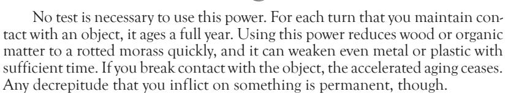
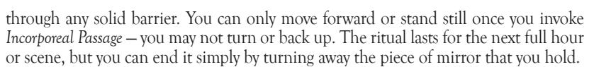

aggravated wounds on others and light flammable objects he touches, but this incidental effect is obviously a secondary consideration.

You may *Engulf* a target multiple times in successive turns, causing cumulative damage as the victim combusts explosively. However, a victim blasted multiple times still only takes one level of damage per following turn due to the continuing fire.

advanCed lure oF Flames

### **Firestorm**

When you call to the flames, they come in a searing wash that fills an entire room. A *Firestorm* rains a hail of flame down across a huge area, burning everything within. Any place that you can see, within 50 feet, can be the target of a *Firestorm*.

When you call down the *Firestorm*, an area up to 20 feet in diameter is shot through with roaring sheets of flame. You make a mass challenge against anyone within, pitting your Mental Traits against their Physical Traits. Anyone who loses is struck with the fire, immediately taking a level of aggravated damage. Victims who cannot reasonably escape the area (because they are trapped in a dead end, perhaps, or because they cannot move fast enough to get out of the way) are burned automatically without recourse to a challenge, at the Narrator's option. All flammable materials in the area ignite immediately, though people or vampires fleeing the space do not necessarily remain lit.

A *Firestorm* lasts until you stop it, or until you move out of range. It also ends immediately if you are knocked unconscious, sent into torpor or killed. Anyone who remains in the area of the *Firestorm* suffers one level of aggravated damage at the end of every turn after its creation.

## movement oF the mind (rego motus)

Through *Movement of the Mind*, you can manipulate remote objects or even creatures. Though this path does not actually impart any sort of physical force, it allows you to control things as if you held them without actually touching them. You need only see the target in order to affect it.

Manipulation with *Movement of the Mind* does not provoke a tactile response. That is, you cannot remotely "feel" an object to tell if it is hot, rough, slippery etc. You simply impart motion into the item in question.

Retests of *Movement of the Mind* use the *Occult* Ability.

BasiC movement oF the mind

### **Force Bolt**

Your concentrated will projects a bolt of force capable of stunning opponents and knocking over objects. A *Force Bolt* is really more of a sudden jar of motion to a target than an actual blow, but the effects are similar.

When you attack someone with a *Force Bolt*, you use your Mental Traits in a challenge against the victim's Physical Traits. If you win, the subject is knocked to the ground, losing his next action (not full turn — victims with *Celerity* may well recover in the same turn).

A *Force Bolt* can be used to lash out at an object no more than a hundred pounds in weight. If the object is not held by anyone, you can push it about five feet in any direction. An object held by someone can only be struck aside if you defeat the holder in a Mental versus Physical Challenge, as described previously. Obviously, though, this power is ideal for disarming foes at a distance, or for knocking aside valuable possessions.

## **Manipulate**

Your control of forces allows you to exert fine manipulation over something at range. When you *Manipulate* an object, you can toy with it in any fashion that you could with one hand. Thus, you can remotely pick something up, push a button or fire a gun.

Using an object remotely takes your full concentration and thus counts as your turn. Additionally, the difficulty of fine control at range requires that you risk an additional Trait in any challenge with the object — if you *Manipulate* a gun to fire at someone, for instance, you must bid an extra Trait for the attack challenge. Objects hefted with this power can only move at walking speed, and they can be nothing larger than you could lift with one hand.

Anything you *Manipulate* remains under your control as long as you can see it, unless you release it from your spell deliberately. You must maintain complete concentration to *Manipulate* an object; when you stop concentrating or take a different action, the spell ceases.

intermediate movement oF the mind

### **Flight**

You can telekinetically hoist a whole person, pulling the individual off the ground. You can also shove large objects around roughly, although you cannot control them easily. This level of power can slam doors, heft desks and snare opponents. *Flight* even lets you lift yourself off the ground and move at a brisk pace through the air.

When you invoke *Flight* on a particular subject, you can move it around at a brisk walking speed. You can move anything up to 200 pounds in weight, but you do not have fine control over the object, and the object cannot be used to bludgeon or cut (since it moves too slowly and erratically). If you grab a person with this power, using a challenge of your Mental Traits against the victim's Physical Traits, you can hoist the victim into the air, or even move him about slowly, though this power does not inflict actual damage.

Most spectacularly, *Flight* lets you move yourself smoothly at walking speed in any direction. You can soar as high as you dare go or simply hover off the ground.

*Flight* lasts only as long as you concentrate on the effect to the exclusion of all other activities. If you use this power on any subject besides yourself, you must be able to see the target in order to control it with *Flight*.

## **Repulse**

A wave of motion overtakes everything around you with a simple gesture and a few spoken words. You can push away threatening opponents or shove objects with incredible power.

You can *Repulse* anything within your line of sight. Objects flung with *Repulse*  move up to 20 feet away from you, and you can push multiple objects simultaneously. If you *Repulse* people, you make a challenge of your Mental Traits against each of their Physical Traits, as described in mass combat. Anyone who loses to you is flung 20 feet away. Even people who are grappling or biting you can be pushed away in this fashion. If you *Repulse* an object so that it strikes a victim, you use your Mental Traits to strike with it while the opponent dodges with Physical Traits. Objects hitting in this fashion do one health level of lethal damage.

*Repulse* is an instant effect; you cannot *Repulse* an object to strike someone and then continue shoving it around in successive turns. You must *Repulse*  objects or people every turn that you wish to move them.

advanCed movement oF the mind

### **Control**

Gripping a target with mental force, you bend its motions to your will. As you direct its movements with your commanding magical phrases and gestures, it spins, flies and moves according to your direction.

When you *Control* an object, you can heft anything up to a ton in weight and manipulate it with precision equal to both of your hands. You can therefore hoist an automobile or tie shoelaces. These devices can be used to attack, doing one health level of lethal damage if they strike (as described under *Repulse*). You can even control a weapon remotely, scoring its normal damage, though this sort of fine manipulation requires you to bid an extra Trait in all challenges with it (as described under *Manipulate*).

People grabbed with *Control* can be rendered paralyzed, or they can be flung about at your will. Slamming a victim into a wall or other hard surface causes one level of lethal damage. You must make a Mental Challenge against the target's Physical Traits when you first exercise *Control*, and in any successive turn where you attempt to move the victim. Thus, you must win a test to grab the victim, and if you do anything other than immobilize him, you must make additional tests. Note that *Control* only affects the victim's physical motions; the subject can still talk, shout for help, use Disciplines and so on.

Exercising *Control* over one object or creature requires all of your concentration. Once you stop concentrating, the power dissipates. *Control* is also lost if you lose sight of the subject.

# the path oF ConJuring (Creo materia)

Creating objects from nothingness is a simple power with *The Path of Conjuring*. Just a few words and a mental image of the desired item allow for the sudden appearance of nearly any object. Any conjured object or creature is literally produced from nowhere.

Objects created with *The Path of Conjuring* are generic, with no distinguishing marks, and are always exactly the same every time they are conjured. You cannot conjure anything larger or heavier than yourself. Also, you must have a working familiarity with the object in question. Making this power its most effective may require you to possess certain Abilities. You would need a few levels of *Firearms* and *Crafts: Gunsmith* to make an Uzi, for instance, or *Science* and *Medicine* to conjure artificial pharmaceuticals. All such objects are conjured from Platonic ideals, not as sums of parts. Therefore, if the object is broken up into components, melted, altered or otherwise violated, the spell is broken and the substance dissolves into a viscous sludge that fades into nothingness.

Using *The Path of Conjuring* requires a full turn to create any one effect. Retests with *The Path of Conjuring*, when necessary, use the *Occult* Ability.

BasiC path oF ConJuring

## **Summon the Simple Form**

Your rudimentary conjuring skills allow you to create basic objects made of a single homogenous material. These items are little more than chunks of matter, possibly crudely fashioned and lacking in any complex or moving parts. You can thus conjure a rod of metal, a club, a wooden stake, a rock or a lump of coal.

When you *Summon the Simple Form*, you can only make an item of inanimate matter of one sort. You cannot conjure living or undead creatures, nor can you make something built from multiple substances.

After you have conjured an item with this power, you must spend a Mental Trait at the beginning of every new turn in which you wish to keep it in existence. If you do not, the object vanishes instantly. You should record your current Mental Traits at the time that you create an object with this power, in case it is dispelled later with *Reverse Conjuration*.

### **Permanency**

Simple objects that you conjure can now be invested with your power, making them real and permanent. You need not make an item permanent, but if you choose to do so, it remains without any further concentration or effort on your part.

Exercising *Permanency* on an item conjured with *Summon the Simple Form*  requires that you spend three Blood Traits in the process of conjuring, instead of the usual one. The object is then considered whole and real, and it does not disappear unless banished with *Reverse Conjuring*.

intermediate path oF ConJuring

### **Magic of the Smith**

Complicated objects, mixed materials and moving parts are now within your purview. As long as you are familiar with an object's workings, you can make a copy of it. The *Magic of the Smith* can make knives, guns, clothes, medicines and other such useful items, and they all have permanent and lasting substance.

Creating an object with *Magic of the Smith* costs five Blood Traits instead of the usual one. Record your current Mental Traits on the item card at the time of creation, in case the object is later challenged with *Reverse Conjuration*.

### **Reverse Conjuration**

You can send conjured objects back to the nether planes from which they come. Any item that you can see or feel can be subjected to this power with only a few words and simple gestures.

To use *Reverse Conjuration* on an item, you must make a Mental Challenge against the Traits recorded at the item's creation. This power works only on conjured objects, but you have no special way of telling a conjured item from a "real" one. You may banish any of your own creations without a challenge (although it still takes a full turn).

advanCed path oF ConJuring

### **Power Over Life**

Though you cannot make true life, you can conjure creations that bear a semblance of life. *Power Over Life* lets you make any creature up to your own size. Such creatures have no independent will, though. They obey your commands mindlessly instead.

You must expend a phenomenal 10 Blood Traits to conjure a living creature. These simulacra last only for a week, after which time they dissolve back into nothingness. A creature that is killed similarly vanishes, as do any parts that are removed from the being (including blood).

# hands oF destruCtion (perdo materia)

The magicians of the Sabbat use magics designed to slay their foes brutally. The painful powers of the *Hands of Destruction* are one such straightforward path. Rumored to be the work of infernalists and demonic tutors, this path delivers agony and decrepitude on its victims.

Some few Camarilla vampires have unearthed this path, but it remains a rare curiosity among most thaumaturges. With the destruction of the Sabbat's Warlocks, the *Hands of Destruction* path is relegated to the few zealous warriors who manage to wrest its secrets from tomes or infernal pacts. A number of regents have barred practitioners of this path from their chantries on suspicion of infernalism, and many Tremere refuse to practice it because of its potentially demonic origins.

Exerting *Hands of Destruction* requires a single turn of casting. In some cases, it is used as a physical attack, and the spell and the attack are considered to take one turn, executed on the caster's normal action.

BasiC hands oF destruCtion

### **Decay**

Inanimate matter crumbles rapidly under your touch. Even dead organic material quickly melts into a puddle of putrescence.

Although you can age the flesh of a vampire with this power, such a tactic has no functional effect. Vampires do not suffer any changes or decrepitude from this aging, as their supernaturally preserved corpses are immune to such treatment.

## **Gnarl Wood**

Your merest glance can swell or contract wood, or twist it into strange shapes. You need not touch the wood to affect it, only see it.

You can warp up to 50 pounds of wood, rendering it gnarled and useless. This is an excellent way to burst doors, destroy furnishings and twists stakes into uselessness. If you try to gnarl an object held by someone, you must best the individual in a Mental Challenge to warp the wood. You can *Gnarl Wood* against multiple objects at once, as long as you can see them all and they do not total more than 50 pounds in weight.

intermediate hands oF destruCtion

## **Acidic Touch**

Mystically altering your vitae, you cause it to become a thick, black, bilious substance, a caustic fluid that burns flesh, cloth, metal and wood alike. Your *Acidic Touch* has no effect on yourself, but it can leave horrible corroded marks on anything that makes the slightest contact with your coated hands.

The vitriol created with *Acidic Touch* inflicts aggravated damage, and it can eat through most substances (Storyteller's discretion as to time). You can exude this acid from any part of your body, thus potentially making simple contact or even a kiss painfully deadly. Each application of *Acidic Touch* does only one health level of damage, so you may need to use this power repeatedly over several turns to burn through a particularly recalcitrant substance (or subject). No test is necessary to use *Acidic Touch*, though, of course, if you try to strike someone with the acids, you must make the normal Physical Challenge to hit. The acid created with this power is thick and slimy, so it cannot be flung or spat at opponents; you must deliver it by touch.

### **Atrophy**

The warping effects of your powers allow you to wither the very limbs of your opponents. A simple touch is all that is required to *Atrophy* a single limb, turning it into a useless, fragile husk.

You need to strike your target physically (with a Physical Challenge) in order to *Atrophy* a limb. If you hit, you wither one arm or leg, rendering it useless. Doing so gives the victim the Negative Traits *Clumsy* and *Lame*. Multiple attacks can wither different limbs, cumulatively crippling the victim (and adding additional Negative Traits). A victim without arms cannot grapple or wield weapons; a victim without functional legs cannot move. This effect is permanent on mortals, though vampires can heal a crippled limb as if it were a single aggravated wound.

advanCed hands oF destruCtion

### **Turn to Dust**

Amplifying the process of decay to incredible speeds, you can reduce your victim to little more than a pile of dust. Mortals almost always die instantly and collapse to putrefied remains, while even vampires are withered.

If you manage to get a firm grip on your victim with a Physical Challenge, you can cause him to turn to dust. Each Physical Trait that you expend afterward

causes the subject to age 10 years. Mortals aged more than 50 years die instantly, reduced to a mass of liquefied tissue and crumbling bone. Vampires attacked with such ferocity (aged 50 years or more) suffer the Negative Trait *Repugnant* for the remainder of the evening as their bodies shrivel slightly, but the immortal curse prevents any actual physical harm. Note that *Turn to Dust* functions only on living or undead targets; use *Decay* on inanimate subjects.

## thaumaturgiCal rituals

Through arcane incantations and properly prepared formulae, the effects of *Thaumaturgy* can be extended beyond the brief and limited powers of the various paths. Rituals are used to perform such complex tasks.

Rituals rank in difficulty as Basic, Intermediate or Advanced, just like the levels of *Thaumaturgy*. A character learns one Basic ritual automatically after learning *Thaumaturgy*. As the vampire's primary path improves, additional rituals are learned, one appropriate to each level gained. Thus, with Advanced *Thaumaturgy*, the vampire knows at least two Basic rituals, two Intermediate rituals and one Advanced ritual. Learning additional rituals takes time, effort and access to specialized equipment and Influence. A vampire can only learn rituals whose difficulty do not exceed her primary *Thaumaturgy* path level.

Actually casting a ritual requires the elements and time listed in each individual description, and a Static Mental Challenge on the part of the caster — difficulty of five Traits for Basic power, seven Traits for Intermediate rituals and nine Traits for Advanced magics. Unless otherwise stated, Basic rituals take 10 minutes to cast, Intermediate rituals require 20 minutes and Advanced rituals take 30 minutes.

BasiC thaumaturgiCal rituals

### **Communicate with Kindred Sire**

Tremere vampires often use *Communicate with Kindred Sire* to seek advice or aid. You need only meditate for half an hour on an object that once belonged to your sire. When you finish the ritual, you establish telepathic communication with your sire, anywhere in the world. This link lasts for 10 minutes.

### **Defense of the Sacred Haven**

*Defense of the Sacred Haven* blocks the entry of sunlight in a single room. You need only use one Blood Trait as you take an hour to inscribe sigils across all of the doors and windows of the room. As long as you remain in the room, sunlight is prevented mystically from entering the area.

### **Deflection of Wooden Doom**

The wooden stake is the bane of all vampires, but *Deflection of Wooden Doom*  protects against such attacks. You must sit in a circle of wood for a full hour to cast this ritual. When completed, you place a tiny splinter of wood under your tongue. As long as the splinter remains there, or until the next dusk or dawn, you are protected. The first stake to impale your heart mystically crumbles to dust, at which point the ritual ends. The stake must actually enter your body for this ritual to work — a stake simply held near you is unaffected.

## **Devil's Touch**

You can brand a mortal mystically with the *Devil's Touch*. You need only place a penny on the mortal as you complete this ritual, and until the next dawn, the subject suffers the Negative Social Traits *Repugnant* and *Obnoxious*.

**The Open Passage**

## **Principal Focus of Vitae Infusion**

Concentrating the power of your blood, you cause your own vitae to sink into a small object. With a touch and a mental command, you can later cause this object to break down back into a pool of your own blood. You can imbue an object between the sizes of a dime and a loaf of bread with a single Trait of your own blood, at which time the object becomes slightly reddish and slick. Alternately, you can use the *Principal Focus of Vitae Infusion* to craft an object of your blood that responds to the touch of another individual, as long as that individual is present during the casting of the ritual. Of course, since your own blood must be used, the subject risks the blood bond.

## **Scent of the Lupine's Passing**

With a mixture of milkweed, wolfsbane and other herbs, you can make a poultice that allows you to sniff out werewolves. The poultice retains its effectiveness for a full scene or hour after its creation; as long as you carry it with you, you can detect Lupines by smell. You must get within five feet of your subject and win a Mental Challenge to determine the *Scent of the Lupine's Passing*.

## **Wake with Evening's Freshness**

In case of emergencies or if you fear invasion of your haven, you can *Wake with Evening's Freshness* simply by spreading ashes of burned feathers over your sleeping place while casting this ritual immediately before slumber. Should you be faced with danger, you awaken immediately. For the first two full turns you suffer no penalties for daylight activity (although you can still be injured by sunlight, of course).

## **Ward versus Ghouls**

Spending 10 minutes repeating a warding invocation while pouring a Trait of blood over an object, you shape a mystical glyph that causes extreme pain to any ghoul touching it. The night after you cast the ritual, the ward takes effect, causing a level of lethal damage to any ghoul touching the object (even adding this effect to other damage if, say, a warded sword is used against a ghoul in combat). Any object in size between dagger and door may be warded. You can specifically exclude certain ghouls from the effect if they are present while you cast the ritual and if each donates a Trait of blood to attune the *Ward versus Ghouls*.

intermediate thaumaturgiCal rituals

### **Bone of Lies**

By enchanting a mortal finger bone as a *Bone of Lies*, you bind the soul of the skeleton to the bone. Then, whenever someone holds the bone, the taint of any lies that they speak is drawn into the finger bone, which blackens it as the spirit within becomes corrupt. The bone must be at least 200 years old, and it must be steeped in at least 10 Traits of blood during the casting of the ritual — all of the blood is mystically absorbed. Thereafter, whenever someone knowingly speaks a lie while holding the bone, it darkens noticeably and forces the subject to speak the truth immediately. Each lie so negated uses one of the Blood Traits in the bone; when all 10 are used, the bone is blackened and useless, home only to a dark spirit twisted by lies.

## **Incorporeal Passage**

By looking into a fragment of a mirror while intoning this chant, you become completely incorporeal. Physical attacks pass through you while you may step unhindered

## **Pavis of Foul Presence**

To combat the powers of the *Presence* Discipline, you tie a blue silken cord around your neck while intoning the *Pavis of Foul Presence*. Until the next sunrise, you are defended against *Presence* powers. If someone manages to exert a *Presence* power on you, it is reflected back instead of affecting you. This ritual is completely unknown outside the Tremere clan, who keep it as a powerful secret in their wars of vampiric influence.

### **Rutor's Hands**

The terrifying servant created with *Rutor's Hands* is actually one of your own severed hands, with one of your eyeballs set atop it! After casting this ritual, you must cut off your own hand and pluck out your eye, suffering five levels of aggravated damage in the process, in order to complete the spell. (Don't actually inflict physical harm on yourself. Your character does the nasty deed, not you.) The ritual keeps your body parts from crumbling to dust, and it animates them as spies for your use. They follow your mental orders, moving as you direct and allowing you to see and hear whatever they experience. You can create as many as you like, though you must regenerate your hands and eyes fully after each casting before making another set of *Rutor's Hands*. The spying, scuttling… thing made with this ritual needs a single Trait of blood each week (from any source), or else it crumbles to dust.

You can get cards for your *Rutor's Hands*, and then use them to spy on other locations. Simply give the card to a Narrator and direct him to a particular location. If the thing is spotted, of course, it is easily destroyed with a single level of damage (it is considered to have three Physical Traits that it can only use to defend itself).

## **Soul of the Homunculi**

Few vampires trust anyone, yet the arcane researches of the Tremere often require capable assistants. A homunculus is a tiny physical replica of the caster, completely loyal and made to serve its master as a spy and aide. Casting the *Soul of the Homunculi*  takes a full month of time outside of play. When completed, the homunculus acts as a tiny extension of yourself. Such creations can resemble tiny winged creatures capable of flight, a legless slug with a human face like its master's, or a small marmosetlike creature with a face resembling its creator. Any given homunculus is completely loyal to its creator, in effect acting as an extra limb. Homunculi have three Physical Traits and two health levels, and they cannot fight. They *can* spy and report back or perform small tasks. You can only have one homunculus at any given time.

## advanCed thaumaturgiCal rituals

### **Blood Contract**

By spending three nights in the writing of a contract with your own blood, you create an unbreakable bond between yourself and any one signatory. You use two Blood Traits to make the contract — one to write it, and one for both parties to sign it. The *Blood Contract*  enforces compliance of both parties to the literal terms listed. Should either party break the terms of the contract, the individual immediately suffers enough aggravated health levels of damage to fall into torpor, and this damage cannot be resisted in any way. The only way to finish the contract is to fulfill its terms or to physically burn it.

## **Nectar of the Bitter Rose**

Hidden among the most vile of diablerists, the *Nectar of the Bitter Rose* breaks the usual constraints of diablerie, allowing multiple vampires to share in the fruits of a victim's power. You must restrain the victim in some fashion while casting this ritual over him. At the ritual's completion, up to five vampires may attempt to

## **Umbra Walk**

The Tremere powers of *Auspex* allow them to search sublime planes of consciousness, but there are still other levels of existence to the infinite cosmos. Through the power of this ritual, which requires the sacrifice of an intelligent being (almost certainly costing you a Humanity Trait), you enter the Umbra, a spirit reflection of the physical world. You arrive naked, though certain magical items may come with you at the Storyteller's discretion. You can even bring other people, though each additional traveler requires another sacrifice. The Umbra is a dangerous place, traveled by werewolves and unfriendly spirits. *Umbra Walk* lasts until you choose to step back into the material plane. See **Laws of the Wild** for more detailed information about the spirit worlds.

## viCissitude

The Fiends of Eastern Europe harbor twisted secrets that make other vampires shudder. *Vicissitude*, the signature Discipline of the Tzimisce clan, reflects the inner nature of the most alien of vampires. Through *Vicissitude*, the wielder can reshape flesh under his very touch, whether into gross deformity or uneathly beauty.

When used on mortals, ghouls, revenants and vampires of weaker generation than the user, *Vicissitude*'s effects are permanent. Vampires of equal or more potent generations can heal back each *Vicissitude-* inflicted scar as an aggravated wound. Of course, a user of this Discipline can always shape his own flesh as desired.

Nosferatu, Samedi and vampires with similar deformities in their blood always heal back alterations of *Vicissitude* that attempt to improve their appearances. The Curse of Caine is not so easily circumvented.

*Vicissitude* uses the *Crafts: Body Crafts* Ability for retests. Most *Vicissitude* effects require physical contact and a Physical Challenge as the vampire tears into the flesh of the opponent. Such strikes use *Crafts: Body Crafts* for retests, instead of *Brawl*, since the aim is to mutate the flesh. For certain surgical effects, the Storyteller may require some level of *Medicine* Ability as well.

## BasiC viCissitude

## **Malleable Visage**

Bending your flesh under your hands, you can change your own appearance. *Malleable Visage* allows you to duplicate others or simply make your own surface skin different from your natural forms. Cosmetic changes like alterations of voice or skin tone and build are all possible, though you must actually sculpt the desired changes into your flesh.

Changing yourself with *Malleable Visage* costs one Blood Trait, and it requires you to spend time reshaping yourself appropriately. If you hope to copy someone else, you must make a Static Mental Challenge, difficulty of the subject's Social Traits, to pull off the disguise, and you still use your own Social Traits in any challenge — you are simply duplicating the person's appearance. You can also afflict yourself with a hideous visage, taking on *Repugnant* Negative Traits (up to three such additional Traits maximum).

### **Fleshcraft**

Your hands can turn flesh to putty, shaping it like potter's clay. You can perform drastic alterations to the flesh and organs of any creature that you touch.

You must touch your victim to use *Fleshcraft*, pulling or shaping the flesh to your whims. You can reshape flesh on yourself or others within the limits described in *Malleable Visage*, or you can move around clumps of tissue or simply reduce someone to scarred deformity. These attacks do not inflict damage, but each such strike causes the victim to suffer a Negative Trait of *Repugnant* (to a maximum of three such Traits from this power). If you alter the distribution of skin, fat and muscle, you can remove one (and only one) of the subject's Physical Traits and replace it with an extra health level, or reverse such an operation.

intermediate viCissitude

### **Bonecraft**

Just as you shape flesh with your touch, you can grasp and twist bone, turning it into any desired shape or moving, lengthening, bending or compressing it. *Bonecraft* lets you literally pull the bone through a subject's flesh, or you can use it with *Fleshcraft* to completely restructure a victim — or yourself.

Using *Bonecraft* allows you to remake appearances just like *Fleshcraft*, but you can also change someone's height or body structure, reshape bone into unusual or spectacular forms, and even make bone spurs and weapons. You must grab the victim, and then twist, pull or bend the bones appropriately. If you do so without exercising *Fleshcraft*, each such strike causes one level of lethal damage as bones warp and tear their way through flesh. Used in conjunction with *Fleshcraft*, you can rebuild someone's visage completely, or you can create defensive spines or offensive bone weapons. Such alterations allow the subject to inflict lethal damage with otherwise unarmed attacks.

## **Horrid Form**

Your own body warps and grows into a hideous monstrosity with *Horrid Form*. Your skin becomes black, rubbery and slimy, while sharp bony spikes protrude from your hands and back. You grow to a full eight feet in height, and you shift into something from a nightmare vision. Those unused to such sights may need to make a *Courage* test.

Awakening the *Horrid Form* costs two Blood Traits. You gain the Negative Social Traits *Bestial*, *Feral* and *Repugnant* in this form, but you also gain the Physical Traits *Brawny*, *Dexterous*, *Enduring*, *Ferocious*, *Quick* and *Stalwart* for the duration of the power. You may also not initiate Social Challenges except for the purposes of intimidation. You inflict lethal damage in brawling combat, and you score an extra health level of damage on all such attacks. You may remain in *Horrid Form* until you decide to change back.

advanCed viCissitude

### **Bloodform**

Deliquescing into a puddle of vitae is within your power. You need only concentrate briefly, and you can reduce any of your limbs or body parts into a puddle of your own pure blood.

Each limb (arm, leg, head) that you transform becomes one Blood Trait; your body forms the remainder of your Blood Traits, up to your maximum size. You can change part or all of yourself, as desired. This blood functions in all ways as your own blood, but you retain a level of autonomic control over it. In *Bloodform,* you can move at a slow walking pace as a puddle of blood, oozing over things and through cracks. Changing body parts back requires only that you be in contact with the blood, or that you regrow your part by expending Blood Traits appropriate to the part (a single Trait to regrow a limb, for instance), in which case the blood that previously formed the piece becomes inert. While fully in *Bloodform*, you can use mental Disciplines, and you are immune to all physical dangers except fire or sunlight. If all of the blood is imbibed or destroyed while you are in this form, though, you meet Final Death.

