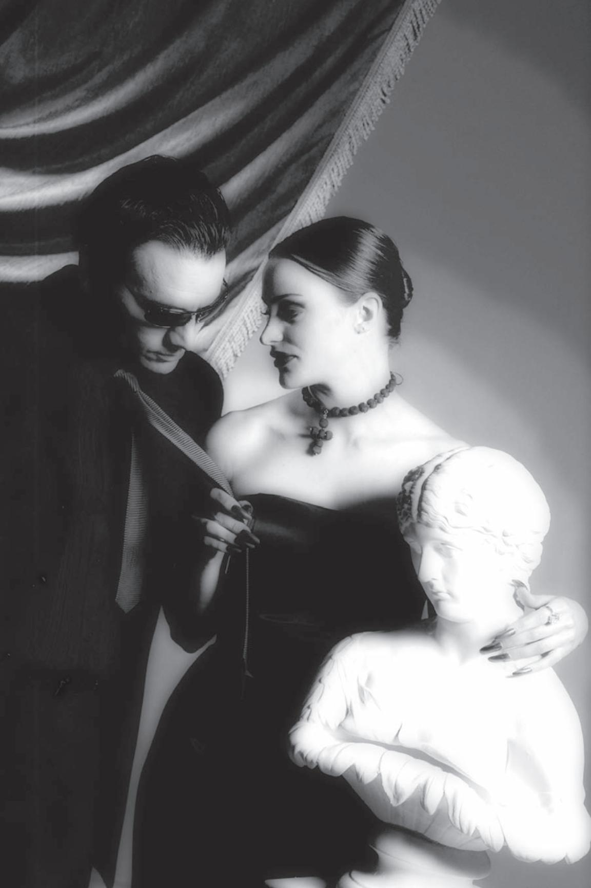
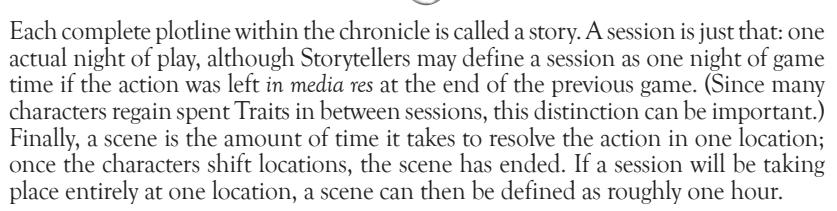

Donata had some time to herself, once Peter and Kevin had both left. She took the opportunity to rearrange some of the statuary. The place wasn't her true haven, but that didn't mean that it had to look trashy.

As Donata took down a painting, looking for a better way to compose it with the statuary, she played over the running plots in her mind. She knew that only the prince had the strength of blood and age to oppose her directly. Warburton would still be set up as the architect of the package deal, and Kristof would owe her for her involvement in stopping the candle ritual. With the major players vanquished, she could move in to conquer their financial and political assets, securing a position that even the prince couldn't dislodge. All she had to do then was get the Warlocks in her corner, and she'd have the run of the city, even if the prince kept his hollow title.

From outside, Donata recognized the distinctive sound of Peter's car. The expensive engine rumbled slightly before turning off, and with a bit of straining she heard the door slamming shut through the sounds of outside traffic. Adjusting her choker, she waited for Peter's entrance. His footsteps resounded up the stairway; he was in a hurry, doubtless flustered by his failure with the Warlocks.

The door to the room opened, and Donata carefully turned one of the statues, its eyes mutely regarding the entrance. Peter stood in the doorway for a moment, stiff and angry, but with a monumental effort of self-control the wave of rage subsided and his bloodless lips relaxed. Not deigning to remove his sunglasses, he approached Donata with quick steps.

"The Warlock was dead."

Donata masked her surprise. Someone had interfered with her careful web, killing the Tremere before Peter could find him! Thinking quickly, she decided to work the situation to her advantage.

"Of course. It must be Kevin. That vicious creature must have done this to stop you," she glibly suggested.

Peter considered her words for a moment, then shook his head. He calculated the possible motives much like he'd look at profit and loss, surprised at his sudden change of focus. I've thought like this for so long, it's a habit, he realized. I need to turn my skills to new advantage. "I don't think so. You forced him to love you, but he had no reason to think that the Tremere was a danger to you."

"Indeed," Donata purred as she wrapped an arm around the statue and a hand around Peter's tie. "But he may have seen you as a danger to me. With the Tremere dead, you could simply let me be seen as the architect, with his materials here among my property. At least, that's doubtless what he thought."

Peter mused over the possibilities. "Perhaps," he thought. And you're too subtle a liar. I need allies that I can control. "I'll go find him. If he's a problem, I'll deal with him myself."

"He mentioned something about a mausoleum," Donata offered. "Probably near where his anarch friends play." Go quickly to your demise, she thought, Peter left as quickly as he'd arrived.

# CHAPTER FIVE: RULES, SYSTEMS AND DRAMA

Rules are an integral part of any game; they define what characters can and cannot do. Only when confrontation does occur are rules necessary to govern those situations. Still, the primary focus of this game is to tell a good story.

## Challenges

There comes a time when two or more players come into conflicts that cannot be resolved through roleplaying alone. The system detailed in this chapter allows for the resolution of conflicts efficiently and quickly. This sort of face-off is called a challenge, and it makes for a very simple system of conflict resolution. In most cases, a Narrator does not even need to be present when a challenge is played.

Roleplaying does not necessarily have to end when a challenge begins; in fact, roleplaying becomes more important than ever if players intend to enjoy a confrontation and avoid disputes. Experienced players can integrate a challenge into their roleplaying so seamlessly that outsiders don't even know that anything unusual is going on. At the players' option, special hand signals can be used to indicate when certain Traits and powers are being employed.

In order for this system to work, players need to work together. They have to educate each other on the rules and agree on what Traits can be used in a challenge. Compromise and cooperation are the bywords of the game. Arguments over whether or not a particular Trait bid is appropriate wreck both the momentum and the mood of a game.

## using traits

Before you can begin to learn how challenges work, you must first understand what defines a character's capabilities. A character is created by choosing a number of adjectives that describe and define that person as an individual. These adjectives are called Traits, and they are described fully in Chapter Two. These Traits are used to declare challenges against other characters or against static forces represented by a Narrator.

## initial Bid

A challenge begins with a player "bidding" one of her Traits against her opponent. At the same time, she must declare what the conditions of the challenge are — like firing a

gun, attacking with a knife or using *Dominate*. The defender must then decide how she will respond. She can either relent immediately or bid one of her own Traits in response.

When players bid Traits against one another, they may only use Traits that could sensibly be used in that situation. Essentially, this restriction means that a player can usually use only those Traits from the same category as her opponent's Traits. Most challenges are categorized as Physical, Social or Mental, and all Traits used in a challenge must be from the same category. Experienced players may offer each other more creative leeway, but only by mutual agreement.

If the defender relents, she loses the challenge automatically. For example, if she were being attacked, she would suffer a wound. If she matches the challenger's bid, the two immediately go to a test. Those Traits bid are put at risk, as the loser of the test not only loses the challenge, but the Trait she bid as well for the rest of the evening.

testing

Once both parties involved in a challenge have bid a Trait, they engage in a test immediately. The test itself is not what you may think — the outcome is random, but no cards or dice are used. The two players face off against one another by playing Rock-Paper-Scissors.

If you lose the test, you lose the Trait you bid for the duration of the session (usually the rest of the evening). Essentially, you have lost some confidence in your own capabilities and can't call on them for a while. You can no longer use that Trait effectively, at least until you regain confidence in your Traits.

The test works like the moment in poker when the cards are turned over and the winner is declared. The test produces one of two possible outcomes either one player is the victor, or the result is a tie.

In the case of a tie, the players must then reveal the number of Traits that they currently have available in the category used (Physical, Social or Mental). The player with the least number of Traits loses the test and therefore loses the challenge. Note that the number of Traits you've lost in previous challenges, or lost for any other reason, reduces the maximum number of Traits you can bid in ties. You may lie about the number of Traits you possess, but only by declaring fewer Traits than you actually have — you may never say that you have more Traits than you actually do. Doing so allows you to keep the actual number of Traits you possess a secret, although doing so may be risky. The challenger is always the first to declare his number of Traits. If both players declare the same number of Traits, then the challenge is a draw, and both players lose the Traits they bid.

**Example of Play:** *Sam, Brujah musician, is caught in a battle with Juan, a fearsome assassin. Knowing his only hope is to come out swinging, Sam begins with an aggressive Trait for his initial bid ("I take a* Ferocious *swipe at you with my guitar!"), and the Assamite responds in kind ("Feel the power of my* Brutal *strike, infidel!"). The two test — both shoot Rock, a tie. Now they have to declare their total number of Traits to resolve the tie. Sam knows he'll need all he's got, so he declares all nine Traits he has available. Juan has only eight traits, and so he loses the challenge. The Assamite loses the Trait he bid, suffers a health level of damage and begins to wonder if this is really such a mismatch after all.*

roCk-paper-sCissors

What we mean by Rock-Paper-Scissors is the following: You and another person face off, and, on the count of three, you show one of three hand gestures. "Rock" is a basic fist. "Paper" is just a flat hand. "Scissors" is represented by sticking out two fingers. You then compare the two gestures to determine the winner. Rock crushes Scissors. Scissors cuts Paper. Paper covers Rock. Identical signs indicate a tie. Certain advanced powers allow some characters to use gestures other than Rock, Paper and Scissors. Before players can use the gestures in a test, however, they must explain what they are and how they are used.

If you have question or argument about the rules or the conditions of a challenge, you need to find a Narrator to make a judgment. Try to remain in character while you look for a Narrator. Any interruption in the progress of the story should be avoided if at all possible, so work problems out with other players if you can. If you do not know the correct application of a certain rule, it's usually better to wing it rather than interrupt the flow of the game.

It should be noted that a challenger who fails on a Social or Mental Challenge must wait at least five real-time minutes (and not spend them arguing over the results of the previous challenge — you can't protest a ruling with a Narrator for 4:58, then drop your argument and say, "Oh look, time's up,") before repeating the failed challenge. This rule includes supernatural powers that use Mental or Social Challenges unless they specify otherwise — a character cannot continue attempting one Mesmerism after another until he finally succeeds. This stricture does not include trials that are failed but then redeemed through retests or overbids.

#### Complications

There are a number of ways in which a challenge can be made more complicated. The basic rules are enough to resolve most disputes, but the following rules add a few bells and whistles.

#### NEGATIVE TRAITS

Many characters have Negative Traits, Traits that can be used against a character by his opponent. During the initial bid of any challenge, after you have each bid one Trait, you can call out a Negative Trait that you believe your opponent possesses. If he does indeed possess the Negative Trait, your opponent is forced to bid an additional Trait, although you must still risk your one Trait as usual. If he does not possess that Negative Trait, you must risk an additional Trait. You may call out as many Negative Traits as you wish during the initial bid phase of a challenge, as long as you can pay the price for being wrong.

If your opponent does not have additional Traits to bid, then your Trait is not at risk during the challenge. Additionally if you guess more than one Negative Trait that your opponent cannot match, you gain that many additional Traits in the case of a tie or an overbid (see below). The same works in reverse, favoring your opponent if you do not have additional Traits remaining to match incorrect Negative Trait guesses. It is considered *very* cheap to list off which Negative Traits a player might possess, if you have no valid reason to suspect as much in-game.

Example of Play: Joshua the Gangrel is attacking Marsilio, a Toreador socialite. He begins with his initial bid ("I make a Ferocious attack with my claws!") while Marsilio attempts to escape ("I'm too Quick for you to catch so easily"). Joshua then suggests that Marsilio possesses the Negative Trait Lethargic ("All those Elysium parties have made you too Lethargic to get away"). If Marsilio did indeed possess that Negative Trait, he would have to bid an additional Trait to have continue the challenge. However, the Toreador does not possess the Lethargic Trait, and now Joshua – having underestimated his opposition – is the one who has to bid an extra Trait if he wishes to continue trying to capture his prey.

It can be risky to bid Negative Traits, but if you're sure about what you're doing, you can raise the stakes for your opponent, possibly even to the point where she relents rather than risking additional Traits.

#### OVERBIDDING

Overbidding is the system by which powerful characters may prevail in a challenge, even if they lose the initial test. Armand the elder with 16 Physical Traits should be able to crush Phil the neonate who has only three. This system is designed to make that possible.

Once a test has been made, the loser has the option of calling for an "overbid." In order to call an overbid, you must risk a new Trait; the original one has already

been lost. At this point, the two players must reveal the number of applicable Traits they possess in the appropriate category, starting with the player who called for the overbid. If you have double the number of Traits as your opponent in that category, you may attempt another test. As with a tie, you may state a number of Traits less than the actual number you have and keep your true power secret. Overbidding can be dangerous unless you are confident in your estimation of your opponent's abilities.

**Example of Play:** *Favian, Setite manipulator, is attempting to coax information from his pawn Endora. He begins with flattery ("My praise is so* Beguiling *that you have no choice but to tell me what I want to know"), but she resists ("I'm too* Dignified *to be so easily won over"). They test and Endora wins, but Favian is far from thwarted. Gambling that he has more social aptitude than the studious Tremere, Favian bids an additional Trait ("I'm ever so* Seductive *when it comes to getting what I want") and calls for an overbid. Endora, being the defender, does not need to risk an additional trait. Favian announces all 14 of his Social Traits, while Endora admits that she has only five, and so the overbid proceeds. They test again, and this time Favian wins. Endora loses the* Dignified *Trait she bid, and Favian still loses his initial* Beguiling *Trait, but he has won the final challenge and so she must divulge the information he was seeking.*

## statiC Challenges

Sometimes you may have to undergo a challenge against a Narrator rather than against another player. For example, a hacker may use a Static Mental Challenge with the *Computer* Ability to break into another computer system. In such circumstances, you bid a Trait that would be appropriate, then perform a test against the Narrator. Before the test is made, the Narrator decides on the difficulty of the task which you are attempting — this is the number of Traits you are bidding against, which is used to compare in the event of a tie. The test proceeds exactly as it would if you were testing against another character. Of course, you may attempt to overbid in a Static Challenge, but beware, because the Narrator can overbid as well. The number of Traits attached to the challenge should represent the difficulty and danger inherent in the challenge.

Sometimes Narrators may leave notes on objects, such as books, doors or even magical items. These notes indicate the type of challenges that must be won for something to occur (such as deciphering a tome or picking a lock).

## simple tests

Simple Tests are used to determine if you can do something successfully when there is no real opposition. Simple Tests are often used when using Disciplines. Most Simple Tests do not require you to risk or bid Traits, though some may.

When a Simple Test is called, a test (Rock-Paper-Scissors) is performed against a Narrator. In most cases, the player succeeds on a win or a tie, although in some cases, it may be necessary for the player to win for him to receive any benefit from the challenge.

## retests

Certain Traits allow a character to retest. A retest allows a character to ignore the results of the first test and test again for a new result. Retests are most commonly gained through Abilities, but other Traits may also provide them; such Traits are noted in their descriptions. Generally, expending one level of an appropriate Ability allows for one retest.

Multiple retests are possible on a single challenge, but each retest must come from a different source. A character may retest a challenge once using a level of *Brawl* and then retest again through the Merit: *Lucky*, but he may not gain multiple retests with the *Brawl* Ability on the same challenge.

Retests may be canceled ("blocked") by a character who is capable of matching the conditions of the retest. Thus, if a player uses *Firearms* to retest when firing a gun, the opponent may expend a level of *Dodge* to block the retest and force the attacker to accept the results of the original test.

**Example of Play:** Michael, a Sabbat recruiter, is holding Daron hostage and subjecting her to an earful of sect propaganda. Reacting with typical Brujah composure, Daron pulls a hidden pistol and attacks ("I use the advantage my Wily plan has given me to shoot you in the chest!") Michael responds by trying to take cover ("I use my Quick reflexes to spring behind the couch."). They perform a test, and Daron loses. However, Daron is an excellent shot ("I am too skilled at Firearms to let you get away that easily!"), and she calls for a retest. The two test again, and Daron wins. Michael suffers damage from the gunshot wound.

Michael tries to recover by knocking Daron's gun away ("Dexterous as ever, I yank the gun from your grasp."). Daron responds by backing away, the better to set up another shot ("I'm too Nimble for you to get a hold of!"), and the two perform another test. Michael loses and immediately calls for a retest with Brawl ("My Brawl skill is good enough to grab a gun at close range!"). Daron blocks the retest with Dodge ("I Dodge out of the way before you have a chance!"), and no retest is performed. Daron is now out of Michael's reach and ready to shoot again.

#### RELENTING

At any time before the actual test is performed, a player may choose to acquiesce and admit defeat. Characters who relent lose the challenge automatically, but they do not lose any Traits, even if they bid one before relenting. They also help the game flow along more smoothly than extended Rock-Paper-Scissors matches do.

#### BONUS TRAITS

Certain weapons and special powers grant a character bonus Traits during a challenge. You may add these extra Traits toward a character's total when determining a tie involving that weapon or special Ability.

#### Order of Challenges

Since multiple challenges will inevitably occur simultaneously during any given fight, occasionally the Narrator needs some means of determining who acts first and who acts last. Each person involved in a given game turn checks the current number of Traits appropriate to the action he wishes to attempt. A character punching someone would use Physical Traits to determine speed, while a character casting a spell would probably use Mental Traits. If an action does not require any sort of Trait challenge, it occurs last in the turn. As with overbidding, you may declare fewer Traits than you possess if you wish. Characters with equal numbers of Traits are assumed to go "simultaneously," though for resolution purposes the Narrator may simply choose one to act first.

Sometimes a character with a high number of Traits will attack a character with fewer Traits, who will decide to strike back. In this case, the character with fewer Traits resolves his action in the same test as the faster character, but in doing so, he loses the ability to take any aggressive action for the turn — he uses up his one action with the counterattack.

This rule can occasionally cause as much confusion as it's trying to solve, and the Narrator may choose to apply this only when there a debate or other critical need to establish who's going first.

Example of Play: Michael and Daron are still locked in combat, and Michael decides his only chance is to dive out the side door and try to get away. Unfortunately for Michael, Daron's friend Shane has also broken free of his bonds and is attempting to block his escape. Michael has five Physical Traits left, and Shane has his full eight Traits. Shane pounces in front of Michael ("I'm too Stalwart for you to get by me!"), and Michael decides he'll try to counter by knocking the stubborn Gangrel down ("I fetch you a Ferocious smash across the knees!"). They perform a test, and Shane loses; he suffers a wound from the attack and is knocked aside. However, Michael cannot escape yet — he's used up his action this turn by striking Shane. Meanwhile, Daron declares that for her action she'll move to a better position for next turn.

#### THE MOB SCENE

It's a fact of life that sooner or later a large group of characters will decide to mix it up. Group challenges can seem intimidating even to experienced Narrators and

Storytellers; these rules are meant to streamline the process and make such situations easier to resolve, rather than devolving into endless matches of Rock-Paper-Scissors.

First of all, find who is challenging whom. The easiest way is to count to three and have everyone point to the person they wish to target that turn. If no one is being challenged by more than one person, then challenges are carried out normally.

If one character is challenged by several targets, or tries to challenge multiple opponents at once, resolve it in the following manner. First deal with groups in the order of largest to smallest, just for ease of play. Each attacker must bid an appropriate Trait as normal for the challenge required; logistics put a limit of up to five characters attacking another character at once.

Next, the defender character must bid enough Traits to counter every opponent in the group; if he does not have enough Traits, he must relent to the rest of his opponents (although he may choose which ones he relents to). Resolve such relented challenges first — it is very possible the defender may fall before the rest of the group can act!

Finally, the defender and any remaining attackers engage in one simultaneous test. The defender then compares his sign to each of the attacker's signs, applying the appropriate results. Thus, if the defending character throws Scissors and his attackers throw Rock, Scissors, Paper and Paper, the defender is considered to have lost to the first challenger, tied the second (resolved like any other tie) and beaten the last two. The defenders and attackers lose Traits bid in any given loss. If the defender in the previous example had bid one Trait against every attacker, he would have lost one Trait to the first attacker, and an additional Trait if he had lost the tie as well.

Once the tests have been made, they are resolved in the standard order of actions and initiative. It is possible for a defender to lose Traits to the first attackers and then lose a tie to an attacker later in the same mob challenge. That's OK the first attackers "softened up" the defender. However, unless the defender has a special power which allows him to take multiple actions, he may only attempt to injure one of his attackers, and it must be one who lost a challenge. If none of the attackers lose, the defender simply suffers the results of their actions.

When the defender in a mob challenge uses Abilities or other powers to gain retests, each attacker's challenge is treated as a separate test. Thus, a defender would need five *Melee* Traits in order to retest against five attackers in a melee combat.

time

Time in **Mind's Eye Theatre** works as it does in real life. It moves forward inexorably, relentlessly. For the most part, everything is played out in real time, and players are expected to stay in character unless they have a rules question.

It is assumed that a player is always "in character" during the course of a story. A player should never drop character when interacting with other players. Doing so ruins the atmosphere for everyone involved. Challenges may be talked through, but a player is always considered to be active in the game. If a player needs to take a break, he should inform a Narrator. That player should not interact with any of the other players while out of character.

The only other exception to the "in-character rule" is when a Narrator calls for a "timeout." This call may be necessary to resolve a dispute or to change the scene if the story calls for it. When "Timeout!" is called, all players within hearing distance must stop whatever they are doing until the Narrator calls out, "Resume" or "Lay on!" Timeouts should be kept to a minimum, since they interrupt the flow of the story.

ChroniCles, stories, sessions and sCenes

**Mind's Eye Theatre** time breaks down into five major allotments: chronicles, stories, sessions, scenes and turns. A chronicle is defined as a series of smaller stories that are all connected somehow, and which may take months or even years to complete.

THENS

To keep everything straight when players start throwing challenges around or attempting complex actions, the time is right to start using turns. Turns are considered to last about four seconds, although this measure may vary from challenge to challenge at the Storyteller's discretion. In any given turn, a character may take one action. Some actions may take multiple turns to complete, such as hacking a sophisticated computer system. Other actions, like speaking a short sentence, do not use up a character's turn at all. Once everyone involved in a turn has taken an action, the turn ends and another turn begins.

In some instances a character may be interrupted before he can take his action, or be forced to respond to events developing around him. In such instances, a character may always defend himself, although doing so uses up his available action for the turn.

If a power affects a character for 15 seconds, it is assumed to be in effect for four turns when turn-based time is in effect. In normal roleplaying, such powers work for their allotted amount of time.

#### DOWNTIME

Many aspects of a character's unlife are critical to her continued existence, yet they do not make for dramatic roleplaying, or they are too intricate to take time during sessions to perform. Storytellers are encouraged to use "downtime" between sessions to allow characters to maintain their holdings, learn Disciplines and see to other facets of their existence. Other actions and interactions may take place during this time, with Storyteller supervision. As long as players don't use abuse downtime privileges, the time between sessions can be a rewarding roleplaying experience in itself.

#### Health

A character in a **Masquerade** game has different health levels that represent the amount of injury the character can endure. These levels include: Healthy, Healthy, Bruised, Bruised, Wounded, Wounded, Incapacitated, Torpor and/or Final Death. If a Healthy character loses two health levels from a combat challenge, she becomes Bruised. If she loses three more health levels, she becomes Wounded, and so on.

- Healthy—When a character is Healthy, he is virtually or completely uninjured. He suffers no penalty aside from possibly being cosmetically scuffed up a bit.
- Bruised A Bruised character is more seriously roughed up, and his injuries have started to impair his viability a bit. He is considered one Trait down on all tied challenges.
- Wounded When a character is Wounded, he is seriously injured in one or more locations. To reflect this injury, he must risk an additional Trait to attempt a challenge, and his opponent wins all ties, regardless of who has more Traits. If the injured character has a power which normally allows him to win all ties, ties are resolved through comparing Traits instead. Note: a character may always attempt to overbid.
- Incapacitated When a character is Incapacitated, he is completely out of play for at least 10 minutes. Once awake, the character is still effectively immobile, although he may whisper pained sentences. He may not enter into challenges until he has healed at least one health level. He is at the mercy of other characters, and he may do nothing more than heal himself. Kindred suffer Final Death if they suffer aggravated wounds at this point.

• **Final Death** — Kindred injured beyond Incapacitated by aggravated damage do not enter Torpor, but are permanently destroyed instead.

**Example of Play:***Dracos is caught in a Sabbat ambush. His first attacker kicks him for one level of bashing damage, putting him at his second Healthy level. Another assailant shoots him for two levels of lethal damage, dropping him to his second Bruised level. Lucky as ever, the next turn Dracos is shot again, suffering another two health levels and falling to his first Wounded level. A Sabbat with* Potence *and a knife slashes him viciously as he tries to escape, inflicting two health levels of lethal damage and reducing him to Incapacitated. Dracos falls to the ground, helpless, and he is now at the mercy of his attackers. If he takes any more lethal damage, he will enter torpor; if he suffers aggravated damage, however, he will suffer Final Death instead. (Further bashing damage will merely render him unconscious for a while.)* 

## torpor

Characters may enter torpor voluntarily or involuntarily (through wounds or other means). Once in torpor, the character remains dormant for an amount of time dependent on her Humanity rating, or until another Kindred gives her blood to revive her. Characters with no Blood Traits lose a health level each time the rules call for them to spend blood, such as rising each night; once the character falls below Incapacitated in this fashion, she enters torpor. Vampires who enter torpor due to blood loss or wounds must rest the entire time required by the following chart, barring some exceptional circumstance (Storyteller's discretion).

Following this period of rest, the character may make a Static Mental Challenge against three Traits and expend a Blood Trait to wake up. Failure means the Kindred may test again once per night until she succeeds or runs out of Blood Traits. If she has no blood, she may not rise until some is given to her.

A character who enters torpor voluntarily falls into a slumber similar to her daily rest, but it is, in fact, far deeper, and it should not be entered lightly. Voluntary sleepers may awaken in half the time usually required by the chart, although they still need to make a Static Mental Challenge to do so. Torpid vampires ignore the nightly need for blood — they are effectively in hibernation for the time they remain in that state.

| Humanity Traits | Length of Torpor |
|-----------------|------------------|
| 5               | Two days         |
| 4               | One week         |
| 3               | One year         |
| 2               | One decade       |
| 1               | One Century      |
| 0               | Millennium       |

## healing

Vampires are dead and unable heal wounds naturally. Only by utilizing their blood can they repair damage to themselves. One Blood Trait spent heals one health level of lethal damage, or two health levels of bashing damage. This process can be performed at the same time other actions are performed, even alongside Discipline use.

## Bashing/lethal damage

Some types of damage are more dangerous than others: a punch to the jaw is less likely to kill than a knife wound. Bashing damage is defined as any injury which is painful but fades relatively quickly, such as kicks, punches or tackles. Lethal

