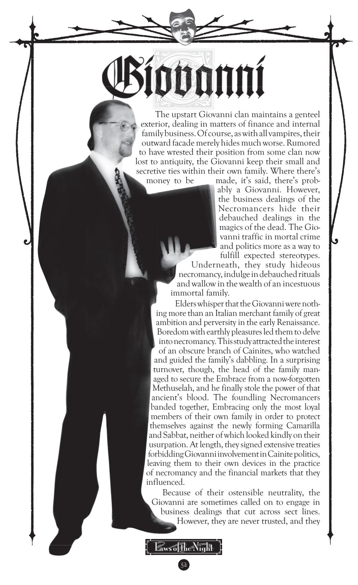

From the frozen northlands, the thick forests and icy mountains, the lands of vicious beasts and monsters come the Gangrel. By turns animalistic and insightful, they embody the most fearsome predators among vampires. From their kind come the tales of such horrors as Grendel and the Norse berserkers. The undisputed masters of the wild ways, the Gangrel are feared and respected for their unmatched prowess in survival. Some, it is whispered, even hunt or deal with the dread Lupines; certainly, their clan's shape-shifting powers and animal features bring to mind legends of dire wolves.

The history of the Gangrel is disputed. Some claim that they are descended from the same line as the Ravnos, while others insist that they are a separate clan (and, indeed, animosity between Gangrel and Ravnos is often quite fierce). For their part, the Gangrel put little stock in rumors. They trade stories when they meet, test their strength in combat and evade the machinations of politics. To the Gangrel, simple survival is more than enough.

> ceded abruptly. Theories as to the reasons behind this departure abound; in their usual detachment, the Gangrel do not discuss the matter, however. This is not to say that all Gangrel are without affiliations — some remained in the Camarilla out of loyalty or friendship, while *antitribu* still claim allegiance in the Sabbat — it's simply that the clan as a whole no longer bothers with politics, after several centuries of Camarilla support. Naturally, this withdrawal makes Gangrel suspect in Camarilla courts, and without the support of a justicar or Inner

Once a part of the Camarilla, the Gangrel se-

Circle member, they can be subjected to political persecution — but few Gangrel really care.

Survivors, woodsmen and animal-lovers make up the ranks of the Gangrel clan, so it's no wonder that they have little use for political infighting or social maneuvering. Typically, a Gangrel watches

a potential

recruit for some time, judging the individual's ruggedness, determination and wanderlust. Those who fail the selection process are either ignored, or they become an evening meal. Those few who are chosen are Embraced and then left to fend for themselves. The Gangrel sire typically watches from afar, only intervening in dire situations and waiting until the new childe has proven her merit before introducing himself and undertaking the process of instruction.

**Roleplaying Hints:** You come from a long line of hardy explorers, both living and undead. In the Dark Ages, the Gangrel were Norsemen and warriors; in the modern age, you are still explorers, and you maintain the warrior spirit. You don't care about politics, or the Jyhad or sects, because they just don't matter to you. With all of eternity, who wants to waste immortality on foolish social maneuvering? There are new horizons to see and realms to conquer. The animals are your kind and your kingdom, and you give fealty only to those worthy of the warrior's heart.

**Disciplines:** *Animalism, Fortitude, Protean*

**Advantage:** While most vampires are uncomfortable outside of the cities, the Gangrel are hardy nomads, capable of survival in any territory. Although Lupines make travel dangerous for any Kindred, the Gangrel are better equipped than most to take to the open road or hide in the wilds outside of humanity's civilization. This wandering nature means that Gangrel hold to the requirements of any societies to which they may claim allegiance only rarely. Camarilla and Sabbat alike tend to give free rein to Gangrel wanderlust, and the sects rarely demand any sort of presentation or recognition. Few princes or bishops could really enforce a ban on the movements of the Gangrel in any case, so they rarely try.

The Gangrel are known to deal with the Lupines from time to time. Though any individual Gangrel probably risks much in confronting Lupines, most Gangrel at least know how to stay out of Lupine territory and what to do to avoid antagonizing the shapechanging killing machines. Gangrel who spend time in the wilds can learn *Lupine Lore* by observing (and hopefully evading) the Lupines. This fact doesn't grant that Lupines are any more favorably disposed toward Gangrel, but a Gangrel is more likely to know how to encounter a werewolf and survive.

All Gangrel gain a free level of Ability in each of *Animal Ken* and *Survival*. **Disadvantage:** The marks of the Beast make themselves known on a Gangrel's visage. Whenever a Gangrel frenzies, she gains an animalistic feature. Further frenzies cause such features to become more pronounced, or introduce new features. Elder Gangrel often barely resemble humans, with cat- or doglike ears, sharp nails, tufts of fur, slitted eyes or stranger features. Each time the Gangrel frenzies, the character gains a new Negative Social Trait of *Bestial*, *Feral*  or *Repugnant*. These Traits can never be bought off or removed without some sort of magical assistance (such as *Vicissitude* or *Obfuscate*). No more than five Negative Traits can be gained with this Disadvantage.

**Bloodlines:** Within the Sabbat exists a small urban group of predators known as the City Gangrel. These Gangrel trace their heritage to one of the two original Gangrel to join the sect, and they Embrace from among those who survive in the cities — criminals, street people, lower-class laborers and the like. The City Gangrel possess the Disciplines of *Celerity*, *Obfuscate* and *Protean*. Although they manifest the same weakness as the rest of the clan, they tend to feature animalistic traits from urban beasts, such as rats' whiskers, cat tails and the like.

are always watched carefully. After all, they have had centuries to perfect the art of the deal, and their ghostly spies are said to be everywhere. The Necromancers' patricidal origins hardly endear them to the other clans, so for the most part, they are left alone, treated as one might treat a dangerous and unpredictable beast. This wariness on the part of the other clans suits them just fine — the Giovanni have great plans, and the involvement of the other clans isn't among them. Like the brokers that they are, the Giovanni are willing to play either side, but ultimately their loyalty always lies within the family. Who'd betray a family that has as much use for you dead as undead?

Since their inception as a clan, the Giovanni have always been particular to Embrace from within their own family. Most commonly, this nepotism involves the Giovanni of Italian descent, but intermarriages over the years have brought different families into the fold. Only very rarely is someone of a minor family or side marriage ever inducted into the undead ranks. Undeath is a reward; the best businessmen and most studious scholars are granted eternity to work their skills on behalf of the family. Others may remain ghouls for eternity, or they may even stay mortals. The Giovanni are no strangers to power-brokering, infighting and influence-mongering — but, ultimately, it's one's value to the family and clan as a whole that determines suitability for eternity.

**Roleplaying Hints:** You're twice-related to a family of murderous, incestuous, nihilistic undead. What more could anyone want? You have the opportunity to earn massive wealth, exercise your will over the very souls of the dead and to exivvvvst forever. All you have to do is follow instructions when someone older in the family talks and avoid causing a political scene with those dumb-ass "Kindred" of the various sects. You're smooth, you're urbane, you're educated and you're in charge.

**Disciplines:** *Dominate*, *Necromancy*, *Potence*

**Advantage:** The insular Giovanni family lends its experience and financial control to all of its members. Those who manage the family's assets well are rewarded; those who fail serve in a more "spiritual" capacity. Giovanni characters start with an automatic Influence level in *Finance* or *Health*, and they can either take a further additional level in one of those Influences or else gain an automatic one Trait *Retainer* — a wraith. A ghostly *Retainer* cannot help with Influence or perform other functions in the physical world, but it is capable of spying and exerting some ghostly powers on behalf of its master (see **Oblivion**).

**Disadvantage:** The bite of a Giovanni holds no Kiss, only pain and terror. When a Giovanni uses the bite to feed, mortal victims are rendered insensible with pain (instead of ecstasy). Furthermore, blood drained with a bite inflicts an extra level of damage for each Blood Trait stolen. Note that this extra damage applies only to mortal victims, and only if the Giovanni bites to feed — a tearing, mauling attack bite used for battle inflicts no additional damage.

**Bloodlines:** Several prominent financial and occult families have found their way into the Giovanni fold. The sorcerous Pisanob hold sway over South and Central America, the "respectable" Milliners work in New England, the cannibalistic Dunsirn maintain banks in Scotland and England and the della Passaglia trade in the Far East. These families do not have different powers, but they indicate that the Giovanni family is more widespread than many Cainites believe. All Giovanni are loyal to the family alone — there are no *antitribu*, and those who attempt to rebel or flee are hunted down in short order.

Once a great clan like the other 12, the Ravnos have, in modern nights, been reduced to a shell of their former selves. The treacherous tricksters once walked randomly among the other Cainites, untrusted and beholden to no one. In a recent storm of madness and death, though, they have been slain and lost until they are but a shadow of their former ranks. No more than a few hundred now claim Ravnos lineage and the strange illusions and philosophies that come with it.

The Ravnos came originally from India, predating the exodus of the Gypsy peoples by a few centuries. At first misunderstood, they wandered from place to place, ignoring the strictures of Cainite society and bringing chaos with them. Many vampires wondered if the Ravnos were Cainites at all, due to their strange behavior, foreign beliefs and unusual Disciplines. As the Dark Ages passed and the Camarilla and Sabbat arose, the Ravnos changed little; they cared not for the beliefs of the Westerners. Instead, the Ravnos continued to spread their unique brand of illusions and mind-twisting treachery across Europe. By the modern age, they had become

known well enough that any court would dread the arrival of a Ravnos, but they would never be barred from a city for fear of bringing down a horde of vengeful Deceivers. Obviously, the charlatanry of the Ravnos grates on the other clans, yet none have bothered to move against the Deceivers. Perhaps it's because Ravnos solidarity ensures that any aggressor would suffer an excruciatingly annoying demise, or maybe it's just because the Ravnos aren't worth the time. For their part, the Ravnos seem to espouse a philosophy that places most Cainites somewhere below invertebrates on the karmic scale to the Ravnos, the undead are without purpose in the greater scheme of things, and they must be taught properly (by tearing the veils of illusion from their eyes through lies, subterfuge and thievery) or destroyed. It is for this reason that the Ravnos spread discord in their wake: They hope that an enlightened few will awaken to their true purpose as heralds of change, while others may be slain and reincarnated into new roles.

During their heyday, the Ravnos most often brought in new recruits from the Gypsy families, mostly male. The diluting blood and customs of the modern age brought in a few more worldly recruits, and now that the Ravnos are scattered and few, they take potential childer where they can get them. Just about anyone with a keen wit can qualify for entry into the clan. Once regarded as buffoons, the Ravnos are now deadly serious. It seems that they may be the first casualties of an impending Gehenna.

**Roleplaying Hints:** It's not only the power of the illusions that you craft, but the voices that bubble in your blood. You are one of the few survivors of a world gone mad. *Svadharma* has taken hold of the Ravnos as a whole and spun them about, slaying many and leaving only a few to balance the wheel of karma. The world continues on a terrifying course to destruction, and there is no time left to save it. Perhaps all you can do now is survive, playing off greater forces while you hide and see what madness strikes next.

**Disciplines:** *Animalism*, *Chimerstry*, *Fortitude*

**Advantage:** The Ravnos tricksters, even those not of Romani blood, are expected to be chaotic whirlwinds of deception. Those who fall into their labyrinthine plots often blame themselves for their stupidity, and they would be too embarrassed to admit to their foolishness in any case. Thus, Ravnos can often get away with cons and deceptions that would land other Cainites in a great deal of trouble.

Since they all tend to practice various vices and move from city to city, all Ravnos gain one level of *Streetwise* Ability for free. They also have a level of *Street*  Influence or *Transportation* Influence.

**Disadvantage:** Perhaps trickery runs in the blood, or maybe the Ravnos truly are harbingers of some greater chaos. Whatever the cause, all Ravnos suffer from a particular weakness for their own favored con games, scams and crimes. Each Ravnos has a particular "signature crime"; once each game session, the Ravnos must make an attempt to indulge in the particular vice, unless a test of *Self-Control/ Instinct* (difficulty of three Traits) can be made, with the usual risks for failed Virtue Tests.

**Bloodlines:** The Ravnos hail from several families of Gypsy stock. Different sorts of Ravnos thus have different capabilities. A Phuri Dae Ravnos learns *Auspex*  instead of *Fortitude*; the Urmen learn *Chimerstry* more than any other Discipline, and the Vritra and Kalderash remain in India and the East, where they supposedly deal with the Cathayans. A few younger Ravnos — mostly *gorgio* — are found as *antitribu*  in the Sabbat, but they are functionally similar to their independent cousins.

## death oF an antediluvian

One of the first signs of Gehenna, the Ravnos Antediluvian is rumored to have actually awakened from torpor. Supposedly, so the tale goes, the creature tore itself free from the lands of Pakistan, roaring its hunger as it sought to sate the thirst of ages on the blood of its kin. Ravnos across the world experienced spells of delusion, madness and uncontrollable *Chimerstry* as the terror fought its way through waiting opponents. At last, it was felled by the combined might of many assailants, though no two stories agree on the nature of its slayers.

On the one hand, it would appear that the Sabbat is right — the Antediluvians are indeed awakening, hungry to devour their childer. On the other hand, the Camarilla's Masquerade may be the only way to avoid the notice of forces powerful enough to slay an Antediluvian. A World of Darkness, indeed.…

Outside the strictures of the 13 great clans and the two sects lie a small set of independent bloodlines. A bloodline is a minor lineage, tracing its distinctiveness to a founder of generation weaker than an Antediluvian, or whose birthright has long since been stolen. Found only in tiny numbers, the bloodlines pursue specialized interests that rarely come into confluence with either sect. Some can and do join sects — the Camarilla and Sabbat alike boast some members of the bloodlines — but in general, members of the bloodlines are rare enough to be unknown to most neonates and objects of curiosity to elders.

Without any formal protection of a sect or clan heritage, vampires of bloodlines often find themselves persecuted by the more "established" lines. Still, they rarely come into direct conflict, since their interests are usually esoteric enough to preclude interacting much with other Cainites. Most cities do not even boast a member of a bloodline; these vampires are rare, often reclusive and usually possessed of highly specialized agendas. Furthermore, the full extent of their powers and capabilities is usually unknown to other Cainites, so established Kindred are loath to risk themselves by antagonizing unknown quantities.

Ultimately, with the exceptions of a few individuals, the bloodlines are footnotes in the Jyhad.

daughters oF CaCophony

The Daughters of Cacophony are a distinctly modern phenomenon, with none described in records before 1700. The Cainites of this talented bloodline espouse music and the voice as tools for the soul. Through their enchanting arts, they perform arias of exquisite beauty, sing verses of ethereal consistency and fire emotions in even undead hearts.

None can say where the Daughters of Cacophony began, and no one knows the name of their elusive founder. The Toreador and the Malkavian have been suggested as parent clans from time to time, with little substantive proof. Some scientifically minded Kindred claim that the Daughters diverged from their parent clan in antiquity due to their focused studies into song, while others speak of myths in which the bloodline's progenitor dealt with faeries or mermaids. The latter seems probable occasionally, as there is more than a hint of fey madness in the Daughters.

The Daughters of Cacophony seem to find the events of the Jyhad singularly uninteresting. These vampires spend their nights in practice and performance, trying to reach new pinnacles in their art. A few take the opportunity to perform for other Cainites, and their services are in great demand — though it is whispered that their arts can easily create terror and madness along with their inspiration. Most claim nominal membership in the Camarilla — finding the best patrons among that sect's ranks, and circumstances largely ideal for pursuing unlives in music — but sectarian considerations generally fall by the wayside. The music is all that matters.

Naturally, the Sirens Embrace only those females with musical and oratory talent. Every type of music and musician is represented in the ranks, from rotund opera divas to waiflike guitar-players to piano ingenues and even frontwomen of punk or jazz bands. However, they all share an inspired touch, a spark that strives for expression, even before the Embrace, and many are snatched away from the mortal world and turned before they can achieve true mortal fame beyond their little-known careers. It is said that in the past, the Sirens allowed men in their ranks, in an even smaller bloodline called the Sons of Discord,

but a recent vicious purge saw the destruction of all males (including castrati) in their ranks.

**Roleplaying Hints:** At the edge of your consciousness is a haunting song, the very music of the spheres. You can sense a spiritual state, the energy of creativity, that pushes itself through you and pulses in your otherwise still blood. Though your words and songs can strike listeners deaf, mad or dead, you care not — your Muse compels you. In short, you sing because you must. The music is all — blood, life and lover.

**Disciplines:** *Fortitude, Melpominee, Presence*

**Advantage:** At least one level of *Performance: Singing* is a requisite for Daughters, thus they get one for free at character creation. The Sirens often Embrace from talented or up-and-coming performers, so new inductees also have at least one level of *High Society* Influence or an additional level of the *Performance* Ability, as well.

**Disadvantage:** The constant throb of the Sirens' music plays through the minds of all Daughters of Cacophony, and a Siren is often deaf to all but her own music. As a result, in any test of perception, the Daughter suffers a two-Trait penalty on challenge resolution. No Daughter of Cacophony can ever have more than two perception-related Mental Traits.

saluBri

Of all Cainites, the Salubri are perhaps the most misunderstood. Billed as soul-eaters and infernalists, they are hunted wherever they go, cast out from vampiric society and reviled as monsters among monsters. Few Salubri remain in this age, for time and witch-hunts have conspired to destroy their past, their elders and their hopes.

Long ago, it is said, the Salubri were a true clan, led by an enigmatic Antediluvian. Somewhere in the past, their Antediluvian was destroyed and diablerized, his power stolen; with his death came the breaking of the Salubri. Once they were proud warriors and scholars in the Dark Ages, but with their leader's destruction they were forced to go underground, fleeing the persecution of the other clans, who perceived them as dangerous. Even today, those vampires who know of the Salubri consider them threats of the highest order, and only a rare few will knowingly give a Salubri aid or shelter. The Tremere in particular hold a special hatred for the Salubri, and they hunt them down at the merest rumor.

In truth, the Salubri are a line of healers and pacifists. Their founder, before his diablerie, disseminated the knowledge of special studies that he learned in the mystical East. Through these practices, the Salubri discovered ways to mend both flesh and spirit. The development of such insights is believed to lead to the development of a third eye in each Salubri's forehead, which most take pains to hide. Despite their persecution, the Salubri often remain gentle beings, concerned with the search for Golconda and the salvation of Kindred souls. They are still vampires, though, and predators. Woe betide the errant Tremere or unsuspecting mortal who takes a Salubri for a fool or weakling.

Salubri share a peculiar form of Embrace: Once the deed is done, the sire calls on the childe to diablerize her. None are certain where this practice came from; even the few Salubri asked aren't entirely certain, although some believe it may have roots in an earlier time. Whatever the reason, the Tremere have been quick to add it to their arsenal of propaganda against the Salubri as infernalists.

**Roleplaying Hints:** Within your veins is the blood that heals; within your mind is the wisdom of centuries; within your spirit is the door to salvation. Vampires may be damned by their state, but you — and anyone with strength of character — can rise above that curse, learning to moderate man and beast in an understanding of your true nature. Through your arts, you learn to sense the wounds of flesh and spirit, to close the rifts that people set in their hearts and to bring about the end to suffering.

**Disciplines:** *Auspex, Fortitude, Obeah*

**Advantage:** Salubri are almost all of powerful generation; only a few elders survived the purge of their clan from the Dark Ages, and since each childe diablerizes her sire, there has been little thinning of the lineage. A Salubri receives two bonus Traits that she may put toward decreasing her generation. If the Salubri does not wish to decrease her generation, however the bonus Traits may not be used for anything else.

**Disadvantage:** The pacifistic nature of the Salubri precludes feeding on unwilling victims. A Salubri who takes blood from an unwilling or resisting victim automatically loses one temporary Willpower Trait immediately, and he must make a *Conscience/ Conviction* Virtue Test with a difficulty of three Traits. Failing this test results in the usual loss of Humanity/ Path Traits.

The Salubri are also a hunted clan, marked for death. Few neonates have heard of them, but those who hear about or actually meet a Salubri soon hear a litany of infernal crimes and accused misdeeds. The most dedicated enemies of the Salubri are the Tremere, who go out of their way to hunt and slay these vampires and who spread propaganda about the bloodline's supposed misdeeds.

samedi

The Samedi are universally reviled as the most disgusting of Cainites, for all of them share a singular curse: Upon the Embrace, a Samedi becomes immortal like other vampires but he has only an imperfect preservation of the flesh. Some appear leathery and emaciated, like unwrapped mummies, while others look like corpses in various arrested stages of decay with a variety of noisome features — foul fluids oozing from tattered skin, rotted noses, death-rictus grins and sunken eyes.

The Samedi are a recent phenomenon, with none recorded as older than 250 years. The eldest, known only as the Baron, is said to lair in the Caribbean, where the line is said to have first appeared. The Giovanni are most often believed to be the parent clan of the bloodline, and indeed, enmity over some old wrong runs deep between the two groups. Occasionally rumors of Nosferatu involvement circulate, but neither group seems to give it great credence. For the most part, the Stiffs have little interest in sect politics beyond the good pay that princes or bishops fork out for Samedi skills as mercenaries or assassins.

The Stiffs Embrace rarely and then only from a small selection of candidates. Generally, the Samedi include those who find a fascination in the study of death and its physical processes. Morticians, existentialists, *houngans* and death cultists have all been inducted into their ranks. Candidates come from a wide range of races and social groups; the only real requirement seems to be an appreciation for death in all its forms.

**Roleplaying Hints:** Death comes to all things in time; it simply came to you in an unusual way. Life itself is defined by the fact that it ends. Such begin-

nings and endings are your passion: the animating moments of life, the pains that it endures and the moment that it succumbs. This quest is not so much a spiritual one as a drive to know *how* the process of creation and cessation works. By extension, you learn about the vampiric condition, the means by which life is extinguished and true death held at bay. You will see death in many forms, whether you are a simple witness or a delivering demon.

**Disciplines:** *Fortitude, Obfuscate, Thanatosis*

**Advantage:** With their strong connections to the process of death, combined with a tradition of dark spiritualism and insight, the Samedi have a significant knowledge of the shadowy Underworld and its ghostly denizens. Although they must pay the additional Experience Trait costs usual for non-clan Disciplines, Samedi can learn the *Necromancy* Discipline and its paths without need for a Giovanni instructor — a great number of the clan's members are necromancers *par excellence* without any traceable instruction. Samedi necromancers start with the *Sepulchre Path*, as usual, and most extend their insight rapidly to the *Bone Path*.

**Disadvantage:** Like the Nosferatu, the Samedi are physically repulsive in the extreme. When a Samedi's true form is apparent, the creature cannot initiate any Social Challenges except ones involving intimidation. No Samedi can possess the Social Traits of *Alluring*, *Gorgeous* or *Seductive*, and they all have the Negative Social Traits of *Repugnant* x 3 which can never be removed.