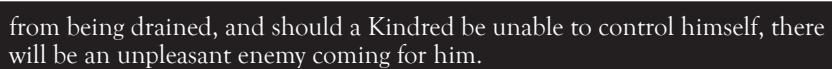
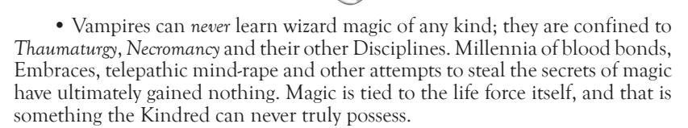

cities have "peace treaties" in place, but such agreements are fragile in any event, and they usually end in rampages of violence that make the preceding tranquillity seem a small gain indeed. The two sides are just too naturally and historically opposed to each other to make lasting peace. While rare (and very, *very* quiet) friendships occasionally develop between species, the price in both societies for dealing with the enemy is high indeed.

Complete, detailed rules about playing Lupines can be found in **Laws of the Wild**, but the following summary is enough to portray the basic aspects of Lupines in a **Laws of the Night** game:

- Many Lupines can detect vampires with low Humanity and Path ratings, whom they claim "stink of the Wyrm," and they will attack such vampires without hesitation. Gangrel are an exception — they do not smell of the Wyrm unless their ratings are quite low indeed.
- Lupines have three basic forms, which they may shift between freely: Homid (human), Crinos (bipedal man-wolf death machine) and Lupus (wolf). Homid is the same as human, and Lupus form is considered to gain the same benefits as the Protean Discipline: *Shadow of the Beast*. The Crinos form is the battle shape of choice for most Lupines, and it is truly Final Death on two large, hairy legs. Crinos Lupines typically stand between eight and 10 feet tall, with huge fangs and claws, a wolf head, and muscles of steel under a thick fur coat. Mortals (not ghouls) who see a werewolf in Crinos form suffer from a madness called the Delirium; treat this effect the same as Rötschreck, with the addition that those who fail to resist it forget ever seeing the Lupine. Crinos-form Lupines double their Physical Traits and effectively gain *Might*, to represent their tremendous physical power in this form.
- Werewolves heal at an amazing rate. They regenerate one non-aggravated wound level every five minutes of game time, and they heal aggravated wounds at the rate of one per day. Only silver, fire and the natural weaponry of other supernatural creatures inflict aggravated damage on Lupines. Furthermore, all Lupines possess a quality called Rage, the primal ferocity that fuels their hunting spirit. Rage Traits may be spent to gain extra actions in a turn, like Celerity, at a cost of one Rage Trait per action; a Rage Trait may also be spent to heal back one health level instantly when a Lupine is Incapacitated, allowing them to fight on through terrible wounds. Each Lupine typically possesses between one and three Rage Traits at a time, and he regains Rage whenever injured, humiliated or otherwise subjected to extreme pain or negative physical or emotional stress.
- In addition to Rage and their regenerative capabilities, Lupines can call on spirits to grant them mystical powers; the Storyteller should feel free allow these effects to mimic vampiric Disciplines (for ease of reference) or generate entirely new results, so long as she keeps in mind the age, role and general affinity of the Lupine in question. For instance, a young city werewolf might be able to call on electricity spirits to short out a building's power, while a rural Lupine could call on wind spirits to summon a cloudburst. Likewise, a werewolf scout would have powers related to stealth and spying, while a warrior would have spirit gifts better suited to battle. Lupines fuel these powers with a spiritual energy called Gnosis, which is regained through bargaining with spirits or long periods of meditation.
- Werewolves are as susceptible to frenzy as Kindred, and they must check for berserk fury (frenzy) and fox frenzy (so called because the Lupine flees her fear; equivalent of Rötschreck) at the same times and difficulties that Kindred do.
- Lupines can apparently travel invisibly through the spirit world, appearing from thin air to attack their enemies and even surprising unwary users of the *Auspex* power of *Psychic Projection* caught wandering lost the spirit plane. (**Note**: In the spirit world Lupines have no silver cords, since they are actually physically "there;" this does not stop them from attacking the silver cord of a Kindred, however. Should a Lupine and a Kindred attack each other in the Umbra, the Kindred bids Mental Traits and the Lupine bids Physical Traits.)

weavers on the loomoF reality

Few things are as frightening as the unknown, which explains why most elders are *terrified* of wizards. Even the Tremere cannot comprehend the ways of the mortal mystics, and Kindred who know of their existence give willworkers a wide berth. No physical match for Kindred or Lupines, most wizards instead hide in plain sight, couching their magic in bizarre coincidences and subtle shifts of fortune. When roused to battle, however, willworkers can call up results that astound the most jaded elders. A powerful mage on the warpath can warp time, alter gravity, shred minds like confetti or burn vampires to a crisp with little more than a disapproving glare. Wizards seem to come in as many stripes as there are views on magic: from faith healers to techno-wizards to Hermetic scholars to demonic priests and native shamans, the actual method a wizard uses to practice magic seems to mean less than his *belief* in that method. Fortunately for the Kindred, many of these diverse factions seem to be locked in a shadow war very similar to the Jyhad, which means most willworkers pay little attention to any vampires that cross their path.

Most Kindred have no dealings with wizards, and they like to keep it that way. However, the Tremere have an uneasy truce with the sect of wizards they used to belong to, the Order of Hermes. While open feuding is a thing of the past, the two sides spy on each other constantly, and subtle traps are not uncommon between the two sides. Demon wizards called the Nephandi sometimes forge dark alliances with Setites or Sabbat on the Path of Evil Revelations, while their opposite number, the Celestial Chorus, has spent centuries battling the Lasombra and others who would pervert the church to their own ends. Shapeshifting witches known as the Verbena have been known to consort to with the Gangrel from time to time, and their form of pagan blood-magic has been whispered in the halls of Elysium for centuries. Finally, some Kindred with influence in cutting-edge technology and at the highest levels of government have long heard rumors about a gigantic wizard "Technocracy" that supposedly has its hooks deep into the world power structure. Naturally, the elders scoff at such rumors, claiming such a takeover would have required hundreds of years of highly secret manipulations that somehow also managed to escape their notice, and surely not even the most powerful wizards could accomplish such a monumental feat of magical treachery... could they?

While vampires are seldom aware of the difference, wizards are actually divided into two types: mages, who know True Magic and thus bend reality at will, and hedge wizards, mortals who are only partially Awakened to the truth of reality and thus can only work magic in static, defined ways. Complete rules for hedge magic and playing hedge wizards can be found in **Laws of the Hunt** and the **Laws of the Hunt Player's Guide**. Hedge wizards are the most commonly encountered type of wizard, and while they can grow to be very powerful indeed, they are small fry next to the freestyle realitywarping talents of their mage brethren. Mages are extremely powerful beings, and they should be used *only* as Narrator characters. However, if used appropriately, mage allies can be excellent sources for mystic artifacts and contacts for arcane lore, as well as the start of any number of interesting story-lines. Mage enemies, on the other hand, are a challenge to even a hardened group of elders, and they can present a refreshing change of antagonists in a long-running game. Storytellers who add mages and hedge wizards to their chronicles should remember the following basic guidelines:

• All wizards have high Willpower Traits; bending reality demands no less. Most mages also have a high number of Mental and Social Traits, as well as many Abilities related to their style of magic (*Computer* and *Science* for a technowizard, *Brawl* and *Meditation* for a wandering yogi). Ultimately wizards *are* mortal, however — they heal as slowly as mortals do unless they employ some form of

#### VITAE FROM SUPERNATURAL SOURCES

Sooner or later, Kindred in contact with other supernatural forces will try drinking their blood, whether due to urgent need, simple curiosity or any number of other reasons. Likewise, sometimes vampires put the bite on what they believe to be a normal mortal, only to discover — too late — that they are supping on something else entirely. Some twisted Kindred may even become addicted to a specific "vintage" of supernatural vitae (e.g., Malkavians to faerie blood, thrill-seeking Licks to Lupine vitae), and he will go to great lengths to get his fix. Most of these Kindred are hunted down by the very prey they enjoy. Whatever the case, Narrators should consult the following guidelines as to what befalls the poor fool who drinks the vitae of a supernatural creature.

**Note:** Unless the Storyteller says otherwise, the rule of vitae usage is "last in, last out;" a Kindred who ingests a Trait of fae blood, for example, must cycle through all the Blood Traits currently in his system before he can spend the fae blood that is plaguing him.

## • Lupine/Other Shapeshifter

Each Blood Trait taken counts double (a Kindred who takes two Blood Traits from a Lupine effectively gains four Blood Traits); however, the vampire must check to resist frenzy immediately. Until the blood is spent, she suffers the Negative Trait: *Impatient*, and is generally full of jittery energy. At the Storyteller's discretion, certain rare or powerful shifters may grant vampires temporary levels of *Potence* or *Celerity* as well.

## • Mage/Hedge Wizard

Storyteller's discretion; the vampire may hallucinate, experience wracking pains, have a sudden flash of insight or find that nothing out of the ordinary occurs. Storytellers are encouraged to base any special results on the power and type of wizard in question.

#### • Wraith/Risen

If the wraith is Embodied, the blood tastes foul and is useless for feeding or fueling Disciplines. Otherwise, the vampire has nothing to bite on. Risen blood has been described as a mix of curdled milk, vinegar and embalming fluid, and may (at Storyteller discretion) cause the Kindred to vomit up twice as many Blood Traits as she drank from the Risen, not to mention angering the Risen who was bitten.

### Changeling

The Kindred immediately gains an active derangement of Storyteller's choice, which lasts until one hour after the last Blood Trait from the changeling has left the vampire's system. Vampires may also perceive the hidden world of changelings during this time, although most vampires will believe such visions to be nothing more than hallucinations. (Note: Drinking faerie blood may be enough to place a vampire under enchantment. See The Shining Host for more on those who fall under faerie enchantment.)

#### The Reborn

Mummy blood is described as tasting stale or like dust, but it will provide nourishment and fuel Disciplines. At Storyteller discretion, the vampire may be be briefly assaulted by a flood of memories, which will continue to hover on the fringes of his consciousness until the blood is gone. Mummies can die

• Numinous Mortal

At the Storyteller's discretion, vampires who drink the blood of those with True Faith may take damage from such sacrilege, if the Faith in question is strong enough. Vampires who ingest the blood of mortals with Psychic Phenomena may experience uncontrollable bursts of the mortal's talent until a night after the last of the psychic's blood is spent; these flashes grow worse the more agitated the vampire becomes. Thus, a vampire who drinks from a telekinetic may suddenly find windows shattering or objects flying about if she becomes upset, while one who ingests vitae from a telepath may find the meaningless surface thoughts of others constantly distracting him. Narrators have final say on the times and game effects of such psychic outbursts, but they should always be far more disruptive than useful, and vampires who drink from psychics too often risk gaining permanent derangements.

healing magic, and they die if they are injured past Incapacitated by lethal or by aggravated damage. Wizards may also be blood bound normally.

- Narrators playing the role of a mage should work with the Storyteller to determine a certain number of prepared effects they are capable of, as well as how these effects can be adjudicated during the game if conflicts arise: Mental Challenges for telepathic spells, Static Physical Challenges for shapeshifting, a Fair Escape for teleportation, etc. Try to use common sense for all effects and (most of all) keep them fair for everyone involved — even an archmage doesn't have an absolute stranglehold on reality, and players will become unhappy quickly if the Narrator's mage seems to be an invincible, omniscient foe. Remember also that a mage's style of magic dictates the general type rituals and effects he uses: a pagan witch may cast runes or dance widdershins in a circle, while a technology wizard might write special software on his computer or design a prototype laser cannon.
- Mages are limited in the scope of their magics by a mysterious factor known as Paradox — when a mage performs obvious reality-altering acts in front of mortal witnesses (ghouls don't count), any number of odd things tend to happen, their severity depending on the grandness of the alteration being attempted. The spell may succeed while the mage suffers some bizarre physical or mental side effect (such as seeing things inside out or suffering intense pain), the spell may simply fail outright, or it may even backfire on the unfortunate mage. This is why mages tend to work their magic subtly, or at least wait until there are only supernatural observers in the area before unleashing raw magical power; better safe than sorry!

Since their static powers have long been recognized by folklore, hedge wizards have a bit more leeway with Paradox, and they do not typically suffer from its harsh side effects. If they attempt dramatic magic in front of mortal witnesses, their spells may fail, but they rarely suffer any worse setback than that. (There are some perks to being lesser wizards at times.)

• At the Narrator's discretion, Kindred with the *Thaumaturgy* Discipline may attempt to counter magic thrown at them, provided they are aware of the incoming spell and they take no other action that turn. This "countermagic" is typically a Mental Challenge, although it may be changed to fit individual circumstances at the Narrator's discretion.

## The Restless Dead

REMINDERS OF SINS FORGOTTEN

Under the grim glow of the Final Nights, many humans die with their dreams unfulfilled, their hearts aching to express their love one last time or to strike down those who wronged them during their lives. Many more, taken abruptly from life by accident or violence, cannot accept the very fact of their death, and they seek to affect the living still, to bring some closure to the life they had just begun to understand. Indeed, by their very existence, all vampires eventually bring about the deaths of dozens if not hundreds of vessels, and the wheels of the Jyhad have often been greased with the blood of countless mortals, making the vampires natural targets for the wrath of those who call themselves wraiths.

Not every mortal lingers on as a wraith, but all those that do are anchored to the world by Passions (emotions driving them beyond death) and Fetters (people, places or things important to them in life), and even an innocent Kindred who somehow interferes with the things that a wraith holds dear can find herself the target of his ghostly powers. Wraiths are capable of all the classic touches of hauntings—telekinetics, possession, tainted dreams, apparitions—and many more tricks as well; a haunted vampire may see ghastly things out of the corner of her eye, find her personal effects in the oddest places or hear her name whispered from a vacant room. However, Kindred on the bad side of a wraith seldom even know the true source of their persecution, often believing they are going mad instead.

Even if they know of their existence, few vampires have much to do with wraiths, supposing — usually rightly — that the affairs of the dead have little place for creatures such as they. Wraiths themselves are barred from manifesting more directly in the Skinlands (the world where people still have skin) by an ancient spiritual barrier called the Shroud. Most of the time, they are confined to a dark, decaying reflection of the living world known as the Shadowlands. Only the perverse Giovanni clan appears to have much interest in wraiths, and what little the other clans have found out about the Restless seems to indicate that all ghosts fear and loathe the Necromancers, avoiding them whenever possible.

Complete rules for wraiths in live-action can be found in **Oblivion**; what follows is a basic overview of wraithly capabilities.

- Wraiths "feed" on emotion like vampires subsist on blood, and they use this energy to power their supernatural abilities. Characters in great passion frenzy included may actually strengthen a wraithly foe. It takes a great effort for wraiths to affect the living lands, but harming those who dare to travel to the Shadowlands (such as those lost while using *Psychic Projection* or certain powers of *Necromancy*) is frightfully easy for them.
- Wraiths are invisible to vampires typically, although Auspex may detect them. Given their incorporeality, wraiths cannot be attacked by vampires through conventional means; Kindred have a better chance by attacking a wraith's Fetters or using some of the powers of the Thaumaturgy or Necromancy Disciplines. For their part, wraiths may possess mortals or attack Kindred telekinetically if they wish to damage them directly, although such efforts are extremely draining.
- The Restless can usually be found around any area which was the site of a great deal
  of emotional trauma (battlefields, murder scenes), although areas of light emotion sometimes
  attract them as well. In such places, the Shroud is weaker than normal, making it easier

for wraiths to affect the Skinlands. **Note:** Mortals (excluding ghouls) who see a wraith or witness obvious wraithly powers in action suffer from fright attacks similar to the Delirium (see above), eventually denying the incident or rationalizing it away. Such is the power — the need — of the living to deny the dead, and thus deny their own mortality as well.

• Giovanni scholars have encountered two rare types of wraiths in their studies. The first are dark spirits who seem bent on inflicting misery to anyone they contact; other ghosts seem to fear these phantoms and refer to them as Spectres. The second is *extremely* rare, consisting of wraiths who manage to re-inhabit their bodies and walk the Skinlands again. Dead as they are, these wraiths—called Risen—are often mistaken for vampires by less learned observers, and they have been known to display unique powers and amazing devotion to their wraithly Passions; indeed, some misguided hunters have realized their mistake only after an irritated Risen plucked the stake from its heart and continued on its way...

#### FAERIES

#### IMMORTAL DREAMS IN MORTAL FLESH

Long ago, the world was a different place, filled with legendary heroes and mythical beasts. That time has since faded into antiquity, but not everyone has forgotten it. Certain Kindred whisper of faeries, mystical creatures of dream who seek to uphold the ancient ways of magic and chivalry, and who live secret lives hidden from the sight of mortal and Kindred alike. Though few vampires these days have much truck with the wild ones, those that do tend to come back *changed* for the experience. Those individuals report that faeries have changed little over the centuries, save for the fact that they now adopt human disguises to protect themselves from the prying eyes of the mortal world. Indeed, most Kindred walk by faeries without ever realizing their true nature, and only those knowledgeable in the unique glamours of the fae have any chance of piercing their masks against their will. However, when a faerie does choose to reveal her true form, her beauty is second only to the tremendous power she wields. Many vampires are left weeping blood tears at a faerie's presence, the presence of such magic and innocence filling them with such poignant longing for their mortal days that even the most jaded elder cannot deny. Some Kindred even succumb to madness in the wake of a faerie's visit, unable to stand their unlives any longer.

Kindred scholars have noticed that faeries are typically most active around the times of major festivals and holidays, such as Halloween or Mardi Gras, and some To read or claim they tend to congregate around centers of great creative talent regardless of the season; some theorists even speculate that faeries somehow draw power from this creativity. However, as with anything concerning these wild children of fantasy, nothing is ever certain. For their part, faeries in general tend to find the deathly aura of vampires uncomfortable, although some notable connections between the two cultures do exist. More urbane Nosferatu occasionally take tea and trade gossip with quiet, observant fae known as sluagh, and the Malkavian clan in general seems to have a special bond with the wild ones, and both sides are forever trading pranks and tall tales. To reador vampires sometimes fall under the spell of a particular faerie's unearthly beauty, or find themselves competing for the attention of a talented mortal who happens to have a faerie patron. Ravnos and Malkavians also sometimes go in search of fae blood, though the former is typically far more savage about it than the latter. Faeries come in as many different varieties as there are legends of the world, from noble lords to savage warriors to charming vagabonds to cunning tricksters, and a vampire who encounters faeries is encouraged to remember that they are as wild and capricious as the primal dreams they originated from.

More on faeries can be found in **The Shining Host**; a brief summary of pertinent faerie traits follows:

- Faeries are mortal, like wizards, and they take accordingly long amounts of time to heal unless they use special healing magics. They are also mortally vulnerable to any lethal or aggravated damage that reduces them below the Incapacitated health level. Faeries may be blood bound normally, although it tends to weaken their faerie spirits dangerously. They seem to have an allergy to cold iron (not steel or other alloys), and they take aggravated damage from that substance; very, *very* few vampires know of this last weakness, however.
- Faeries thrive on creative energy, which they call Glamour, and they use it to power their various magical talents. Inspired artwork or dedicated artists might be worth much Glamour, while pop material would have very little. Faeries are capable of a very broad range of magical effects, but they tend to focus on illusions, shapeshifting, emotion control and making a quick escape. Faeries may even draw others into their secret world by infusing another being with Glamour, but the complexities of their chimerical world require **The Shining Host** to adjudicate properly. (Suffice it to say such enchantments are the basis for Rip Van Winkle legends and the like, and that some Kindred who are "stolen away" never return...)
- Faeries fight boredom and anti-creativity (which they call Banality) actively, and they avoid people and places that tend to attract such negative forces — like IRS inspectors, office cubicles, overbearing teachers or prisons. Fear of Banality is also the reason most fae avoid vampires, whose deathly existences tend to attract much suffering and negative emotion over time. Only Malkavians, Ravnos on the Path of Paradox and Toreador with real artistic talent tend to have low enough Banality to offset this natural disadvantage, and even then, most fae are extremely cautious about dealing with the notoriously predatory Kindred.
- Illusions created by the *Chimerstry* Discipline are actually dangerous to faeries; an illusory wall presents special difficulty to them, and an illusory gun actually harms them. In their terms, *Chimerstry* creations are chimerically real to changelings, and they can even inflict chimerical damage on a changeling's faerie form. The same holds true even if the changeling knows she is looking at an illusion — another reason faeries avoid the Ravnos clan if at all possible. For their part, the Ravnos are completely unaware of this side effect, and the faeries intend to keep it that way.

# united under the Final nights: Crossover powers

In many games, Kindred will encounter at least a few of the different supernatural creatures described previously, and in some games, players may even be allowed to play characters from these other denizens of the shadows. While such games can be a wonderful chance to roleplay the interaction between the different hidden cultures in the Gothic-Punk world, it is likewise inevitable that clashes will occur between character types as players use different supernatural powers against each other. Therefore, Storytellers and Narrators alike should be prepared to adjudicate what happens when the Gifts/ Spheres/ Arcanoi/ Arts/ Numina/ etc. of other supernaturals come in conflict with vampiric Disciplines. Before the nitty-gritty rules of such adjudication are put forth, however, there are a few basic points to remember:

**Check the FAQs — Mind's Eye Theatre** has evolved considerably since its creation, and many common crossover questions are answered in various FAQ sections of the main rulebooks. Furthermore, the **Mind's Eye Theatre Journal**

is updating and expanding material for the various games of **Mind's Eye Theatre** constantly, providing another source for rules clarification.

**Be Fair —** Players work hard to improve their characters, and it's only fair to allow players to try out new uses of their abilities if they can provide a good explanation. However, if one player's application of a supernatural power would give them an unbeatable lock over another type of character, don't be afraid to change that power or even disallow its use entirely. It is rarely a good idea to let a player purchase an Advanced power if allowing alienates half the players.

**Be Consistent —** This guideline goes hand in hand with fairness. If you allow *Heightened Senses* to detect Lupine invisibility one week, don't reverse that ruling the next week, at least not without first explaining to the players why you did so. "House rules" are part of many games, but weekly changes will make players believe you're simply being arbitrary about their application. Making sure you keep Narrators and players alike updated on any new rules changes or additions will go a long way toward preventing player arguments during game time.

**Don't Fix What Ain't Broke —** Remember when power comparisons are necessary and when they aren't — crossover rules should not apply unless the two powers conflict *directly*. A Tremere casting a spell on a changeling who's trying to magically alter the color of the vampire's jacket do not need power comparison rules, nor do a mage and a werewolf hurling fire at each other — the latter instance might result in two injuries, but one ball of flame would not "cancel out" the other. However, if the Tremere and the faerie are both trying to control a target's mind, or the werewolf is conjuring water to douse the mage's fireball, then it's time to use some method of power comparison. Of course, if one character's power *specifically* states that it cancels/ counters another supernatural ability (it happens), don't let other crossover rules interfere. Kindred and Garou in particular have battled each other long enough to have some powers built this way.

**Relax! —** Cooperation is the most valuable key to working out the details in a crossover chronicle. If your players understand that no one type of character is automatically stronger than another, and that you are doing your best to keep things playable for everyone, then there's no problem you won't be able to tackle. If your players keep shouting out their differences or feel one group has an unstoppable edge, however, even tiny situations can become agonizing to resolve. When stepping in to mediate crossover situations, keep tempers cool (with time-outs if necessary) and make sure that everyone remembers the point of the game is to have fun, *not* to see if Bozon the vampire can counter Bezel the werewolf's latest Gift.

That said, there are no actual lists of power comparisons in this chapter; such lists would require an exhaustive amount of space and likely become inaccurate with future rules updates anyway. Rather, what follows are two ways of looking at how supernatural powers can be compared across game lines; both methods are strictly optional, although most groups will tend to choose one or the other. Of course, if you decide to use one of these methods, make sure your players know which you have chosen so they know where you're coming from when handing down rules adjudications.

## **Method #1 — "Case Law" Comparisons**

This method consists of considering supernatural clashes on a case-by-case basis as they occur in the game and deciding what ruling makes the most sense based on those instances. This is not to say that you the Storyteller change your ruling in every instance (remember the consistency guideline), but rather that once an agreement has been reached regarding how given powers interact, that ruling becomes the standard for the game. Doing so does not bar you from making rulings on your own — if you foresee a problem, by all means settle it before the game if you can — but by saving most of the decisions until play begins, you allow

the players a chance to use their creativity in matching powers with each other, instead of making judgments based on raw power alone. Using this method lets the players feel they have a real say in how their powers work in the game, which in turn boosts morale and encourages them to experiment with new things. Likewise, if they disagree with a ruling, players know they have room to discuss it with their Storyteller. Of course, once a ruling has been made, it's your duty to make sure the players and Narrators know what their new standard is, otherwise you'll wind up working out the same problems over and over again.

On the down side, the "case law" method can be very demanding at first, since it requires a good deal of player understanding, and for Storytellers and Narrators to work out disputes as they come along. However, the ultimate result — a game customized to the players and characters involved — makes it time well spent. For their part, players should understand the demands placed on Narrators by this method, as well as the value of compromise required case-by-case. Method #1 generally tends to work better with smaller troupes, where more individual attention can be paid to the players, but with sufficient support from the players (especially the Narrators) it can work with troupes of any size.

## **Method #2 – Relative Power Levels**

Using this method, supernatural abilities are judged by power level alone; if two characters clash supernaturally, both players declare the power level they're using (out of character, of course), with the character who possesses the greater overall power level taking precedence in a given situation. If two characters are evenly matched, the result is a test using whatever Traits are appropriate to the powers at work. The chart lists the basis for power level comparison for each type of supernatural creature. Note that the *overall* power level of a character is used for comparison with this method — a character who has earned the Advanced levels of a Discipline is considered to use the Basic powers of that Discipline better than another vampire who only has the Basic levels of that Discipline.

This method is a very clear and efficient way of settling most supernatural disputes, and it can save Narrators a lot of time in larger games especially. However, it can also make some players feel helpless to battle characters who possess superior powers, and it tends to limit player creativity a bit when it comes to the application of their supernatural abilities. Based as it is strictly on powers earned, it can also invite abuse from unscrupulous players seeking to min-max their characters into war machines or unstoppable manipulators, so Narrators need to keep an ear to the ground and step in if players are taking advantage of this system's elegant simplicity. Players who take advantage of their out-of-character knowledge of another character's overall power level are cheating, plain and simple.

Remember, don't use this for clashes within the same character type! The Disciplines of the Kindred are written to be balanced in respect to each other, as are the powers of the other supernatural groups; *only* when a Kindred fights a Garou, a faerie battles a wraith, etc. should you implement the relative power levels method of comparison. Such are the perils of battling the unknown….

**Example of Play:** *Dice, pooka trickster, is using the Basic* Chicanery *Art of* Veiled Eyes *(invisibility) to escape an unruly crowd, while Amber the Toreador is using Basic* Auspex, Heightened Senses*, to catch him. Overall, Dice has Advanced* Chicanery*, while Amber has only Basic* Auspex*. Using this method, Dice cannot be detected at all by Amber (no test is involved), since his overall* Chicanery *rating is higher than her overall* Auspex *score. However, if they were reversed and Dice had only Basic* Chicanery *and Amber had Advanced* Auspex*, then she would automatically detect him (again, no test involved). If both of them had the same overall power level (both had Intermediate levels overall in their respective powers, for example), a test of some kind would determine which power wins — in this case a Mental Challenge.*

i Just put the Bite on [insert Critter here]. what happens?

The Embrace was designed for mortals and mortals alone; after all, if it was possible to combine supernatural elements with a quick slip of the fangs, regular Kindred would have been replaced by undead super-hybrids long ago. However, for the sake of general clarity and the few rare exceptions, the following chart gives the result of a Kindred attempting to Embrace a given class of prey.

**Note:** Storytellers who intend to change any of these guidelines should first consider the impact creating such a character would have on the chronicle as a whole: no matter how good a reason there might be for the existence of such characters, they are universally outcasts who are almost inevitably destined to bring ruin on themselves and anyone close to them. No matter who they used to be, such pathetic creatures are invariably ostracized or put out of their misery — or even sought after for vivisection! — in short order. Finally, other players may feel resentful of a character who is able to use powers of more than one supernatural group, no matter how wretched a social life such a character may have, and players who feel unfairly outclassed or that the Storyteller is favoring a particular character seldom remain players for long.

| Type of Being Garou         | Result of Embrace Static Gnosis Challenge: on a win, the Garou dies quickly and painlessly; on a tie, death comes slowly and painfully; on a loss and with Storyteller permission, a vampire/Garou Abomination is created. (Willpower may be spent to retest this challenge.) Such creatures lose their natural regeneration and all werewolf societal benefits, but they may continue to use any Gifts they possess, as well as learn Disciplines and spend blood like other Kindred. (Note: Kindred and shifters alike hunt such creatures on sight; be prepared for a short, lonely existence.) |
|--------------------------------|----------------------------------------------------------------------------------------------------------------------------------------------------------------------------------------------------------------------------------------------------------------------------------------------------------------------------------------------------------------------------------------------------------------------------------------------------------------------------------------------------------------------------------------------------------------------------------------------------------------------------------|
| Other                          | Dead fuzzy, unless the Storyteller says otherwise; see Garou shapeshifter listing for some possible effects.                                                                                                                                                                                                                                                                                                                                                                                                                                                                                                                  |
| Mage/ Hedge Wizard          | Vampire; Embrace destroys all magical powers forever.                                                                                                                                                                                                                                                                                                                                                                                                                                                                                                                                                                            |
| Wraith                         | Can't; wraiths are incorporeal. (Duh.)                                                                                                                                                                                                                                                                                                                                                                                                                                                                                                                                                                                           |
| Risen                          | Big gulp of embalming fluid and one angry Risen.                                                                                                                                                                                                                                                                                                                                                                                                                                                                                                                                                                                 |
| Changeling                     | Limp faerie corpse.                                                                                                                                                                                                                                                                                                                                                                                                                                                                                                                                                                                                              |
| Mummy                          | No vampire; mummy goes into death cycle instead. (She/ he will be back later to get you for that.)                                                                                                                                                                                                                                                                                                                                                                                                                                                                                                                            |
| Ghoul/ Revenant             | Vampire; all previous Disciplines retained, but such powers also count against the initial three Disciplines granted at character creation.                                                                                                                                                                                                                                                                                                                                                                                                                                                                                |
| Kinfolk/ Kinain/               | Vampire.                                                                                                                                                                                                                                                                                                                                                                                                                                                                                                                                                                                                                         |
| Other supernatural relative |                                                                                                                                                                                                                                                                                                                                                                                                                                                                                                                                                                                                                                  |
| Gypsy                          | Vampire.                                                                                                                                                                                                                                                                                                                                                                                                                                                                                                                                                                                                                         |
| Numinous Mortal                | Vampire; previous Numina are lost.                                                                                                                                                                                                                                                                                                                                                                                                                                                                                                                                                                                               |