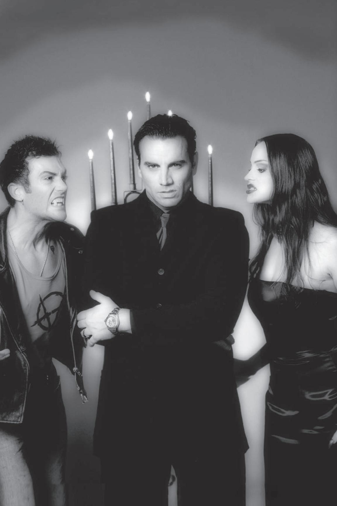

With Donata's influence, it was a simple matter to convince Kevin to return with her and Peter to the old loft where the next part of the plan could proceed. The uncom- fortable union made its way out of the projects and closer to the uptown areas, near art galleries and museums. Peter finally parked in a nearby structure. Donata guided Peter and Kevin across the street and up a flight of stairs to studios in a historical building, above a busy restaurant.

Once in the studio, Donata shut and locked the door. Peter noted that most of the artistic furnishings were somewhat substandard. Doubtless, this tiny studio served only as a meeting ground, and not as a true haven. He made a mental note to check up on the ownership of the building anyway, while he removed a small vial and a lighter from his pocket.

Kevin turned to regard Peter as the lighter was flicked into operation. Donata remained an impassive mask, but Kevin flinched at the sudden glow of flame. With a tiny smirk, Peter applied the fire to the tips of candles on a large candelabrum. Donata waited, impatient, as Peter unscrewed the lid of the vial, daubing tiny amounts of the bloody contents on his fingers.

"This will settle matters. Nobody will be able to confirm anything out of Kristof, and that simply leaves Warburton to take all of the blame," Peter said in a reverential whisper. And, he thought to himself, when the sheriff finds the paraphernalia in Donata's property, she'll take the fall for Kristof's death.

Now simultaneously entranced and repulsed by the flame, Kevin watched the unfa- miliar proceedings, eyes flicking occasionally to regard the impassive Donata.

Peter closed his eyes and traced a slow circle in the air, then steeled himself as he passed his fingers through the flame. Tiny wisps of smoke rose from the fire, and the blood on his fingers vaporized, but he held his hand steady, his dry, dead flesh resisting the hungry heat. Peter knew better than to push his luck, though, and withdrew his hand as quickly as possible, opening his eyes.

The flame danced a merry yellow on the candles.

Donata snarled with disgust. "You idiot! You fouled it up!" she spat at Peter, who tried to puzzle out his failure.

"I did it just as the Warlock instructed. He said to make that symbol, to burn the blood, and that all of the enchantments he'd placed on it would be released, that it would consume Kristof!" Peter shouted in retort.

Kevin bared his fangs, hissing angrily at Peter. "That was your plan? Leave the damn spells to the Warlocks!"

Peter shook his head slowly. "No, I studied this… it should have worked."

"Unless that Tremere double-crossed us!" growled Donata.

"Or unless he were killed before his magic were released," Peter mused. "I'd better check on him. If he betrayed us, I'll take care of him myself. If he's dead, then someone's ahead of us. Either way, this business is now personal."

Donata and Kevin watched Peter, frowning, as he left in a hurry.

# CHAPTER THREE: CHARACTER CREATION AND TRAITS

Without characters, there can be no game. Each player takes on the role of a character, a persona within the context of the game. To guarantee that all players use the same potentials and capabilities for their characters, the rules of **Mind's Eye Theatre** provide a single simple set of guidelines for character creation.

## QuiCk CharaCter Creation proCess

- Step One: Inspiration Who are you?
- Choose a concept
- Choose a clan
- Choose a Nature and a Demeanor
- Choose a Morality Path
- Step Two: Attributes What are your basic capabilities?
- Prioritize Attributes (seven primary, five secondary and three tertiary)
- Choose Traits
- Step Three: Advantages What do you know?
- Choose five Abilities
- Choose three Basic Disciplines (four for Sabbat)
- Choose five Backgrounds (none for Sabbat)
- Step Four: Last Touches Fill in the details.
- Assign Blood Traits
- Assign Willpower Traits
- Assign Virtue Traits
- Choose Negative Traits and Flaws (if any)
- Choose a Derangement (if desired)
- Spend five (or more) Free Traits and choose Merits (if any)
- Step Five: Spark of Life Narrative descriptions

Many Storytellers and Narrators think that when creating characters, the player must begin with the end result — what sort of vampire is the person creating? For those new to roleplaying or **Vampire**, trying to envision one's character that way is a little out of reach; after all, if they're not familiar with the vampire clans, how can they guess what they want to play? In such situations, another tack to take is to guide the new player through the creation of a *person*. In the end, no matter how much folks may want to deny it, every vampire started off as a mortal. Creating the mortal can sometimes give the player an idea about what clan might have claimed him and why.

A concept shouldn't be an exercise in pulling teeth, or another frustrating blank space to fill — it's meant to be helpful. If the way it's presented here doesn't help, ignore it or change it. Likewise, concepts do not always fit neatly into one-word definitions. Titling the character like a book or tagging her with a phrase that sounds right can be just as helpful — consider phrases like "Man In Black," "Bad Moon Rising" or "The Truth is Out There."

# step one: inspiration

Arguably the most important step in character creation is the formation of the basic concept. Every vampire was once a normal human, after all, with hopes, fears, dreams and ambitions. Once Embraced, the character brings her particular views to her new unlife. These strengths and weaknesses shape the character's Traits, capabilities and limitations.

The first step in creating a character is to come up with a basic idea of the person. This initial concept can usually be summed up in a single word — scholar, drifter, dilettante, laborer, whatever. Don't worry about details now; think more in terms of broad brushstrokes. Create the *person*, before you create the vampire.

## Clan

With a base concept in mind, determine your character's clan. An artistically inclined mortal, for instance, is likely to be Embraced as a Toreador; a businessman from European stock could be a Ventrue. It's fine to break stereotypes, of course, but the initial concept, even if it does not determine clan, will shape a character's outlook to her own clan (and others).

The choice of clan influences a character's development heavily. The clan determines the sorts of goals and accomplishments for which the character will be lauded in Cainite society, and the expectations to which she will be held. The clan also determines the sorts of Disciplines, strengths and weaknesses innate to the character. Note that some clans or bloodlines are more rare than others, and the Storyteller may very well restrict access to some — not every city will have a population of Lasombra *antitribu* or Daughters of Cacophony, after all.

If no clan strikes a particular chord, a character can always be Caitiff — bereft of any known clan and possessed of an eclectic assortment of Disciplines — but these vampires are almost uniformly weak of blood, higher in generation and limited in Cainite standing.

## nature and demeanor

To define a character's personality, choose a particular Archetype. Each Archetype lists an underlying motivation, a reason for a character to behave in specific ways. The Archetypes described here are, by no means, the final list of personalities; Storytellers can suggest and approve any further numbers of Archetypes.

A character's Nature is her inner-most persona, the true basis of her motives. Though many people bury their desires behind facades, the drives of the Nature

• Assamites — (Independent) Dreaded Assassins from the Middle East, the Assamites hunt other Cainites for vitae and study powers of silent death.

Disciplines: *Celerity*, *Obfuscate*, *Quietus*

• Brujah — (Camarilla) Ideological revolutionaries and rebels, the Rabble serve their causes with passion.

Disciplines: *Celerity*, *Potence*, *Presence*

• Followers of Set — (Independent) Distrust and suspicion follow the Serpents in their quest for forbidden knowledge and service to a sleeping god.

Disciplines: *Obfuscate*, *Presence*, *Serpentis*

• Gangrel — (Independent) No city holds sway over the Outlanders, who wander the wilderness and survive as vampiric predators among animals.

Disciplines: *Animalism*, *Fortitude*, *Protean*

• Giovanni — (Independent) The Necromancers keep a veneer of businesslike respectability over their family's dark practices.

Disciplines: *Dominate*, *Necromancy*, *Potence*

• Lasombra — (Sabbat) The majestic and terrible Keepers control spiritual darkness itself in seeking to manipulate mortal and undead societies.

Disciplines: *Dominate*, *Obtenebration*, *Potence*

• Malkavians — (Camarilla) The deranged Lunaticsclaim a fractured insight into the workings of reality.

Disciplines: *Auspex*, *Dementation*, *Obfuscate*

• Nosferatu — (Camarilla) The hideous curse of blood warps the physical visage of each of the Sewer Rats, but others respect and fear their mastery of hidden byways and secret-gathering.

Disciplines: *Animalism*, *Obfuscate*, *Potence*

• Ravnos — (Independent) Claiming kinship to Gypsies, the wandering Deceivers hail from India with power over illusions.

Disciplines: *Animalism*, *Chimerstry*, *Fortitude*

• Toreador — (Camarilla) Protectors of culture and promoters of art make up the Degenerates, but they also include sycophants and pleasure-seekers in their ranks.

Disciplines: *Auspex*, *Celerity*, *Presence*

• Tremere — (Camarilla) Ruthless and insular, the Warlocks and their potent blood magic are untrusted, but grudgingly respected.

Disciplines: *Auspex*, *Dominate*, *Thaumaturgy*

• Tzimisce — (Sabbat) Hailing from Eastern Europe, the inhuman Fiends study mortal and vampire alike with clinical coldness and utter ruthlessness.

Disciplines: *Animalism*, *Auspex*, *Vicissitude*

• Ventrue — (Camarilla) Rulers of board room and battlefield, the Blue Bloods lead other Kindred as their right and responsibility.

Disciplines: *Dominate*, *Fortitude*, *Presence*

• Daughters of Cacophony — (Independent) Heralds of song and voice, the Sirens' music leads others to enlightenment or madness.

Disciplines: *Fortitude*, *Melpominee*, *Presence*

• Salubri — (Independent) Reviled as soul-stealers and diablerists, the Cyclops flee from persecution while hunting spiritual insight.

Disciplines: *Auspex*, *Fortitude*, *Obeah*

• Samedi — (Independent) Rotting and monstrous, the Stiffsclaim terrifying control over the processes of death and the secrets of immortality.

Disciplines: *Fortitude*, *Obfuscate*, *Thanatosis*

often shine through. Since the character's Nature is a result of her upbringing and life experiences, Nature changes rarely. It takes extraordinary events to cause someone to change Natures.

By contrast, the Demeanor is the public face, the one a character shows to everyone else. Even if radically at odds with the character's Nature, the Demeanor provides a convenient mask against intrusion. Demeanors are subject to change at whim; some characters may change Demeanors like some people change socks, while others may choose a single face to present to the world. On occasion, Nature and Demeanor may be the same, but few individuals are so open, especially in Kindred society.

## arChetypes

Architect, Autocrat, Bon Vivant, Bravo, Caregiver, Celebrant, Child, Competitor, Conformist, Conniver, Curmudgeon, Deviant, Director, Fanatic, Gallant, Judge, Loner, Martyr, Masochist, Monster, Pedagogue, Penitent, Perfectionist, Rebel, Rogue, Survivor, Thrill-Seeker, Traditionalist, Trickster, Visionary

## morality paths

Every vampire struggles with the Beast Within, the predatorial drive of hunger that pushes Cainites to acts of fury, desperation and horror. Only by clinging to a moral compass — a philosophical ground to stand against the ravages of amorality — can a vampire resist the slide into total depravity.

Most vampires cling to a semblance of their human morality, repressing their monstrous urges. The vicious politics of Cainite society take an inevitable toll, though. Similarly, the ravages of uncontrollable frenzy, combined with the vampire's alienation from humanity, push many to terrible deeds. Only through strong will and determined control can a vampire resist losing the last shreds of humanity as centuries of ennui erode the vestiges of mortal feeling. A few even take to inhuman codes, seeking balance through constructed vampire ethics. Regardless, many fail to hold to their ethics *well*, instead sliding into amorality driven by their hungers.

The majority of new vampire characters choose Humanity for their morality. Neonates cling to the memories of their human existences, seeking to reconcile their consciences with their new bloodthirst. Often, many of them are unaware of any other choices. Only a vampire of extreme determination takes to one of the Paths of Enlightenment, a created code of vampire behavior.

At this step in character creation, decide on a form of morality for the character: Humanity or a Path of Enlightenment. Traits will be assigned later. The important step is to determine how the character holds onto sanity against the relentless Beast. Most vampires default to Humanity.

This chart lists the Paths of Enlightenment common to vampires of many sects or independent loyalty, and it also shows the Virtues espoused by each Path.

- Humanity The default morals of mortal life include: Avoid killing, stealing or hurting; try to help others, or at least live without impacting others overmuch. Most vampires follow Humanity, even though many fail to uphold very much Humanity after a few decades or centuries. (*Conscience*, *Self-Control*)
- The Path of Blood (Assamite) A means to redemption through the teachings of Haqim, founder of the Assamites. Vampires on the Path of Blood hunt and kill in the holy quest to ascend to the level of Haqim. (*Conviction*, *Self-Control*)
- The Path of Bones (Giovanni, Samedi) This Path espouses the study of physical death and the transformation of the body from life to death or undeath. A follower of this Path seeks an understanding of death and what lies beyond it, whether Cainite existence or that of a ghost. (*Conviction*, *Self-Control*)
- The Path of Metamorphosis (Tzimisce) The science of the Slavic Fiends in their search for a higher form of existence expresses itself through this Path. As vampires are above mortals, the followers of this Path believe that a higher consciousness awaits beyond vampirism. (*Conviction*, *Instinct*)
- The Path of Night (Lasombra) This hideous Path delves into the vampire's existence as a tool for showcasing evil and serving the needs of the darkness that created him. (*Conviction*, *Instinct*)
- The Path of Paradox (Ravnos) This Path teaches that the material world is illusion, and that each individual must find his own place in the cycle of existence. Followers of this Path delve into riddles and puzzles to seek the underlying fates of all beings. (*Conviction*, *Self-Control*)
- The Path of Typhon (Followers of Set) The Setites hope to raise their dark god, and they use hidden knowledge and forbidden wisdom as their tools in binding others to this end. (*Conviction*, *Self-Control*)

The Sabbat also teaches certain other Paths, but such Paths are reserved for their savage children and not for vampires of the Camarilla or independent clans.

Paths of Enlightenment are advanced moral codes. They espouse an utterly alien viewpoint, with little grounding in anything resembling human morality. These are best played by experienced players. Consult a Storyteller before choosing a Path.

# step two: attriButes

Natural capabilities use Attributes for descriptions. Every character has certain innate qualities. Attributes describe these qualities, marking a character's particular areas of intrinsic talent.

## Choosing attriButes

Each character has areas of modest skill and other areas of excellence. You determine your character's natural talents, selecting whether your character is to be physically adroit, mentally agile or socially adept. The character's concept should guide these choices, so a mountaineer is likely to be physically exceptional while a bookish historian probably has more mental development than social.

• Physical Attributes measure your character's general health, stamina, agility and power. A character with modest Physical Attributes is probably not very athletic, while a character with high Physical Attributes is exceptionally strong, dexterous or tough.

• Mental Attributes help in problem-solving, learning, deduction and general alertness. With limited Mental attributes, a character is not particularly well-educated, quick-thinking or perceptive. A strongly Mental character is conversely attentive, logical or intuitive.

Choose the priority of your character's attributes. Each character is stronger in some areas than in others, at least at first. Obviously, clan and concept shape these attributes to some degree, but only a broad outline is needed in this step.

## Choosing traits

Once you've decided on your character's inherent strengths, you should describe exactly the sorts of exceptional characteristics he possesses. In your primary area of attribute development, choose seven Traits; in your secondary, choose five; in your tertiary area, select three Traits. Traits are adjectives describing the character, just like the descriptions in a novel or play. Thus, a Mentally focused character might be more *Intuitive* than *Rational*, or a strong Physical character could be *Brawny* and *Tough* but not very *Quick* or *Nimble*.

A complete list of Traits starts on p. 80. Pick Traits that describe your character as if you wanted to write down the particular qualities of the individual. You can pick a particular Trait multiple times, if you like, to denote spectacular depth in an area.

# step three: advantages

No character begins play unformed and without education. The skills and training picked up in the course of life, and the friends made among various fields of work, all gift a character with special resources. Furthermore, vampiric powers, called Disciplines, flow from the blood of all Cainites, granting them superhuman capabilities. Collectively, these advantages are learned or developed benefits not inherent to one's raw potential.

Advantages are divided into several categories. Abilities represent skills or training, allowing characters to perform tasks. Backgrounds are connections among the mortal and immortal communities, representing such diverse facets as friends, social standing or Cainite sponsors. Disciplines are the powers of the blood, the finely honed endowments that come with the Curse. Lastly, Virtues represent a character's strength of moral behavior, defining how well a particular vampire comports himself and holds to his ethics in the face of the Beast.

## Choosing aBilities

Select five Abilities that represent your character's education and training. Whether learned in mortal days or honed after death, Abilities set apart your character by letting her attempt tasks that less skilled compatriots cannot

## attriButes

- Physical Traits: *Agile, Brawny, Brutal, Dexterous, Enduring, Energetic, Ferocious, Graceful, Lithe, Nimble, Quick, Resilient, Robust, Rugged, Stalwart, Steady, Tenacious, Tireless, Tough, Vigorous, Wiry*
- Social Traits: *Alluring*, *Beguiling*, *Charismatic*, *Charming*, *Commanding*, *Dignified*, *Diplomatic*, *Elegant*, *Eloquent*, *Empathetic*, *Expressive*, *Friendly*, *Genial*, *Gorgeous*, *Ingratiating, Intimidating*, *Magnetic*, *Persuasive*, *Seductive*, *Witty*
- Mental Traits: *Astute*, *Attentive*, *Clever*, *Creative*, *Cunning*, *Dedicated*, *Determined*, *Discerning*, *Disciplined*, *Insightful*, *Intuitive*, *Knowledgeable*, *Observant*, *Patient*, *Rational*, *Reflective*, *Shrewd*, *Vigilant*, *Wily*, *Wise*

Academics, Alertness, Animal Ken, Athletics, Brawl, Computer, Crafts, Dodge, Drive, Empathy, Etiquette, Expression, Finance, Firearms, Hobby/ Professional/ Expert Ability, Intimidation, Investigation, Law, Leadership, Linguistics, Medicine, Melee, Occult, Performance, Politics, Repair, Science, Security, Stealth, Streetwise, Subterfuge, Survival

understand or complete. You can choose an Ability multiple times, if desired, to show greater expertise. A complete list of Abilities starts on p. 85. Note that some Abilities may be restricted by your Storyteller.

## Choosing disCiplines

Select three Basic Disciplines for your vampire character. You must select them in the order listed (that is, you must take the first Basic level before taking the second Basic level in any given Discipline), and you can only take the Basic levels at this time. These Disciplines must come from your clan's specialty Disciplines. If you are Caitiff, you may simply choose any three Basic Disciplines desired, but your Storyteller may restrict you to the eight most common Disciplines — *Animalism*, *Auspex*, *Celerity*, *Dominate*, *Fortitude*, *Obfuscate*, *Potence* or *Presence* — unless you have an exceptional reason for learning a more specialized power.

A complete list of Disciplines starts on p. 132. See the previous table for a quick list of your clan's specialty Disciplines.

Sabbat characters begin play with four Basic Disciplines.

## Choosing BaCkgrounds

You may take five Background Traits for your vampire. Each Background represents a tie to a particular agency, organization or resource, whether mortal or Cainite. You can have up to five Traits in any Background, though your Storyteller may prohibit certain Backgrounds based on your concept, and most Storytellers will scrutinize any Background above three Traits heavily.

Background descriptions start on p. 93.

Sabbat characters do not begin play with any Backgrounds — they must expend Free Traits to take Backgrounds.

# step Four: last touChes

The final character Traits come together once concept, clan, Attributes and advantages are chosen. Your last touches include Blood Traits, Willpower Traits, Morality Traits and Virtue Traits.

## Blood traits

Each vampire has a certain number of Blood Traits, or vitae. This blood can be used for a variety of different tasks, from temporarily improving one's physical prowess to healing wounds to powering Disciplines. You can hold a number of Blood Traits determined by your generation, as shown on p. 95. This number is modified by any clan disadvantages or Flaws that you may have relating to feeding, and it can be improved by the *Herd* Background (see p. 96).

## willpower traits

When all other avenues are exhausted, your Willpower measures your innate drive for self-preservation, your sense of mental fortitude and your ability to resist temptation and defeat. You can use Willpower Traits for a variety of tasks, like redoubling your efforts in a task or resisting supernatural coercion.

You come into play with a number of Willpower Traits dependent on your generation. The generation table on p. 95 shows your starting permanent Will-

- *Animalism* Communion with and control over natural animals, through the Beast.
  - *Auspex* Incredible sensory acuity, even extending to psychic sensitivity.
  - *Celerity* Superhuman speed granted by the power of blood.
  - *Chimerstry*  The Ravnos gift of crafting illusions and hallucinations.
- *Dementation*  The Malkavian ability to catalyze madness and spread the gift of insanity.
  - *Dominate*  Control of minds through piercing gaze and strong will.
  - *Fortitude*  Resilience against even the forces that normally injure vampires.
- *Melpominee* The Daughters of Cacophony manipulate their voices to madden or inspire their listeners with this power.
- *Necromancy*  Commerce with and power over the spirits of the dead. The *Sepulchre Path* communicates with ghosts; the *Bone Path* deals with corpses; the *Ash Path* sees across the barriers of death and manipulates the lands of the dead.
- *Obeah* This little-understood power of the Salubri allows them to shelter and heal the injured, whether in body or mind.
  - *Obfuscate*  Concealment through tricking the minds of onlookers.
- *Obtenebration*  Manipulation of tangible, soul-smothering darkness is the province of the Lasombra.
  - *Potence*  Incredible strength, beyond even the unfaltering might of dead limbs.
  - *Presence*  Unnatural charisma and ability to sway emotions.
- *Protean*  Shapeshifting and wilderness survival in primal forms, specific to the Gangrel.
- *Quietus*  The Assamites have learned to manipulate blood to bring silent, poisonous death.
- *Serpentis*  The Setites' Discipline of reptilian transformation from Egyptian legend.
  - *Thanatosis* The Samedi's control of the processes of death and decay.
- *Thaumaturgy*  Tremere blood magic exercised through the will over vitae. The *Path of Blood* controls Cainite vitae; *The Lure of Flames* summons unnatural fire; *Movement of the Mind* controls objects telekinetically; the *Path of Conjuring* allows a caster to pull objects from thin air.
- *Vicissitude*  This art and craft of shaping flesh and bone like clay is known to the Tzimisce.

power, indicating how many Willpower Traits you have. The maximum Willpower listing shows the highest rating that your Willpower can reach. You may choose to have a card for each Trait of Willpower you possess, and you must turn the card over to a Narrator or Storyteller when you expend Willpower.

## virtue traits

Every vampire must resist the temptation to "sin" in some fashion. Virtue Traits are the spiritual endurance with which a character fights against the talons of the Beast.

Virtue Traits come in three categories: *Conscience/ Conviction* Traits, *Self-Control/ Instinct* Traits and *Courage* Traits. You get seven Traits to split among these categories. Each category must range from one to five total Traits.

