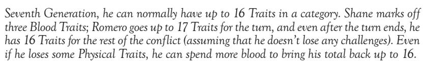

| 2 | Track most celebrities and luminaries                      |
|---|------------------------------------------------------------|
|   | Be a local voice in the entertainment field                |
|   | "Borrow" idle cash from rich friends (\$1,000)             |
| 3 | Crush promising careers                                    |
|   | Hobnob well above your station                             |
| 4 | Minor celebrity status                                     |
| 5 | Get a brief appearance on a talk show that's not           |
|   | about to be canceled                                       |
|   | Ruin a new club, gallery, festival or other posh gathering |
|   |                                                            |

industry

The grinding wheels of labor fuel the economies and markets of the world. Machines, factories and blue-collar workers line up in endless drudgery, churning out the staples of everyday living. Control over *Industry* Influence sways the formation of unions, the movements of work projects, locations for factories and the product of manufacturing concerns. Union workers, foremen, engineers, construction workers, manual laborers and all manner of blue-collar workers exist among these ranks.

| Cost  | Effect                                              |
|-------|-----------------------------------------------------|
| 1     | Learn about industrial projects and movements       |
| 2     | Have minor projects performed                       |
|       | Dip into union funds or embezzle petty cash (\$500) |
|       | Arrange small accidents or sabotage                 |
| 3     | Organize minor strikes                              |
|       | Appropriate machinery for a short time              |
| 4     | Close down a small plant                            |
|       | Revitalize a small plant                            |
| 5     | Manipulate large local industry                     |
| legal |                                                     |
|       |                                                     |

Since many of the operations that Cainites undertake are at least marginally illegal, a good amount of sway over judges and lawyers is indispensable. Those Kindred who dabble in law often pull strings in the courts to make sure that the questionable practices of Cainite society go unnoticed and unpunished. Of course, a little *Legal*  Influence is also excellent for harassing an enemy's assets, too. Such Influence ranges from law schools and firms, to lawyers, judges, DAs, clerks and public defenders.

| Cost | Effect                                             |
|------|----------------------------------------------------|
| 1    | Get free representation for minor cases            |
| 2    | Avoid bail for some charge                         |
|      | Have minor charges dropped                         |
| 3    | Manipulate legal procedures                        |
|      | (minor wills and contracts, court dates)           |
|      | Access public or court funds (\$250)               |
|      | Get representation in most court cases             |
| 4    | Issue subpoenas                                    |
|      | Tie up court cases                                 |
|      | Have most legal charges dropped                    |
|      | Cancel or arrange parole                           |
| 5    | Close down all but the most serious investigations |
|      | Have deportation proceedings held against someone  |
|      |                                                    |

## media

 Directing media attention away from vampire activities is a key component of the Masquerade. Putting specific emphasis on certain events can place an enemy in an uncomfortable spotlight or discredit a rival. With *Media*, you can crush or alter news stories, control the operations of news stations and reporters and sway public

opinion, with DJs, editors of all varieties, reporters, cameramen, photographers and broadcasters at your disposal. At Storyteller discretion, *Media* Influence may also allow access to the more technical areas of television, radio or movies.

| Cost | Effect                                            |
|------|---------------------------------------------------|
| 1    | Learn about breaking stories early                |
|      | Submit small articles (within reason)             |
| 2    | Suppress (but not stop) small articles or reports |
|      | Get hold of investigative reporting information   |
| 3    | Initiate news investigations and reports          |
|      | Get project funding and waste it (\$250)          |
|      | Ground stories and projects                       |
| 5    | Broadcast fake stories (local only)               |
|      | Kill small local articles or reports completely   |

#### OCCULT

The hidden world of the supernatural teems with secrets, conspiracies and unusual factions. Obviously, a vampire is aware that there are strange things out there by dint of his very existence (after all, if vampires exist...), but hard knowledge of such things is a function of Abilities. By using *Occult* Influence, you can dig up information to improve your knowledge, get inside the occult community and find rare components for magical rituals. Even parts of the elusive *Book of Nod* are available to those with the right connections. Cult leaders, alternative religious groups, charlatans, occultists, New Agers and a few more dangerous elements can be found here.

| Cost | Effect                                            |
|------|---------------------------------------------------|
| 1    | Contact and make use of common occult groups      |
|      | and their practices                               |
|      | Know some of the more visible occult figures      |
| 2    | Know and contact some of the more obscure         |
|      | occult figures                                    |
|      | Access resources for most rituals and rites       |
| 3    | Know the general vicinity of certain supernatural |
|      | entities and (possibly) contact them              |
|      | Access vital or rare material components          |
|      | Milk impressionable wannabes for bucks (\$250)    |
|      | Access occult tomes and writings                  |
|      | Research a Basic ritual from your sect            |
| 4    | Research an Intermediate ritual from your sect    |
| 5    | Access minor magic items                          |
|      | Unearth an Advanced ritual from your sect         |

### Dofice

"To protect and serve" is the motto of the police, but these days, Kindred and kine alike may have cause to wonder who is being protected and served. That said, *Police* Influence can be very handy to assist with the Masquerade, to protect one's holdings or to raid the assets of another. After all, attitude won't save the anarchs whose haven is the target of a daylight raid. Police of all ranks, detectives, clerical staff, dispatchers, prison guards, special divisions (such as SWAT or homicide) and local highway patrol make up these ranks.

| Cost | Effect                                    |
|------|-------------------------------------------|
| 1    | Learn police procedures                   |
|      | Hear police information and rumors        |
|      | Avoid traffic tickets                     |
| 2    | Have license plates checked               |
|      | Avoid minor violations (first conviction) |
|      | Get "inside information"                  |
| 3    | Get copies of an investigation report     |
|      |                                           |

|   | Have police hassle, detain or harass someone Find bureau secrets |
|---|---------------------------------------------------------------------|
| 4 | Access confiscated weapons or contraband                            |
|   | Have some serious charges dropped                                   |
|   | Start an investigation                                              |
|   | Get money, either from the evidence room or as                      |
|   | an appropriation (\$1,000)                                          |
| 5 | Institute major investigations                                      |
|   | Arrange setups                                                      |
|   | Instigate bureau investigations                                     |
|   | Have officers fired                                                 |
|   |                                                                     |

## politiCal

Deal-making is second nature to most vampires, so they can get along very well with other bloodsuckers — that is, politicians. Altering party platforms, controlling local elections, changing appointed offices and calling in favors all falls under the purview of *Political* Influence. Well-timed blackmail, bribery, spin doctoring or any sundry tricks are stock in trade on both sides of this fence. Some of the likely contacts and allies include pollsters, lobbyists, activists, party members, spin doctors and politicians from rural zoning committees to the mayors of major cities or Congressional representatives.

| Cost | Effect                                                    |
|------|-----------------------------------------------------------|
| 1    | Minor lobbying                                            |
|      | Identify real platforms of politicians and parties        |
|      | Be in the know                                            |
| 2    | Meet small-time politicians                               |
|      | Garner inside information on processes, laws and the like |
|      | Use a slush fund or fund-raiser (\$1,000)                 |
| 3    | Sway or alter political projects (local parks,            |
|      | renovations, small construction)                          |
| 4    | Enact minor legislation                                   |
|      | Dash careers of minor politicians                         |
| 5    | Get your candidate in a minor office                      |
|      | Enact encompassing legislature                            |
|      |                                                           |

## street

Ignored and often spat on by their "betters," those in the dark alleys and slums have created their own culture to deal with life and any outsiders who might come calling. When calling on *Street* Influence, you use your connections on the underside of the city to find the homeless, gang members of all sorts, street buskers, petty criminals, prostitutes, residents of the slums or barrios, and fringe elements of so-called "deviant" cultures.

| Cost | Effect                                                                                                      |
|------|-------------------------------------------------------------------------------------------------------------|
| 1    | Open an ear for the word on the street                                                                      |
| 2    | Identify most gangs and know their turfs and habits Live mostly without fear on the underside of society |
|      | Keep a contact or two in most aspects of street life                                                        |
|      | Access small-time contraband                                                                                |
| 3    | Get insight into other areas of Influence                                                                   |
|      | Arrange some services from street people or gangs                                                           |
|      | Get pistols or uncommon melee weapons                                                                       |
| 4    | Mobilize groups of homeless                                                                                 |
|      | Panhandle or hold a "collection" (\$250)                                                                    |
|      | Get hold of a shotgun, rifle or SMG                                                                         |
|      | Have a word in almost all aspects of gang operations                                                        |
| 5    | Control a single medium-sized gang                                                                          |
|      | Arrange impressive protests by street people                                                                |
|      |                                                                                                             |

Most Cainites make their havens in defensible parts of cities. Traveling across the wilderness is difficult, with the problems of daylight and marauding Lupines. Without this Influence, the vampiric world shrinks into islands of "civilization" with dangerous wastelands in between. Getting access to special supplies and services can also take a measure of *Transportation*. All these things can be controlled with a bit of sway over truckers, harbors, railroads, airports, taxis, border guards, pilots and untold hundreds, as well as more mundane aspects like shipping and travel arrangements.

| Cost | Effect                                                  |
|------|---------------------------------------------------------|
| 1    | Know what goes where, when and why                      |
|      | Travel locally quickly and freely                       |
| 2    | Track an unwary target if he uses public transportation |
|      | Arrange passage safe (or at least concealed) from       |
|      | mundane threats (robbery, terrorism, sunlight, etc.)    |
| 3    | Seriously hamper an individual's ability to travel      |
|      | Avoid most supernatural dangers when traveling          |
|      | (such as Lupines)                                       |
| 4    | Shut down one form of transportation                    |
|      | (bus lines, ships, planes, trains, etc.) temporarily    |
|      | Route money your way (\$500)                            |
| 5    | Reroute major modes of travel                           |
|      | Smuggle with impunity                                   |
|      |                                                         |

## underworld

The world of crime offers lucrative possibilities to strong-willed or subtle leaders. Guns, money, drugs and vice — such delicious pastimes can be led by anyone talented or simply vicious enough to take them. *Underworld* Influence lets you call on such favors for all manner of illegal dealings, and its ranks are filled by the Mafia, La Cosa Nostra, drug dealers, bookies, Yakuza, tongs, hitmen, fences and criminal gangs.

| Cost | Effect                                             |
|------|----------------------------------------------------|
| 1    | Locate minor contraband (knives, small-time drugs, |
|      | petty gambling, scalped tickets)                   |
| 2    | Obtain pistols, serious drugs, stolen cars         |
|      | Hire muscle to rough someone up                    |
|      | Fence stolen loot                                  |
|      | Prove that crime pays (and score \$1,000)          |
| 3    | Obtain a rifle, shotgun or SMG                     |
|      | Arrange a minor "hit"                              |
|      | Meet someone in "the Family"                       |
| 4    | Make white-collar crime connections                |
| 5    | Arrange gangland assassinations                    |
|      | Hire a demolition man or firebug                   |
|      | Supply local drug needs                            |
|      |                                                    |

## university

Institutions of learning and research are the purview of the *University* Influence. Access to the halls of learning can help you with any number of resources, from ancient languages to research assistance to many impressionable young minds. School boards, students from kindergarten through college, graduate students, professors, teachers, deans, Greek orders and a variety of staff fill the ivy-covered halls.

| Cost | Effect                                        |
|------|-----------------------------------------------|
| 1    | Know layout and policy of local schools       |
|      | Have access to low-level university resources |
|      | Get records up to the high school level       |

| 2 | Know a contact or two with useful knowledge or Abilities |
|---|----------------------------------------------------------|
|   | Have minor access to facilities                          |
|   | Fake high school records                                 |
|   | Obtain college records                                   |
| 3 | Call in faculty favors                                   |
|   | Cancel a class                                           |
|   | Fix grades                                               |
|   | Discredit a student                                      |
| 4 | Organize student protests and rallies                    |
|   | Discredit faculty members                                |
| 5 | Falsify an undergraduate degree                          |
|   |                                                          |

### Mentor

An older or more experienced Cainite looks after you and comes to your aid occasionally. Whatever the case, you can get assistance from your mentor, though his favor may be fickle.

When you call on your mentor, you risk a certain number of Traits to achieve a given effect. A lowly one-Trait mentor probably knows only little more than you, while a five-Trait mentor may well have luminous standing within your sect and a wide range of potent powers. Regardless, taking up your mentor's valuable time is costly. You must engage in a Simple Test when you call on your mentor. If you succeed, your mentor deigns to aid you. If you tie, your mentor grants you assistance, but then requires something in return. If you fail, your mentor demands the favor first before helping. In any case, your mentor can be called on only once in any given game session, and only if you have an appropriate way to contact him or her.

The level of aid that your mentor can give depends on the number of Traits in this Background (and Storyteller approval, of course):

- $\bullet$  For one Trait, your mentor is privy to a single piece of specialized information at a level above your own. If you have *Cainite Lore* x 2, for instance, your mentor can be called on to gift you with one piece of information from *Cainite Lore* x 3.
- For two Traits, you can borrow one level of *Contacts*, Influence, *Resources* or Status from your mentor for the duration of the game. If your mentor is very powerful (four or five Traits), you can borrow two levels.
- Two Traits allow your mentor to instruct you in a Basic Discipline that you do not know.
- For three Traits, your mentor can instruct you in an Intermediate Discipline that you do not know.
- Also at a cost of three Traits, your mentor can train you in the ways of a special *Hobby/ Professional/ Expert Ability* that is outside your normal ken, such as *Wraith Lore*.
- $\bullet$  For four Traits, your mentor can train you in an Advanced Discipline beyond your grasp.
- For five Traits, your mentor can train you in the phenomenal powers of the elders, if your blood is potent enough to learn such secrets.

Since *Mentors* can prove unbalancing by providing too many different powers over the course of a long game, the Storyteller may lower your total *Mentor* Traits as you call on his knowledge. This decrease represents the fact that as your character learns the mentor's secrets, the mentor has less left to teach.

#### RESOURCES

You have access to liquid capital and spending money. You also have some solid resources that you can use when times are tight. Unlike the use of *Finance*, these resources are always readily available, and they come to you automatically due to your investments, jobs and holdings.

|               | Resource Allocation                                                                                                                   |
|---------------|---------------------------------------------------------------------------------------------------------------------------------------|
| No Traits:    | Poverty. Income \$200. Get roommates. Bus pass.                                                                                       |
| One Trait:    | Small savings and holdings; income \$500. Have apartment, cheap means of transportation.                                              |
| Two Traits:   | Modest savings and holdings; income \$1,000. Have condo and motorcycle or modest car.                                                 |
| Three Traits: | Significant savings and holdings; income \$3,000. Own house, car.                                                                  |
| Four Traits:  | Large savings and holdings. Income \$10,000. Own large house or some small properties, two vehicles, some luxuries and unusual items. |
| Five Traits:  | Rich. Income \$30,000. Own estate and grounds, multiple small properties, several vehicles, arts and treasures, luxury items.         |

Your number of *Resources* Traits determines the amount of money and capital that you can secure. By expending temporary *Resources* Traits (which return at the next game session), you can draw on your regular income, as shown in the accompanying table. If you expend permanent *Resources*, you can divest yourself of holdings, allowing access to 10 times the amount shown on the table. However, the limits of what you can buy are always adjudicated by the Storyteller. Truly powerful uses of *Resources* are best left to downtimes and moderation between game sessions.

### RETAINERS

Whether out of personal loyalty, love, *Conditioning*, the blood bond or some other power, you have managed to secure the fellowship of a mortal (or several mortals) who obeys your every whim. Unlike the *Allies* Background, your retainers are nearly always around, overseeing your personal effects, defending your property and furthering your goals. They may not have the specialized knowledge of allies, but they are mostly loyal to your cause, and they serve your needs first.

You should work with your Storyteller to determine how you managed to secure a loyal retainer. Your retainer's exact capabilities are up to the Storyteller; a retainer may be skillful but unmotivated, or loyal but inept. No retainer is ever perfect, but they all can be a great help.

- A retainer can be assigned to watch over a particular location. Generally, if someone attempts to break into your house, the retainers there will attempt to stop the intruder. In this case, they are treated as normal humans, run by Narrators.
- A retainer can be used to manage your assets and perform tasks. Retainers tied up in this fashion allow you to manage more Influence than normal; they add to the number of Attribute Traits that you possess for purposes of counting your total Influences. Each retainer directed in this fashion adds one to your maximum Influence Traits. If retainers are later lost, killed or reassigned, the excess Influence Traits are lost, starting with the highest levels of Influence held.
- A retainer can perform other menial functions, as allowed by the Story-teller. You can get someone else to pick up your character's dry-cleaning.

You may choose to declare that any one of your retainers is a ghoul, if you so desire. However, for each ghoul that you have in your holdings, you begin each session's play one Blood Trait down from usual, as you must feed and maintain the servant. Ghouls have the usual benefits of Disciplines and an improved understanding of vampire society, so they make useful guards, but too many can be troublesome. Jealous ghouls (especially when many are blood bound to the same domitor) can cause no end of troubles.

For more about ghouls, see Liber des Goules.

Blood is the power that fuels all vampires. Unable to enjoy the pleasures of mortal flesh or the comfort of more mundane gratification, only blood offers sustenance to Cainites. Vampires must consume blood to survive, and it is with the life contained in blood that a vampire draws on the strengths of the undead condition.

Blood Traits do not have adjectives. Rather, each Trait simply represents a quantity of blood. In general, a vampire is assumed to have 10 pints of vitae in her system when full. Elder vampires, however, concentrate their blood more efficiently, and thus they have more than 10 Traits.

Blood Traits can be represented with cards. When a character gains Blood Traits by feeding, take the cards from the victim. When Blood Traits are spent, give the cards to a Narrator or Storyteller.

Your starting Blood Trait total is determined by your generation. When you come into play for an evening's game, make a test with a Narrator as you pick up your character sheet. If you win, you come into play with all of your Blood Traits, as determined by generation. If you tie, you have half your generational limit of Blood Traits, rounded up. If you lose, you come into play with only four Blood Traits. Certain Merits, Flaws, clan disadvantages or other circumstances may alter your number of Blood Traits at the beginning of play, and possession of the *Herd* Background allows you to come into play with more Blood Traits, up to your generation limit (see the appropriate Background descriptions on p. 96 for *Generation* and *Herd*).

When you have expended a great deal of blood, you become hungry. A hungry vampire is susceptible to the Beast and to frenzy due to the ravenous lust for vitae. You are considered hungry if at five or fewer Blood Traits; you may be susceptible to frenzy at the sight, smell or taste of blood (see *Self-Control/Instinct*, on p. 109). If you have two or fewer Blood Traits, you are ravenous, and your difficulty to resist frenzy due to hunger goes up by one Trait, making it very likely that you enter frenzy at the first opportunity to feed.

Feeding is the only way to replenish blood. You can take Blood Traits from mortals, other vampires or other creatures with blood, such as animals or Lupines. When you bite someone to drain blood, you invoke the Kiss; your bite causes a rapturous helplessness in normal mortals, and it is pleasurable even to other creatures. However, each Blood Trait drained inflicts a level of lethal damage on the victim. Up to three Blood Traits may be drained each turn. You can close the wound by licking it to seal up traces of your feeding. You may only heal such wounds that were made by your fangs.

You can expend Blood Traits for a variety of functions:

- You must spend a Blood Trait each night at sunset, for simple sustenance.
- One Blood Trait can heal one health level of bashing or two levels of lethal damage. You are still limited to your generation limits of blood expenditure (so most young vampires cannot heal more than one health level of damage in a turn). Healing in this fashion requires your concentration and a full turn.
- One Blood Trait can be spent to gain an extra Physical Trait for the duration of a conflict. You can bid this Trait like any other ("by the power of my blood,"), and you can count this Trait in ties and overbids. You can spend blood like this as a reflexive action at any time, not counting as your action, though of course you still obey the limits of blood expenditure according to generation. You can raise your Physical Traits up to the limit of your generation for one conflict; any additional Traits added with blood beyond that remain only for the duration of a single challenge.

**Example:** Romero de la Salle, Lasombra antitribu scourge, wants to augment his already-mighty Potence by increasing his Physical Traits over his usual 14. As he is of the

- One Blood Trait generally measured as a full pint is sufficient to turn a mortal into a ghoul. This state lasts for a month; after that time, the ghoul must be fed more blood, lest he revert back to mortality.
- One Blood Trait enables a vampire to take on a semblance of humanity for a scene. The vampire flushes and becomes capable of mimicking human activity (such blinking, sneezing or having cool skin rather than cold )Doing so is difficult for vampires with low Humanity; a vampire must spend an extra Blood Trait for each Trait that her Humanity is below five a vampire with four Humanity Traits must spend two Blood Traits to appear mortal, a vampire with three Humanity Traits spends three Blood Traits to masquerade and so on. Vampires following Paths of Enlightenment cannot do this trick at all. You can take on a mortal visage while performing other tasks. If you must spend multiple Traits to perform this feat but your generation prohibits spending enough blood at once, you must spend the Blood Traits over successive turns. That is, a 13th-generation vampire with a Humanity of three Traits would have to spend three turns, spending one Blood Trait per turn, although he would still be able to perform other actions.
- Three Blood Traits can be spent to heal one level of aggravated damage. This damage heals over the day, as the vampire sleeps. Blood Traits spent this way can be accumulated; that is, you need not spend the three Traits all at once, or even all in the same day. You should note Traits expended in this fashion with marks next to your level of aggravated damage; once you have spent three Blood Traits on the injury, it heals the next time the sun sets. You can only heal one level of aggravated damage per day in this fashion, though, unless you also spend a Willpower Trait for each extra wound healed in the same rest period.
- Many Disciplines require the expenditure of Blood Traits, as listed in their individual descriptions. If a particular Discipline costs multiple Blood Traits but your generation prohibits you from spending all of the blood at once, you must spend the blood on successive turns. Spending blood in this fashion is usually reflexive, though the Discipline itself may require an action. For instance, activating Celerity is reflexive; you spend a Blood Trait and still get your normal action, plus extra actions from Celerity. Casting a Thaumaturgy effect, on the other hand, requires your full turn in addition to the blood expenditure.

You can acquire blood from any creature that has blood, including other supernatural creatures, but doing so can cause certain side effects. See pages 202-203 for information about the effects of drinking such "special" blood.

# WILLDOWER

Willpower Traits measure the strength of your character's resolve and sense of self. By exerting your Willpower, you can withstand otherwise untenable conditions, renew your commitment to a course of action and empower certain difficult Disciplines.

Willpower Traits are not described with adjectives. You simply have permanent Willpower – your normal limit of Willpower Traits – and temporary Willpower, your expendable Traits. Your starting permanent and temporary Willpower are determined by your generation; your generation also determines the maximum level to which you can improve your permanent Willpower. When you expend temporary Willpower Traits or raise your permanent Willpower, you regain temporary Traits at a rate of one per game session (though your Storyteller may vary this pace to suit the needs of her game or to simplify bookkeeping).

- A Willpower Trait can be spent to refresh all of your lost Traits in one Attribute category Physical, Social or Mental. You may do so once per category per game session.
- Expenditure of a Willpower Trait allows you to gain a retest when defending against a Mental or Social Challenge. Trait loss works as normal for such retests. Note that certain Disciplines or powers may override this stipulation—for instance, you can not use Willpower to see through *Obfuscate*.
- Spending one Willpower Trait enables you to enter a challenge for which you lack an appropriate Ability. Thus, you can make a test even if you would normally require a specific Ability that you don't have or have used up.
- You can spend a Willpower Trait to try to control yourself briefly while in frenzy. You are able to act normally for one turn when you spend Willpower in this fashion, though you otherwise keep all the other stipulations of frenzy ignoring wound penalties and so on. You do not actually regain control so much as you fight mightily to direct yourself for a few moments in the face of overwhelming rage or terror; roleplay your actions appropriately.
- You can expend a Willpower Trait to ignore all wound penalties, up to and including Incapacitated, for the duration of one full turn.
- Spending a Willpower Trait lets you suppress a derangement temporarily. If you spend enough Willpower Traits on suppressing a derangement, you may overcome it eventually. Malkavians cannot overcome their primary derangement this way. (See "Derangements" on p. 212-214.)
  - Certain Disciplines or powers require the expenditure of Willpower.

### VIRTUE TRAITS

When pressed by overwhelming stresses or destructive forces, vampires may find themselves lost in the fury of their predatory instincts. The Beast in every vampire strives to survive, forcing you to hunt for blood, to kill others who threaten you and to flee the power of fire and sunlight.

You have three categories of Virtue Traits. Each type of Trait is used for a specific sort of Virtue Test. Conscience/ Conviction is used to hold to your moral path, even if you have a lapse of behavior. Self-Control/ Instinct allows you to deny or direct the terrible urges of your hungry and destructive Beast. Courage stands against the primal fear of the forces that can destroy you. Your Morality Path determines the sort of Virtues that you have; you cannot have both Conscience and Conviction or Self-Control and Instinct — you have only one from each category. Each Virtue Trait rating goes from zero to five Traits, though you do not use adjectives to describe the Traits.

### VIRTUE TESTS

When you suffer from an ethical dilemma, overpowering rage or incredible fear, you may use a Virtue Test to resist succumbing to the Beast. Such a test is a Static Challenge. The difficulty varies with the stimulus, as described for each sort of Virtue. Note that you are never required to make a Virtue Test; you may relent and automatically lose, if desired.

If you win a Virtue Test, your morals overcome the Beast and you hold fast against the predator. When you lose a Virtue Test, you suffer a lapse of virtue. You suffer from a debilitating Negative Trait or problem, as described under the appropriate Virtue.

You may make one retest on a failed Virtue Test by risking an appropriate Virtue Trait; if you succeed in the retest, you only lose a Virtue Trait temporarily (for the rest of the session, making you more likely to succumb to further failings

if you are not careful). If you lose the retest, you gain a temporary derangement related to your failure in addition to suffering the normal results of a Virtue Test loss. Note specifically that you may not overbid on a Virtue Test.

Regaining Virtue Traits requires the expenditure of Experience, as well as consistent roleplaying for the particular strength that you wish to cultivate.

See the specific Virtue descriptions for examples of Virtue Tests.

Conscience/Conviction

Conscience represents your tie to feelings of remorse and guilt. If you have a high Conscience, you suffer whenever you do something that you find morally wrong. As a result, your tie to your feelings keeps you from losing Morality Traits.

Conviction, on the other hand, is the strength to resolve yourself against future failings. If you suffer a lapse of Morality but have a high Conviction, you chastise yourself and steel yourself against ever making the same mistake. This strength of character also keeps you from losing Morality Traits.

A Virtue Test of Conscience/ Conviction is appropriate whenever you violate your Morality Path, as described on the Hierarchies of Sin. Whenever you commit a violation that is at or below your current Morality Trait total on the Hierarchy of Sin, you must make a Conscience/ Conviction Virtue Test. If you have only two Morality Traits, breaches of higher Morality are too trivial to cost you any further ground, but if you have four or five Morality Traits, you must be careful to uphold your ethics with every action. The difficulty of the challenge is the level of the sin on the Hierarchy table; if you commit a sin at level four on the Hierarchy of Sins table, you have a four-Trait difficulty to your Conscience/ Conviction challenge.

Losing a Conscience/ Conviction Virtue Test causes you to immediately lose a Morality Trait.

**Example:** Adian Gray, a rather cold Ventrue with a Humanity of three Traits, winds up killing a mortal in the course of his investigations. Outright murder is a two-Trait sin, so Adian's player makes a Conscience test with a difficulty of two Traits. If he wins or ties, Adian feels remorse for his actions and does not lose Humanity; if he loses, he suffers the loss of a Humanity Trait, dropping to two. Adian's player makes the test and wins – Adian realizes that he could have avoided killing the mortal and feels shame and remorse for the deed.

Later, Adian steals some documents while sneaking about the local police building. Since that is a four-Trait sin and he only has three Humanity Traits, it is too minor a crime to cause him further risk of Humanity. The player need not make a test of Conscience for that action.

Self-Control/Instinct

When you are overcome with murderous rage or hunger, you can use your Self-Control to stand against the Beast, to fortify your will and to keep control over yourself. When you would normally enter frenzy, you can make a Virtue Test of Self-Control (though you are not required to do so); the difficulty varies as shown on the accompanying table. If you succeed, you manage to push aside your feral urges for the time being. You then need not make any further Self-Control challenges against the same stimulus for the rest of that conflict.

Similarly, *Instinct* allows you to guide your frenzy, keeping some modicum of direction over your actions. If you have *Instinct*, you *always* enter frenzy, unless you have more *Instinct* than double the rating of the frenzy shown on the table, in which case, you may choose whether or not to enter frenzy. Once in frenzy, you can make an *Instinct* Virtue Test, if desired, to control your actions for one turn. If you win the test, you manage to direct your frenzy for the turn, though of course you still suffer all the usual conditions of frenzy — resistance to injury, inability to use your Mental or Social powers and so on. If you lose, your frenzy proceeds as

