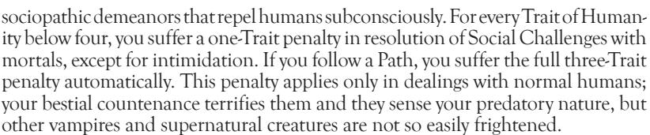
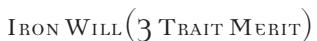
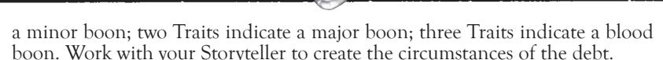

normal; in the event of a tie, compare your current *Instinct* Traits to the provocation rating to determine whether you manage to direct your frenzy.

You can never use more Self-Control/Instinct Traits on Virtue Test resolution than your current number of Blood Traits. If you are hungry, it is hard to resist the call of frenzy. Note that you do not frenzy automatically if you run out of blood; however, you are very likely to frenzy if you are exposed to a stimulus, since you won't be able to use any Self-Control/Instinct Traits in the event of a tie.

If you attempt to make a test of Self-Control/Instinct and fail, you automatically gain the permanent Negative Social Trait: Callous or Condescending (your choice), though it can be bought off normally.

**Example:** Starved, stumbling down a side alley, Arithon catches sight of a mortal meal. Although he is out of blood, he does not frenzy immediately, since he is not yet agitated and has not scented blood. As he closes in, the punk belligerently turns to face him, and gives him a rude gesture. Now that he's been harassed, Arithon must make a Self-Control Virtue Test, with a difficulty of two Traits. Since he is out of blood, he effectively has no Self-Control; he tests against another player (since it's just a Static Challenge) and ties. With his lack of blood leaving him with no Self-Control Traits, Arithon enters a frenzy, attempting to drain the mortal. He also gains a new permanent Negative Trait. Realizing that he can't win on ties and that the mortal is unlikely to pose a problem, Arithon's player decides not to risk any further Traits on a retest.

Later, full of blood, Arithon is at a local club when he is accosted by an Assamite. The Assamite attacks him from surprise – a three-Trait provocation. Arithon's player makes a Static Challenge. If he wins, he manages to control himself, and does not frenzy as the Assamite attacks him. If he ties, his Self-Control of two Traits is insufficient to best the frenzy stimulus; if he loses, he frenzies automatically.

#### COURAGE

The eternal life promised by the curse of Caine can be ended by varied means, the most painful of which are probably fire and sunlight. The searing wounds inflicted by these banes galvanize Cainites to extremes of self-preservation. Few can remain calm in the face of this destruction.

Courage Traits measure self-possession and the ability to resist the terror inflicted by fire, sunlight and True Faith. You must make a Courage challenge when confronted with such attacks. If you succeed, you manage to resist the urge to flee for the duration of the conflict (or for 10 minutes). If you fail, though, you enter Rötschreck, a form of terrified frenzy in which you attempt to escape by any means possible. Losing a Courage Test also causes you to suffer from the Negative Physical Trait: Cowardly or the Negative Mental Trait: Submissive, permanently, although such Traits can be removed later with Experience.

Note that you generally do not need to make a *Courage* Virtue Test against fire under your control. If you are lighting your own cigarette, for instance, or using the *Thaumaturgy* path *The Lure of Flames*, you are in control of the fire

|        | Self-Control/Instinct Difficulties                          |
|--------|-------------------------------------------------------------|
| Traits | Stimulus                                                    |
| One    | Smell of blood when hungry                                  |
| Two    | Sight of blood when hungry; harassed;                       |
|        | life-threatening situation                                  |
| Three  | Physical provocation or attacks; taste of blood when hungry |
| Four   | Loved one in danger; humiliated                             |
| Five   | Outright humiliation; mortal insults                        |

and thus unaffected by fear of it. However, if someone uses fire against you as a weapon (a hunter threatening to touch a lighter to your hair, facing someone brandishing a torch), you may need to make a *Courage* Test.

**Example:** *Due to some rather rash actions, the haven of Marcus the Brujah is engulfed in flames. Marcus, Cassandra and John Slime are all surprised by the fire that bursts up from the floor. The Storyteller calls for a Virtue Test of* Courage *with all the vampires present, to see who succumbs to Rötschreck. The Storyteller throws Scissors. Marcus' player throws Rock, and thus Marcus remains unaffected. John Slime and Cassandra's players both throw Paper, so they're in trouble. Both of the players risk a* Courage *Trait for a retest, and test against the Storyteller again. This time, Kurt wins, so John Slime manages to control himself, but he loses a* Courage *Trait for the evening — he's shaken by the experience and more likely to flee from later threats. Katherine, on the other hand, ties on her retest, but Cassandra only has two* Courage *Traits. She loses the test, gains a Negative Trait, gains a temporary derangement and goes into Rötschreck*.

# morality traits

As described previously, your Morality Path shows the particular code that you try to uphold. Your Morality Traits measure your distance from the Beast and your success in adhering to that moral code. Ranging from zero to five Traits, these Traits simply serve as an indicator of your ethical strength. You do not expend or use Morality Traits in any fashion. However, your total Morality Traits do affect your condition; a vampire close to being overtaken by the Beast is more likely to succumb to vampiric instincts like slumber during the day or the long torpor of ages.

Morality Traits are lost when you suffer a lapse in *Conscience* or *Conviction*. See the Morality tables on p. 75-79 for the Hierarchies of Sin, which determine what constitutes a moral violation for your beliefs. You can only gain Morality Traits through consistent adherence to your ethics, good roleplaying and the expenditure of Experience with your Storyteller's approval.

- When sleeping during the day, your total Morality Traits determine how deeply you slumber. You can never bid more than triple your Morality Traits for any action during the day (so even a mighty elder is susceptible to mortals due to such sluggishness).
- The length of time that you spend in torpor varies with the strength of your Morality. Normally, you spend six game sessions in torpor and out of play; lower this number by one session for each Morality Trait that you possess. Note that certain circumstances can rescue you from torpor prematurely: magical healing or imbibing a Trait of blood from a vampire three generations lower than you, for instance. This imposed length of time applies only if you are sent to torpor involuntarily — if you choose to take the long sleep, you can rise at any time that you desire.
- If you have Humanity, you appear more like a normal mortal. Vampires with low Humanity Traits, or on alternate paths of morality, have trouble dealing with normal humans. Such monstrous creatures acquire pallid, corpselike visages and

|        | Courage diFFiCulties                           |
|--------|------------------------------------------------|
| Traits | Stimulus                                       |
| One    | Being bullied; lighter; sunrise                |
| Two    | Torch; obscured sunlight                       |
| Three  | Bonfire; uncovered window during daylight      |
| Four   | House fire; being burned                       |
| Five   | Trapped in a burning building; direct sunlight |

• If you ever run completely out of Morality Traits, your character falls to the Wassail, the final frenzy. Your character enters a totally uncontrolled state of berserk rage and instinctive survival. Such a character cannot be coaxed from frenzy, cannot control himself and is no longer suitable for play. Other Cainites generally put down such unfortunates very quickly.

# DERANGEMENTS

Mental instability and insanity plague many vampires, who are gripped by their guilt, remorse and inability to deal with the changing world. Derangements represent specific mental problems that sometimes crop up in situations of stress.

Derangements are tools of advanced roleplaying, and they should only be taken with the consultation of the Storyteller. As a result, they are listed in the Storytelling section of this book, on pp. 212-214.

# NEGATIVE TRAITS

As listed previously under Attributes, you can take Negative Traits to specify particular weaknesses inherent to your character. The listings of Negative Traits are included with the other Traits on pp. 80-85.

When someone guesses your Negative Trait successfully in a challenge, you are forced to risk an additional Trait to continue with the challenge. Thus, if you enter a Mental Challenge but your opponent successfully guesses one of your Negative Mental Traits, you must bid and risk an additional Trait to continue with the challenge. If you do not have any more Traits to risk, you automatically lose the challenge.

## MERITS AND FLAWS

As optional Traits to flesh out your character, Merits and Flaws allow you to specify particular advantages or disadvantages that are not covered by Attributes, Abilities or Backgrounds. All Merits and Flaws are organized into specific categories, according to their type. To purchase a Merit, you must expend Free Traits equal to the cost of the Merit; taking a Flaw, conversely, hinders you with a handicap of some sort, but it offers additional Free Traits. You can take up to seven Traits each of Merits and Flaws. Some elder characters may have more; certainly, very old vampires may develop potential capabilities and resources outstripping their younger childer, or they may succumb to more terrible illnesses of body and mind.

Normally, you must purchase Merits and Flaws during character creation. However, with an appropriate story, you may be able to buy a new Merit (with Experience equal to double its value) or overcome a Flaw (again, with Experience equal to double its value).

# PHYSICAL MERITS AND FLAWS

Acute Sense (I Trait Merit)

You have a particularly sharp sense (specify which one). In all tests with that sense, you are two Traits up on challenge-resolution. Combined with the Auspex power of Heightened Senses, this Merit can gift you with truly superhuman acuity. You may have multiple Acute Senses, but you may only take this Merit once for each sense.

amBidextrous (1 trait merit)

You have a high degree of coordination, and you can use both of your hands equally well. Normally, you suffer a two-Trait penalty for performing tasks with your "off" hand. With this Merit, you have no penalty for using either hand. Of course, if you use both hands, you still suffer the coordination penalty for both (see "Two-Weapon Combat" on p. 207).

Catlike BalanCe (1 trait merit)

You almost never slip, stumble, fall or even get dizzy. Your sense of balance is so well-developed that you can walk with ease even on a narrow ledge or wire. You are two Traits up on resolution of challenges where your balance is a deciding factor.

eat Food (1 trait merit)

Perhaps you developed this capacity after your Embrace, or maybe you never lost the ability to eat food. Whatever the case, your atrophied organs can still stomach solids. You do not digest such food, however, and you gain no sustenance from it; you must regurgitate the food at a later time. Having this Merit can be invaluable in maintaining the Masquerade.

Blush oF health (2 trait merit)

Unlike other vampires who become pallid and gaunt, you retain a flush of life to your skin. Your appearance is still healthy, and you only feel slightly cool. This Merit is a great boon in blending in with mortals, though you still suffer Negative Traits from low Humanity or Path ratings (as those are more a result of your innate monstrousness than your appearance).

enChanting voiCe (2 trait merit)

Your voice is naturally resonant and commanding. All uses of your voice grant you two Bonus Traits; you can seduce, intimidate and cajole with just a few well-chosen words. This gift is most effective in combination with *Presence* or *Melpominee*.

daredevil (3 trait merit)

Not only do you take outrageous risks, you survive them. Whenever you take a risky (some would say foolhardy) course of action — one with a Static difficulty of at least eight Traits or a potentially harmful outcome — you get one Bonus Trait on the attempt. This bonus applies only to combats where you are outnumbered or sorely outclassed (Narrator's discretion).

eFFiCient digestion (3 trait merit)

You manage to draw extra nourishment out of blood while feeding. You gain three Blood Traits for every two that you drain from a mortal (rounding fractions down). This efficiency applies only to mortal blood, and you cannot take more than your normal Blood Trait maximum.

huge size (4 trait merit)

Nearly seven feet tall and hundreds of pounds in weight, you tower over most adversaries (and allies). You have one extra Bruised health level. You should represent your incredible mass appropriately — wearing bulky clothing is a good start.

hard oF hearing (1 trait Flaw)

You have some difficulty hearing. You suffer a two-Trait penalty on all tests of hearing. Obviously, you cannot have this Flaw and the Merit: *Acute Sense: Hearing*.

short (1 trait Flaw)

You have trouble seeing over things, interacting with tall people and escaping notice due to your proportions. You can only take two steps in an action instead of three, due to your small size. You also have trouble reaching countertops and manipulating objects designed for normal people (like cars). You should wear a tag to note your condition if you are not actually that short.

SMELL OF THE GRAVE (I TRAIT FLAW)

You exude the unconcealable stench of wet earth, which puts you one Trait down on social interactions with mortals automatically. Your loamy scent is quite distinctive to those familiar with you.

BAD SIGHT (I TO 3 TRAIT FLAW)

Defective sight causes you no end of trouble. Any time you are called on to perform a challenge that involves careful eyesight, you suffer a two-Trait penalty. If your vision problem is correctable with glasses or contact lenses, it is only worth one Trait; if it is uncorrectable, it is worth three Traits. Obviously, you cannot have the Merit: Acute Vision: Sight with this Flaw.

FOURTEENTH GENERATION (2 TRAIT FLAW)

Embraced in the modern age, your blood is thin beyond even that of most Caitiff. You are no more than five years as a vampire, created by one of the 13th generation. You have 10 Blood Traits, but you can only use eight of them; the other two are inert, treated like mortal blood. You must take the Flaw: *Thin Blood* (although you do get Free Traits for it), and you are most likely Caitiff, for your blood is too weak to pass the distinguishing characteristics of clan. You may not take the Backgrounds of *Generation* with this Flaw.

DISFIGURED (2 TRAIT FLAW)

A hideous disfigurement afflicts you, twisting your countenance in a memorable fashion. You cannot take any Appearance-related Social Traits. Furthermore, you suffer a two-Trait penalty on all Social Challenges except intimidation.

ONE EYE (2 TRAIT FLAW)

Whether by injury or defect, you are missing an eye or one of your eyes does not function. You are two Traits down on tests of depth perception, including ranged combat. Depending on the nature of your eye damage, you may choose to wear an eyepatch, or you may simply have one blind eye.

Addiction (3 Trait flaw)

Some chemical or biological substance hooked you, and now you crave it in the blood. You try to feed from people whose blood will satiate your cravings. This substance generally has negative effects on you — alcohol or depressants may give you the Negative Trait: *Lethargic* for the rest of the evening after feeding, or amphetamines may cause you to suffer from the Negative Trait *Impatient*. You can only draw nourishment from blood with your "fix" in it; you vomit up any other blood.

CHILD (3 TRAIT FLAW)

You were embraced as a child, between five and 10 years of age. Your age causes some decided problems: you cannot have more than six Physical Traits normally, and you suffer a two-Trait penalty on tests of authority with adults. Since you never age or grow up, this Flaw will probably be with you forever. You must additionally take the Flaw: *Short* (though you do get Free Traits for it).

DEFORMITY (3 TRAIT FLAW)

A physical deformity of some sort not only mars your appearance, but it makes physical activity difficult for you. You have a one-Trait penalty on challenge resolution for Physical tests, and two for Social tests. You should work with the Storyteller to define the nature of your deformity (be it a hunchback, club foot, withered limb etc.).

Infections Bite (3 Trait flaw)

Due to enzymes, a disease or just some unknown mystical factor, you cannot heal your bite simply by licking the wound. In fact, mortals can be infected with a serious disease if you feed on them — if you fail a Simple Test after leaving a mortal alive but bitten, the mortal contracts a serious disease (see **Laws of the Hunt** for information about mortals and infection).

LAME (3 TRAIT FLAW)

More than simply suffering from a twitchy limb like the *Lame* Negative Physical Trait, you have severe damage to your legs. You can only take one step per action, you cannot run and you should take the Negative Trait *Lame* as well. You should roleplay this Flaw with a cane or a set of leg braces.

Monstrous (3 Trait flaw)

Something about you became wholly monstrous when you were Embraced. Your outward form twists to reflect your inner Beast. You cannot initiate Social Challenges, except ones concerning intimidation, when your true form is apparent, and you may not take Appearance-related Traits, such as *Alluring* or *Gorgeous*. Nosferatu and Samedi may not take this Flaw.

DERMANENT WOUND (3 TRAIT FLAW)

Before your Embrace, you suffered some sort of wound which your transformation failed to repair. As a result, you rise each night with the same affliction. You wake up each evening at your first *Wounded* health level with lethal damage, although this damage may be healed normally.

SLOW HEALING (3 TRAIT FLAW)

Your blood is not very efficient in healing your wounds, or may be you just never really learned to direct your vitae for regeneration. Repairing one level of damage costs you two Blood Traits, and you can only restore one aggravated level of damage per week (though you can bank your blood for healing, as described under "Blood Traits", p. 106).

DEAF (4 TRAIT FLAW)

You are completely deaf. You must use sign language or some other form of communication. You cannot hear *Dominate* commands, and so you are usually immune to them (unless they are implanted telepathically or otherwise without voice), but you suffer a three-Trait penalty on tests of perception and alertness. You cannot have *Acute Sense: Hearing*, and you are surprised automatically by anyone who approaches you from outside your line of sight.

DISEASE CARRIER (4 TRAIT FLAW)

You suffer from a fatal disease, and you spread it readily to anyone who drinks your blood. Though it has little effect on Cainites, it does require you to spend an extra Blood Trait when awakening in the evening if you wish to avoid suffering its debilitating symptoms. Furthermore, other vampires who feed on you must make two Simple Tests — if both tests are lost, the vampire contracts your disease as well.

MUTE (4 TRAIT FLAW)

You cannot speak at all. To communicate, you may need to sign or write out your thoughts. You can explain actions to a Storyteller, but that is the limit of your speaking. Without *Linguistics*, you may not even be able to sign. This Flaw can be difficult to roleplay, so choose carefully.

THIN BLOOD (4 TRAIT FLAW)

The curse of Caine is weak in your vitae. As a result, your blood sustains you only poorly. All costs for Blood Traits are doubled, and may require you to spend multiple turns when powering Disciplines or healing. You cannot create a blood bond, and you can only Embrace someone if you win (not tie) a Simple Test — otherwise, the victim simply dies.

flesh of the Corpse (5 Trait flaw)

When you suffer injury, your flesh knits with terrible scars and puckering seams. Every time you take a wound, you suffer from the Negative Trait *Repugnant*, and it persists even after you heal the injury. After a day's sleep, your skin finally restores itself, but the marks are still a difficulty when dealing with the Masquerade before you have slept.

The world of sight is lost to you. You automatically lose all ties where sight would be a factor (tests of manual dexterity, for instance). You fail any challenge requiring sight automatically. You cannot be affected by *Dominate* because you cannot see the opponent's gaze, but that is about the limit of the benefits. If you have this Flaw, you should wear a special tag or glasses to indicate its nature. Interestingly, you can still use the *Auspex* Discipline power of *Aura Perception*, though you perceive the aura through other senses (smell, sound, etc.).

#### MENTAL MERITS AND FLAWS

COMMON SENSE (I TRAIT MERIT)

You still have a lot of gut insight and everyday practicality. Whenever you're about to do something that runs counter to common sense, the Storyteller or Narrator can make suggestions about the action. This Merit is excellent for new players who are not familiar with the intricacies of the game.

CONCENTRATION (I TRAIT MERIT)

You can shut out distractions and annoyances that would hinder others. Whenever penalty Traits are assigned for some outside phenomenon (harsh lighting, rain, loud noise, etc.), you suffer none of the penalty.

TIME SENSE (I TRAIT MERIT)

You can estimate time accurately to the nearest one or two minutes without the use of a watch or clock. This Merit is obviously very useful in getting back to safety before sunrise.

CODE OF HONOR (2 TRAIT MERIT)

A specific code of behavior and ethics, separate from your Path of Enlightenment, guides your actions. This code is very personal, shaped by your own experiences. You should work with your Storyteller to build an appropriate code (which should include some hindrances and prohibited activity in addition to beliefs and passions). You gain one free retest whenever facing a Mental or Social situation that might cause you to violate your code, be it supernatural persuasion or possible frenzy.

EIDETIC MEMORY (2 TRAIT MERIT)

Your memory is nearly perfect, and you recall almost everything you experience with incredible clarity. A single turn of attention is sufficient to commit a page, picture or short conversation to memory. If you are involved in combat or otherwise distracted, you must make a Static Mental Challenge, difficulty of six Traits, to successfully memorize the contents of your subject of scrutiny. You should keep a "cheat sheet" of your memories to aid you and the Storyteller in "recollection."

LIGHT SLEEDER (2 TRAIT MERIT)

While most vampires sleep soundly during the day, you are still sensitive to your surroundings. You wake easily and instantly at any sign of disturbance. You also suffer no limit to your Traits due to sleepiness during the day, regardless of your Morality Trait total.

NATURAL LINGUIST (2 TRAIT MERIT)

You have a remarkable grasp with any languages that you speak or write (as per your *Linguistics* Ability). You gain three Bonus Traits on all challenges related to language.

CALM HEART (3 TRAIT MERIT)

Though the Beast moves in you, it is more subdued than in other vampires. You control your passions better than most, or you are just naturally more temperate. You are one Trait up on resolution of Self-Control/Instinct and Courage Virtue Tests. Brujah may not take this Merit.

When your mind is set, your will is not broken easily. If you are affected with the *Dominate* Discipline, you may expend a Willpower Trait to retest the effect. If you win, the effect is negated and you receive a five-minute immunity to further *Dominate*. If mind-altering magic or *Thaumaturgy* with a Mental Challenge affects you, you get three Bonus Traits in defense. Note that this Merit does not defend against *Presence* or other social manipulations.

DEED SLEEDER (I TRAIT FLAW)

You are even more sluggish than the normal vampire during the day. You have great difficulty awakening, even at signs of danger. During the day, waking up is a Static Mental Challenge versus 10 Traits.

NIGHTMARES (I TRAIT FLAW)

Hideous nightmares (daymares?) flit through your mind whenever you slumber. At a Narrator's discretion, you may suffer nightmares so bad that you are unable to sleep restfully, causing you to lose one Trait on all challenges for the evening. A crafty Storyteller is usually quick to take advantage of this Flaw.

PREY EXCLUSION (I TRAIT FLAW)

For some reason, you refuse to hunt a certain class of prey, such as children, clergy or police. If you accidentally feed on your excluded subject, you immediately enter frenzy and must make a four-Trait Conscience/Conviction Challenge or lose a Morality Trait. Furthermore, if you witness someone else feeding on your excluded type, you must make a Self-Control/Instinct Virtue Test as if provoked. Ventrue cannot take this Flaw, due to their more restrictive clan diet.

SHY (I TRAIT FLAW)

Unlike the Negative Trait Shy, which indicates difficulty dealing with other individuals, you have a specific problem with large groups of people. You take a two-Trait penalty on all Social Challenges with three or more people, three Traits for groups of 10 or more.

SOFT-HEARTED (I TRAIT FLAW)

You cannot abide suffering, because of the emotional disturbance or pain that it causes you. You must avoid causing pain or suffering to anyone; only by spending a Willpower Trait can you overcome this limitation for a scene (one hour). You must have at least four Morality Traits of Humanity to take this Flaw.

Speech Impediment (I Trait flaw)

Astammer, Tourette's Syndrome or other speech deficiency makes communication difficult for you. Roleplay your deficiency, and suffer a two-Trait penalty on all verbal communication. You cannot have this Flaw with the Merit: *Enchanting Voice*.

AMNESIA (2 TRAIT FLAW)

The past is a blank slate. You know nothing of your history, family, friends or foes. Your Storyteller makes up your character's history, including the reasons for your Amnesia. The Storyteller may even keep your character record partially hidden, only revealing your Abilities, Disciplines, Merits and Flaws when you try to use them. In general, the only things obvious to you are the things you can see in the mirror.

LUNACY (2 TRAIT FLAW)

The cycles of the moon shift your moods, making you unpredictable and wild. Under a crescent, half or gibbous moon, you suffer a one-Trait penalty to all Self-Control/Instinct Virtue Tests; under a full moon, this penalty increases to two Traits.

DHOBIA (2 TRAIT FLAW)

Some object, creature or circumstance fills you with dread. This fear goes far beyond the normal level of phobias: Your vampiric Beast instinctively flees the

thing, treating it as a dire threat. When confronted by the object of your fear, you must make a *Courage* Virtue Test with a difficulty of at least three Traits (more if the Narrator decides that the circumstances are particularly severe). Should you fail, you suffer the usual penalties of failed *Courage* and R^tschreck.

SHORT FUSE (2 TRAIT FLAW)

Even for a vampire, your temper is ferocious. You suffer a one-Trait penalty on all Virtue Tests of Self-Control/Instinct. Brujah cannot take this Flaw.

TERRITORIAL (2 TRAIT FLAW)

You stake out a particular area and claim it as your hunting grounds. You do not tolerate trespassers, especially other predators (vampires and Lupines). If you catch another vampire entering your turf uninvited, you must make a *Self-Control/Instinct* Virtue Test as if provoked, or fly into a frenzy and attack. You generally dislike leaving your home for extended periods; roleplay this reticence.

Vengeful (2 Trait flaw)

You want to even a score, either from your mortal days or with some group or individual thereafter. You plan ways to get your revenge constantly, and if presented with an opportunity for vengeance, you must spend a Willpower Trait to take some other action for the scene.

WEAK-WILLED (3 TRAIT FLAW)

Mind-altering powers like *Dominate* or even simple threats can break you easily. You get no test against the *Dominate* Discipline (although you are still immune to uses of *Dominate* from Cainites of weaker generation). You also suffer a two-Trait penalty on all Mental and Social Challenges. You cannot exceed a total of three Willpower Traits, regardless of your generation, unless you overcome this Flaw.

Conspicuous Consumption (4 Trait flaw)

The organs and blood-bearing tissue of your victims are staples of your diet. You believe that you must consume the liver, kidneys, heart and other pieces in order to sustain yourself. You must purchase the *Eat Food* Merit so that you can devour the meaty bits. You can only absorb Blood Traits by eating these organs; blood drunk from other sources is vomited back up. This hunger will necessitate the deaths of your victims, and it could lead to interesting problems with the Masquerade and maintaining Morality.

## Social Merits and flaws

NATURAL LEADER (I TRAIT MERIT)

Natural magnetism and leadership capabilities spring from your actions and words. Others want to follow you, and you easily take charge. You gain two Bonus Traits on tests of leadership (including most *Presence* tests). You must have at least six Social Traits to take this Merit.

PRESTIGIOUS SIRE (I TRAIT MERIT)

Your sire is well-known in Cainite society, and he is held in some esteem. You gain a small measure of prestige due to your sire's fame, even if you no longer have any contact with her. Many other vampires treat you with at least a modicum of respect, as they fear or revere your sire. You are generally treated as if you possess one Status Trait more than you really have, although this Trait is not actually used — it shows that people accord you slightly greater standing.

DEBT OF GRATITUDE (I TO 3 TRAIT MERIT)

An elder owes you prestation due to a favor performed by you or your sire. In keeping with the strictures of Cainite society, there is no easy way for the vampire to get out of this debt without repaying you. One Trait indicates

ENEMY (I TO 5 TRAIT FLAW)

A particular enemy is out to ruin you, or worse, to kill you. You may even have a group of powerful enemies hounding your steps. The value of this Flaw depends on the power of the enemy: A single vampire of power similar to your own is worth one Trait, while a cabal of mages or an entire organization of hunters would be worth five Traits. The Storyteller will ensure that your enemy figures into plots. He may not appear every game, but his machinations will be there.

DARK SECRET (I TRAIT FLAW)

You have some sort of secret that, if exposed, would cause you great embarrassment or hardship. The Storyteller will work to make sure that your secret could be exposed in the course of play. If the secret gets out, you may either buy off the Flaw immediately by taking a Negative Trait (*Untrustworthy* is a good one), or by the loss of a Status Trait, depending on the circumstances.

INFAMOUS SIRE (I TRAIT FLAW)

Your sire is well-known and well-hated among vampires of your sect. You are treated as if you have one less Status Trait than you actually possess. This penalty does not affect your true amount of Status; it simply means that others treat you with scorn for your lineage.

MISTAKEN IDENTITY (I TRAIT FLAW)

Another Cainite happens to bear a striking resemblance to you. Worse, others in your area have heard descriptions of this person or even met your lookalike, causing no end of confusion. You should wear a tag that indicates your *Mistaken Identity*. This Flaw can be especially problematic if your lookalike is particularly powerful or notorious in Cainite society.

SIRE'S RESENTMENT (I TRAIT FLAW)

For whatever reason, your sire has decided that your Embrace was a mistake, and she wishes you ill. You are unlikely to have a *Mentor* or any allies of note among Cainites, and your sire will attempt to hinder your plans at any opportunity.

HUNTED (4 TRAIT FLAW)

A powerful and dangerous mortal hunter has decided you are a danger to the world, and he seeks to snuff out your existence. The mortal has the contacts and skills necessary to make your unlife dangerous and unpleasant (and very short, if you aren't careful). Your friends, allies and other associates may all be at risk if the hunter decides to turn his eye on them.

PROBATIONARY SECT MEMBER (4 TRAIT FLAW)

You turned your back on your former organization, and now you stand with another. You may be a Camarilla turncoat, a Sabbat refugee or an independent who joined with one of the greater sects. As long as you have this Flaw, you are suspect within your new organization. You can have Status normally, but elders are likely to cast a suspicious eye over you regardless of your actual standing (treating you as if you had only one Status Trait). Even those with whom you associate may be judged tainted.

## SUPERNATURAL MERITS AND FLAWS

Magic Resistance (2 Trait Merit)

The magical forms and rituals of *Thaumaturgy* and other magic seem to have difficulty affecting you. You gain two Bonus Traits when testing against any form of magic, though this bonus applies to both benevolent and harmful effects. You can never learn *Thaumaturgy* if you have this Merit.

