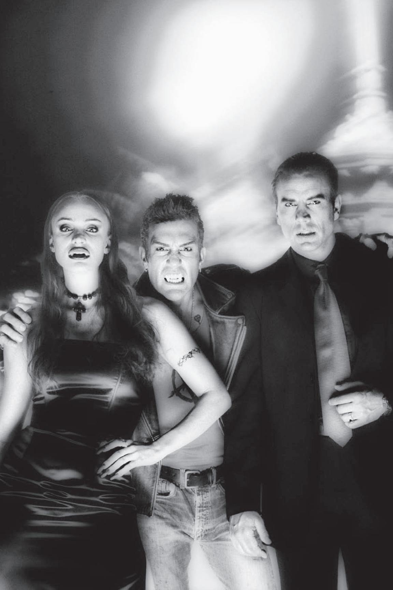
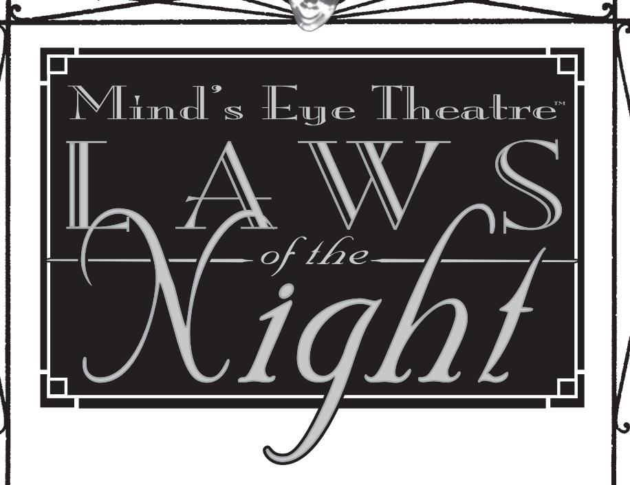
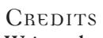
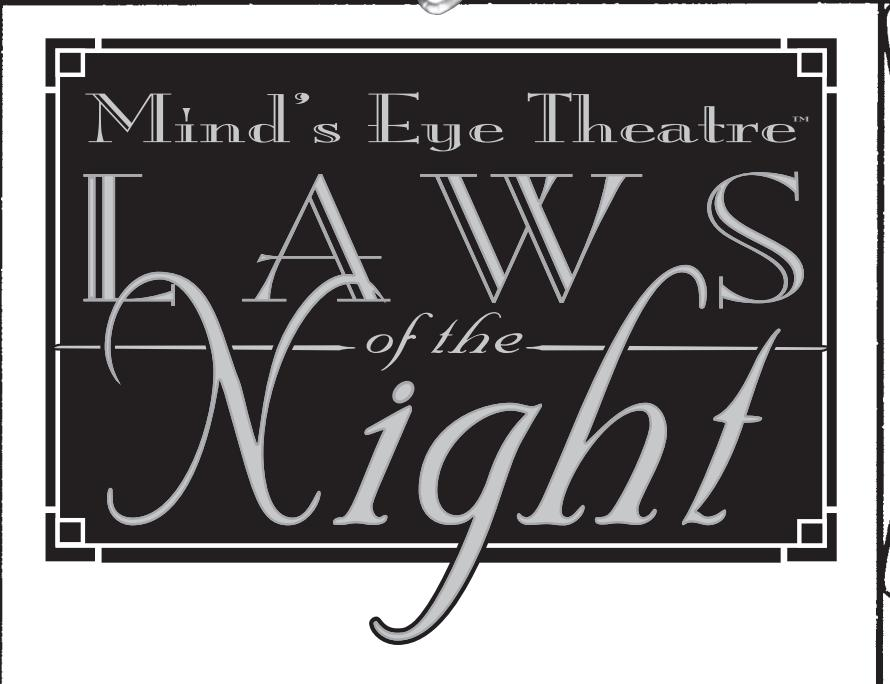

## Mind's Eye Theatre Control of the Control of the Control of the Control of the Control of the Control of the Control of the Control of the Control of the Control of the Control of the Control of the Control of the Control of the Control of the Control of the Control of the Control of the Control of the Control of the Control of the Control of the Control of the Control of the Control of the Control of the Control of the Control of the Control of the Control of the Control of the Control of the Control of the Control of the Control of the Control of the Control of the Control of the Control of the Control of the Control of the Control of the Control of the Control of the Control of the Control of the Control of the Control of the Control of the Control of the Control of the Control of the Control of the Control of the Control of the Control of the Control of the Control of the Control of the Control of the Control of the Control of the Control of the Control of the Control of the Control of the Control of the Control of the Control of the Control of the Control of the Control of the Control of the Control of the Control of the Control of the Control of the Control of the Control of the Control of the Control of the Control of the Control of the Control of the Control of the Control of the Control of the Control of the Control of the Control of the Control of the Control of the Control of the Control of the Control of the Control of the Control of the Control of the Control of the Control of the Control of the Control of the Control of the Control of the Control of the Control of the Control of the Control of the Control of the Control of the Control of the Control of the Control of the Control of the Control of the Control of the Control of the Control of the Control of the Control of the Control of the Control of the Control of the Control of the Control of the Control of the Control of the Control of the Control of the Control of the Control of the Control of the Control of the Control of the Control of the Co

Revised Rules for Playing Vampires

VAMPIRE THE MASQUERADE

"It is," Peter Coleman said, "really goddamned dark in here." He ran his fingers down the lapels of his suit out of nervous habit, checking to see that he was still immaculately groomed, even in pitch blackness. "I don't see why we have to wait in the dark."

He felt a soft finger on his lips in response. "Hush," came the voice of his associate from somewhere to his left. "You know exactly why we are here. If we do not stand in the dark, then we are visible to your little friend Kevin. If we are visible to your little friend Kevin, then Kevin may remember our faces and have that memory dragged out of him by any one of our rivals. I, for one, would prefer to minimize my risks."

Coleman rolled his eyes, he hoped invisibly. "As you say, Donata. I humbly beg your pardon, and I shall wait in silence until *our* little friend arrives." With that, Peter shut his eyes and began mentally fiddling with projections on a few IPOs that were scheduled for the next month and a half. He whistled tunelessly as he did so, feeling, rather than seeing, Donata bristle beside him.

"Must you do that?" she said, an edge of real irritation coloring her voice. Her words echoed hollowly in the space of the tunnel they stood in. "He'll hear you and get spooked, and then all this will be for naught."

Peter smiled and sat down on a projecting ledge. The concrete was surprisingly smooth and cool to the touch, and he found himself hoping that there wouldn't be too much dust on his suit when he got out of here. "Are you sure it isn't that I'm offending your delicate sensibilities? I'm sure that you've heard much finer whistling in Elysium."

Donata took a step to the left, gritting her teeth almost audibly. "Whatever you say, Peter. Don't make this more difficult than it has to be. We can go back to hating each other properly once all of this is finished, but in the meantime, I'll do my best to make this endurable if you will. Do we have an arrangement?"

"We have," Peter said, "several. But you are, as always, right." He checked his watch, which glowed a faint green. "Damn. The boy is late."

"His kind always is," said Donata, and sat in the darkness beside him. He glanced her way once, barely seeing her silhouette through the gloom, but made no move to acknowledge her presence.

Side by side, the two predators sat and waited. It was one of the things that they'd gotten very good at over the years.

✙ ✙ ✙ ✙

Kevin skulked up the storm drain tunnel, his boots making only the slightest of splashes as he trudged through the shallow stream that ran through the conduit. Every 15 steps or so, he paused to look behind him and make sure that he wasn't being followed, while he let the echoes of his footsteps fade away. He kept to the water because he'd been told that it made you harder to track, and he definitely didn't want anyone tracking him tonight.

("He's coming," Donata said, a quarter mile ahead. "I can hear him." Coleman frowned and said that he heard nothing. "That," she responded, "is your problem. To me he's clear as day. Now be quiet. He'll be here shortly.")

A full 20 minutes later, Kevin finally took the last cautious steps to the meet point. To outside eyes, the place was just another dank section of storm drain, but the instructions he'd received told Kevin that he would meet his contacts here. He looked around. The place was pitch black, and there was no sign of any other presence, human or otherwise. He stood for a minute, then muttered a curse under his breath and turned to go.

"That's far enough, Kevin," came a voice from the darkness. "Stop right there."

"What if I don't want to?" he blustered, making a big show of splashing back a few steps in the direction he'd come from.

"You really don't want to test me, Kevin," the voice said wearily. "I'm right behind you, and if you take another step, I'll rip your throat out and go looking for another runner. Kristof recommended you to me because he said you were smart. Be smart now, and stop."

Beside Coleman, Donata could barely swallow her laughter. Kristof the Nosferatu had recommended Kevin, yes — but because he was *expendable*. Intelligence was never part of the equation.

"Okay," Kevin said. "I'm stopping, but only because I want to." He turned around slowly. "So where are you? Show yourself. What's your name? Why the hell did we have to do this here?"

"Because," Donata said, "we know how important your friends are to you, Kevin. We know how they feel about us, too, and we know that if they found out you were talking to us, they'd turn on you in a minute. They'd abandon you, leave you to the streets on your own, maybe even try to hurt you." Her voice was full of loving mock concern. "We couldn't let that happen to our

favorite runner, now, could we? All this," and she paused breathily, "is for your protection."

Kevin snarled. "And you get nothing out of it? Bullshit. You don't want your high-and-mighty friends to know that you've been talking to someone like me, do you? Hell, you don't even want me to know who you are, because you're afraid I'll shoot my mouth off." There was silence for a moment, then he continued. "Well, we'll play it your way for now, but don't make the mistake of thinking I'm some kind of common idiot."

"Of course not," Coleman said soothingly. *You're a* unique *kind of idiot*, he thought instead.

"Yeah. Sure. Whatever. So, where's the package?"

"Taped to the underside of the manhole cover in the next chamber, and in a waterproof case. Directions on where to deliver it are attached. Deliver it to the drop point tomorrow at midnight, and your payment will be waiting for you at the address indicated on the papers inside." Truth be known, there was no such address at all. Coleman's plan was for Kevin to open the package — which contained important papers relating to the prince of the city's finances — at the drop point, then close it back without bothering to seal it properly. Coleman would, no doubt, get some blame for having chosen an unreliable courier, but the brunt of the prince's wrath would come down on Kevin and those like him. The prince was irrational that way, it seemed. And an irrational prince who was angry made mistakes — mistakes that meant that there might be opportunities for ambitious Kindred to move up in the city's hierarchy.

Peter Coleman was very, very ambitious. As for Donata del Este, she was not quite so driven, but she had a certain vested interest in seeing to it that Peter's star continued to rise higher than those of her rivals.

Kevin was simply belligerent. "And the money?"

Donata sighed. "Already waiting for you. Now, are you going to do it?"

"Yeah, I'll do it." He took a few steps toward the exit, smiling to himself, "but on one condition."

"What is that?" Peter said, his voice low and guarded. Unbidden, he got off the ledge and into a fighting stance.

"This!" Kevin took a camera out of his pocket, pointed it at the voices he'd heard and pressed the button.

Donata had heard the whine of the camera's flash charging up, but she had had no idea what it was. As a result, she was completely unprepared for the flood of white light. As she had been straining her vision to its utmost already, aided by her supernaturally acute perceptions, the tide of brilliance hit her like a sledgehammer. She screamed, staggered and fell.

Cursing, Coleman leapt down onto Kevin, who stood with his eyes half-shaded. The anarch saw him coming and tried to run, but he could only turn and take a single step before the Ventrue was on him. With a snarl, Coleman grabbed the back of Kevin's jacket and bodily slammed him into the concrete of the storm drain wall. There was a sharp crack, as several of Kevin's teeth shattered on impact. Coleman then pulled the dazed vampire back to glare at him.

"All right, little anarch, you've had your fun. What the hell was that about?" Behind him, Donata groped blindly in the water, weeping bloody tears of pain.

"It wasn't nothing, man! I just wanted a look at your faces! I wanted to know who I was dealing with!" Kevin was terrified, and he babbled the words out around the shards of his broken teeth.

"Not good enough," Coleman said, slamming Kevin's face into the wall again. "Who else are you working for? Who wanted to know about this meeting?" He spared a glance back at Donata, then turned his attention to Kevin again. "Tell me, and I may let you walk out of here. Don't, and all that's going to be left of you will be a bloodstain on this wall."

"No one, man! I swear, it was no one!"

"Wrong answer," Peter said grimly. He bashed Kevin into the concrete again. The impact would have pulped the skull of a human being, but both Peter and Kevin were a long way past human. "Now, are you ready to talk?"

"I'll talk, I'll talk," Kevin whimpered. "Just don't hurt me anymore."

"A much wiser choice." Coleman dropped the anarch. "So who was it?"

"Warburton. It was Warburton. He's moving up, so he wanted to find out who was 'consorting with anarchs' and turn them over to your prince. I was supposed to get your faces and then run, while his people picked up the package." Kevin was sobbing harder than Donata was. By now, she had pulled herself to her feet unsteadily and taken a few staggering steps toward the other two vampires.

"Well, Mr. Warburton is going to have to do without your services, Kevin. I'm sorry, but when you double-crossed us, you became a liability. And liabilities are only good for one thing: write-offs." Coleman's voice was surprisingly calm and controlled. "Say good night, Kevin."

"Wait." Donata spoke up. "I have a better idea."

"Oh?" Coleman turned to her. "Do tell."

"If you kill this piece of trash, we'll only look guilty in Warburton's eyes. Instead, I say we take little Kevin here," and there was no affection in her voice now, only cold rage, "and turn him."

"Hmm." Coleman rubbed his chin thoughtfully. "An interesting point. But how are we going to accomplish that, given the resources at hand?"

"Leave that to me," Donata said. "Leave that to me."

 ✙ ✙ ✙ ✙ Kevin loped west along High Street, smiling. His mouth was a bloody ruin, but Donata, lovely Donata, had assured him that his teeth would grow back soon enough. It was amazing to him that he'd ever thought of betraying her. He shook his head. How foolish he had been.

Now, though, he could repay her for that breach of trust. He could prove to her that he was worthy of being loved.

First, he thought, he would go to Warburton and bear false witness against two other Kindred who'd once said unkind things about his beloved. Then, he'd go hunting for a suitable gift for his lady. He didn't think either chore would take him very long.

 ✙ ✙ ✙ ✙ "So what did you do to him?" Coleman's voice was only mildly curious, as if he were asking out of mere politeness.

Donata sipped at her goblet before replying. Both she and Coleman had been dreadfully late for the evening's gathering at Elysium because of the misadventure with Kevin, but she counted it as a blessing. The delay had allowed her to make a suitably attention-worthy entrance, and that sort of notice was worth more than gold to her.

"Oh, just a trifle," she said. "I made him love me."

Coleman's eyebrow shot up. "You can do that?"

She nodded, then leaned over and kissed him. Her mouth was cold, but so was his. He could taste blood on her lips; it was sweeter than he expected. "I can indeed. He's mine now. Think about that the next time you want to spend the evening in a sewer with someone." She smiled without mirth, and walked away.

Coleman stared after her, rubbing his mouth absently with the back of his hand. "I'll bear that in mind," he said softly. "Don't worry, I don't think I'll ever forget."

**Written by:**Jason Carl, Jess Heinig, Peter Woodworth

**Additional writing by:**Richard E. Dansky

**Development by:** Cynthia Summers

**Editing by:**Carl Bowen

**Previously published material from:**Vampire The Masquerade Revised, Laws of the Night

**Art direction by:**Rich Thomas

**Art by:**Pauline Benney,Louis Cahill

**Front and back cover design:**Craig S Grant

**Layout and typesetting by:**Pauline Benney

**Mind's Eye Theatre Design:** Mark Rein•Hagen, Ian Lemke and Mike Tinney

**Playtesters:**Kathryn Abromovich, Chris Arnold, David Blackwell, Michael Blank, Brian Clark, Shaun Crawford, Michael Dent, Julian Dillard, Jim Fillmore, David Flannery, Brian Gates, Misty Gates, Alyson Gaul, Jody Gerst Crystal Greenlee, Jason Hale, Brock Hall, James M. Hendricks, Geoff Hinkle, Matthew Kauffman, Tim Leber, Chris Loeffler, Tori Mauslein, Jeremiah McCoy, Glenys Ngaire McGhee, Sarah McIlvaine, Mike Metcalf, Laura Middleton, Joshua Patterson, Sarah Riggs, John Sargent, Matthew Skipper, Marc Spencer, Bill Terry, Golden Sky Tullis, Jim Vasquez, Peter Woodworth, W. Andrew Woodworth

## SpecialThanks to: You, the fans — it's all for you.

© 2010 CCP hf. All rights reserved. Reproduction without the written permission of the publisher is expressly forbidden, except for the purposes of reviews, and one printed copy which may be reproduced for personal use only. White Wolf, Vampire, Vampire the Masquerade, Vampire the Dark

Ages, Mage the Ascension and World of Darkness are registered trademarks of CCP hf. All rights reserved. Werewolf the Apocalypse, Wraith the Oblivion, Changeling the Dreaming, Werewolf the Wild West, Trinity, Laws of the Night, The Long Night, Liber des Goules, The Shining Host, Laws of the Wild, Laws of the Hunt, Laws of the Hunt Players Guide, Oblivion, and Storytelling System are trademarks of CCP hf. All rights reserved. All characters, names, places and text herein are copyrighted by CCP hf. CCP North America Inc. is a wholly owned subsidiary of CCP hf.

The mention of or reference to any company or product in these pages is not a challenge to the trademark or copyright concerned.

This book uses the supernatural for settings, characters and themes. All mystical and supernatural elements are fiction and intended for entertainment purposes only. This book contains mature content. Reader discretion is advised.

Check out White Wolf online at <http://www.white-wolf.com> PRINTED ON DEMAND

## Contents

| Rendezvous: A CautionaryTale              | 1   |
|-------------------------------------------|-----|
| ChapterOne: Introduction                  | 10  |
| Chapter Two: The Clans                 | 24  |
| ChapterThree: Character CreationandTraits | 58  |
| Chapter Four: Discplines                  | 128 |
| Chapter Five: Rules, SystemsandDrama      | 186 |
| Chapter Six: Storytelling              | 222 |
| ChapterSeven: AlliesandAntagonists        | 248 |