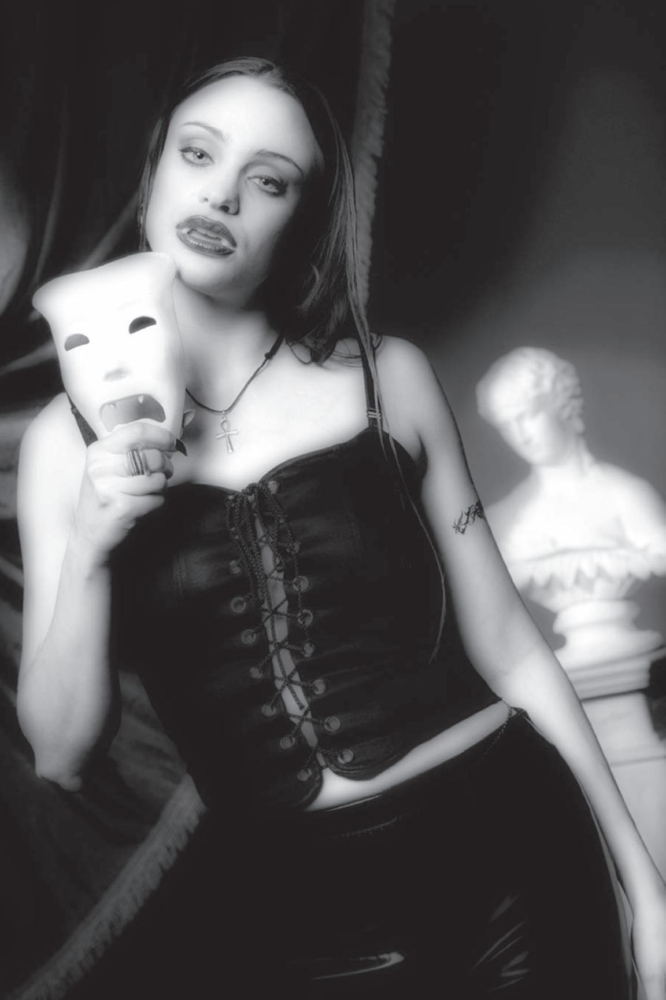
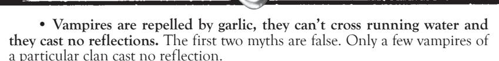
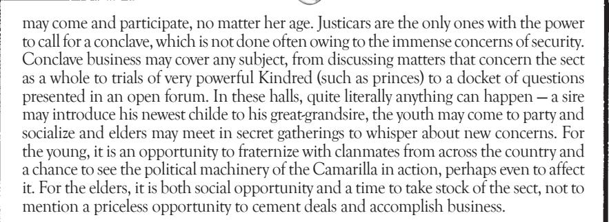

# CHAPTER ONE: INTRODUCTION

# stories around the Fire

Once upon a time, long before television or computers or even books, people sat around the fire and told stories for entertainment. Whether it was a ballad of a hero's latest exploits or a cautionary tale about dealing with the hidden creatures of the world, storytellers were a valued part of the community as teachers and entertainers. And tale-telling was hardly a passive art — the storyteller relied on his audience for reaction to his tale as he spoke. How else would he know if they were enjoying the story, or if they were getting bored?

Time marched on, and technological developments began to change, if not interfere with, the storyteller's art. Books (and the development of greater literacy among people) meant that someone could simply read a story whenever he liked, instead of hunting down a storyteller to tell it. Radio and television remade the storyteller into an impassive creature that did not encourage audience participation. Stories were still told, and in great quantity, but they were largely sterile, unliving things.

Now we come to the 1970s, and the era of roleplaying. A group of players sits around a table, listening to their leader describe scenes of dank dungeons and dark cities, and they choose which path to take next. At one of these sessions, someone gets the idea to start standing up, moving and thinking as her character might. Over time, more players do the same, creating what will become known as live-action roleplaying (or LARP). In fact, this "new" entertainment is a return to the oldest the leader was the storyteller, taking his listeners on a new journey, and the listeners were responding in kind, taking on the roles of the characters in the story, telling this new tale to the storyteller, the other player-listeners and to themselves.

what isMind's Eye Theatre? This game is probably unlike anything you have played before. In many ways, it's not really a game, because it doesn't have a lot of the trappings of games — such as cards, dice or a playing board. It's also far more concerned with the stories to be told along the way than "winning." It's far more like the make-believe of childhood than what most people typically think of when they imagine "games." This book contains all the information you'll need to start playing and telling your own stories. You create the action, you choose the path to follow, you decide what risks to accept. We call this style of game **Mind's Eye Theatre.**

Playing **Mind's Eye Theatre** is like being in a movie. You and your friends are the characters, but there is no script. There may be a framework or setting that determines the parameters of the world around you, but you and the others around you are creating the story as you play. The "director" of this movie is the Storyteller, assisted by Narrators. The Storyteller creates the stage and the minor characters that the players interact with to tell this story.

Most scenes in **Mind's Eye Theatre** are played out in real-time — an hour in the make-believe world is 60 minutes long, and it takes up 60 minutes in the real world — and always in character. Players always remain in character during the game unless there is a rules dispute.

# CharaCters

When you play **Masquerade** (the game for which this book was developed), you take on another persona, most likely a vampire. Your character can be almost anything — from any walk of life, age, creed, race or sex. The only limit is your imagination. When you create this character, you decide what she says or does. You decide where she goes and what choices she makes. During the game, you speak as your character, unless you're resolving a rules dispute or talking to the Storyteller. Because most of what a **Mind's Eye Theatre** player perceives around him depends on the other players, all players must be vivid and expressive.

While the characters may direct the plot through their actions, the plot reacts in ways that direct the characters. For example, a character decides she wants to create a coffeehouse with space for people to perform, and she invites another vampire to sing for an evening — here, the characters are directing the plot through their actions. However, the plot reacts to this direction — the Storyteller tells the characters that the performance has aroused some suspicious attention. It seems that the performing character reminds someone of another famous human singer, who also just happened to die at the same time the character became a vampire. Thus is a story built in **Mind's Eye Theatre.**

Creating a character for **Masquerade** is easy, and it takes just a few minutes. Only a few things become necessary to define the basic capabilities of a character, and when they're done, you can start playing. There's another phase to creating a character, though. A character is, by and large, like a person, and people aren't just flat cardboard cutouts with a few numbers to represent what they can do. People have pasts, likes and dislikes, goals and dreams — all the intangible things that make a person into what other people see when he walks into a room or talks to them. It's not much different from all the care that an actor or author takes when creating a character. So as you're creating your character, think a little about where she comes from, what she wants out of her existence, what she'll do to get it, what she loves and hates. Does your character love thunderstorms

## vampire: the masQuerade and laws oF the night

This book is based on the tabletop creation **Vampire: The Masquerade**. While it is not necessary to own or know **Vampire** to play this game, some players may find it helpful for more setting material. There are a number of **Vampire**-related books with material that can be adapted for live-action play.

This edition of **Laws of the Night** has been created to update the rules for**Vampire**'s live-action adaptation, **Masquerade**. Since the creation of the original rules, continuous play has seen a few bugs crop up, and this book is designed to correct some of the those problems. Those with older editions of **Laws of the Night** may find some significant differences between the two, and it is advised that a Storyteller rule which edition of **Laws of the Night** is canon for the game for the sake of clarity and consistency.

and watch them from the window, or have they frightened her ever since she was a small child? Does your character want to build a business to replace one that was lost several years ago, and he'll bargain with the Devil himself to get it? While certain personality quirks and details will emerge as you play, it's a good idea to have the basics in place for the first time you walk into a room and meet the other characters.

Characters are the heart and soul of the story. Without them, all the efforts of the Storyteller would be for nothing, and there would be no stories to tell.

# the storyteller

The Storyteller is the one who creates the world that the players move through. She creates a skeletal framework of setting and plot, then turns the characters loose to put flesh on its bones. More than that, she acts as an impartial judge when the rules are questioned, describes scenes that can't be staged and even plays the parts of antagonists or other people with whom the characters interact. The Storyteller is usually assisted by Narrators, who play their own characters but are ready to answer rules questions when necessary.

Storytelling is a demanding (and occasionally exhausting) task. A Storyteller must oversee the events to be certain that people have a good time, that the rules are being followed and that the story is running smoothly. Sometimes she must create plot elements on the spur of the moment or adjudicate between several quarreling players. In spite of all this responsibility, there is something immensely satisfying about watching the players create something remarkable with the plot elements given them. It really makes the headache all worthwhile.

More on the Storyteller's role can be found in Chapter Six. elegantly simple

This game was designed to be easy to play and easier to start. Character creation takes only a few minutes. The basic rules are simple, and they cover most of the encounters a new player will enter. Even very new players who have never played **Masquerade** or LARP before will find that this game takes little effort to pick up.

# howto use this Book

This book gives you all the basic rules that you'll need to start playing or Storytelling **Masquerade**.

**Chapter One: Introduction** — The introduction to both **Mind's Eye Theatre** and the World of Darkness.

**Chapter Two: The Clans** — A complete overview of the vampire clans and bloodlines available for play in the World of Darkness.

**Chapter Three: Character Creation** — Everything that you'll need to create a character to start playing.

**Chapter Four: Disciplines** — Descriptions of the mysterious powers granted on the Embrace.

**Chapter Five: Rules, Systems and Drama** — The chapter starts with the basic rules you'll need for play, followed with systems for combat, derangements, health, healing and more vampiric issues, such as the blood bond.

**Chapter Six: Storytelling** — This chapter speaks to Storytellers and Narrators, both old and new, containing all the ins and outs of how to craft stories and deal with players.

**Chapter Seven: Allies and Antagonists** — Vampires aren't the only creatures of the night. This chapter provides a basic overview of some of the other denizens of the World of Darkness, as well as ways to incorporate them into stories.

These are the most important and immutable rules of MET, the ones that keep your game and your players safe from folks who either don't care that you're playing a game, or who take the game way too seriously. Always adhering to these rules will also keep your game amenable to law enforcement and other non-player folks.

no touChing. no stunts. That means none whatsoever. It's far too easy for things to get out hand in the heat of the moment. Save the stunts for your imagination. If you can imagine you're a centuries-old vampire, then you can sure imagine you're swinging on a chandelier or leaping across rooftops.

## no weapons

No matter how careful you are. Whether it's to prevent some fool from skewering himself on your new dagger, or to make sure the police don't think you're a threat, weapons of any sort are forbidden. Even fake or toy weapons, trained attack gerbils or laser pens are not allowed. Use item cards instead.

## no drugs or drinking

Well, duh. Drinking and drugs do not inspire peak performance, and players who are so impaired are a threat to other players and the game. It's one thing to *play* a character who is drunk or stoned, but another thing entirely to actually come to a game under the influence. At best it's tasteless; at worst it's illegal. Don't do it.

## it's only a game

If a character dies, if a plot falls apart, if a rival gets the upper hand, it's just a game. You and the rest of the players are doing this for fun. Taking things too seriously, or taking character issues into real life, will only spoil everyone's enjoyment, including yours. Remember, playing a game should be fun — if you're not having fun, it's time for a reassessment.

Remember to leave the game behind when the session's over. "Soft" roleplaying (conversing in character without challenges) can be fun, and there's nothing wrong with talking about the game afterward at the local diner. On the other hand, demanding weekly clan meetings or trying to rouse your primogen to talk business at three in the morning signifies the need for a change in perspective.

## Be mindFul oF others

Not everyone around you is playing the game, and it's in extremely poor taste to try to feed off passers-by. You want to ensure that your game and your players are welcomed. Frightening people and getting the local law enforcement called on you is not the way to do it. This is especially true if you're playing in a public area, such as a park. It can be a very good idea to alert local merchants and police before you play so they're prepared. If you get curiosity-seekers, try to have some business cards on hand and offer to speak with them when you have more time.

## do what works For you

We at White Wolf often call this proviso "the golden rule." Your game may have special circumstances that require a few extra bells and whistles to the rules, or your troupe may find a way to handle something that works better for you. So long as people are having fun, go ahead and run with it — it's your game.

Likewise, if you see something that you want in your game that doesn't appear with an **MET** system, then sit down and cobble up something that will work for you. If **MET** is all about telling stories, then here's the part where the Storyteller improvises.

## have Fun

Not "Win." Not "Go out and conquer everyone else." Just have fun, because in **MET**, it's not about how the game ends, but what happens along the way.

# the world oF darkness

On the surface, the World of Darkness is not too much different from our own. People are born, grow up, work and die every day. Plants grow, as do skyscrapers. The same newspapers are sold on the street corner, and television is the same vast wasteland. Below the surface, however, is a much darker element, one that is fed by the violence and despair which the monsters need to fuel themselves. It is far less simple than throwing a coat of black paint over the veneer of our world. The monsters in the World of Darkness are far too real.

Gothic-Punk is the term used to describe the attitude of the World of Darkness. The "Gothic" aspect is that of the sinister, looming shadow that permeates life. Buildings here, encrusted with gargoyles, dwarf all below them. Despair is a common theme, and any banner that offers hope or power can be certain of many followers. The divisions between haves and have-nots are nearly insurmountable gulfs. The world is a place of mystery — the sort that is uncovered in old books and which is best left alone for safety's sake.

On the other side of the coin is "Punk" — what many citizens of the World of Darkness have done in order to give their lives meaning. They throw themselves against the walls of power in rebellion, often until they forget what they first despised. Crime is more prevalent and more violent. Speech is coarser, fashions are bolder, art seeks only to shock, and technology ensures that everyone gets it at the click of a button.

This is the world that the Cainites call home.

# the kindred

Vampires have been fixtures in myth and legend since time immemorial. Sometimes they've been monstrous creatures that swooped out of the darkness to ravish innocent virgins and steal babies from their cradles. Other times they've been predators of incredible beauty and sensuality, enchanting men and women alike, offering seductive death in return for a little nip. The vampires of the World of Darkness are all these things and more. There is enough about them that is similar to the vampires of myth and cinema, but more than enough that is different to cause some fatal errors for would-be hunters. The Kindred, as many call themselves, are sentient, with some faint similarities to their mortal selves, but as different from mortals and myth as night from day.

Some myths and suppositions about the undead (as well as the facts behind them) include:

- **Vampires are immortal**. While it is possible to kill a vampire, he will not age or die of natural causes. He does not need water, food or air. For all intents and purposes, he is a corpse.
- **Vampires require the blood of the living to survive**. While vampires are corpses, they still require nourishment to sustain themselves, and their preferred taste is for blood. Not only does it preserve their bodies, blood allows vampires to perform amazing supernatural feats of healing, strength or speed. A vampire need not kill her prey; some take only a little blood, then hide the evidence of their feeding. A vampire may close any wounds she makes with her fangs by simply licking the wounds. By and large, most vampires seek human blood, although some choose to drink animal blood. Some whisper fearfully that elder vampires must hunt their younger brethren for feeding, unable to gain sustenance from human blood any longer.
- **Anyone who dies from a vampire's bite will become a vampire.** The world would be overrun with vampires if this statement were true. Those bitten and drained by vampires in the course of feeding simply die. It takes a very special process, known as the Embrace, to create a vampire.
- **Vampires are burned by sunlight.** True. Vampires must avoid sunlight or risk death. Vampires are nocturnal creatures, and most find it difficult to stay awake during the day, even out of the sunlight.

- A cross or other holy symbol can burn or repel a vampire. Generally untrue. The symbol itself is of little power. It is the faith of the person who wields the symbol that the vampire must fear.
- Vampires will die from a stake through the heart. While they cannot die from such wounds, vampires *are* immobilized by wooden stakes, arrows, crossbow bolts and the like that pierce the heart, until the item is removed.

THE EMBRACE

The Embrace is the process by which a new vampire is sired, or created. It is almost never given lightly; after all, one more predator means more competition for resources. Some vampires Embrace to find companionship, others to have conspirators or dupes for schemes, others to "give back" something to Kindred society. Potential childer may be watched for weeks, months, even years, without ever realizing that they are being evaluated for immortality.

To Embrace a new vampire, the sire drains her chosen victim of blood, similar to a normal feeding. However, when the victim has been drained to the point of death, the sire places a small amount of her own vampiric blood in the victim's mouth. Even a drop or two can finish the process. The Embrace can even be given to a dead mortal, provided the body is still warm.

During the Embrace, the body reworks itself, sloughing off the imperfections present in every mortal form and becoming more beautiful, albeit with the grace of a predatory animal. The new childe reawakens, but his heart does not beat nor does his blood circulate. He is now one of the living dead. He wakes suffering a ravenous Hunger, his first acquaintance with the monster (or the Beast) that has also been awakened in him.

Over the next few weeks, the young vampire, usually under the tutelage of his sire, undergoes a series of subtle (and not-so-subtle) transformations. He learns to use the powers granted by his blood, such as speed or how to understand animals. He learns of the raging Hunger inside him and how to rein it in. He learns to hunt, often a difficult proposition, as need begins to force him to prey on his former species. He also learns that the Embrace truly makes vampires the living dead. Subtle, higher emotions are the province of mortals, and he may find that he can no longer bring to mind true pleasure or joy or love, except in memory. It is this last that many young Kindred cannot endure during their first weeks. Some choose to greet the morning sun, rather than look ahead to years of cold comfort.

For those vampires who survive their first nights, a much larger world awaits them.

#### THE CAMABILLA

The Camarilla dates back to the years of the Inquisition, as humanity turned its collective eye on vampires. The principle of the Masquerade took root and held sway, growing into the creation of today — a massive, global conspiracy of sorts, meant to deceive humanity about the monsters in its midst, and thus avert another purging. In these times of nuclear devices, powerful governments and enormous populations, the Masquerade has become both guiding principle and ironclad policy. Today, the Camarilla concerns itself with the Masquerade, maintaining harmonious relations between Kindred and kine, and thwarting the Sabbat.

The Camarilla claims all vampires to be under its aegis and proclaims itself the greatest sect of Kindred across the globe. Indeed, it claims that all Cainites are already under its banner, regardless of those vampires' wishes. In spite of the claims, only

six clans hold full membership in the sect: Brujah, Malkavian, Nosferatu, Toreador, Tremere and Ventrue. Vampires from the other clans may join, but they are often suspect, and without a voice in the Inner Circle, they are largely powerless.

The Inner Circle, considered the true hub of the sect, is said to consist of one representative for each clan, supposedly the very eldest of each. These elders plan out the business and direction of the Camarilla, or as much as a race of predators can be directed. It is also their business to select the justicars, those Kindred who become the walking will of the Inner Circle.

The six mighty vampires called justicars are appointed by the Inner Circle to be its eyes, ears and occasionally fists. It is they who are judge, jury and executioner of the entire sect, save the Inner Circle. They alone may adjudicate matters of the Traditions. They alone decide the punishment for those who have violated the Traditions on a wide scale, and none are above them in this respect. Those being judged by the justicars may not expect mercy. The power wielded by the justicars is immense and often resented by those who have been victims of it, but there is little that can be done about it beyond discontented grumbling. Every justicar is, without exception, several centuries old and extremely powerful.

Below the justicars are the archons, who are singly chosen by a justicar to act in her name as suits her purposes. Most archons are "young" elders and older ancillae, and such a prestigious appointment can make or break them in the halls of power. An archon typically serves for as long as a justicar wishes to retain her, or for the length of the justicar's tenure.

In the Camarilla, the conclave is the greatest political event that every Kindred can be privy to. Any Camarilla or friendly independent vampire who hears the call to conclave

# the traditions

The Traditions are considered the inviolate rules of Kindred existence, and they have been the basis of all vampiric laws since the time of Caine. Most vampires follow them out of habit, whether because they are common sense suggestions or necessary for survival.

the First tradition: the masQuerade

Thou shalt not reveal thy true nature to those not of the Blood. Doing so shall renounce thy claims of Blood.

the seCond tradition: the domain

Thy domain is thy concern. All others owe thee respect while in it. None may challenge thy word in thy domain.

the third tradition: the progeny

Thou shalt sire another one with permission of thine elder. If thou createst another without thine elder's leave, both thou and thy progeny shall be slain.

the Fourth tradition: the aCCounting

Those thou create are thine own childer. Until thy progeny shall be released, thou shalt command them in all things. Their sins are thine to endure.

the FiFth tradition: hospitality

Honor one another's domain. When thou comest to a foreign city, thou shalt present thyself to the one who ruleth there. Without the word of acceptance, thou art nothing.

the sixth tradition: destruCtion

Thou art forbidden to destroy another of thy kind. The right of destruction belongeth only to thine elder. Only the eldest among thee shall call the blood hunt.

#### THE SABBAT

The Inquisition also spawned another movement of the vampires, but a far more brutal one. As the witch-fires raged, the elder vampires took threw their childer into harm's way in an effort to save their own hides. Finally, many of these abused childer rose up and rebelled against their sires. The resulting fight was called the Anarch Revolt. Fueled by youthful rage and strange secrets from Eastern Europe that allowed them to break the bonds of blood that held them to their sires, the anarchs wrought terror on the elders. But for all that they made the elders suffer, they also suffered losses to the Inquisition's fires.

The battle ground to a stalemate, and both sides called for parley. The Treaty of Thorns put an official end to hostilities, allowed those Kindred who wished to return to the Camarilla's fold to do so, and punished those who had been most instrumental in the fight. However, not everyone was so convinced of the Camarilla's promises, and these die-hard rebels turned their backs on the Camarilla entirely. Many of them joined to create their own force that would set itself opposite the Camarilla, called the Sabbat. Since those days, the Sabbat and the Camarilla have continued, diametrically opposed to one another, hounding and thwarting each other at any opportunity, up unto the modern nights.

The Sabbat claims two clans — the shadowy Lasombra and the monstrous Tzimisce — which make up the larger part of the membership. The rest are *antitribu* of the Camarilla and independent clans. These turncoats are like dark mirrors of their Camarilla brethren, reveling in their vampiric natures and often setting themselves fiercely opposite their former clanmates.

The Sabbat organizes itself in a parody of the Catholic Church, from which much of its ritual springs. At the lowest level is the pack, which is led by a leader and a priest. Above the pack are the bishop and archbishop, who oversee Sabbat activity in a city. Cardinals coordinate Sabbat activity in regions, while the regent in Mexico City oversees the entire sect, aided by the prisci. Paladins and templars serve as assassins and bodyguards for the regent, prisci and cardinals.

Freedom and loyalty are the guiding principles of the Sabbat. A vampire, as a superior being, is free to choose what she will, so long as she maintains her first loyalty to her sect. Above all, the sect looks ahead to the nights of Gehenna, fearing the prophecies of the Antediluvians, and it is determined to survive it by any means necessary. And the means of the Sabbat include merciless cunning, brutality and perversion — whatever it takes to both spite the enemy and thwart the future.

All the Rest

The other clans — including the Gangrel, Assamites, Giovanni, Followers of Set, Ravnos and the minor bloodlines (the Daughters of Cacophony, Salubri and Samedi) — do not claim membership in either sect. Those who choose to join the sects are a minor handful in comparison to their clanmates.

By and large, these clans have their own goals, which do not include playing sectarian politics. Though they follow the Traditions and may lean one way or another toward a particular sect out of convenience or personal philosophy, they follow their own paths. A few may choose to join with one sect or another, but they are exceptions to the rule, and they are distrusted by both their clanmates and sectmates.

The Gangrel were among the original founding members of the Camarilla, but they have chosen to leave the sect for their own reasons. The clan continues to lean toward many of the Camarilla's principles, but it does not include itself in politics or parley. While rumors of the circumstances behind the sudden departure abound, the Gangrel themselves do not talk of it. Many even become hostile when pressed about the matter.

Bloodlines are either Kindred who are some strange offshoot of a parent clan (which often does not acknowledge the relationship) or a former clan that has lost its founding Antediluvian (such as the Salubri). Bloodlines often walk perilous lines, as they make handy scapegoats, and many clans fear their strange abilities. Many are so rare that the average Kindred has never heard of them.

# the generation spread

As creatures who are (for all effects) immortal, age carries great weight among the Kindred. More importantly, a Kindred's generation can mark one as a youth or elder. Among some sects, age and generation can be one of the greatest barriers to advancement of any kind. This is a case where it can be truly said that less is more.

According to the most widely accepted history of the Kindred, vampires are descended from Caine, he of Biblical fame who murdered his brother Abel and was subsequently banished to the land of Nod by God. Caine's vampirism was said to be a curse from God in punishment for the crime. Caine sired three childer, who sired their own childer, and so on, down into the modern nights.

- **Second Generation** Directly sired by Caine, little is known of these three. It is believed they died at the hands of their childer or during the Great Flood.
- **Third Generation** These vampires are known as the Antediluvians, so called because they predate the Flood, and it is from them that the clans are said to descend. Every clan had an Antediluvian founder at one time, and most believe that they slumber the ages away in torpor. It is they who are the true players of the Jyhad, those who move their pawns in point and counterpoint, as they have for the past centuries. Antediluvians are considered almost divine in the scope of their abilities, and all vampires fear their touch upon the unlives of others, for none escape unscathed.
- **Fourth and Fifth Generations** Called Methuselahs, these vampires are millennia old and almost as powerful as the Antediluvians. They involve themselves in the Jyhad behind screens of lesser Kindred, out of sight, as their potent blood makes them a favored target of diablerists. It is said that the most influential members of the Camarilla and the Sabbat's regent and prisci are Methuselahs.
- **Sixth, Seventh and Eighth Generations** Members of these generations are typically considered elders. They are the most visible players of the Jyhad, and many princes, primogen and justicars tend to hail from their ranks. Most elders find it inconceivable that they could be manipulated in the Jyhad, although they often are, unknown to them.
- **Ninth and Tenth Generations** The ancillae walk a dangerous line: While too old and experienced to be neonates, they are usually considered too inexperienced and weak to hold their own among the elders. Most prefer to meet the night on their own terms, and the elder generations are often pursuing other concerns to do much about it. Like mortal teenagers, ancillae are getting a taste for the power and influence that they may soon possess.
- **11th, 12th and 13th Generations** Neonates and young ancillae hail from these generations. Most are relatively new to vampirism, and though more

