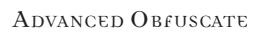
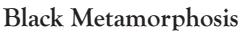

complex minds are harder to cure. If you succeed, you alleviate one of the target's derangements. Although a Malkavian can never be cured of his core problem permanently, this power can affect even such madness, temporarily removing the derangement for the rest of the scene or the next hour (whichever comes first). Other subjects are relieved of the burden of insanity permanently.

*Mens Sana* cannot be used to cure your own derangements.

advanCed oBeah

### **Unburdening the Bestial Soul**

Perhaps the most incredible power of *Obeah*, *Unburdening the Bestial Soul* allows you to lift the terrible stains of the vampiric Curse from the soul of a target. You literally take the subject's soul into communion with your own, soothing the psychic scars and trauma that afflicts the victim. Though you cannot remove the Curse of Caine from a subject, you can heal the most terrible emotional trauma that weighs down most vampires.

When you remove a soul for healing with *Unburdening the Bestial Soul*, the subject's body is devoid of consciousness. As a result, the empty shell cannot be affected by Mental or Social Disciplines, as there is no personality to affect. However, it does make a perfect host for wandering spirits or ghosts. Unless possessed by an outside consciousness, the body automatically follows your simple verbal commands as long as you hold the soul. Without free will, though, the body cannot perform any task but autonomic functions unless you direct it specifically.

*Unburdening the Bestial Soul* functions only on a willing subject, and you must make eye contact with the target. Then, you make a Static Physical Challenge against the subject — the difficulty is two Traits for every Humanity/ Path Trait that the subject falls below six (a subject with three Humanity Traits, for instance, has a static difficulty of six Traits). This power only functions on vampires with Humanity Traits, or on the Paths of Harmony or Honorable Accord, and it cannot affect a subject who has no remaining Humanity/ Path Traits.

Once you remove a subject's soul, you can expend permanent Willpower Traits to restore Humanity/ Path Traits on a Trait-for-Trait basis. You can restore the subject up to the normal maximum of five Traits.

If you fail to care for the subject's body while holding the soul, or try to hold the soul after the subject wants to return to his body, you risk losing your own Humanity (make a *Conscience/ Conviction* Virtue Test, difficulty four Traits). The soul can make a Mental Challenge against you once per night to break free in such a case.

You cannot use *Unburdening the Bestial Soul* to restore your own Humanity/ Path Traits.

# oBFusCate

As creatures of cunning, intrigue and misdirection, Cainites possess an uncanny knack for deception and stealth. For some, though, this ability goes far beyond normal subterfuge. Such vampires actually cloud the minds of people around them, dulling notice and directing attention elsewhere. As a result, these vampires can remain obscured from observation, perhaps even extending their concealing powers to other objects and people.

The powers of *Obfuscate* are often employed by the Assamites in their assassination work, and by the Followers of Set, who surreptitiously ferret out secrets and watch over their quarry. Malkavians use this power to escape notice when engaged in their insane activities. The undisputed masters of this Discipline, though, are the Nosferatu, who use its mind-numbing powers to gather secrets and hide their fearful countenances.

Because *Obfuscate* clouds the awareness of its targets, they avoid notice of a concealed individual and to rationalize away such attention unless it is forced on them. Thus, if a vampire is concealed with this Discipline while wandering about a room, people avoid

her subconsciously. If she sits in a chair while hidden, others ignore the chair, taking other seats or standing but failing to notice her innocuous presence or the "mysteriously empty" seat. This concealment is generally broken if the hidden individual deliberately interacts with the environment, by picking up or dropping something, speaking to someone, touching a person or manipulating an object — the amount of concealable activity varies with this Discipline's power, as shown in the individual levels. The concealment of *Obfuscate* functions against all of the senses, because it actually forces attention away from the hidden individual. Thus, the presence of a Nosferatu wandering about with *Unseen Presence* is not betrayed by any telltale odor of the sewers.

Cross your arms in front of your chest to represent your use of *Obfuscate*, displaying a number of fingers on each hand corresponding to your highest level of power (one for Basic, two for Intermediate, three for Advanced).

The Discipline of *Auspex* can sometimes be used to pierce the veil of *Obfuscate*. An individual with *Auspex* (or a similar power of supernatural sensitivity) may penetrate *Obfuscate* if he is already looking for hidden individuals. The searcher may engage in a Mental Challenge with the hidden subject. For each level of difference between the subject's *Obfuscate* and the searcher's *Auspex*, there is a Trait modifier on a one-forone basis to the outcome of ties or overbids. If the searcher wins, then he pierces the *Obfuscate* and senses the hidden vampire normally. If the concealed individual wins, the searcher remains oblivious to her presence. Thus, if a vampire with *Vanish from the Mind's Eye* (an Intermediate power) uses *Obfuscate* while trying to evade a vampire with only *Heightened Senses* (a Basic power), the hiding vampire gains a two-Trait bonus on the Mental Challenge, and if successful, he remains unseen. This bonus applies even if the sneaking vampire uses a lower level of *Obfuscate* than he actually possesses, so using *Unseen Presence* is still potent against low levels of *Auspex* if the vampire actually has Intermediate or Advanced *Obfuscate*. Similarly, simple *Heightened Senses* and the like gain the full benefit of the vampire's best level of *Auspex*, so a vampire with *Psychic Projection*  is extremely difficult to fool, even if only using the Basic levels of sensory powers.

*Obfuscate* powers last as long as they are maintained, and they generally require no particular effort. These powers conceal the user and everything worn or carried. The *Stealth* Ability is used for retests by augmenting the Discipline with natural shadows and concealment. Hidden individuals cannot use Willpower to defend against *Auspex*  challenges to *Obfuscate* (they cannot "will" themselves into a more hidden state).

BasiC oBFusCate

#### **Cloak of Shadows**

By remaining still and relying on natural cover, you can blur the apparent lines of your form and make it difficult for people to notice you. While nobody is watching, you can use cover to fade from view. As long as you remain completely silent and unmoving in a shadowed place or behind some sort of cover, you may cross your arms in front of your chest to represent the use of *Obfuscate*. While thus hidden, nobody but a Cainite using *Auspex* (or another supernatural creature with similar sensory acuity) can spot you. This concealment vanishes immediately if you move, speak or interact with your environment in any fashion.

### **Unseen Presence**

Your powers of concealment allow you to fade from view, and then to wander about while remaining unnoticed. Any time that you are hidden from sight, you may invoke this Discipline, crossing your arms in front of your chest to represent *Obfuscate*. Once concealed, you may move about at a walk and remain unnoticed. This concealment remains as long as you do not speak, make any loud noises or interact with your environment — you can wander about unnoticed, but you automatically become visible if you open a door, attack a person, exert the *Presence* Discipline or knock over a vase, for instance.

# **Mask of a Thousand Faces**

By twisting perceptions around you, you cause others to see you not as you really are but as someone different from your actual physical appearance. Generally, this power causes people to ignore your features, making you unassuming and average. However, with concentration, you can assume a specific hallucinatory visage, or even copy the features of another individual.

While using the *Mask of a Thousand Faces*, your features seem bland and unremarkable. Most often, people will describe you in vague, general terms relating to your normal appearance, but without any specifics, unique features or details. (Nosferatu and Samedi in particular find this power useful for assuming a semblance of their mortal countenances.) If you expend a Mental Trait, you may assume a specific set of features instead, causing those who look on you and who do not pierce your disguise to see, hear and smell the form that you choose. Thus, you can make your hair seem to be of a different color, change your apparent facial features, or seem to exude the smell of a specific perfume (or no smell at all). Note, though, that this power does not change the appearance of anything that you wear or carry — only your physical features are obscured. A *Mask of a Thousand Faces* remains until you fall asleep, are knocked unconscious or torpid, or are killed.

You still use your normal Social Traits while using the *Mask of a Thousand Faces*. You can copy an image of fewer Traits deliberately, but if you hope to masquerade as someone with more Social Traits, you must expend Blood Traits to match that person's total Social Traits. Otherwise, your appearance and mannerisms mysteriously fail to convey the person's countenance properly. You cannot use the *Mask of a Thousand Faces* to assume more Social Traits than your generation would allow you to possess, so you may have difficulty duplicating the incredible grace of an elder. In either case, you still use your normal Social Traits; the assumption of the *Mask of a Thousand Faces* merely causes you to appear like someone of more or less social acumen and appearance.

## **Vanish from the Mind's Eye**

The incredible powers of your stealth allow you to remain hidden even while speaking or moving about. You can even fade from plain sight, disappearing from the view of any onlookers.

When using *Vanish from the Mind's Eye*, you gain all the benefits of *Unseen Presence*, but with some additional power. You may vanish from view at any time, without having to seek cover. To do so, you simply declare your intent, and then make a mass Mental Challenge against any onlookers (regardless of *Auspex*) who care to challenge your powers — you bid one Mental Trait for each onlooker, and throw one symbol against all of them. If you succeed, you fade away, unnoticed by anyone. Even if some people notice you, you can attempt to fade from their view again on consecutive turns. Fading away with *Vanish from the Mind's Eye* does not count as an action, but it happens only at the end of a turn. Thus, if you strike someone and then attempt to disappear, you must wait until the end of the turn.

Additionally, you may speak aloud while using this Discipline, and still attempt to remain hidden. Again, if you speak, you must make a mass Mental Challenge against everyone trying to detect your position, regardless of *Auspex*. Anyone losing to you fails to locate you, simply hearing a disembodied voice; those who best you manage to pierce the veil of your *Obfuscate*. You still cannot remain invisible while interacting physically with your environment, screaming, exerting *Presence* or attacking, but you could take such an action and then try to fade away, as described previously.

# **Cloak the Gathering**

Your powers of concealment extend beyond your own form. With an effort, you can throw your disguising powers over several people, hiding them all from view or masking them with hallucinatory guises.

To use *Cloak the Gathering*, you must spend one Mental Trait for each subject cloaked. You can then exert any *Obfuscate* power that you possess over the targets. Thus, you could choose to spread several *Masks of a Thousand Faces* over your allies, making them all look like different people (or even making some look like clones), or you could shroud a group with *Vanish from the Mind's Eye*, causing them all to fade from view. When you exert this power, you must meet all of the normal conditions for the *Obfuscate* that you extend — you cannot cast *Cloak of Shadows* over someone who is not hidden behind cover or shadows, for instance. If you cause a group of people to *Vanish from the Mind's Eye*, you need only make one Mental Challenge to extend the effect over your entire group. Anyone who bests you sees through the cloak, while anyone who loses to you fails to notice anyone under the cloak. You can only cast out a power that you are using, and you can only extend one power at a time.

Individuals under the effects of *Cloak the Gathering* still sense one another normally. Of course, a cloaked individual could use his own *Obfuscate* powers to remain unnoticed to other people under the cloak. If an individual under *Cloak the Gathering*  violates the provisions of his loaned *Obfuscate* in some way (say, by launching an attack), then he immediately loses the benefits, but the cloak itself remains intact. Only if you violate your *Obfuscate* does the cloak fail. Similarly, if a character with *Auspex* attempts to breach your concealment, individuals noticed under the cloak do not compromise the protection for everyone else, but if you are noticed, then the entire cloak fails.

*Cloak the Gathering* only throws your *Obfuscate* over other creatures or entities. You cannot use *Cloak the Gathering* to shroud a house, for instance, but you can certainly conceal a small group of vampires and all that they wear or carry.

# oBteneBration

The bailiwick of the Lasombra clan, the *Obtenebration* Discipline summons forth and shapes a strange, cloying darkness. This darkness is wholly unnatural. It mutes sound, absorbs light and sometimes seems to have a tangible substance. Some Cainites claim that this darkness is a reflection of the primordial void before Creation, while others hold that it stems from the vampire's blotted soul. Whatever the source, this shadowstuff is certainly terrifying to those unused to its manifestations.

Any given vampire can see through her own *Obtenebration* darkness automatically without penalty, unless otherwise noted. Creations of other users of the Discipline are just as impenetrable to other Cainites with the power, though.

*Occult* retests are appropriate for the *Obtenebration* Discipline's powers, though shades used in a more mundane fashion (like attacking or grappling) should use the appropriate Abilities (like *Brawl* or *Melee*).

BasiC oBteneBration

#### **Shadow Play**

You can exert a limited degree of control over existing shadows and darkness. At your mental command, darkness can be made to deepen or retreat, lengthen, move, flicker or undulate disturbingly. Though you can only affect a limited area of shadow, the stuff takes on a hellishly cloying quality and bends to your supernatural will.

You must expend a Blood Trait to use *Shadow Play*; once activated, it lasts for the duration of the scene or for an hour. You can affect one individual with the flapping,

disconcerting shades of this power. If you choose to conceal yourself, you gain one bonus Trait in all challenges of stealth and ranged combat. By pulling shadows around you into a terrifying mantle, you may alternately gain one bonus Trait in all challenges of intimidation. If you decide to afflict a victim with flapping, twisting shadows, the subject suffers from the Negative Trait Clumsy due to the distraction, and is disconcerted and asphyxiated by the darkness. A mortal enveloped in this fashion may even be strangled; a mortal with three or fewer current Physical Traits loses one Physical Trait every turn, and then loses one health level per turn as long as the morass continues to attach to her. Should the mortal lose all of her health levels in this fashion, she chokes to death.

Directing the shades of this power to conceal or surround you is automatic, but attacking an individual with the strangling shadows requires a successful challenge of your Mental Traits versus the target's Physical Traits.

### Shroud of Night

You can evoke a cloud of inky blackness, a blob that absorbs all light and distorts sound. Hovering preternaturally in the air, this globe feels like a heavy morass to all those engulfed within.

You need only expend a Blood Trait to create a sphere of blackness roughly 10 feet in diameter. You can even create the cloud in a location outside of your line-of-sight, at the cost of one Blood Trait, as long as it is within 50 feet of your location. Victims enveloped in this globe suffer the Negative Physical Trait Clumsy while they are engulfed, and mortals with five or fewer current Physical Traits may be strangled, like the power of Shadow Play. (The Trait penalties and strangling damage from this power are not cumulative with Shadow Play, though.) You can even cause the tenebrous cloud to move at a speed roughly equal to a walk, as long as you concentrate fully on such motion.

Inside the *Shroud of Night*, all light sources other than fire are extinguished and sound is muffled. All victims of the cloud (except yourself and those with some means of seeing through *Obtenebration*) suffer the penalties of total darkness: They lose two Traits in resolution of challenges, and they are forced to make a single retest on any successful challenge because of the darkness. Even those with *Heightened Senses* and *Eyes of the Beast* are affected; each removes one penalty Trait from the effects of the cloud (the forced retest is not removed).

Your *Shroud of Night*, once created, lasts for the entire scene or hour, or until you dispel the darkness to whatever nether region from which it came.

Intermediate Obtenebration

#### Arms of the Abyss

From the shadowy corners of a room or the blackness of night itself, you can summon forth tentacle limbs that flail about, ensnaring or attacking as you desire. These black shadow tentacles animate as you direct, even while you take other actions. You can pull many tentacles from a single source, or generate shades from several locations at once.

You must expend a Blood Trait to create the shadow tentacles; every tentacle created costs one Social Trait. The tentacles are six feet long and they possess three Physical Traits and four health levels. Each additional Blood Trait spent in the creation can gift one tentacle with an extra Physical Trait, or increase one's length by an additional six feet.

Once created, your shadowy tentacles remain for the duration of the scene, unless you dispel them or fall into unconsciousness or torpor. You can control the actions of the tentacles even while performing other actions. The tentacles can grab, whip, hold items and perform other tasks with precision. The tentacles take damage normally from attacks, and they suffer from fire and sunlight just like a vampire, though they are considered to have any *Fortitude* that you may possess. You can add your *Potence* to the might of the tentacles as well, though not at the same time as you are adding your *Fortitude*. You may not combine the effects of *Obtenebration* with the powers of any other Disciplines.

Spewing forth your own stained inner spirit, you meld your corpselike body with the very stuff of tangible darkness. Your head and limbs seem to fade into shadow, while bands of blackness striate your body and shadowy tentacles sprout from your torso.

You must expend two Blood Traits and a Social Trait to evoke this power. You immediately sprout four tentacles just like those of the *Arms of the Abyss* power, though they are considered extensions of yourself and they use your Traits. The chilling darkness about your body and infusing the tentacles afflicts anyone you touch with the Negative Trait *Clumsy* as their limbs are numbed with supernatural cold. You may make one additional attack at the end of each turn by using the tentacles, in addition to any strikes that you normally gain or make with *Celerity*  (this extra attack is added to your attack sequence, not multiplied if you have extra actions). You gain the bonus Traits *Intimidating* x 3 while taking on this demonic aspect. Lastly, you suffer no penalties from any sorts of mundane darkness.

The *Black Metamorphosis* lasts for one scene or one hour.

advanCed oBteneBration

#### **Tenebrous Form**

At this level of skill, you no longer summon forth the darkness within yourself — you *become* it. Your form collapses into a shadowy outline, a pseudo-liquid humanoid shape of utter blackness. While in this form, you can slither about through tiny holes and cracks, and you may see through any normal darkness.

You must expend three Blood Traits and spend three full turns in concentration, doing nothing else, in order to make this transformation. While in *Tenebrous Form*, you cannot be harmed by physical attacks, although you still take damage from magic, fire and sunlight. You also cannot affect your surroundings physically, as you have no real solid substance. By enveloping a victim, though (with your Mental Traits challenging his Physical Traits as an attack), you can perform the same functions as the *Shroud of Night* power, causing disorientation, darkness and smothering. You are unaffected by gravity, and you can slither along any surface or move like a blob of ambulatory liquid. You can even use mental Disciplines while in this state, though within the limitations of your form — you have no eyes and thus cannot use *Dominate*, but you could hide your shadowy form with *Obfuscate*. In this shadow form, your Blood Traits are the same sort of inky darkness, and thus, they are unaffected by the powers of *Thaumaturgy*.

While in *Tenebrous Form*, fire and sunlight are exceedingly painful to you; thus, you suffer a one-Trait penalty on resolution of *Courage* Tests.

# potenCe

All vampires are capable of preternatural strength by human standards, simply through the use of blood. With *Potence*, though, this strength extends far beyond such measures. The inhuman might of *Potence* is sufficient to allow a vampire to break bones, shatter stone, even heft and destroy heavy or resilient objects. Vampires using *Potence* in battle are fearsome indeed, delivering telling blows that fell even their undead adversaries.

Most uses of *Potence* above the Basic levels are considered a breach of the Masquerade among Camarilla Kindred.

The *Potence* Discipline is most commonly known by the Brujah, Giovanni, Lasombra and Nosferatu clans, all of whom prize physical strength and prowess. As *Potence* is a highly useful capability and requires little effort on the part of the vampire in question, many Cainites seek out tutors in this Discipline.

The *Potence* Discipline, as a physically augmenting Discipline, does not use any Ability for retests other than the Ability commonly associated with whatever

use the normal *Brawl* Ability for retesting.

BasiC potenCe

#### **Prowess**

You have unearthed a level of strength unusual in vampires. Where others would flag and fail, you redouble your efforts. Your mighty blows land with a force that kills even the hardiest mortals.

With *Prowess*, all of your unarmed or clubbing attacks inflict lethal damage instead of bashing damage, if you so desire. Furthermore, once per game session, you may recoup your lost strength, restoring all used Physical Traits of *Brawny*, *Ferocious*, *Stalwart*, *Tough* and *Wiry*. You must restore all of them at once — if you have some Traits of the appropriate type unused when you invoke *Prowess*, you cannot restore them later. Using *Prowess* costs nothing, and it does not count as an action; it may be done at any time.

#### **Might**

Your strength daunts even other Cainites. Few would dare to cross you in a test of physical power. You are far more likely than the average vampire to succeed in challenges of strength.

With *Might*, you may make a single retest on any challenge of sheer physical strength. Thus, if you are grappling, picking up a heavy object or breaking something, you can use *Might* as a retest. Once you invoke *Might*, it is the last test of the challenge; no further retests are allowed. *Might* costs nothing to use.

You may use *Might* even if your opponent attempts to evade your strength. Your power is so startling that even an opponent who attempts to outlast you with stamina or to dodge you with quickness can be overcome, as long as you rely solely on your strength. Doing so generally requires you to bid a strength-related Trait, such as the types of Traits restorable with *Prowess*. Obviously, if you cannot exert your *Might*, you cannot make this retest — thus, you cannot use *Might* at range, with a thrown object (requiring speed and accuracy). You could use *Might* while trying to grab at a dodging opponent, but not when picking up and throwing a heavy object.

intermediate potenCe

#### **Vigor**

Your vampiric strength is truly monumental. You can heft hundreds of pounds with ease, deliver enough force to crush bones in a single blow and hammer down any opponent of lesser strength.

When you possess *Vigor*, you may use the Bomb in challenges of strength. The Bomb is a closed fist with the thumb sticking up. The Bomb defeats Rock and Paper, ties with other Bombs and loses to Scissors (the fuse is cut). You are not required to use the Bomb, but you must always state before a Physical Challenge that you are capable of doing so. Using *Vigor* costs nothing. Your use of *Vigor* requires you to use only your strength; your opponent may try to defend with stamina or speed, but his doing so does not prevent you from using the Bomb.

# **Intensity**

Your titanic strength never fails you. Unless sorely pressed or wounded, you can continue incredible feats indefinitely.

Whenever you enter a challenge of strength, you may use *Potence* as your bid Trait. This Trait does not count toward totals when resolving ties or overbids, but it can never be lost; thus, you may continually use *Potence* in successive tests of strength. Only if you are forced to risk multiple Traits — such as due to wounds or Negative Traits — do you risk losing any of your other Physical Traits.

have been completely exhausted, you can no longer enter challenges.

Advanced Dotence

#### Puissance

No mortal can match you, and even vampires tremble at your touch. The strength of your dead limbs is truly monumental, crushing anything that stands before you.

With Puissance, you win all ties in tests of strength automatically. You need not compare Traits at all, unless some other factor would cause you to lose ties (such as wounds) or give the opponent the ability to win all ties as well (such as Fleetness).

Furthermore, your incredible strikes inflict an additional health level of damage in combat. This bonus applies to any attack in which your strength is a factor — unarmed combat or combat with melee weapons. However, use of this incredible strength almost certainly breaks weapons that are not specially designed to stand it.

## Dresence

To many, vampires seem to exude an air of command, sensuality or intimidation. For a master of *Presence*, emotions are playthings to be manipulated and stimulated. When many Cainites survive through careful manipulation of mortal society, the ability to sway emotions and control passions is a powerful capability indeed. More than simply using intrigue or carefully rehearsed acting to influence others, vampires with *Presence* literally project auras of power or dread.

The Presence Discipline is most common among vampires of the Brujah, Follower of Set, Toreador and Ventrue clans. Brujah often use *Presence* to whip mobs into righteous anger, while Followers of Set influence their "customers" subtly. Toreador cultivate an air of artistic beauty, and Ventrue rely on their control of emotions to influence and rule their "subjects."

Unlike Dominate, which affects the rational mind directly. Presence affects emotions. Thus, it is a more subtle form of control. However, subjects of Presence are less predictable than Dominate victims. Also, whereas Dominate requires that the victim see the user's eyes, Presence usually requires only that the user's face be visible – some Presence powers do not even require that much exposure.

Retests with Presence use the Leadership Ability.

BASIC DRESENCE

#### Awe

The sight of you turns heads. When you let your charisma shine, you draw attention naturally. People try to be close to you, and even those disinclined to listen to you give some consideration to anything you say or do.

When you are involved in a Social Challenge, you may expend one Social Trait to invoke Awe, gaining an automatic retest. You may only use this power once per Social Challenge. You may use Awe in a mass challenge, but you must expend one Social Trait for each person retested against.

#### Dread Gaze

By hissing, baring your fangs and allowing your vampiric features to rise to the fore, you can terrify mortals and even shake the resolve of other vampires. Though few would risk the wrath of an angry Cainite, your fearsome visage goes beyond that, driving supernatural terror into the hearts of your victims.

By making a Social Challenge against your foe, you strike terror into your victim. If you succeed, the subject flees your presence and tries to avoid you for the rest of the scene or hour. If cornered, the victim will still defend himself, but he will do his best to escape you. The subject defends himself normally, but he must risk an additional Trait if he wishes to attack or act against you, just as if he were wounded.

intermediate presenCe

#### **Entrancement**

When you bring your charm to bear on an individual, you are almost hypnotically magnetic. Individuals affected by your *Presence* find your manner irresistible.

You must make a Social Challenge against a target to exercise *Entrancement*. If you succeed, the target is favorably disposed toward you, and she will not insult or attack you for the rest of the scene (or for an hour). Indeed, a formerly neutral subject wants to aid you and act as your friend; even a previously hostile target is rendered neutral. If you take a hostile action against the subject, of course, the *Entrancement* is broken immediately, and it may not be used against the subject again in the same scene.

#### **Summon**

Extending your incredible manipulative powers, you can draw others to your location. Your victim need not see you, or even be seen by you — as long as the subject is known to you, you can *Summon* him to your side. Once called, the subject tries to get to you by whatever means possible, completely unaware of the supernatural nature of the desire and avoiding situations that would prevent fulfilling the compulsion (like locked rooms and overprotective allies). The compulsion lasts until the victim manages to arrive and make his presence known to you.

To *Summon* someone, you must ask for a Narrator's assistance. Inform the Narrator of the person that you wish to *Summon*, as well as your number of Social Traits and whether you are using the *Leadership* Ability. The Narrator then finds the subject, performing a Social Challenge in your stead and using the *Leadership* Ability for a retest if necessary. If the challenge succeeds, the subject comes to you as previously described. If the challenge fails, the subject manages to resist the *Summon*. In either case, you have no knowledge of the outcome, so there is no guarantee of success. Of course, if the subject does not appear, you can wait five minutes and then attempt to *Summon* the victim again.

You can only Summon someone that you know — at bare minimum, someone that you have had the chance to talk with for a few minutes, or someone who has been a target of your *Presence* powers before. If another individual then uses *Summon* on your subject, the victim heads to the summoner of the most powerful generation; if multiple summoners are of the same generation, the victim goes to the first one to exert the power. Should two vampires of equal generation simultaneously *Summon* the same victim, then the Narrator should make a Social Challenge between the two, with the victim heading to the victor.

In the unusual case that *Summon* is used on a false identity (an identity created with *Mask of a Thousand Faces*, for instance), the *Summon* still brings the appropriate individual. If multiple individuals use the same false identity, then the first *Summon* calls whichever is nearest (generally, whichever one a Narrator finds first), and any further *Summon*s then call the same individual. Thus, if three Malkavians using *Mask of a Thousand Faces* all pretend to be the same imaginary person, a *Summon* of that person brings whichever of the Malkavians is nearest and then calls that Malkavian for any future uses of *Summon*.

advanCed presenCe

#### **Majesty**

The force of your personality makes even the most stalwart tremble. When you exert your *Majesty*, heads bow, hearts break and spines quiver. None would dare to challenge you or risk your ire, for your ambiance is without peer.

By expending a Willpower Trait, you exert your *Majesty* for the duration of a scene or a full hour. You can represent this power's effect by holding your arms out from your sides, or with a special card or ribbon. As long as you have *Majesty*, nobody may insult you or attack you as long as they are within 10 feet of you and able to see you. A subject may attempt to break through your *Majesty* by making a Social Challenge against you, but must spend a Willpower Trait to make the attempt. Failure means that the subject cannot challenge your *Majesty* again in the same scene.

If you attack someone or undertake a hostile action while using your *Majesty*, the aura fades automatically and immediately as your onlookers are startled or outraged. You may still use your Social and Mental Disciplines as long as they do not inflict direct harm — you may still *Entrance* or *Dominate* a subject — but a deliberate attack disrupts your *Majesty*.

When attempting to penetrate *Majesty*, a Willpower Trait may be used for a retest. This is an exception to the normal rule that Willpower is used only to defend against Mental and Social Challenges.

# protean

Survival in the wilds is difficult indeed for vampires, who must find means to avoid sunlight, hunt and evade marauding Lupines. The shapeshifting Gangrel, though, have mastered this craft, and their *Protean* Discipline is thought to be a large factor in their success. With *Protean*, the vampire can alter parts of her body to draw on the strength of natural forces.

Retests for *Protean*, if applicable, should use the *Survival* Ability.

BasiC protean

### **Eyes of the Beast**

With a moment's pause, you can make your eyes able to see in absolute darkness. An eerie red glow emanates from your eyes, and you can see perfectly well in pitch-blackness.

You need only declare your intent to use *Eyes of the Beast*, and at the end of the turn, the change is complete. You suffer no penalties at all for natural darkness while using this Discipline. However, you do suffer the Negative Trait *Bestial* due to your red, glowing eyes, unless you take steps to conceal them (most commonly, with sunglasses). Using this power is also a rather obvious breach of the Masquerade.

### **Feral Claws**

Like a wolf or bear, you have powerful claws capable of rending flesh. You can grow these claws at will with a simple effort; they sprout mystically from your otherwise normal hands, and similarly retract when you desire.

By expending a Blood Trait, you cause *Feral Claws* to extend from your hand (and feet, if you so desire) at the end of the turn. These claws have the bonus Trait *Sharp*, useable in combat or in climbing, and they inflict aggravated damage.

intermediate protean

### **Earth Meld**

For a traveler in the wilds, *Earth Meld* is an invaluable power. With this Discipline, you sink into the bosom of the earth, able to sleep mystically undisturbed within the soil.

You must be touching raw soil to *Earth Meld*; you cannot sink through stone, wood, concrete or other substances. You immediately begin sinking eerily into the earth itself, taking with you only your clothing and small personal possessions that you carry (such as a cellular phone or a small pistol). Using the power protects you completely from daylight and allows you to sleep undisturbed. You remain unaware

