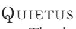

of what transpires around you, and indeed, you are not fully of the material world at all. While in this state, you cannot move, except to rise at will.

While bonded with the earth, you remain in a semi-tangible state, partially diffused into spirit by your connection to the soil. Thus, you cannot be readily detected either physically or with spirits. If you patch of soil is disrupted in any fashion, you immediately return to physical form and complete wakefulness, shooting up to the surface and showering dirt in all directions. You cannot act during the first turn that you rise from the soil in this fashion, though if you rise up of your own accord (which you may do at any time), you are fully aware and able to act normally.

You must expend a Blood Trait to *Earth Meld*. Sinking into the ground requires a full turn, during which time you can do nothing else (because you are descending slowly into the ground).

## **Shape of the Beast**

Ancient tales of vampires tell that they assume the forms of wolves and bats. Though most vampires consider this nonsense, elder Gangrel sometimes possess the transmutive power to change into animal forms. With *Shape of the Beast*, you can shift your physical body into that of an undead beast, mimicking a normal animal. Most vampires change into wolves or bats, though some possess different forms dependent on their cultural and geographic ties — jackals in Africa, dingoes in Australia or giant rats in major cities have all been reported.

 Shifting into animal form costs one Blood Trait and takes three full turns (each additional Blood Trait spent lowers the transformation time by one turn, to a minimum of one turn with three Blood Traits). You remain in beast form until the next dawn, or until you decide to change back. Clothing and small personal possessions change with you.

In animal form, you can use any of your normal Disciplines except *Necromancy*, *Serpentis*, *Thaumaturgy* and *Vicissitude* (the inability to speak may make *Dominate*  difficult, of course). Wolf form grants you the bonus Mental Traits *Alert* and *Attentive*, as well as the effects of *Feral Claws* and improved running speed. Bat form grants you flight capability and the benefits of the Merit: *Acute Hearing*, though you possess a maximum of three Physical Traits in that form.

The animal forms granted by this power are in all ways physically identical to normal animals, though of course they are dead, animated corpses as befits a vampire.

advanCed protean

## **Mist Form**

Your control over your physical form is so complete that you can dissolve into a fine cloud of mist. You disperse into a floating cloud, still able to sense your surroundings and able to move about as you desire. This cloud form can slip through tiny cracks and holes, and it cannot be dispersed by the mightiest of natural winds.

Assuming *Mist Form* costs one Blood Trait and takes three full turns (additional Blood Traits reduce this time at a one-for-one cost, with a minimum of one full turn at three Blood Traits). You may change back instantly at any time. You are immune to mundane physical attacks in this form, and you take one less level of damage from fire and sunlight automatically. You are still affected normally by mystical attacks, though of course you have no blood in this form, so much of *Thaumaturgy* is useless against you. Though you cannot affect the world physically, you can still use Disciplines that do not require a physical form (you cannot use *Dominate*, for instance, because you have no eyes, but you could exert *Presence*). While in *Mist Form*, you may move as desired at the pace of a brisk walk, although you can be pushed about by strong winds.

The deadly assassins of the Assamite clan study the *Quietus* Discipline. By transmuting their blood into poison, they deliver death to their targets in terrible silence and agony. This Discipline has become significantly altered since the report of the broken blood curse, and those Kindred familiar with the clan whisper that such powers have not been seen in centuries.

Though many uses of *Quietus* may involve striking with a blood-covered hand or spitting vitae at one's foes, this transformed blood is more of an alchemical poison than a form of vitae. Thus, blood used with this Discipline cannot later be gathered and used to form blood bonds or as a focus for *Thaumaturgy*.

Most *Quietus* powers are not directly opposed, so they do not use retests. Using *Quietus* with a physical attack, for instance, simply involves the normal uses of *Brawl*, *Melee* and similar Abilities in the attack. If spitting blood at an opponent (a function of several different powers), use *Athletics* for a retest.

BasiC Quietus

## **Silence of Death**

The first skill learned by a true assassin is the ability to travel in complete stealth. The mystical *Silence of Death* permits you to extend a field of silence about yourself, blocking all screams, gunshots, explosions and so on.

When you use *Silence of Death*, you muffle all sound within 10 feet of yourself. Although sound from outside can still come into this radius and be heard, no sound emanates from anything or anyone close to you. Using this power costs one Blood Trait to invoke, and the effect lasts for a scene or an hour.

## **Scorpion's Touch**

With the deadly venom and toxins of your studies, you can transmute your blood into a substance that weakens and poisons your victims. You can then coat weapons with this foul ichor, spit it at your foes or simply bring it to the surface of your skin to affect your victim by touch. Unwary foes may actually drink such tainted vitae.

Each Blood Trait that you spend on this power is converted into a dangerous poison. If this tainted vitae touches a victim or is otherwise ingested into her system, she loses one Physical Trait automatically. Thus, you can strike someone with your hand (and a Physical Challenge) and cause the victim to lose an additional Trait due to your venom. You can coat weapons of dagger-size or larger with this poisonous blood, or even kiss your opponent. You can even make a Physical Challenge against anyone within 10 feet to spit this blood at a victim. (Do not actually spit at your foe, of course — simply make your intentions known before making the challenge.)

Mortals who lose all of their Physical Traits in this fashion become deathly ill by the next night, and they do not heal normally. See the effects of severe illness in **Laws of the Hunt**. Otherwise, all lost Physical Traits return at the next game session, as usual.

Any given attack may only use one Trait of blood with this power, though multiple attackers with poisoned weapons could wreak deadly havoc on a single victim. Similarly, you can only spit a single Trait of this tainted vitae or strike unarmed with a single Blood Trait in each action. Altering your blood in this fashion does not require an action on your part — you can strike an opponent with your hand, for instance, and then declare the use of *Scorpion's Touch* with a single Blood Trait. You can concentrate multiple Blood Traits onto a single weapon, though each strike uses only one Trait of blood (and thus reduces only one Physical Trait from the victim). Of course, preparing yourself thus is a legitimate tactic if you think you will be in a protracted fight and you want a weapon sufficient for several strikes.

## **Dagon's Call**

With a touch, you can infect a victim with a small quantity of your own vitae; later, with a bit of concentration, you cause that very blood to burst forth from the victim, tearing her apart from the inside.

You must touch your target physically before using this power (which may require a Physical Challenge). Thereafter, at any point in the same scene or within the next hour, you can issue *Dagon's Call* — you need not even be able to see the target. You expend at least one Willpower Trait and call for the aid of a Narrator. Each Willpower Trait that you spend at that point then forces the target to make one Static Physical Challenge; the Narrator will take note of your Physical Traits and go to perform the tests against your subject. Each test that the victim fails indicates one level of lethal damage as her very blood tears its way through her vessels and organs. You must declare all Willpower Traits that you expend at once; once you have activated this power, you cannot invoke it again on the same subject until you manage to touch her again.

## **Baal's Caress**

The toxins in your vitae are sufficient to burn through any flesh, living or undead. This poison melts through flesh once it comes in contact with the bloodstream, leaving other materials unharmed. Indeed, even Cainites without blood in their systems can be affected if the poison enters through a wound.

To use *Baal's Caress*, you must spend a turn to transform your vitae into poison and then put that blood on an object or weapon of dagger-size or larger. Each Trait of blood so placed on a bladed or piercing weapon causes that weapon to inflict aggravated damage with one strike. Thus, if you place three Traits of blood on a knife with this power, then the next three successful strikes with the knife inflict aggravated wounds. The weapon in question must penetrate the victim's flesh with a successful blow; blunt weapons or unarmed strikes, for instance, cannot use this vitae with any appreciable effect. Blood cannot be placed on bullets; not enough can be applied for appreciable damage, and most of it will be lost during the flight and initial impact.

Note that you must actually place this blood on something and it must enter the target's system in order to have any effect. You cannot randomly bleed on a subject and inflict damage.

## advanCed Quietus

## **Taste of Death**

Your concentrated blood is so powerfully toxic that you can merely spit it at a foe and watch it burn through her skin. The ichor evoked with this power does not affect metal or stone, but melts through flesh and bone, reducing it to smoking sludge.

You can spit a single Blood Trait at a victim with this power (this counts as a single action). If you successfully strike with a Physical Challenge, the victim takes one level of aggravated damage. You must directly spew this blood out; if it misses the victim or is placed on an object, it loses its toxicity within the turn. Note that the blood must be deliberately converted into a poison in this fashion — your own blood can still be drained from your body without poisoning the drinker.

# serpentis

The Followers of Set use *Serpentis*, a power connected with the snakes that are the hallmark of Set's worship. The uncanny capabilities of this Discipline are disturbing indeed, marking the Follower as something far different from human — or even from other vampires. Despite the cold, reptilian features of this Discipline, many of its manifestations are strangely alluring. Followers of

Set attribute this facet to their capacity to sway the emotions of their victims, digging out buried secrets and bringing hidden vices to the surface.

Most *Serpentis* powers involve no challenge to use, or are simply used with combat. Any power used for a direct challenge should use *Subterfuge* for a retest.

BasiC serpentis

## **The Eyes of the Serpent**

The legendary hypnotic gaze of the serpent is yours. When you meet the gaze of a victim (who need only be able to see your eyes), your eyes become gold with large black irises, capturing the attentions of your subject. As long as you hold the gaze of the target, he remains completely immobilized.

You must make a Social Challenge to affect your target with this power. If you succeed, the target is paralyzed as long as you hold his gaze with your own. Of course, if the target is attacked or injured, the hypnotic spell breaks.

## **The Tongue of the Asp**

At will, you can cause your tongue to shift in shape to that of a snake. The supernatural razor-edge on the forked tongue inflicts terrible wounds, striking up to a foot and a half away, and it even lets you drink blood from your victims.

You need only decide to use *The Tongue of the Asp* in order to gain the benefits of this power. Your tongue inflicts one aggravated wound with a successful strike (requiring a Physical Challenge); furthermore, on successive turns you can drain blood from the victim as if drinking directly. This draining even causes the Kiss, paralyzing mortal victims with helpless fright and ecstasy.

*The Tongue of the Asp* is highly sensitive to vibrations. Using this Discipline while in darkness allows you to reduce the penalty Traits for natural darkness by one.

intermediate serpentis

## **The Skin of the Adder**

The power of your reptilian blood allows you to erupt into a serpentine form of protective scales and snakelike flexibility. You can thus transform into a monstrous hybrid of humanoid and snake, an effective engine of war or a terrible slithering beast of intimidation.

You need only spend a Blood Trait and a Willpower Trait to invoke this power. At the end of the turn, *The Skin of the Adder* overtakes you, covering you in a mottled scaly hide and lending a whiplike flexibility to your limbs. You gain the bonus Traits *Lithe* and *Tough*. Your mouth also distends like a snake's, so that your bite causes an additional wound if you win (not tie) a Simple Test after biting (though you can still feed without causing any extra damage, if desired). Your cartilaginous body can also fit through any opening wide enough to accommodate your head. Due to the hideous nature of your snake-form, you gain the Negative Social Traits *Bestial* and *Repugnant* while in this form. Obviously, being in this form rips the Masquerade wide open if you're spotted by mortals.

*The Skin of the Adder* remains in effect until you decide to transform back, or until the next sunrise.

## **The Form of the Cobra**

No longer limited to steps between man and snake, you can literally turn into a giant cobra. This reptile form grants a venomous bite and the ability to slip through small passages, while still allowing you to use any Disciplines that do not require hands or speech. In this form, you retain your normal weight, so you are a tremendous, black-and-gold nightmare serpent.

You must expend one Blood Trait to transform into *The Form of the Cobra*. The change takes a full three turns, and the rate cannot be accelerated. Cloth-

advanCed serpentis

## **The Heart of Darkness**

Egyptian legend tells that the hearts of the dead are weighed against a feather in the afterlife; those found wanting are devoured, while those found worthy move on to eternal paradise. As you have already cheated death with your immortality, you can now cheat this judgment as well. On the new moon, you can pull your very heart from your unliving body; with several hours of surgery (out of play), you can even do the same to another vampire.

No test is necessary to remove the heart, but the subject must be willing. While most vampiric flesh rots and decays in a single turn after being separated from the body, the withered heart coaxed forth with this power remains intact. Anyone whose heart is removed in this fashion is therefore immune to staking. Most often, the Setite carefully places the heart in a guarded clay urn, perhaps surrounded by other false hearts to avoid discovery.

As the heart is considered the seat of emotion, you gain a bonus Trait in Virtue Tests to resist frenzy. However, you also lose any *Empathy* Abilities, plus any Social Traits relating to warm interactions with people, such *Friendly*, *Empathetic* or *Genial*.

If a separated heart is staked, then its vampiric owner (the vampire that the heart originally came from) is immediately paralyzed. Should the heart be exposed to fire or sunlight (even a single health level's worth), it is destroyed and its owner erupts into flame, reduced to ash (and Final Death) in a single turn.

Use of *The Heart of Darkness* can also return a stolen heart to its former body. Obviously, trying to use this power on a mortal, even a ghoul, is messily fatal.

# thanatosis

The corpselike bodies of vampires are innately tied to death. No Discipline reflects this process of arrested decay so clearly as *Thanatosis*. The Samedi bloodline practices this nightmare Discipline, using its powers to control the very steps of death and decay. Indeed, fearful Cainites whisper that *Thanatosis* grants some control over the Curse itself, temporarily suspending the immortality of vampires and even reducing them to rotting masses.

The Stiffs do not share their secrets of death, though mercenary Samedi are more than willing to visit the discomfort of *Thanatosis* briefly on too-curious subjects. This Discipline seems to be a natural outgrowth of the Samedi fascination with death and decay. Strangely, other Cainites who unearth this Discipline do not suffer from the rotting affliction of the Stiffs, leading to some speculation that the bloodline suffers its peculiar curse for other, more sinister, reasons.

Retests of *Thanatosis* involve the *Occult* Ability. Optionally, Storytellers may choose to use the more specialized *Thanatology* Ability for *Thanatosis* retests.

BasiC thanatosis

## **Hags' Wrinkles**

You can contract or expand your skin, sending it into baggy, rippling waves or pulling it taut over your undead flesh. *Hags' Wrinkles* obviously can mask your appearance, but you can also use little pockets of flesh to conceal small objects about your person, although such bulges or depressions may be visible if your skin is not already marred (say, by the signature deformities of the Nosferatu and Samedi) or found during a pat-down search.

## **Putrefaction**

The Samedi are feared for their control over decay, and *Putrefaction* is the first manifestation of such power. Supernatural decomposition afflicts any flesh that you touch, if you so will it. Pustulent, festering decay spreads from your point of contact, even rotting the preserved flesh of vampires.

*Putrefaction* requires you to best your victim in a Physical Challenge while expending a Blood Trait. Should you succeed, the victim suffers one health level of lethal damage and gains the Negative Trait *Repugnant* until the damage is healed. This sort of wound is accompanied by rotting flesh, decaying teeth and bones, festering sores and fungus-ridden patches. You can strike a victim multiple times with this power, spreading the rot. You can even affect vampires and plants in addition to other living creatures, withering and decaying them.

intermediate thanatosis

## **Ashes to Ashes**

Tearing apart the bonds that hold your physical form together, you collapse suddenly into a desiccated heap of ash. The power of *Ashes to Ashes* allows you to retain your consciousness, though, keeping you in a pile of fine detritus that can reform later into your original vampiric body.

You must expend two Blood Traits while concentrating for a full turn to use *Ashes to Ashes*. When you take your action, you transform into a pile of thick, sticky ash. You can vaguely sense your surroundings (about 10 feet in all directions) at this time, and you are completely immune to physical attacks, fire and sunlight. If the ashes are separated, though (a tedious and disgusting task, requiring deliberate effort), you reform missing some parts of your body — the largest remaining pile reforms as yourself, but you take lethal health levels of damage depending on how much of your substance was removed. Should you reform while contained in some object, you burst forth, shattering the object as you resume your usual size.

## **Withering**

By gripping an enemy and channeling your own dead energy into his limbs, you can cause him to twist into an aged, withered and decrepit form. Terrifying pain results as limbs shrink and snap from *Withering*.

You need only touch or strike a victim with a Physical Challenge and expend a Willpower Trait to use *Withering*. The subject immediately suffers the Negative Traits *Clumsy* and *Lame*, as the shrunken limb is rendered completely useless, and he suffers one health level of bashing damage (in addition to any damage from the blow). Vampires and other supernatural creatures heal the effects of *Withering* at the end of the night, but mortals and living animals are afflicted permanently.

By making two successful Simple Tests (win only) after striking with *Withering*, you can strike the head instead of a limb. Doing so kills mortals instantly and causes vampires to suffer the Negative Traits *Oblivious* and *Witless* in addition to rendering them unable to use the powers from *Celerity*, *Fortitude* and *Potence*.

*Withering* is not cumulative on the same limb, but successive strikes can certainly afflict other limbs. Victims with multiple limbs affected suffer all of the Negative Traits appropriately. With no functional arms, a victim cannot attack physically; with no legs, the subject cannot move.

## **Necrosis**

The hideous decomposition induced with *Necrosis* disgusts and revolts even the hardiest constitution. Accelerating the forces of decay, you cause the target's skin to rot away and slough off, exposing internal organs in a terrifying panoply of pain.

*Necrosis* requires you to touch the victim and expend two Blood Traits. The subject immediately suffers a level of lethal damage as his skin rots and sloughs off in pieces. Furthermore, the victim takes the Negative Traits *Decrepit* and *Repugnant* as a result of the attack; these Negative Traits remain until the damage heals. Multiple strikes can inflict additional damage and Negative Traits in a cumulative fashion, rendering the victim a pool of putrescent liquid.

# thaumaturgy

Vampires are creatures of magic, and tales in the *Book of Nod* tell of rituals and powers unknown to the common spate of Disciplines. For the most part, such strange capabilities — controlling the weather, altering one's own blood, casting mystical lights and so on — remained the province of apocryphal tales. A rare few vampires learned to harness the power of their blood to perform magic, but most used only the gifts granted by the Curse.

In the Dark Ages, though, the Tremere clan rose to prominence through the use of *Thaumaturgy*. By combining their mortal wizardly knowledge with their new-found powers of blood, the Tremere discovered ways to control the manipulation of vitae, forcing it to perform specialized powers. Furthermore, with careful rituals, they were able to create wide-ranging effects, much like the powerful spells attributed to legendary sorcerers.

The Discipline of *Thaumaturgy* is the study of vampiric magic, the ability to shape the forces of vitae into directed mystical energy. Pioneered primarily by the Tremere, the Discipline is actually composed of several "paths." Each path represents a particular area of magical study: blood manipulation, fire control, warding or other, stranger effects.

When learning *Thaumaturgy*, you must specify one path as your primary path of study. Whenever you improve your *Thaumaturgy*, you improve your capabilities with that path. However, you can learn additional paths just like other Disciplines. You can never be as skilled in your additional paths as you are in your primary area of study, though, until you master *Thaumaturgy*. Thus, you cannot study additional paths until you have learned Intermediate *Thaumaturgy* in your primary path, and your secondary paths cannot exceed the Basic levels until you attain Advanced *Thaumaturgy* in the studies of your primary path. Once you learn Advanced *Thaumaturgy*, you may improve any of your other paths to the Advanced level as well through the use of Experience.

*Thaumaturgy* is the province of the Tremere clan, and they guard their wizardly secrets jealously. Indeed, learning even the rudiments of *Thaumaturgy* can take a year or more for vampires unskilled in the Tremere's arcane ways. The Tremere do not teach this Discipline to those outside their clan; vampires who wish to study *Thaumaturgy*  must find a traitor to the Tremere or else engage in decades of intensive research with the rarest of occult materials and books. However, a few vampires outside the Tremere clan do study *Thaumaturgy*. Most notably, some Assamite viziers have learned to cast *Thaumaturgy* as a result of their studies of the Tremere curse and its underlying magic; however, as this magic is not native to them, their forms of *Thaumaturgy* always cost an extra Blood Trait. Within the Sabbat, some rare Tzimisce calling themselves *koldun* study the ways of *Thaumaturgy* that were brought by former Tremere defectors. Rumors hold that true *koldun* actually study a completely different form of sorcery, far older than Tremere *Thaumaturgy*, but none would ever wish to meet a Tzimisce old and twisted enough to know the truth of such matters.

In game terms, vampiric magic is usually referred to as *Thaumaturgy*, though not all *Thaumaturgy* is the same. A form of corrupting magic is supposedly practiced by the Followers of Set, for instance, yet it is totally different from and incompatible with the practices of Tremere magic. Of course, this fact does not stop the Tremere from using their knowledge to develop duplicates of such powers. This flexibility to devise paths (duplicating or opposing nearly any Discipline) is, perhaps, the greatest strength of *Thaumaturgy*.

The majority of Tremere neonates start learning the *Path of Blood* as their primary *Thaumaturgy* path, but a few start with other areas. Still, the sheer usefulness of the *Path of Blood* makes it more valuable than other specialized abilities.

Any use of *Thaumaturgy* requires the expenditure of a Blood Trait. Some specific powers may require additional expenditures as well. *Thaumaturgy* does rely on speaking magical phrases and gestures, and as such its use is generally noticeable. Unless otherwise noted, casting *Thaumaturgy* takes a full turn, and the magic takes effect at the time of your action. You cannot accelerate *Thaumaturgy*  with speed-enhancing powers such as *Celerity*.

# the path oF Blood (rego vitae)

Almost every Tremere studies the *Path of Blood* as a primary form of magic. Espousing the clan's strengths in subterfuge, detection, manipulation and control, this path allows you to alter the properties of blood within your own system or to detect features of the blood of others.

The *Path of Blood* uses the *Occult* Ability for retests.

BasiC path oF Blood

## **A Taste for Blood**

With but a small sample of vitae, you can determine a foe's capabilities and weaknesses. You need only taste a bit of blood in order to recognize many salient characteristics.

*A Taste for Blood* allows you determine a few traits of another individual, simply by tasting a single Blood Trait. From one Blood Trait, you can learn: How much vitae is currently in the subject's system (Blood Traits, whether mortal or vampire); how recently he has fed, if a vampire; generation, if a vampire and whether the Cainite in question is a diablerist (within the usual limits of detection time).

Using *A Taste for Blood* requires you to actually ingest the vitae that you test, so it can be dangerous if the blood is tainted or if you have already sampled some of the subject's blood.

## **Blood Rage**

With but a touch you can stir up another Cainite's blood. Thus, you force the subject to expend blood in any fashion that you mentally decide when you touch the victim.

*Blood Rage* requires a light contact, which may necessitate a Physical Challenge against a wary subject. If you manage to get a firm grip, you can immediately force the subject to spend a single Blood Trait in any fashion that you desire, even beyond the usual limits of blood expenditure for the vampire. Thus, you can force a Cainite to increase his physical strength (gaining Physical Traits with Blood Traits), heal wounds (possibly even recovering from torpor) or even to sweat blood from his pores.

intermediate path oF Blood

## **Blood of Potency**

You can mystically concentrate the vitae within your system, making it more potent for a short time. Doing so affords you many of the benefits of a genera-

tion superior to your natural one. You need only murmur for a moment, and your blood distills down to a more concentrated form.

Your *Blood of Potency* lasts for the duration of the scene or for the next hour, whichever ends first. You can expend Mental Traits to gain a "virtual generation," improving your maximum number of Blood Traits and making your *Dominate* Discipline able to affect more powerful Cainites. Each generation that you artificially lower costs two Mental Traits, to a maximum of six Traits for three generations.

Once you have used *Blood of Potency* in a night, you may not invoke it again until the next night. As soon as the power wears off, any Blood Traits that you possess in excess of your normal limits dilute immediately, leaving you at your normal Blood Trait limit.

If you are diablerized during this time, or if you Embrace childer, your real generation is used, not your virtual generation. Thus, even if you are virtually 10th generation while normally 12th, your childer are still 13th generation, and other vampires gain no benefit from diablerie if they are 12th generation or lower.

## **Theft of Vitae**

Focusing on the call of blood, you can draw forth the vitae in a victim's system. You need only see your target and concentrate. The blood bursts from the victim's pores in a rushing flow, soaring through the air to be mystically absorbed into your own flesh.

You must be able to see a subject within 50 feet in order to use *Theft of Vitae*. As long as no intervening barriers stop the transfer of blood, the fluid rushes out of the victim (doing no damage to Cainites, but probably startling them) and sinks into your body. Essentially, you are able to ingest blood from a victim while at range. Using *Theft of Vitae* requires you to expend a number of Mental Traits equal to the amount of blood that you try to steal, up to a maximum of three Traits. You must make a challenge of your Mental Traits against the subject's Physical Traits after this expenditure, with success indicating that you tear forth a number of Blood Traits equal to the Mental Traits expended previously (subject to the limit of the victim's actual amount of blood). Blood stolen in this fashion has all of its normal properties — drinking three times from one vampire creates a blood bond, poisoned blood still sickens you, and so on.

Needless to say, this rather unsettling power is considered a breach of the Masquerade when used in public.

advanCed path oF Blood

## **Cauldron of Blood**

The blood within any creature is vulnerable to your manipulations. Instead of controlling or stealing blood from a victim, you can bring it to a rolling boil with but a touch. Red mist rises from the victim's body as bubbling blood seeps from his pores and orifices. Few Cainites can withstand this internal furnace, and mortals are almost inevitably killed by such an attack.

Using *Cauldron of Blood* as an action, you must make a Physical Challenge to grasp your target. Then, for each Mental Trait that you expend, up to three, you can boil one Blood Trait in the victim's system (subject to the limit of the victim's actual blood, of course). Each Blood Trait boiled in this fashion inflicts one aggravated level of damage on the target.

# the lure oF Flames (Creo ignem)

Perhaps one of the most feared forms of vampire magic, *The Lure of Flames* allows you to summon forth magical fire. The burning power of your blood is shaped into dancing flame that answers your command. Although such fires are small at first, masters of this path can conjure forth veritable hellstorms of unnatural flame.

Retests for *The Lure of Flames* use the *Occult* Ability.

BasiC lure oF Flames

## **Hand of Flame**

A dancing puff of fire surrounds your hand (or both hands) at your command. This palm of flame creates light and allows you to strike with your hand to burn your opponents. Once cast, the *Hand of Flame* remains until you decide to snuff it out. You can even use it in conjunction with other powers like *Celerity*  and *Potence*, becoming a formidable combatant.

The *Hand of Flame* causes aggravated damage, if you strike with your flamewreathed hand(s). You suffer no damage or inconvenience from the *Hand of Flame*; indeed, you may even wear gloves or other clothing, which remain unaffected by the fires. Should you cause something else to catch fire, that fire can later burn you. Invoking the *Hand of Flame* takes one action.

## **Flame Bolt**

By pointing at a target and intoning words of power, you may launch a *Flame Bolt*. This dart of fire streaks through the air to wound whomever it strikes with a searing blast, and it causes readily flammable objects to catch fire.

Casting a *Flame Bolt* requires you to challenge your Mental Traits against a target's Physical Traits in order to hit. A *Flame Bolt* inflicts one level of aggravated fire damage when it strikes, then snuffs out in a puff of mystic fire. Should the *Flame Bolt* strike a readily flammable target (like a pile of hay or papers, but not clothing worn by someone), the target catches fire. You are not immune to your own *Flame Bolt*, if by some chance it should be directed back at you. Firing a *Flame Bolt* is a single action.

intermediate lure oF Flames

## **Wall of Fire**

A column of flame erupts from the very air, burning with unnatural vigor at your command. You need only point to the desired location and utter the syllables of this magic in order to generate a veritable *Wall of Fire*. You can create this flaming barrier at any site that you can see, up to 50 feet away from yourself.

Casting a *Wall of Fire* takes a single action. A *Wall of Fire* occupies a space approximately six feet in diameter, and of equal height. If you cast the wall at a person's location, you use your Mental Traits in a challenge against the victim's Physical Traits. If you win, the fire shoots up underneath the subject, inflicting a level of aggravated damage. The wall remains until you decide to extinguish it, move more than 50 feet away or are knocked unconscious, fall into torpor, or die. Individuals moving through the *Wall of Fire* suffer a level of aggravated damage automatically each turn that they are within or passing through its confines.

If you cast a *Wall of Fire* at a flammable object or surface, the target may well ignite, spreading the fire. You have no special immunity to your own fires created with this magic.

## **Engulf**

By staring intently at a subject and speaking the words of fire creation, you cause the victim to burst into flames, combusting rapidly. This fire burns the subject with horrible power, remaining until the subject manages to extinguish the flame.

Casting *Engulf* takes a single action. You must make a challenge of your Mental Traits against the target's Physical Traits in order to successfully *Engulf*  a foe. If you succeed, the target bursts into flames, suffering two levels of aggravated damage from the fire. Furthermore, until the target takes a full action to smother the flame, he continues to suffer an additional level of aggravated damage at the end of every successive turn. The victim does, of course, score

