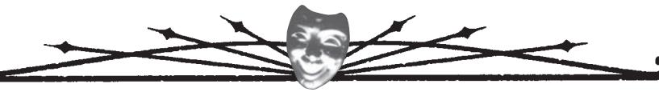
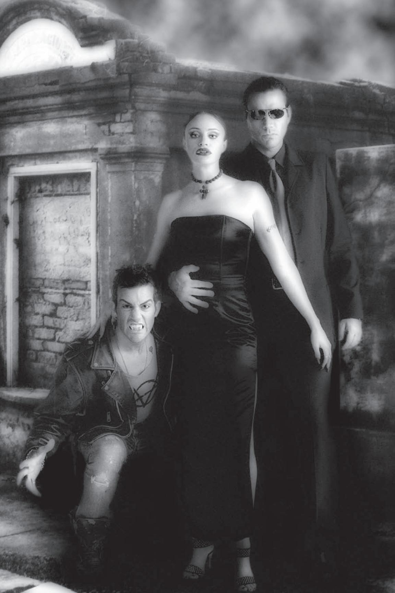
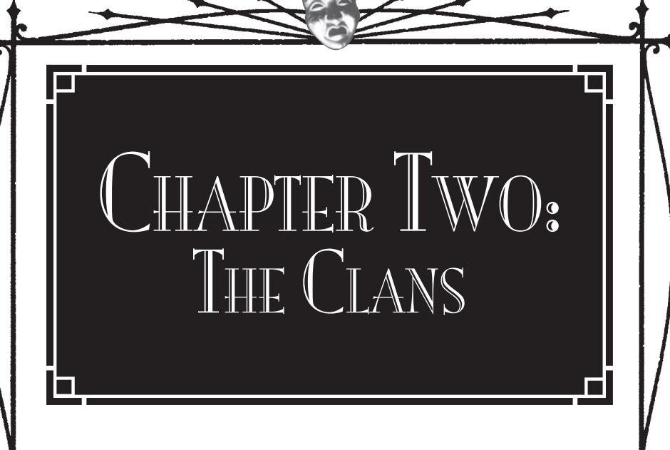
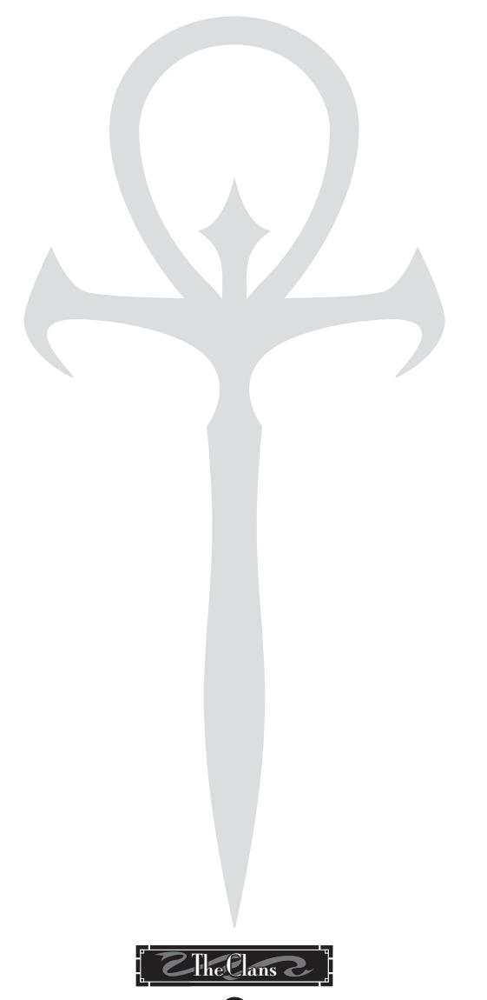

potent than the mortals they hail from, they are as insects among the older generations. Inexperienced and often heady with their new power, some run rampant. Most **MET** characters will be of these generations.

**• 14th and 15th Generations** — These Kindred are so far removed from Caine that their blood has become weak and the Curse does not manifest as strongly in them. Some are rumored to be able to bear the light of the sun or eat food, although they can rarely sire childer. Older Kindred fear these modern youth, as *The Book of Nod* makes claim that the thin-blooded ones will herald the coming of Gehenna.

#### ghouls — those who serve

Many vampires are served and assisted by mortal retainers. After all, it's quite useful to have someone who can go places a vampire cannot, such as outside (during the day) or into dangerous territory. Of these servants, there are those who have partaken of vampire blood without receiving the Embrace. These servants are known as ghouls.

Ghouls receive a number of benefits from their servitude — they often develop limited vampiric powers (such as speed, strength and accelerated healing), they cease to age as long as they have vampire blood in them and grateful masters may reward them with considerable wealth and influence. By and large, ghouls are still mortal and able to enjoy all the pleasures of mortal life. However, as in all things, there are drawbacks. Many ghouls become subject to the blood bond, developing a "devotion" to their masters that deepens into aberration or psychosis. Not every vampire is kindly to his servants, and abuses are common. And ultimately, no matter how prized, a ghoul is still a servant and disposable should the need arise.

The Sabbat scorns ghouls by and large, with two exceptions. Revenant families are comprised of hereditary ghouls who are born with vampire blood already in their veins. Many are seared with physical disability or psychoses, which suits the purposes of their Tzimisce masters. A few are occasionally rewarded with the Embrace for faithful service. The other exception are the fleshcrafted nightmares created by the Tzimisce known as *szlachta* and *vozhd*. These monstrosities are used as attack dogs, war-machines and tides of horror in the campaign against the Camarilla. Most have been so reshaped and molded by their masters that they are not even remotely human-looking.

# who hunts the hunters

It might be supposed from all this talk that the Kindred are powerful enough to run amuck, terrorizing humanity and using the world as their playground and abattoir. Centuries ago, certainly, vampires walked more openly among mortals, flaunting their immortality and supernatural powers, and stretching an iron hand over demenses of terrified mortals. Then the mortals finally rebelled, turning the collective might of the Church and humanity against their vampiric "lords." For over 200 years, the Inquisition held the Kindred in terror, and in these nights, no Kindred who recalls those times wishes to see them come again.

In these days, there are dedicated mortals who are aware of the vampiric threat and who hunt it with the fervor of their medieval predecessors. The most notable organization of hunters is the Inquisition, which bases itself in the Catholic Church but has opened itself to those of other denominations recently. Another, more scholarly group called the Arcanum has observed the Kindred for over a century, and it shares its knowledge occasionally with more "active" hunters. Individual hunters, men and women driven by their knowledge of the Kindred and often touched by experience, follow personal crusades against the Damned, although recent nights have seen these solitaries band together into organized cells. And of course, there will always be nosy reporters who find things that don't add up to their liking, or the detectives who insist on learning the truth behind a series of mysterious deaths.

#### In These Nights...

The modern nights have seen a great deal of turmoil, and many Kindred fear that their world is about to turn over and reinvent itself, but none can say how that will happen or what will come of it.

One of the most disturbing developments has been the change in the Assamites. Somehow, the Children of Haqim have managed to release themselves from the Tremere curse that prohibited them from diablerie, and they have returned to their old cannibalistic ways. They kill without contracts or discretion to sect, and many claim that there is a marked change in the clan's general demeanor.

Cracks are appearing in the formerly monolithic Camarilla. The ranks of the anarchs swell with young vampires who see no future in a calcified society. The Gangrel's sudden departure from the fold sent ripples throughout the sect up to the Inner Circle. Even worse, the Camarilla has begun to lose ground in North America. Along the East Coast, a number of cities have either become contested territory or have fallen completely to the Sabbat. On the West Coast, incursions by the mysterious Asian vampires have caught the Camarilla in a very uncomfortable place. Some believe the Camarilla is a wounded animal in its death throes, but others know that a wounded animal is often the most dangerous.

The Sabbat has suffered its losses as well. In 1997, a mysterious incident wiped out the entire faction of Tremere antitribu, depriving the sect of its arcane resources. Just as mysteriously, the Malkavian antitribu communicated their Discipline of Dementation to their Camarilla brethren, and the Sabbat have lost another powerful tool. The Camarilla has not let go of its cities as easily as imagined, and many of the contested cities have become nightly struggles. The Sabbat majority likes to believe it has the upper hand, but much of its leadership fears that some of their oldest prophecies and worries are finally showing themselves.

#### LEXICON

A new existence calls for new words. Many young vampires often inventslang, while elders favor older forms; either usage dates a vampire's age with fair accuracy.

Ancilla – A Kindred "adolescent", usually at least a century old.

**Anarch** – A rebel among the Kindred, one who disdains elders and their highly structured society.

**Antediluvian** – A vampire of the Third Generation, so called because she predates the Great Flood.

**Archon** – An agent of a justicar.

**Barrens, the**—Areas of a city unfit for living, such as cemeteries, abandoned buildings, industrial wastelands and areas of urban blight.

**Book of Nod, The** – A collection of Kindred legends and history, which some Kindred equate with the Bible.

**Beast, The** – The personification of the vampire's predatory nature, to which is attributed animal instincts and bloodlust.

Blood – A vampire's heritage; that which makes a vampire a vampire.

**Bloodline** – A group of vampires that is an offshoot of its parent clan, often displaying particular characteristics or even strange powers.

**Blood Bond** — A mystical power over another individual (mortal, Kindred or ghoul) created by drinking a vampire's blood three times.

**Boon** — A favor owed between vampires.

**Cainite** — Any vampire; an older term.

**Caitiff** — A vampire without an identifiable clan or bloodline, usually of thin blood and very high generation; such vampires are scorned by others.

**Camarilla, the** — A sect of vampires concerned primarily with maintaining the Traditions, particularly the Masquerade.

**Cathayan** — One of the mysterious vampires of Asia; very little is known about these vampires, but many believe they are unrelated to Kindred.

**Childe** — A vampire created through the Embrace; the progeny of her sire.

**Clan** — A group of vampires who share common characteristics passed on by the Blood

**Coterie** — A group of Kindred who protect and support one another.

**Damned, The** — A collective name for vampires.

**Diablerie** — The act of murdering another vampire by drinking both her blood and her spirit; considered the worst crime among vampires.

**Disciplines** — The powers of a vampire, such as strength, speed or supernatural senses, which come with the Embrace.

**Domain** —An area of a particular vampire's influence; her "turf."

**Elder** — A vampire of at least three centuries or more.

**Elysium** — A place where vampires may meet without threat of violence to conduct business or discuss art; often held in places of art or culture.

**Embrace, the** — The act of turning a mortal into a vampire.

**Final Death** — Destruction of a vampire.

**Frenzy** — An emotional state where the Beast rises to the forefront, and the vampire reacts as an enraged animal would.

**Generation** — The number of steps that a vampire is removed from Caine.

**Gehenna** — The time when the Antediluvians will rise and devour their descendants before beginning a reign of darkness and terror; equated with the mortal Judgment Day.

**Ghoul** — A mortal who has drunk vampire blood, but has not been Embraced.

**Golconda** — A fabled state of being to which many vampires aspire, wherein the predatory instincts of the Beast and the higher thoughts of the Man come to balance.

**Haven** — A vampire's home or where he sleeps during the day.

**Inconnu** — A little-known sect composed entirely of elders.

**Inquisition** — A mortal organization based in the Catholic Church dedicated to hunting vampires and other supernatural creatures.

**Justicar** — A traveling judge of the Kindred who ensures that the Traditions are enforced.

**Jyhad, the** — The secret, centuries-long war waged among the Antediluvian Kindred, using younger vampires as pawns.

**Kindred** — Any Camarilla vampire; their name for themselves.

**Lick** — A vampire; considered vulgar by many.

**Lupine** — A werewolf; used by vampires.

**Masquerade, the** — The collective effort made after the advent of the Inquisition to hide the Kindred from mortal notice.

**Methuselah** — An elder vampire who no longer lives among other Kindred. Many Methuselahs are Inconnu.

**Neonate** — A young, newly created vampire, often recently released from her sire's care.

**Numina** — Special powers possessed by certain, gifted mortals.

**Pack** — The basic social unit of the Sabbat.

**Prestation** — The system of owing and granting favors; used as a bartering tool among Kindred.

**Primogen** — A city's ruling council of elders.

**Prince** — A vampire (male or female) who has established a claim of rulership over a city, and is able to support that claim.

**Progeny** — The collective offspring of a single vampire sire.

**Regnant** — A vampire who holds a blood bond over another Kindred.

**Retainers** — Humans who serve a vampire master

**Rites** — Special Sabbat rituals performed for religious or other reasons.

**Sabbat, the** — A sect of vampires that believes the Masquerade to be useless and that vampires should revel in their darker natures. They are violent and often bestial, using horror and cruelty as their tools.

**Sect** — General name for one of the major groups among the Kindred, such as the Camarilla or the Sabbat.

**Sire** — The parent-creator of a vampire.

**Thrall** — A vampire who is blood bound to another.

**Vaulderie** — A Sabbat ritual involving the communal sharing of blood.

**Vessel** — A source of blood (past or potential); usually a human.

**Vinculum** — The communal blood bond within a pack, forged through Vaulderie.

**Vitae** — Blood.

mind's eye theatre terms

**Attribute** — The raw potential of an individual, from social acumen to intellect to physical prowess.

**Ability** — The things that a character knows or can do.

**Challenge** — Any time that two opponents face off and throw Rock-Paper-Scissors to determine the outcome.

**Extended Challenge** — A challenge that continues until the tester loses.

**Health Level** — A measure of how injured a character is.

**Static Test** — A challenge that requires someone to risk a certain number of Traits to complete a task.

**Simple Test** — Any time two opponents throw Rock-Paper-Scissors without risking Traits.

**Scene** — A location where action is taking place.

**Trait** — An adjective used to describe a character's Attributes, such as *Quick*, *Gorgeous* or *Knowledgeable*.

**Turn** — A unit of time in **Mind's Eye Theatre** play, usually considered to be the equivalent of about three seconds.

Elysium had closed without difficulty — a few words played into the right ears, and suddenly all of the movers and shakers knew that Warburton had chosen to square off politically against Donata. Subtle whispers and hurried deals had rippled through the room, especially in light of Warburton's hurried exit midway through the evening.

Now, though, it was back to business. That meant bringing Kevin back to heel, and finding out exactly what sorts of sweet little lies he'd told to flavor the equation.

"Why can't we simply send someone else to scrape up the fool?" Peter had grumbled as Donata had directed him to drive into the bowels of the city's decaying downtown projects.

Donata had scowled in response to Peter's complaints. "The 'fool' only responds to my commands and my power. I must question him directly."

Peter simply shook his head as he passed the burned-out wreckage of adandoned businesses. He could very well tear the information from the anarch's weak mind with the strength of his commanding will, but best not to let Donata know the full extent of his capabilities. In the back of his mind, he calculated expenses and possibilities involved in restoring business to the projects, tabulating any angle for profit out of habit.

"Wait here." Donata directed Peter to pull up to the curb, and he did so smoothly, setting the alarm on his car as they exited, as if it would do some good. A small gathering of youths loitered on the corner, and Kevin chatted in hushed tones among them.

Donata slid up the street, resplendently out of place in her debonair gown, approaching the group as Peter stayed a step or two behind. A few of the gang gave out hoots or whistles, and Kevin turned slightly to regard the approaching pair. With a quick slash of his hand, Kevin silenced the gang, breaking away in a swaggering gait to meet Peter and Donata. His various head wounds had healed — probably from a little blood judiciously taken from the gangers — and he grinned at Donata.

Gently touching Kevin's arm, Donata brought the full spark of her potent charisma to the fore. "How delightful to see you again, my dear. I presume that our assignments have proceeded well?"

Kevin nodded amicably. "Of course," he murmured, shooting a jealous look at Peter. "Warburton will look like an idiot, and a treacherous one at that. His cronies just happened to let Kristof get his hands on the package, and everyone knows how the Nosferatu like to sell out secrets." Kevin grinned. Even if the prince forbade the Nosferatu from selling the financial information, he'd never be able to be sure that the Nosferatu hadn't copied and distributed it somehow — and Warburton would bear the brunt of that wrath.

"Excellent," Peter said crisply, as Donata smiled. It appeared that the alliance would bear some fruit, after all.

Tracing their lineage through millennia back to legendary founders, the families of vampires organize themselves along their lines as clan s — vampires who share common heritage, abilities and weaknesses. Each clan claims descent from one of the near-mythical Antediluvians, the grandchilder of Caine and progenitors of the vampiric race. The predilections and curses of these Antediluvians, it is said, mark each member of the clans. As a result, the members of given clans often share similar tastes and potentials.

Further removed from the clans and Antediluvians are the bloodlines. While technically any lineage of vampires may be considered a bloodline, the term (in common parlance) refers specifically to members of a peculiar sub-clan, a grouping of vampires with common powers and interests like a clan but lacking an Antediluvian founder. These bloodlines are small and rare; indeed, few neonates are even aware of their existence. However, any clan can be humbled and brought to the level of mere bloodline should its Antediluvian be devoured and his power stolen by a claimant to a new clan — a process that has happened more than once in times past.

In nights of old, clans would only Embrace new members along fairly strict lines; only those with enough aptitudes and tastes corresponding to their prospective clans' predilections would be considered as candidates for unlife. The cosmopolitan modern age has changed this exclusivity, though, as it does to all things. Now vampires are Embraced along broader lines, and knowledge of a particular vampire's clan does not necessarily bring a corresponding knowledge of the individual's strengths, weaknesses and interests. Many young neonates, Embraced for some potential outside of the clan's normal interests, rebel against the stultifying influence of the elders, taking up habits and alliances against all expectations of clan.

Occasionally, some new fledglings are abandoned by their sires, knowing little of the clans or the ways of vampiric society. These clanless, referred to as Caitiff, are often a threat to the Masquerade, and they rarely survive without instruction. Some vampires claim that such weak-blooded mules lack identifying clan characteristics and upbringing, and thus, they herald the coming End Times. These paranoid vampires hunt the clanless ones whenever they can.

# Bloodrights

Carrying the strengths of the founders, each clan holds certain particular strengths and weaknesses. These characteristics pass from sire to childe; in some rare instances, these characteristics do not manifest fully, but most often, a childe holds the same potential as the sire (limited, of course, by weaker generation).

Bound together by blood, each member of a clan shares certain predilections. A vampire's clan dictates the Disciplines that come most naturally. Though the Curse of Caine bestows a wide range of capabilities, the specialized powers of vampires manifest in different propensities among the clans. Thus, each clan or bloodline has three signature Disciplines, powers that are most common among members of that line and that come more easily than others.

Conversely, each clan also passes on certain weaknesses and frailties to its childer. This effect may manifest as faults in personality, temperament or disposition; in others, more mystical traits or even physical alterations appear. These weaknesses often tie to some apocryphal story of the clan's founder, usually of some failing or curse on that luminary.

Because clan members tend to be Embraced due to similarities in disposition and interest to the clan's areas of expertise, most vampires of a given clan share certain abilities or benefits. As a result, a vampire's clan also offers particular advantages that are common to all members. Even those individuals who are Embraced outside of a clan's normal range are instructed or assisted quickly in developing these benefits. It is always the choice of the individual whether or not to follow such direction.

# allegianCes

The Camarilla and Sabbat claim the nearly exclusive membership of certain lineages. Among the Camarilla, the six clans of the Brujah, Malkavians, Nosferatu, Toreador, Tremere and Ventrue predominate. In the Sabbat, leadership and the bulk of membership is claimed by the Lasombra and the Tzimisce, though a good portion of the sect is made up of *antitribu* members of the other clans. The Assamites, Followers of Set, Gangrel, Giovanni and Ravnos are largely independent, with the majority of their individuals holding membership in neither sect.

Among the bloodlines, individual vampires are so scattered and rare as to make any sort of sectarian classification pointless, and allegiances break down to an individual basis. The elusive Cathayan vampires of Asia are not known to conform to any clan, either, and indeed, they do not even claim any relationship to Caine. What this disavowal bodes is unknown to western Kindred.

# the Camarilla

Founded in the late Dark Ages to resist the fires of the Inquisition, the Camarilla relies on the Masquerade to hide vampires from humanity. As the largest global sect of vampires, the Camarilla offers prestige to the elders and security to the youth. In theory, all vampires are invited to join the Camarilla, but aside from a few expatriates and loners of other clans, only six clans have real membership. Among the member clans of the Camarilla, representation comes through a member of the Inner Circle and the appointment of a justicar. Other clans or bloodlines of vampires may nominally have members, even officers such as princes or primogen, but without an Inner Circle member and justicar, their true clout in the upper halls of the organization is limited.

# the saBBat

For centuries, the elders of Cainite society maintained a rigid status quo over their childer. The elders retained positions of power and influence, keeping the younger Cainites trapped in relative impotence and servitude. The formation of the Camarilla only exacerbated this relationship, as the elders banded together to support their own authority. Obviously, the existence of hordes of neonates, itching for advancement and giddy with their own vampiric power, created incredible friction between the generations. As the Dark Ages closed with the Renaissance and the newer, larger cities and populations of Europe, the number of younger, dissatisfied and educated vampires increased. Finally, matters came to a head in the Anarch Revolt, where hordes of the younger Cainites, fired by their mistreatment at the hands of their elders, rose up and destroyed the institutions of their society in wholesale rebellion.

Eventually, the Camarilla crushed the Anarch Revolt, the Convention of Thorns forming an uneasy truce between anarchs and Camarilla vampires. Still, many Cainites remained outcast due to their heinous crimes against the Camarilla, or retained a desire to overthrow the organization. Bolstered by early successes and the discovery of ancient Tzimisce rituals that bonded them together into unified packs, these vampires formed their own organization, the Sabbat. Though a thorn in the side of the Camarilla at first, the vampires of the Sabbat recruited dissatisfied younger Cainites in their war and overtook more territory and control.

In the modern age, the Sabbat stands in direct opposition to the Camarilla. Though only one-third the size of the Camarilla, the Sabbat makes great strides in taking territory, partly because it flouts the Traditions and partly because its fanatically motivated and loyal packs destroy the disorganized Camarilla individuals. Members of the Sabbat seek to overthrow the hold of the elders and, ultimately, the Antediluvians. The two pre-eminent clans of the Sabbat, the Lasombra and the Tzimisce, are held in great esteem among their sect for their successful destruction of their own Antediluvians. However, many vampires of other clans also ally with the Sabbat, becoming *antitribu* or "anti-tribes" in opposition to their original blood heritage. The Lasombra and Tzimisce are the most common clan members of the Sabbat, but a fair number of *antitribu*  claim allegiance in the never-ending war to overthrow the elders, establish the rule of vampires over the kine and shatter the illusions of Cainites who hold on to their lost humanity.

The Camarilla claims the allegiance of six great clans, the Sabbat's core comes from two — but what of the other five? These other clans call no sect master, instead charting their own courses. For them, their own key philosophies, often intertwined with the mortal beliefs of their homelands, are the only guiding principles necessary.

For several hundred years, the Assamites, Followers of Set, Giovanni and Ravnos were the only four independent clans. Recently, though, the Gangrel left the Camarilla *en masse*, taking up a neutral position once more. Whether the Camarilla's shaky foundations will further erode, or whether a new clan will take the Gangrel's place, remains to be seen.

