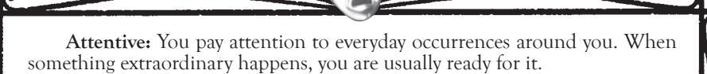
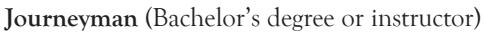
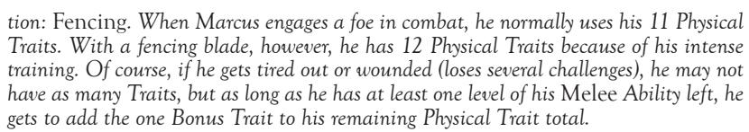

When you enter a situation with a questionable outcome, you bid a Trait appropriate to the challenge. If you are trying to knock someone over, for instance, you might bid the Physical Trait *Brawny* as you use your strength. The nature of the challenge determines the Trait used — Physical, Social or Mental.

You should try to bid a Trait appropriate to the nature of each given challenge. That is, using your strength may call on the *Brawny* Trait but not the *Dexterous* Trait. If you and your opponent agree, you can use other Traits, but in general, choose Traits fitting the challenge.

Remember, when you bid a Trait for a challenge, you risk that particular Trait. If you fail the challenge, you may temporarily lose the use of the Trait, as you exhaust your resources and lose your confidence. Some situations may require the use of an additional Trait or more — any time that you are considered "bids down," you must risk additional Traits. Conversely, if you are listed as "Traits up" or "Traits down," you modify your current number of Traits when comparing for overbids or ties.

For the purposes of determining what kinds of Traits are appropriate to specific challenges or Disciplines, the Trait listings include a run-down of what sorts of Traits fit into what specialized categories. For example, the Physical Trait *Tough* is appropriate for the Discipline of *Potence* because it is a strength-related Trait. Of course, you can ignore these categories if you wish, in favor of speeding the game. Remember, unique situations may allow Traits to be used in unusual ways.

New players may find it easier to bid a generic Trait from the appropriate pool instead of picking a specific one. Doing so allows them time to get the hang of the system. When they're more comfortable with bidding, then start having them choose Traits. DHYSICALTRAITS

Strength-related: Brawny, Ferocious, Stalwart, Tough, Wiry

Dexterity-related: Dexterous, Graceful, Lithe, Nimble, Quick

Stamina-related: Enduring, Resilient, Robust, Rugged, Tireless

Miscellaneous Physical: Agile, Energetic, Steady, Tenacious, Vigorous

Agile: You have a well-honed and flexible body. You can bend, twist, run and jump with ease.

Uses: Acrobatics. Athletics. Competitive events. Dodging.

Brawny: Bulky muscular strength.

Uses: Punching, kicking or grappling in combat when your goal is to inflict damage. Power-lifting. All feats of strength. *Potence*.

Brutal: You are capable of taking nearly any action in order to survive.

Uses: Fighting an obviously superior enemy.

**Dexterous:** General adroitness and skill involving the use of one's hands. Uses: Weapon-oriented combat (*Melee or Firearms*). Pickpocketing. Punching. Celerity.

Enduring: A persistent sturdiness against physical opposition.

Uses: When your survival is at stake, this Trait is a good one to risk as a second, or successive, bid. Fortitude.

**Energetic:** A powerful force of spirit. A strong internal drive propels you and, in physical situations, you can draw on a deep reservoir of enthusiasm and zeal.

Uses: Combat.

**Ferocious:** Possession of brutal intensity and extreme physical determination. Uses: Any time that you intend to do serious harm. When in frenzy. *Potence*. **Graceful:** Control and balance in the motion and use of the entire body.

Uses: Combat defense. Whenever you might lose your balance. *Celerity*.

Lithe: Characterized by flexibility and suppleness.

Uses: Acrobatics, gymnastics, dodging, dancing and *Celerity*.

**Nimble:** Light and skillful; able to make agile movements.

Uses: Dodging, jumping, rolling, acrobatics. Hand-to-hand combat. *Celerity*.

**Quick:** Speedy, with a fast reaction time.

Uses: Defending against a surprise attack. Running, dodging, attacking. *Celerity*.

**Resilient:** Characterized by strength of health; able to recover quickly from bodily harm. *Fortitude*.

Uses: Resisting adverse environments. Defending against damage in an attack.

**Robust:** Resistant to physical harm and damage.

Uses: Defending against damage in an attack. Endurance-related actions that could take place over a period of time. *Fortitude*.

**Rugged:** Hardy, rough and brutally healthy. Able to shrug off wounds and pain to continue struggling.

Uses: When resisting damage, any challenge that you enter while injured. Earth Melding. *Fortitude*.

**Stalwart:** Physically strong and uncompromising against opposition.

Uses: Resisting damage, or when standing your ground against overwhelming odds or a superior foe. *Potence*.

**Steady:** More than simply physically dependable — controlled, unfaltering and balanced. You have firm mastery over your efforts.

Uses: Weapon attacks. Fighting in exotic locations.

**Tenacious:** Physically determined through force of will.

Uses: Second or subsequent Physical Challenge.

**Tireless:** You have a runner's stamina — you are less taxed by physical efforts than ordinary people.

Uses: Any endurance-related challenge, second or subsequent Physical Challenge with the same foe or foes. *Fortitude*.

**Tough:** A harsh, aggressive attitude and a reluctance to submit.

Uses: Whenever you're wounded. *Potence*.

**Vigorous:** A combination of energy, power, intensity and resistance to harm.

Uses: Combat and athletic challenges when you're on the defensive.

**Wiry:** Tight, streamlined, muscular strength.

Uses: Punching, kicking or grappling on combat. Acrobatic movements. Endurance lifting. *Potence*.

negative physiCal traits

**Clumsy:** Lacking physical coordination, balance and grace. You are prone to stumbling and dropping objects.

**Cowardly:** In threatening situations, saving your own neck is all that is important. You might even flee when you have the upper hand, just out of habit.

**Decrepit:** You move and act as if you are old and infirm. You recover from physical damage slowly, you are unable to apply full muscular strength and you tire easily.

**Delicate:** Frail and weak in structure; you are damaged easily by physical harm.

**Docile:** The opposite of the *Ferocious* and *Tenacious* Traits. You lack physical persistence, and you tend to submit rather than fighting long battles.

**Flabby:** Your muscles are underdeveloped. You cannot apply your strength well against resistance.

**Lame:** You are disabled in one or more limbs. The handicap can be as obvious as a missing leg or as subtle as a dysfunctional arm.

**Lethargic:** Slow and drowsy. You suffer from a serious lack of energy or motivation.

**Puny:** You are weak and inferior in strength. This Trait could refer to diminutive size.

**Sickly:** Weak and feeble. Your body responds to physical stress as if it were in the throes of a debilitating illness.

# soCial traits

Charisma-related: *Charismatic*, *Charming*, *Dignified*, *Eloquent*, *Expressive*, *Genial*

Manipulation-related: *Beguiling*, *Commanding*, *Ingratiating*, *Persuasive*

Appearance-related: *Alluring*, *Elegant*, *Gorgeous*, *Magnetic*, *Seductive*

Miscellaneous Social: *Diplomatic*, *Empathetic*, *Intimidating*, *Friendly*, *Witty*

**Alluring:** An attractive and appealing presence that inspires desire in others.

Uses: Seduction. Convincing others.

**Beguiling:** The skill of deception and illusion. You can twist the perceptions of others and lead them to believe what suits you.

Uses: Tricking others. Lying under duress.

**Charismatic:** The talent of inspiration and motivation, the sign of a strong leader.

Uses: In a situation involving leadership or the achievement of leadership. *Presence*.

**Charming:** Your speech and actions make you attractive and appealing to others.

Uses: Convincing. Persuading. *Presence*.

**Commanding:** Impressive delivery of orders and suggestions. This Trait implies skill in the control and direction of others.

Uses: When you are seen as a leader.

**Dignified:** Something about your posture and body carriage appears honorable and aesthetically pleasing. You carry yourself well.

Uses: *Presence*. Defending against Social Challenges.

**Diplomatic:** Tactful, careful and thoughtful in speech and deed. Few are displeased with what you say or do.

Uses: Very important in intrigue. Leadership situations.

**Elegant:** Refined tastefulness. Even though you don't need money to be elegant, you exude an air of richness and high society.

Uses: High society or Toreador parties. Might be important in some clans for advancement. Defending against Social Challenges.

**Eloquent:** The ability to speak in an interesting and convincing manner.

Uses: Convincing others. Swaying emotions. Public speaking. *Presence*.

**Empathetic:** Able to identify and understand the emotions and moods of people with whom you come in contact.

Uses: Gauging the feelings of others.

**Expressive:** Able to articulate your thoughts in interesting, meaningful ways.

Uses: Producing art of any kind. Acting. Performing. Any social situation in which you want someone to understand your meaning.

**Friendly:** Able to fit in with everyone you meet. Even after a short conversation, most find it difficult to dislike you.

Uses: Convincing others.

**Genial:** Cordial, kindly, warm and pleasant. You are pleasing to be around. Uses: Mingling at parties. *Presence*. Generally used in a second or later Social Challenge with someone.

**Gorgeous:** Beautiful or handsome. You were born with a face and body that is good-looking to most people you meet.

Uses: Modeling, posing.

**Ingratiating:** Able to gain the favor of people who know you.

Uses: Dealing with elders in a social situation. Defending against Social Challenges.

**Intimidating:** A frightening or awesome presence that causes others to feel timid. This Trait is particularly useful when attempting to cow opponents.

Uses: Inspiring common fear. Ordering others.

**Magnetic:** People feel drawn to you; those around you are interested in your speech and actions.

Uses: Seduction. First impressions.

**Persuasive:** Able to propose believable, convincing and correct arguments and requests. Very useful when someone else is undecided on an issue.

Uses: Persuading or convincing others.

**Seductive:** Able to entice and tempt. You can use your good looks and your body to get what you want from others.

Uses: Subterfuge, seduction.

**Witty:** Cleverly humorous. Jokes and jests come easily to you, and you are perceived as a funny person when you want to be.

Uses: At parties. Entertaining someone. Goading or insulting someone.

negative soCial traits

**Bestial:** You have started to resemble the Beast of your vampiric nature. Maybe you have clawlike fingernails, heavy body hair or a feral glint in your eyes; however your Beast manifests, you definitely seem inhuman.

**Callous:** You are unfeeling, uncaring and insensitive to the suffering of others. **Condescending:** You just can't help it; your contempt for others is impossible to hide.

**Dull:** Those with whom you speak usually find you boring and uninteresting. Conversing with you is a chore. You do not present yourself well to others.

**Feral:** The animalistic predator in you is evident in your actions. You scratch yourself, sniff at people or otherwise behave in a primitive fashion.

**Naive:** You lack the air of worldliness, sophistication or maturity that most carry.

**Obnoxious:** You are annoying or unappealing in speech, action or appearance.

**Repugnant:** Your appearance disgusts everyone around you. Needless to say, you make a terrible first impression with strangers.

**Shy:** You are timid, bashful, reserved and socially hesitant.

**Tactless:** You are unable to do or say things that others find appropriate to the social situation.

**Untrustworthy:** You are rumored or perceived to be unreliable, whether or not you really are.

# mental traits

Perception-related: *Attentive*, *Discerning*, *Insightful*, *Observant*, *Vigilant* Intelligence-related: *Cunning*, *Disciplined*, *Knowledgeable*, *Rational*, *Reflective* Wits-related: *Alert*, *Clever*, *Intuitive*, *Shrewd*, *Wily*

Miscellaneous Mental: *Creative*, *Dedicated*, *Determined*, *Patient*, *Wise*

**Alert:** Mentally prepared for danger and able to react quickly when it occurs.

Uses: Preventing surprise attacks. Defending against *Dominate*.

Uses: Preventing surprise attacks. Seeing through *Obfuscate* when you don't expect it. Preventing *Dominate*.

**Clever:** Quick-witted resourcefulness. You think well on your feet.

Uses: Using a Mental Challenge against another.

**Creative:** Your ideas are original and imaginative, which implies an ability to produce unusual solutions to your difficulties. You can create artistic pieces. A requirement for any true artist.

Uses: Defending against *Auspex*. Creating anything.

**Cunning:** Crafty and sly, possessing a great deal of ingenuity.

Uses: Tricking others.

**Dedicated:** You give yourself over totally to your beliefs. When one of your causes is at stake, you stop at nothing to succeed.

Uses: Useful in any Mental Challenge when your beliefs are at stake.

**Determined:** When it comes to mental endeavors, you are fully committed. Nothing can divert your intentions to succeed once you have made up your mind.

Uses: Staredowns. Useful in a normal Mental Challenge.

**Discerning:** Discriminating, able to pick out details, subtleties and idiosyncrasies. You have clarity of vision.

Uses: *Auspex*. Investigation and tracking.

**Disciplined:** Your mind is structured and controlled. This rigidity gives you an edge in battles of will.

Uses: *Thaumaturgy*. Staredowns. Useful in a Mental Challenge.

**Insightful:** The power of looking at a situation and gaining an understanding of it.

Uses: Investigation (but not defense against it). *Auspex*.

**Intuitive:** Knowledge and understanding somehow come to you without conscious reasoning, as if by instinct.

Uses: Spontaneous deduction.

**Knowledgeable:** You know copious and detailed information about a wide variety of topics. This Trait represents "book-learning."

Uses: *Forgetful Mind* tests. Remembering information your character might know. Employing *Thaumaturgy*.

**Observant:** Depth of vision, the power to look at something and notice the important aspects of it.

Uses: *Auspex*. Picking up on subtleties that others might overlook.

**Patient:** Tolerant, persevering and steadfast. You can wait out extended delays with composure.

Uses: Staredowns or other mental battles after another Trait has been bid.

**Rational:** You believe in logic, reason, sanity and sobriety. Your ability to reduce concepts to a mathematical level helps you analyze the world.

Uses: Defending against emotion-oriented mental attacks. Defending against an aura-reading. Not used as an initial bid.

**Reflective:** Meditative self-recollection and deep thought. The Trait of the serious thinker, *Reflective* enables you to consider all aspects of a conundrum.

Uses: Meditation. Remembering information. Defending against most Mental Challenges.

**Shrewd:** Astute and artful, able to keep your wits about you and accomplish mental feats with efficiency and finesse.

Uses: Defending against a Mental Discipline.

**Vigilant:** Watchful. You have the disposition of a guard dog; your attention misses little.

Uses: Defending against investigation or *Forgetful Mind*. Seeing through *Obfuscate*. *Auspex*. More appropriate for mental defense than for attack.

**Wily:** Sly and full of guile. Because you are wily, you can trick and deceive easily. Uses: Tricking others. Lying under duress. Confusing mental situations.

**Wise:** An overall understanding of the workings of the world.

Uses: Giving advice. Dispensing snippets of Zen.

negative mental traits

**Forgetful:** You have trouble remembering even important things.

**Gullible:** Easily deceived, duped or fooled.

**Ignorant:** Uneducated or misinformed, never seeming to know anything.

**Impatient:** Restless, anxious and generally intolerant of delays. You want everything to go your way — immediately.

**Oblivious:** Unaware and unmindful. You'd be lucky if you noticed an airplane flying through your living room.

**Predictable:** Because you lack originality or intelligence, even strangers can figure out what you intend to do next.

**Shortsighted:** Lacking foresight. You rarely look beyond the superficial; details of perception are usually lost on you.

**Submissive:** No backbone; you relent and surrender at any cost rather than stand up for yourself.

**Violent:** An extreme lack of self-control. You fly into rages at the slightest provocation, and frenzy is always close to the surface. This Trait is a Mental one because it represents mental instability.

**Witless:** Lacking the ability to process information quickly. Foolish and slow to act when threatened.

# aBilities

The particular bits of knowledge learned over the years, the tricks of the trade and the hard-won secrets of crafts are all Abilities. A character's Ability Traits represent special training or talent, and as such, they often allow performance of tasks that would be otherwise impossible. Even with more mundane situations, Abilities allow for a much improved chance of success.

When a character performs a risky or uncertain action, Abilities aid the outcome. If you try a task and fail, you can temporarily expend one of your appropriate Abilities, to gain an immediate retest. You lose the Ability used and the initial Trait(s) bid for the task (if any) because you lost the initial test, but you can still overcome the challenge. Abilities used like this are recovered at the next game session.

A character with multiple levels in a given Ability is certainly more experienced and proficient than an individual with just one. Most characters will fall into one to three levels of Ability; greater amounts are very rare, and anything beyond five levels is almost certainly superhuman (and limited to elder vampires and their ilk). The total level of Ability in a given field corresponds roughly to the character's professional capabilities:

**Competent** (Able to earn a living)

**Professional** (Licensed, capable of supervision)

**Expert** (Master's degree or researcher)

**Master** (Doctorate or true innovator)

Some tasks are simply too difficult, or they require too much skill, to be attempted by a character without the requisite Abilities. The Storyteller may occasionally require the possession or use of an Ability Trait to perform a specific task. In this case, characters without the Ability, or who have already used all of their levels of the Ability, cannot attempt the task at all.

When an Ability is used against a set scenario or object (such as using *Security*  to pick a lock), the feat usually has a difficulty assigned by the Storyteller. In such a Static Challenge, you may be required to risk a Trait for a trivial task, or even be asked to bid two or more Traits for a difficult, risky or frustrating undertaking.

Some Abilities can be used against an opponent instead of facilitating a regular task. In this case, the Ability is expended to gain a retest in a challenge with the opponent. See the rules for challenges and retests on p. 195 for complete details.

# FoCusing aBilities

A few Abilities specifically require a concentrated area of study. One cannot simply study all *Crafts* at once, after all. These Abilities are specifically noted in the descriptions. When you take such an Ability, you must choose an area of study, a specific topic that you have concentrated on. Each area is considered a separate Ability, so *Science: Biology* counts completely separately from *Science: Metallurgy*, for instance.

# aBility speCializations

Within a given area of expertise, some practitioners further hone their knowledge to a razor's edge. By choosing a specialization in an Ability, you hone your skills with a particular facet of that talent.

Ability specializations are a wholly optional rule. Remember to ask your Storyteller before taking a specialization.

Taking a specialization requires that you spend one Experience Trait or Free Trait on an Ability that you already have. Whenever you perform a task with that specialization — even if you do not expend the Ability — you gain a one-Trait bonus on resolution of challenges, as long as you have at least one level of the Ability left. You may only have one specialization in any given Ability; you cannot take *Firearms: Pistols* and *Firearms: Rifles* together, for instance. You also can never gain more than one Bonus Trait at a time from specializations, even if more than one would be appropriate to a given challenge. That is, even if you have *Medicine: Physiology* and *Science: Biology Research*, you only get a one-Trait bonus on a test of biochemistry, despite your multiple specializations.

A specialization is a fairly narrow area of research or practice. You cannot, for instance, take a *Firearms* specialization in "guns," nor could you have an *Occult* specialization of "writing." An appropriate specialization refers to one small class of items or to one type of practice within the Ability, such as *Firearms: Antique Pistols* or *Occult: Superstitions*.

You may take a specialization in an Ability with an area of study. In such a case, you concentrate your research in one particular facet of that sub-Ability, or in one application of it. Thus, you could have *Crafts: Woodworking* with a specialization in *Hidden Panels*, or *Science: Botany* with a specialization in *Exotic Flora*.

Note that the Bonus Trait from a specialization does not have an adjective, and it is not bid or used like other Traits. You simply are "one Trait up" on challenges within the specialization.

**Example:** *Marcus von Schlagenhanz is an experienced Brujah fighter, but he is especially good with fencing weapons. He has the Ability:* Melee *x 3 with the specializa-*

### Academics

You possess a level of education and general knowledge beyond rudimentary schooling. With *Academics*, you can express artistic criticism, debate the classics, consider philosophy and indulge in studies of culture. This broad Ability covers all sorts of humanities in learning.

Academics allows you to recognize historical, art and cultural references. You can use Academics when working in such fields, when developing a critique or researching. Calling on Academics Ability may require a Mental or Social Challenge to determine your exact level of competence.

You may further direct your studies by choosing a specific field, such as Art Criticism, Classical Studies, History, Journalism, Theology or anything else that could be studied with higher education.

### Animal Ken

Most animals find Kindred frightening. With *Animal Ken*, you have learned to understand animals, and you can sometimes deal with them more equitably. Though they may retain a healthy fear of the predator lurking within you, you know what drives them and how to assuage their fears.

Animal Ken is often used with the Animalism Discipline. With Animal Ken, you can train an animal (especially a ghoul) into particular behaviors (stay, fetch, attack), or attempt to deduce an animal's state of being (injured, angry, frightened, etc.) with a Mental Challenge. If you work with an animal over a long period of time (generally a month or so), you may be able to teach it a simple trick, up to a limit of one trick for each Mental Trait that the animal has.

## **Athletics**

Whether due to a background in sports or just personal talent, you are skilled in all manner of athletic endeavors. You can throw a ball, sprint, climb, jump and swim. This last can be especially useful to vampires, who do not naturally float.

Your Athletics Ability is used for retests on most forms of raw physical activity: acrobatics, swimming, jumping, throwing, climbing and running. You may choose to focus on something you do especially well.

#### Awareness

You have a talent for knowing when things are not as they should be, whether by that strange feeling in the pit of your gut or through tested observation. This is particularly useful for sensing when other supernatural creatures about, detecting evidence of Numina or other strange phenomena, or just getting that weird feeling when the laws of nature are about to take a hard left.

Awareness requires a Mental Challenge to use, and retests are made with the Occult Ability.

#### Brawl

Back-alleys, martial arts schools and rough bars are your stomping ground. You might have military training, or maybe you just grew up with a passel of rough-and-tumble siblings. Whatever the case, you know how to dish out damage with your fists and feet.

Use the *Brawl* Ability for retests in combat when you are using your natural weapons (teeth, claws or fists). This Ability is also the province of the martial arts, although you should specify which art when taking this Ability.

Most Cainites have difficulty adapting to modern inventions. As a result, an understanding of cutting-edge technology makes for dangerous knowledge. With the *Computer* Ability, you understand how to use, program and access computers of all sorts.

Use Computer with a Mental Challenge (difficulty determined by the Storyteller) to break into systems, alter data, write programs or figure out unfamiliar operations.

#### Crafts

You can build things. Depending on your area of expertise, you know how to manufacture items and make handy tools or decorations. You must choose a focus for Crafts, specifying your form of creation: Carpentry, Clockworks, Blacksmithing, Leatherworking and the like are all possibilities. You can fashion works of art, studying Painting, Drawing or similar physical media. Crafts also covers more technical skills done with labor, such as Mechanics and Electronics.

Making or repairing an item with *Crafts* usually involves a Physical Challenge of your dexterity, with difficulty set by the Storyteller based on the type of job (making a concealed spring-loaded trap is far more difficult than planing a board, for instance). Artistic works designed with *Crafts* x 3 or better may entrance Toreador, at the discretion of the Storyteller.

The Tzimisce practice a focus of *Body Crafts* when using *Vicissitude*. This Ability covers tattooing, piercing, flaying and all other applications thereof regarding the alteration of the body.

# Dodge

When trouble rears its ugly head, you know how to get out of its way. Unhesitating reactions let you evade blows and shots, getting out of the way of injury. You can use *Dodge* against any attack that you're aware of: diving for cover as someone fires a gun or twisting away from a sword, for instance. *Dodge* may be used as a retest when defending against an attack that you can see or sense coming.

#### Drive

Though most people can drive in the modern age, you can drive well. You're equally at home with a stick shift or an automatic, rush hour is no concern and you can get the most performance out of a car. In dangerous situations, you can evade traffic and even use your vehicle as a weapon. Bear in mind that just because you can drive a station wagon doesn't mean you can drive a semi with equal ease. A Mental Challenge may be required to allow you to figure out where everything is in an unfamiliar vehicle.

Drive tests most often involve a Physical Challenge of your reflexes.

## Empathy

You are sensitive to the moods and emotions of people around you. When you listen to someone, you understand her feelings. You can identify with others and tell when people are lying or holding back while talking to you.

With a Social Challenge and the expenditure of an *Empathy* Ability, you can determine if the last thing that someone said was a lie (although *Subterfuge* can defend against this expenditure). Alternately, you can attempt to determine the subject's current Demeanor.

## Etiquette

Even though knowing which fork to use isn't as important to Kindred society, you do know the proper way to greet someone, when to rise and how to make introductions. You can hold a toast with the best of them, and you keep your cool in any social scenario, from high tea to a gang's rally.

The *Etiquette* Ability can be used with Social Tests to impress or blend in at parties. If you make a social *faux pas*, you may expend an *Etiquette* Ability immediately to negate the gaffe — your character knew better than to make the mistake.

Words and feelings flow freely from you. When the muse strikes, you put pen to paper (or fingers to instrument) and pour out a torrent of emotion and stirring imagery. You can convey message and meaning in your art, from symphonies to poetry, and whatever you write is both clear and moving.

When writing or composing, you can sink true *Expression* into the work. Works created with *Expression* x 3 or more have the potential to entrance Toreador, as per their clan weakness.

#### Finance

The world of money and business awaits your whim. You understand interest, CDs, stock market transactions, currency exchanges and GNPs. A little *Finance* lets you make quite a bit of money. You can also use your *Finance* to balance books or run a business of your own.

Typically, you can run a business, follow a money trail, perform an audit or clean up an accounting mess with a Mental Challenge (difficulty dependent on the task, as determined by the Storyteller). Alternately, you can expend a level of *Finance* Ability to raise \$250 in cash between games. Not every use of *Finance* is so benign — money laundering operations have to come from somewhere.

#### Firearms

A little time at the gun range goes a long way. You know how to hold, fire and clean a gun. You can unjam one, too, and you can tell different models apart. You know how to stand to get the best aim, how to handle recoil and how to take care of problems in the field.

If you possess the *Firearms* Ability, you may use your Mental Traits for gun combat instead of using Physical Traits, at no cost. You can expend *Firearms* for a retest in ranged-fire combat.

# Hobby/Professional/Expert Ability

In a certain area of expertise not covered by another Ability, you have achieved some level of skill. You may have a small grasp of a trade due to some work on the side, or perhaps you've specifically studied a topic.

Hobby/ Professional/ Expert Ability is a catch-all category for highly unusual Abilities like Cainite Lore, Thanatology, Demolitions and so on. Any Ability of this type must be specifically approved by the Storyteller, and it has its capabilities defined by the Storyteller.

### Intimidation

Intimidation represents any of a broad variety of techniques for terrifying people into compliance. This could be anything from physical size, to a particularly frightening grin, to knowing which emotional buttons to push.

You can use *Intimidation* when trying to scare someone with a Social Challenge, or with certain Disciplines.

#### Investigation

You know how to pick up clues and put together disparate pieces of information. By habit and training, you can set a jumbled mass of data into order, discovering identities, motives and patterns in an otherwise chaotic scene. You can use *Investigation* with a Mental Challenge when trying to puzzle out meaning to a random scene, or with most *Auspex* Discipline powers.

#### Law

Nobody is above the law, except those who know how to use it to their own advantage. You're one of the latter. Perhaps you uphold the law, or maybe you twist it to your own ends. Your knowledge of *Law* allows you to understand legal processes, courts and lawyers, and to use them effectively.

